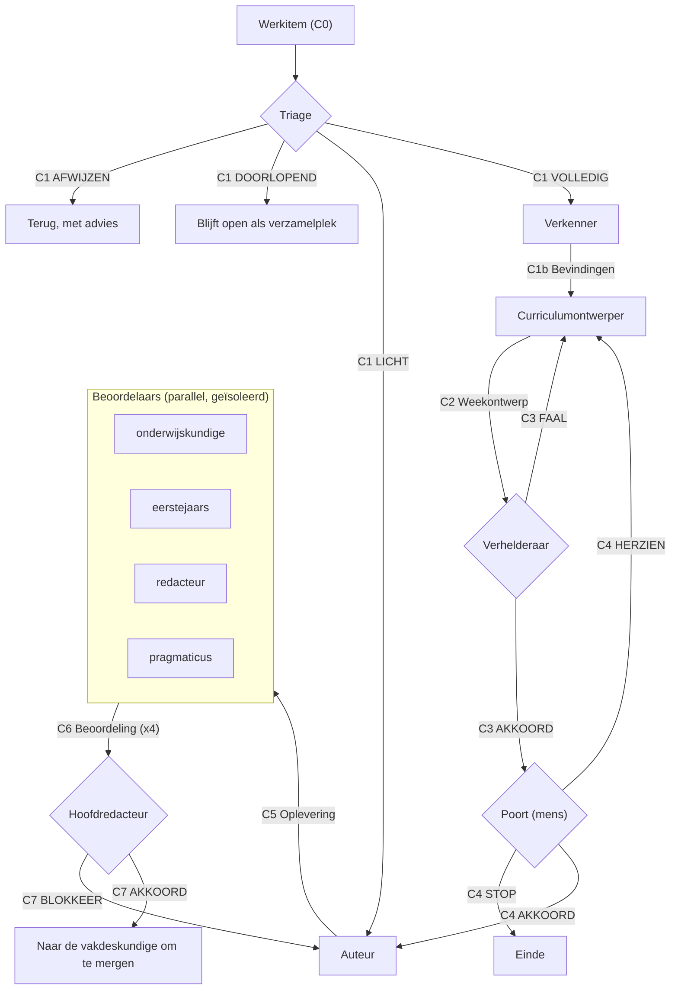

# De rollenlus

De pijplijn: de stappen, de contracten die ertussen gaan, en de plekken waar het
pad zich splitst. De grondslag staat in [principles.md](principles.md), de
contracten in [contracts/](contracts/), de rolprompts in [roles/](roles/). De
uitleg voor mensen staat in [`rollen/`](../../../rollen/rollen.md).

Dit is een bewerking van het [role loop](https://github.com/misja/agent-role-loop)-model
voor een redactieproces in plaats van een softwareproject. De vier principes
gelden onverkort; de rollen en de contracten zijn bewerkt.

## Pijplijn



## Stappen

| Stap | Rol | Krijgt | Levert | Door |
|---|---|---|---|---|
| Triage | [triage](roles/triage.md) | C0 | C1 | agent |
| Meten | [verkenner](roles/verkenner.md) | C0, C1 | C1b | agent |
| Ontwerpen | [curriculumontwerper](roles/curriculumontwerper.md) | C0, C1b | C2 | agent |
| Verhelderen | [verhelderaar](roles/verhelderaar.md) | C0, C2 | C3 | agent |
| Poort | [vakdeskundige](roles/vakdeskundige.md) | C2, C3 | C4 | **mens** |
| Schrijven | [auteur](roles/auteur.md) | C2, C4 | C5 | agent |
| Beoordelen | [vier beoordelaars](roles/) | C5 (kern) | C6 (x4) | agents, parallel |
| Eindoordeel | [hoofdredacteur](roles/hoofdredacteur.md) | C5 (volledig), C6 (alle) | C7 | agent |

De vier beoordelaars kijken naar dezelfde kern vanuit een eigen houding:
[onderwijskundig](roles/beoordelaar-onderwijskundige.md),
[als eerstejaars](roles/beoordelaar-eerstejaars.md),
[redactioneel](roles/beoordelaar-redacteur.md) en
[pragmatisch](roles/beoordelaar-pragmaticus.md).

De [eindredacteur](roles/eindredacteur.md) staat buiten de lus en draait
periodiek over het geheel. Zijn bevindingen worden meestal werkitems met de route
`DOORLOPEND`.

## Waar het pad zich splitst

1. **Triage (C1).** `VOLLEDIG` begint bij de verkenner. `LICHT` gaat rechtstreeks
   naar de auteur met een minimaal ontwerp. `DOORLOPEND` blijft open als
   verzamelplek. `AFWIJZEN` gaat terug met advies.
2. **Verhelderaar (C3).** `AKKOORD` gaat naar de poort. `FAAL` gaat terug naar de
   ontwerper met genummerde wijzigingen. Faalt het drie keer, dan gaat de patstelling
   naar de mens.
3. **Poort (C4).** `AKKOORD` laat de auteur beginnen. `HERZIEN` stuurt genoemde
   wijzigingen terug. `STOP` beëindigt het werk. Alleen een mens vult C4 in.
4. **Eindoordeel (C7).** `AKKOORD` en `AKKOORD MET PUNTJES` sluiten de lus.
   `BLOKKEER` gaat terug naar de auteur met een moet-lijst.

## Gelijktijdigheid

De beoordelaars draaien parallel en geïsoleerd: elk krijgt dezelfde kern van C5,
en geen van hen ziet het oordeel van een ander. Onafhankelijke gezichtspunten zijn
de waarde; context delen laat ze samenvallen tot één.

Schrijven gebeurt achter elkaar. Twee auteurs in hetzelfde materiaal leveren
conflicten op, geen snelheid.

## Wat de machine eerst doet

De mechanische controles zijn groen **voordat** de oplevering naar de
beoordelaars gaat:

```sh
uv run pre-commit run --files <gewijzigde bestanden>
uv run make html
```

Ze zijn een toegangsvoorwaarde tot de beoordeling, geen onderdeel ervan.
Beoordelingsaandacht besteden aan wat een hook al vaststelt, is verspilling.

## De leesronde: beoordelaars buiten de lus

De vier beoordelaars horen in de lus thuis, na de auteur. Maar ze kunnen ook los
draaien, op materiaal dat de lus nog nooit heeft gezien.

Doe dat **voordat** je een ongelezen week door de volle lus haalt. Gemeten: twee
beoordelaars op twee weken kostten samen ongeveer een derde van wat één week door
de volle lus kostte, en leverden twee werkitems vol aantoonbare defecten op. Op
ongelezen materiaal is lezen goedkoper en opbrengender dan ontwerpen, omdat je pas
daarna weet wat er aan de hand is - en wat er níét aan de hand is.

Hun oordelen worden dan de grondslag van het werkitem: zet ze als reactie op de
issue, want ze bestaan verder alleen in de sessiecontext en zijn duur om opnieuw te
maken.

Welke beoordelaars je kiest hangt af van wat je wilt weten. De eerstejaars vindt
waar een student vastloopt en dat vindt niemand anders; de redacteur vindt
dubbelingen en verhoudingen; de onderwijskundige ziet of een keuze een opzet is of
een omissie. Vier is niet altijd nodig.

Wat er in een leesronde anders geldt staat in het C6-contract, onder *Twee modi*.

## Gereedschap: gebruik wat er is

Elke rol die een commando draait, gebruikt de standaardgereedschappen die op het
systeem staan: `grep`, `sed`, `awk`, `find`, `python`, `git`, `jq`. Wat er verder
aanwezig is, stel je vast in plaats van aan te nemen.

**Ga er niet van uit dat `ripgrep`, `fd`, `bat` of ander vervangend gereedschap
bestaat, en installeer nooit iets.** Wat er op de machine staat is een besluit van
de gebruiker, niet van een rol. Draai een patroon dat je opschrijft eerst zelf, en
draait het niet, kies dan een vorm die het wel doet - `grep -P` heeft dezelfde
PCRE-semantiek als de meeste voorbeelden die je tegenkomt.

Dit is een bijzonder geval van de verkennersregel *meet het ding zelf, niet iets
ernaast*: een patroon dat stukloopt op een vlag die dit systeem niet kent, meet
niets, en een patroon waarvan nul treffers het geslaagd-criterium is, slaagt dan
altijd.

## Proportionaliteit

| Omvang | Route |
|---|---|
| Een typefout, een dode link, een naam rechtzetten | `LICHT`, of gewoon doen |
| Eén opgave herzien, een sectie toevoegen | `LICHT` |
| Een week herzien | `VOLLEDIG` |
| Beeldkwaliteit, terminologie, dode verwijzingen | `DOORLOPEND` |
| Een vak herindelen | `AFWIJZEN`; eerst opsplitsen in weken |

Bij twijfel telt hoe moeilijk het terug te draaien is. Materiaal weggooien of een
leeruitkomst verplaatsen verdient de volledige lus, ook als de wijziging klein
oogt.

### De omvang bindt ook de rollen die erna komen

Triage bepaalt een omvang en tot nu toe deed niemand daar iets mee: een klein
werkitem kreeg dezelfde behandeling als een grote herziening. Dat is de duurste
fout die de lus kan maken, want zij treft juist de stappen die het meeste kosten.

| | **XS, S, M** | **L, XL** |
|---|---|---|
| Verkenner | meet wat het werkitem vraagt en wat het ontwerp moet beslissen, en verder niets | meet ook de omgeving: terminologie, verhoudingen, wat er ooit stond |
| Ontwerper | een checklist per onderdeel, geen apparaat eromheen | de volledige vorm, inclusief meetgereedschap waar dat draagt |
| Verhelderaar | faalt alleen op wat de auteur ophoudt | de volledige controlevolgorde |
| Beoordelaars | het aantal uit de weegdrempel, en niet meer | idem, maar over meer materiaal |

De omvang staat in het C1 Triagebesluit. Wie hem niet kent, vraagt ernaar in plaats
van de volle behandeling te kiezen omdat die veiliger voelt.

### Artefacten convergeren

Een herzien artefact is **korter** dan zijn voorganger, of het zegt waarom niet.
Een reparatieronde die het ontwerp langer maakt, heeft iets anders gedaan dan
repareren.

Let daarbij op één patroon dat de lus uit zichzelf voortbrengt: de verhelderaar
vraagt om hardheid, de ontwerper antwoordt met apparaat, en de ronde daarna vraagt
de verhelderaar of dat apparaat wel klopt. Zo optimaliseert de lus tegen zijn eigen
criticus. Verifieerbaarheid is een middel; als de beschrijving van de meting langer
wordt dan wat er gemeten moet worden, is de verhouding zoek.
