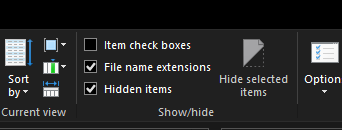
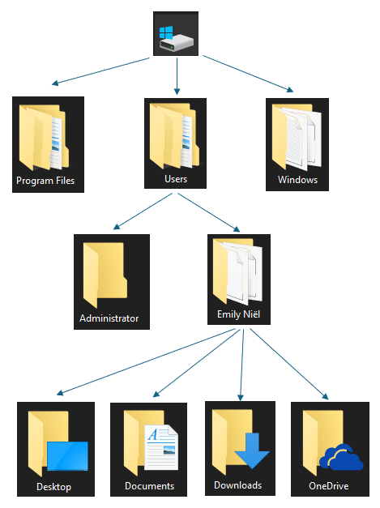
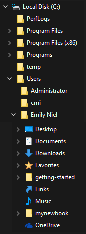
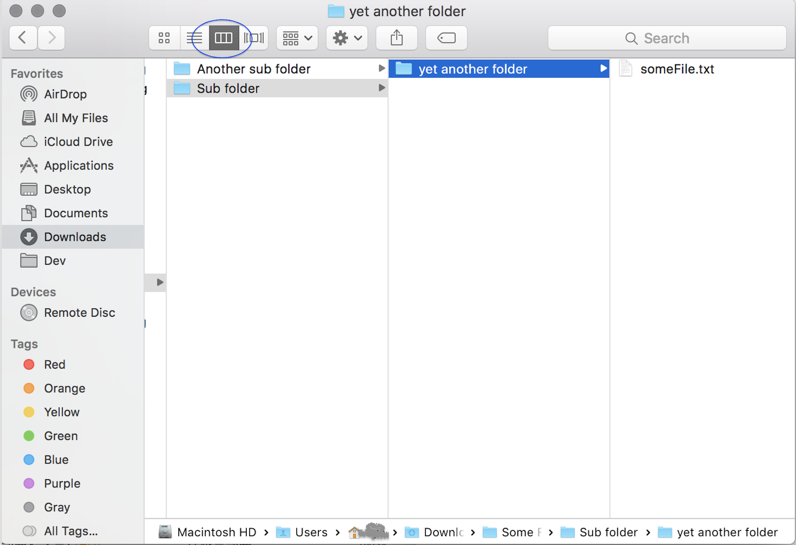
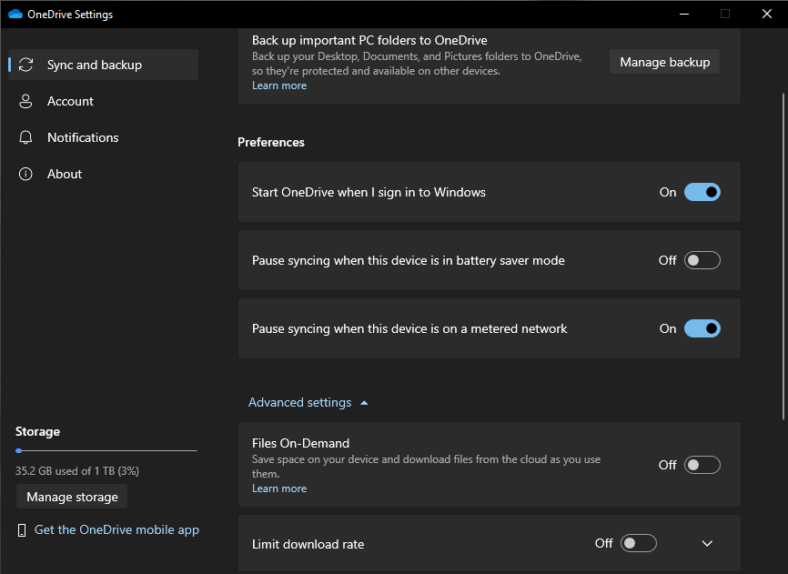
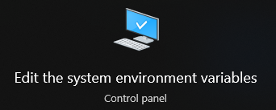
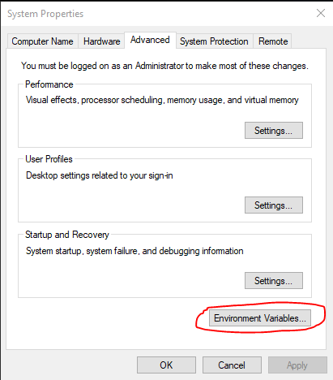
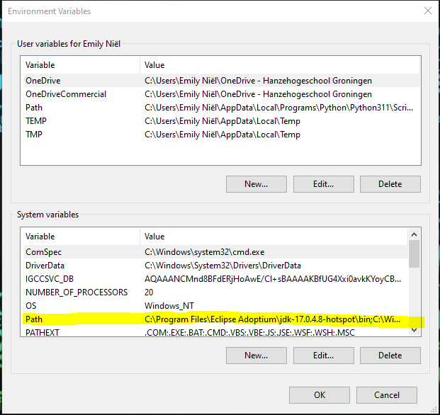

# De terminal

Het **doel** van deze les is om:

* Kennis maken met het folder systeem. 
* Werken met een command-line interface

## Foldersysteem
Een programma heeft instructies nodig om te weten wat het moet doen. Deze instructies staan in bestanden, ook bekend als files. Elk bestand heeft een extensie om aan te geven wat voor type bestand het is. `bestand.py` is een python bestand, `bestand.docx` is een word bestand. Het zijn altijd de laaste drie, soms vier letters na de **laatste** punt. `bestand.docx.py` is nog steeds een python bestand. 

:::{admonition} Belangrijk!
:class: notice

In de verkenner van windows zijn niet alle bestanden en mappen zichtbaar. Daarnaast zijn de extensies niet standaard weergegeven. Het is verstandig om via het tabblad View de optie *file name extensie* en *hidden items* te selecteren. 


:::

Vele programma's bestaan uit verschillende bestanden en om deze allemaal bij elkaar te houden staan ze in een map, ook bekend als een folder of een directory. Als gebruiker kan je ook mappen aanmaken om bestanden makkelijk terug te vinden. Binnen windows gebruik je de verkenner a.k.a. de explorer en binnen apple gebruik je Finder. 

Mappen staan in een zogenaamde boomstructuur. 



Vaak staan de mappen onder elkaar afgebeeld. 



De apple finder gebruikt een andere methode om mappen structuur af te beelden. 



### One-drive
One-drive is de cloud systeem van microsoft. Het is automatisch geinstaleerd in windows. Voor mac kan het geinstalleerd worden met Rosetta 2 emulator. Via de hanze heb je toegang tot een grote one-drive om al je schoolwerk in kwijt te kunnen. Het werkt als een normale folder in de verkenner en alles wat erin staat wordt opgeslagen in de cloud. Het grote voordeel is dat je werk altijd een backup heeft. Je kan ook op verschillende apperaten inloggen dezelfde one-drive account instellen, bijvoorbeeld op een tablet, laptop en desktop. Op deze manier heb je toegang tot je bestanden op alle drie the apperaten. 

In de settings van one_drive kan je een account toevoegen, including je hanze schoolaccount. Zodra je deze hebt aangemaakt wordt er een nieuwe map aangemaakt voor de one-drive. Daar kan al het werk in geplaats worden. 

:::{admonition} Belangrijk!
:class: notice

One-drive staat standaard op *Files On-demand*. Dit houdt in dat het enkel een document download zodra je het opent. Voor programmeren werkt dat niet. Bestanden moeten lokaal beschikbaar zijn. Het is dus verstandig om *files on-demand* uit te zetten.  


:::

## Command Prompt!
De meeste interacties die we met computers hebben zijn via vensters die door het besturingssysteem aangeboden worden. Het besturingssysteem (of *OS*, kort voor *operating system*), is meestal Windows of Mac OS, maar er zijn vele andere, waarvan Linux de meest voorkomende is. Het besturingsysteem dat je gebruikt voorziet in een *venstersysteem* waardoor je een muis kan gebruiken, op een gebruikersvriendelijke manier kan interacteren met de computer, en zelfs films kan bekijken. De klik-en-sleepinterface van moderne venstersystemen is zeker heel erg handig!

***Echter***, de grafische interface is ook een gordijn, dat de gebruiker afschermt van wat er echt gebeurt met de bestanden op het systeem. Het is een krachtige en nuttige vaardigheid om een duidelijk idee te hebben van hoe bestanden gebruikt worden *achter* het gordijn van het venstersysteem. De terminal is een programma dat "achter" het gordijn kijkt. Hij gebruikt tekstcommando's op de zogeheten "command line" (of commandoregel) om bestanden en acties op je computer aan te spreken.

Je op je gemak voelen op de command line is vaak handig om programma's te *maken*. Het besturingssysteem is erg geschikt voor het *gebruiken* van programma's!

***Start je terminal op!***

Windows: Start command prompt via het startmenu. Klik op het start menu of op het vergrootglas en type in cmd. Je kan ook werken met powershell door powershell in te typen en op te starten. 

Apple: Om de terminal te openen in Apple druk je op command+spatie en type je in term. Dit geef dan de optie om de terminal te openen. 

De terminal heeft vele namen:

* De terminal
* De shell
* De command line

Als dit de eerste keer is dat je de terminal gebruikt, goed bezig!

## Paden. 
Zodra je de terminal opent start het vaak in de eigen user map. Dit is aangegeven via een pad. 

```console
C:\Users\Emily>
```
De slashes `/` scheiden submappen van de map waar ze in zitten. Op Windows zie je meestal backslashes `\` of dubbele backslashes; dit verschil is niet belangrijk.

Vertaling: Op de C-schijf in de map Users is de map Emily

Alle bestanden hebben hun eigen pad, een locatie binnen het systeem. Een computer kan enkel een bestand vinden als het pad bekend is. 

### Path Variable
Er zijn commando's die je als programmeur vaak wil gebruiken, bijvoorbeeld het uitvoeren van Python of een java programma. Om de computer een python programma uit te laten voeren heeft python.exe nodig samen met een python bestand. Pyhton.exe heeft een locatie, bijvoorbeeld `C:\Users\Emily\AppData\Local\Programs\Python\Python311\python.exe`. Als je pyton gaat programmeren wil je niet elke keer de hele locatie uit typen. Het is makkelijker als de pc altijd python.exe kon vinden.

In windows kan je dat doen via PATH. Druk op start en type in path. Dit geeft je de optie om de system environment variables aan te passen. 



Dit opent een nieuw programma in en in het tabblad Advanced kan je de optie Environment variables aan klikken. 



Je hebt nu toegang tot alle environment variables, waaronder ook Path. 



In path staan verschillende locatie aangegeven. De bestanden die in deze locaties staan zijn altijd te vinden. Als `C:\Users\Emily\AppData\Local\Programs\Python\Python311\` in het path staat is `python.exe` beschikbaar om te gebruiken. 

## De terminal en de command-line

Alles wat je kan doen met de vensters van je besturingssyteem kan je ook met de terminal en de command-line doen. (Sterker, je kan nog veel *meer* met de command line doen...)

Bij dit vak heb je drie terminalcommando's nodig. We behandelen ze alledrie kort. Hier is een kort overzicht:

* `pwd`; kort voor *print working directory*. Het drukt je huidige locatie (map) af.
* `ls`; Het drukt een lijst af van alle bestanden in de huidige locatie.
* `cd`; kort voor *change directory*. Het laat je van map naar map door je computer navigeren.


## `pwd`

Eerst zie je de *prompt*. De prompt is het stukje tekst aan de linkerkant dat wacht totdat je wat op de command line typt en dit zal er voor Windows, macOs en Linux nét iets anders uit zien (die van macOS en Linux lijken op elkaar omdat deze besturingssystemen familie van elkaar zijn!). Dat het op input wacht kan je zien aan de knipperende cursor (het knipperende blokje).

`````{tab-set}

````{tab-item} Windows
```console
PS C:\Users\misja>
```
````

````{tab-item} macOS
```console
misja@MacBook-Air ~ %
```
````

````{tab-item} Linux
```console
misja@selenix:~$
```
````

``````

**Het commando `pwd`** staat voor *print working directory*. Het drukt je huidige locatie (map) af. Probeer het:

`````{tab-set}

````{tab-item} Windows
```console
PS C:\Users\misja> pwd

Path
----
C:\Users\misja


PS C:\Users\misja>
```
````

````{tab-item} macOS
```console
misja@MacBook-Air ~ % pwd
/Users/misja
misja@MacBook-Air ~ %
```
````

````{tab-item} Linux
```console
misja@selenix:~$ pwd
/home/misja
misja@selenix:~$
```
````

`````

Je ziet de locatie waarin je terminal en command line op dit moment actief is. Waarschijnlijk zal je een iets ander resulaat zien, behalve als je naam toevallig `misja` is 😉

Merk ook op dat een volgende prompt verschenen is, die op een volgend commando wacht...

De uitvoer is de *naam van de map* waar je je momenteel bevindt in de terminal. "Map" en "directory" betekenen hetzelfde.

De slashes `/` scheiden submappen van de map waar ze in zitten. Op Windows zie je meestal backslashes `\` of dubbele backslashes; dit verschil is niet belangrijk.

In alle voorbeelden is de gebruiker in een submap met de naam `misja` op de harde schijf. Dit zal jou "home directory" zijn, de plek waar al jouw bestanden staan.

We gaan nu kijken wat we hier kunnen vinden met het commando `ls`...

## `ls`: het *list*-commando

**Het commando `ls`** staat voor *list*.

Als je `ls` uitvoert toont dit een lijst van alle bestanden en mappen in je huidige directory. Gebruik je het programma command prompt, dan gebruik je het commando `dir` (afkorting for directory). Een voorbeelduitvoer van `ls` is:


`````{tab-set}

````{tab-item} Windows
```console
PS C:\Users\misja> ls


    Directory: C:\Users\misja


Mode                 LastWriteTime         Length Name
----                 -------------         ------ ----
d-r---         9/26/2022  12:32 AM                Contacts
d-r---        10/23/2022   8:10 PM                Desktop
d-r---        10/23/2022   9:15 PM                Documents
d-r---         8/30/2023   9:03 PM                Downloads
d-r---         9/26/2022  12:32 AM                Favorites
d-r---         9/26/2022  12:32 AM                Links
d-r---         9/26/2022  12:32 AM                Music
d-r---         9/25/2022  11:55 PM                Pictures
d-r---         9/26/2022  12:32 AM                Saved Games
d-r---         9/25/2022  11:48 PM                Searches
d-r---         10/7/2022   8:45 PM                Videos


PS C:\Users\misja>
```
````

````{tab-item} macOS
```console
misja@MacBook-Air ~ % ls
Desktop  Documents  Downloads  Library  Movies  Pictures  Public
misja@MacBook-Air ~ %
```
````

````{tab-item} Linux
```console
misja@selenix:~$ ls
Desktop  Documents  Downloads  Movies  Music  Pictures  Public
misja@selenix:~$
```
````

`````

De uitvoer is een lijst van alle bestanden en (sub)mappen in de huidige directory (Ter herinnering, "directory" en "map" zijn hetzelfde; de begrippen worden beide gebruikt.)

Probeer het commando om een lijst van de namen van bestanden en submappen in je huidige directory te zien in de terminal, bijvoorbeeld


````{tip}
Met `ls` kan je ook de inhoud van een submap bekijken door het de naam van deze map mee te geven als extra *argument*, bijvoorbeeld

```console
ls Desktop
```
````

Nu ga je door de directory's heen "bewegen" met `cd`...

## `cd`: het *change-directory*-commando

**Het commando `cd`** is het belangrijkste. Het staat voor *change directory*.

Het commando `cd` laat je van je huidige map naar andere mappen (directory's) op je computer navigeren. Om het te gebruiken moet je natuurlijk wel weten waar je heen wilt gaan!

Je kan bijvoorbeeld het bureaublad (Desktop) proberen ... typ dus `cd Desktop` in:

`````{tab-set}

````{tab-item} Windows
```console
PS C:\Users\misja> cd Desktop
PS C:\Users\misja\Desktop>
```
````

````{tab-item} macOS
```console
misja@MacBook-Air ~ % cd Desktop
misja@MacBook-Air ~/Desktop %
```
````

````{tab-item} Linux
```console
misja@selenix:~$ cd Desktop
misja@selenix:~/Desktop$
```
````

`````

Er is niet veel gebeurd ... tot je `pwd` intypt en ziet dat je ergens anders bent! En als je goed kijkt zal je ook zien dat de *prompt* is veranderd en jou laat weten dat je nu in een andere *directory* bent ...

Als je nu `ls` typt zouden er *veel* meer bestanden kunnen zijn maar dat hangt er een beetje vanaf hoe rommelig je bureaublad is! *Probeer het maar!*

```console
ls
```

Je gaat je nu "omhoog" verplaatsen in de directorystructuur...

## `cd ..`: een map "omhoog" gaan

Ok, je bent naar het bureaublad (Desktop) ge-`cd`'d, *maar hoe ga je terug?!*

De speciale directorynaam met twee punten achter elkaar `..` betekent "één directory *omhoog*".

Als je dus `cd ..` intypt en op return drukt ben je terug in de map die je bureaublad *bevat*:

```console
cd ..
```

Probeer nu `pwd` en `ls` om er zeker van te zijn dat je weer terug bent!

### Oefenen!

Probeer de volgende commando's op jouw computer. Twijfel je bij elke stap waar je je nu bevindt? Gebruik dan altijd `pwd` om het te controleren!

```console
cd
```

Het commando `cd` is zonder de naam van een directory waar je naartoe wilt? Dit is geen typfout! Het commando `cd` zonder een *argument* zal altijd `cd`-en naar jouw *home directory* en is de meest snelle manier om weer 🏠 te komen 😊

```console
cd Documents
```

Welke interessante bestanden heb jij in deze directory staan? Gebruik `ls`!

```console
ls
```

En maar weer een stap terug, waar je net vandaan kwam ...

```console
cd ..
```

Ben je nu weer terug in jouw *home directory*? Controleer het met `pwd` ...

```console
pwd
```

Dat is alles! Je kan nu de command line gebruiken. Er zijn een paar *erg* handige shortcuts die de command line *veel* efficiënter maken; efficiënter dan de drag-en-drop-vensterinterface! Een paar voorbeelden:

* *tab completion* Typ `cd Des` als je in je home directory staat en druk op de *tab*-toets. De command line zal je commando proberen aan te vullen. Ervaren (en luie!) gebruikers zullen lange namen bijna altijd met tab afmaken, in plaats van ze te typen. Het kan je veel tijd schelen!
* *pijltje omhoog* en *pijltje omlaag* De pijltje-omhoog- en pijltje-omlaag-toetsen onthouden wat je eerder gedaan hebt. Nadat je een commando hebt gebruikt, kan je deze met pijltje-omhoog terughalen. Je kan het ook bewerken (pijltje-links en pijltje-rechts werken hier ook) als je een fout maakt.