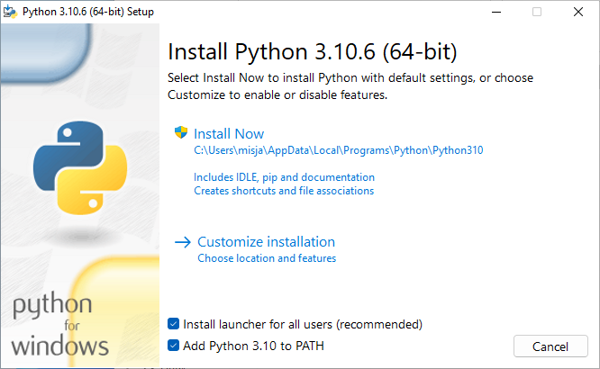
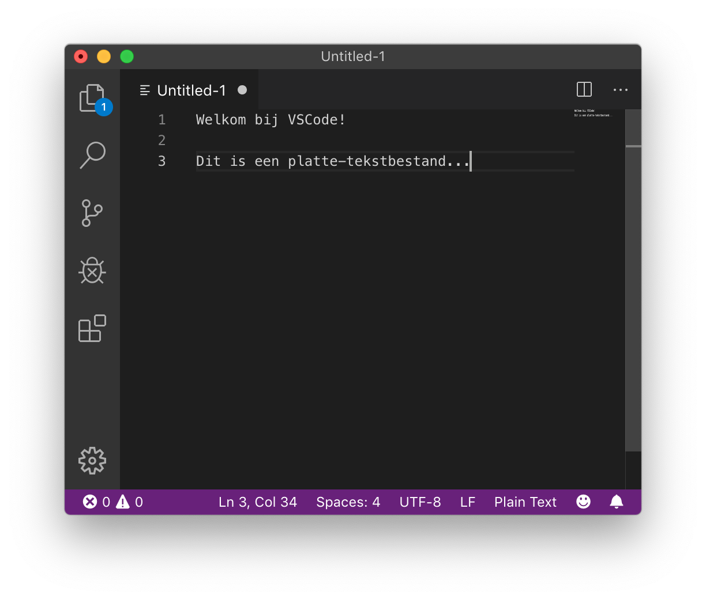
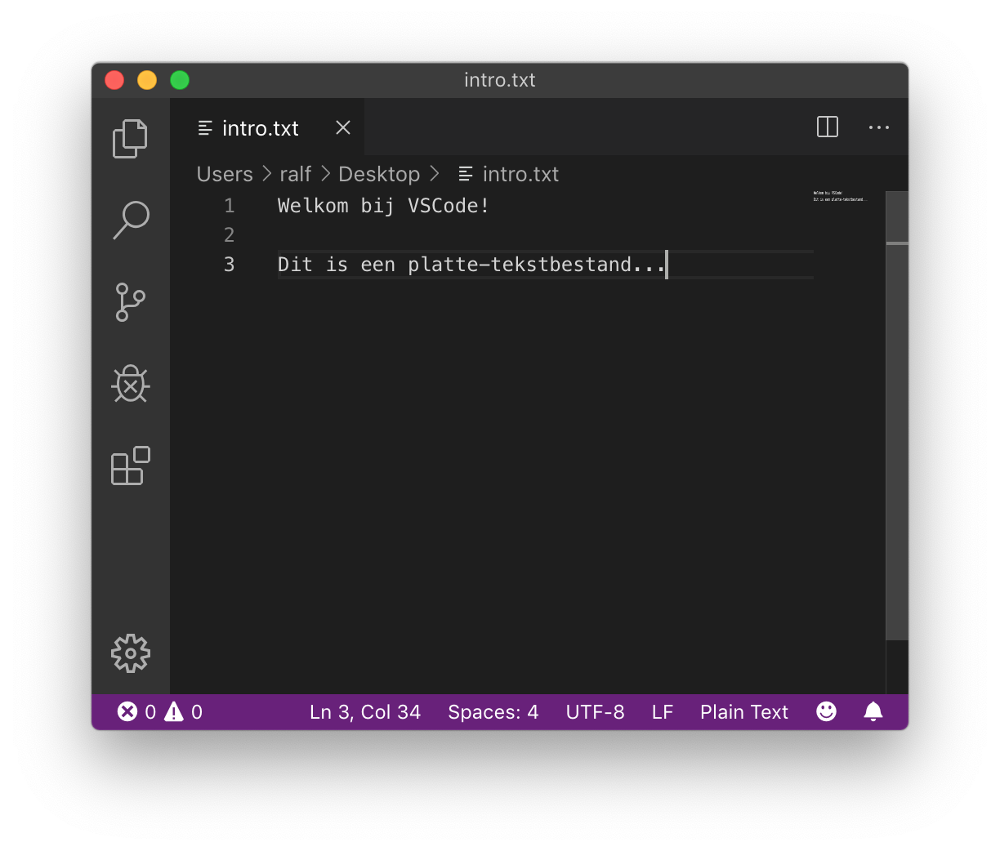
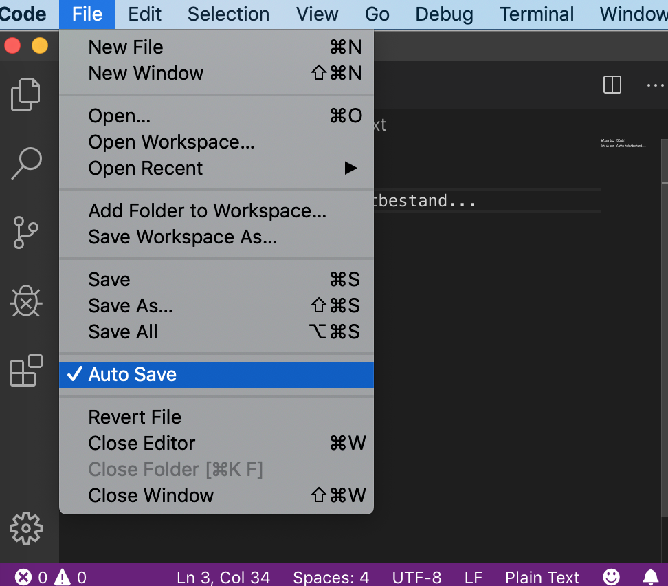
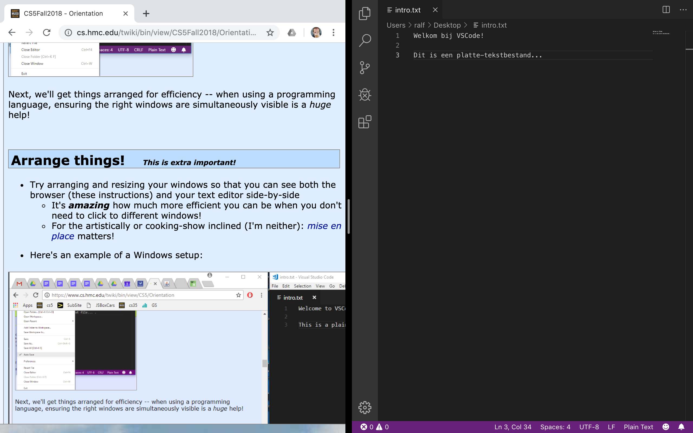
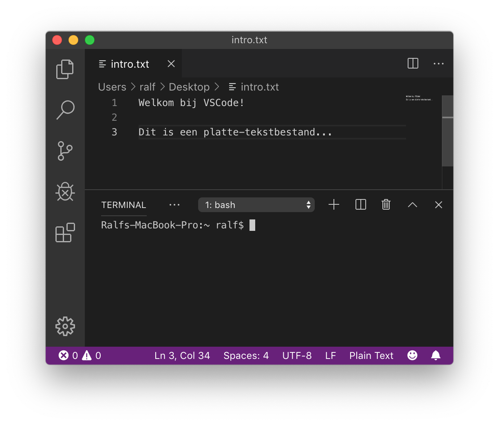
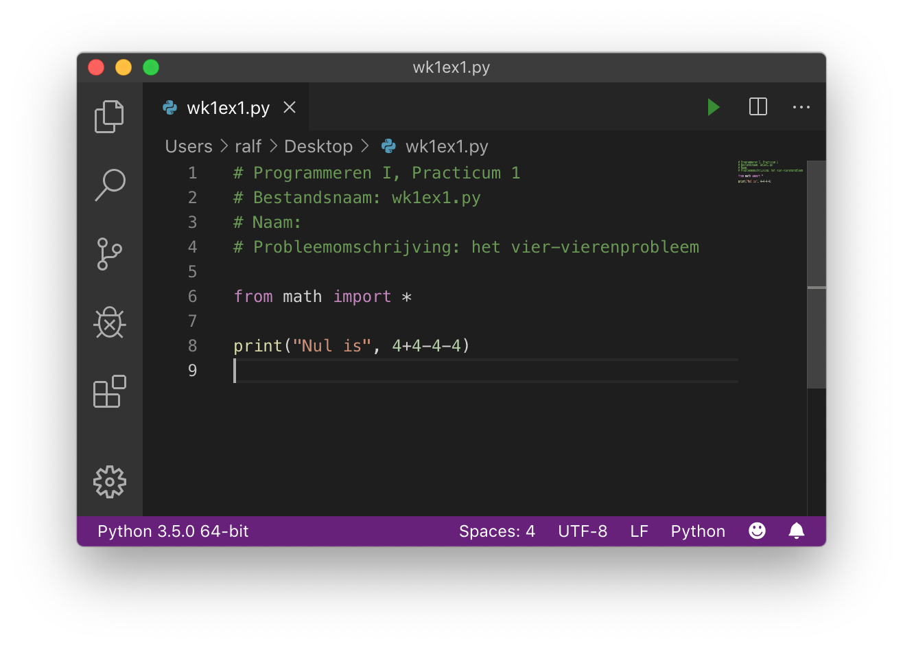

# Python installeren

Het **doel** van deze opgave is om:

* Te zorgen dat je Python en een teksteditor geïnstalleerd krijgt op je computer
* Om een "Hallo"-programma te lezen, bewerken en uitvoeren in Python

## De software installeren

### Welke software gebruiken we?

We gebruiken bij Programmeren software die je misschien nog niet hebt. Je hebt de volgende programma's nodig:

* **Python**; wij gebruiken de laatste versie van [python.org](https://python.org).
* **Een teksteditor**; geen tekstverwerker; om je Python-bestanden te bewerken. We raden [VSCode](https://code.visualstudio.com/) aan, een gratis, veel gebruikte tekstverwerker die beschikbaar is voor alle besturingssystemen (macOS, Windows en Linux). *Als je al een favoriete teksteditor hebt, kan je die ook gebruiken.*

### Downloaden en installeren


`````{tab-set}

````{tab-item} Windows
Download en installeer Python van [python.org](https://www.python.org/downloads/windows/).

```{caution}
Tijdens het installeren zal worden gevraagd of je Python aan `PATH` zou willen toevoegen, kies hier voor!


```
````

````{tab-item} macOS
Sinds macOS 11.0 ("Big Sur") is Python versie 3 op macOS standaard geïnstalleerd maar dit is vaak een oudere versie. We raden je aan de laatste versie van [python.org](https://www.python.org/downloads/macos/) te downloaden en te installeren.
````

````{tab-item} Linux
Linux gebruikers hebben het gemakkelijker, als je een up-to-date distributie als bijvoorbeeld Ubuntu, Mint of Arch hebt dan zal je ook een recente Python versie standaard al geïnstalleerd hebben. Controleer dit als volgt op een terminal:

```console
python3 --version
```
````

`````

### Wacht, ik heb Python al...

Geen probleem! Zorg er in ieder geval voor dat het een recente versie is.

## VSCode installeren

Visual Studio Code (VSCode) is een gratis teksteditor, met hulpmiddelen voor het bewerken van software broncode, bijvoorbeeld Python.

Download en installeer VSCode van [https://code.visualstudio.com/](https://code.visualstudio.com/).

## VSCode als editor gebruiken

### Probeer VSCode, een *teksteditor*.

* Teksteditors zijn niet hetzelfde als tekstverwerkers.
  *   Microsoft Word, Google Docs, Pages van Apple of elke andere *tekstverwerker* kan tekst mooi opmaken
      *   Maar ze geven je *geen* rechtstreekse toegang tot de daadwerkelijke inhoud van een bestand!
    *   Ze bevatten speciale, onzichtbare tekens met informatie over de opmaak
    *   Aangezien programmeertalen ***platte tekst*** (strings met karakters) gebruiken, zijn (platte-)teksteditors de geschikte tool om in te programmeren!
*   Start dus je teksteditor op; vermoedelijk VSCode, als je die net geïnstalleerd hebt...
*   Sluit de introductietabs (je kan VSCode vertellen deze niet meer te tonen) en zorg dat je een "leeg bestand" (een leeg venster) ziet.
    *   Type daarna wat tekst, zoals bijvoorbeeld:

      
*   Sla dit bestand op als `intro.txt`
    *   Dat kan op je bureaublad of in een speciale map voor Programmeren I; dat mag je zelf bepalen. Dit ziet er dan ongeveer zo uit:

      
*   ***Automatisch opslaan!***; het is een goed idee om VSCode in te stellen zodat deze al je bestanden automatisch opslaat
  Deze optie kan je hier vinden:

   

We gaan nu je vensters herschikken zodat je efficiënter kan gebruiken; als je aan het programmeren bent kan het *erg veel* helpen als je zorgt dat de goede vensters tegelijk zichtbaar zijn!

## Vensters herschikken! (dit is handig!)

* Probeer je vensters zo te herschikken en in grootte aan te passen zodat je tegelijk je browser (met deze instructies) en je teksteditor, naast elkaar, kan zien.
  * Het is ***belachelijk*** hoe veel efficiënter je wordt als je niet steeds tussen vensters hoeft te wisselen.
  * Mocht je artistiek zijn of van kookprogramma's houden: [*mise-en-place*](https://nl.wikipedia.org/wiki/Mise-en-place) is belangrijk!
* Hier is een voorbeeld van een Mac-omgeving:

  

* Neem even een kijkje in de menu's van VSCode. Je kan bijkvoorbeeld in *View* de optie *Hide Status Bar* en *Hide Activity Bar* kiezen, maar het kleurenschema veranderen is nog leuker!
* **Kleurenschema!** Besteed niet te veel tijd hieraan, maar voel je vrij om je favoriete kleurenschema te kiezen voor VSCode (menu's: File/Code ... Preferences ... Color Theme). Dit is erg leuk, misschien zelfs [te leuk](https://code.visualstudio.com/docs/getstarted/themes)...

Hierna ga je een *terminalvenster* openen...

## Het terminalvenster!
In de teksteditor VSCode kan je een terminal open door in het menu *View* en dan *Terminal* te kiezen. Je scherm wordt nu opgesplitst:



De bovenste helft is nog steeds de teksteditor.

***De onderste helft is nu je terminalvenster.***


Ok! We zijn nu klaar voor Python.

## Python in een *bestand* uitvoeren

We hebben al een teksteditor open staan!

Maak dus in een nieuwe tab een nieuw, leeg bestand (via het menu *File* en daaronder *New File*)

Plak (of typ) onderstaande code in het nieuwe bestand

```python
# Programmeren I, Practicum 0
# Naam:
# Probleemomschrijving: Hello world

print("Hello World")
```

Sla dit bestand op als `hello.py` in je programmeer folder.

* Hierna kan je je Python-programma's overal opslaan; het is handig om ze te organiseren in mappen.
* Vergeet **niet** om de extensie `.py` toe te voegen
* Als je het bestand opslaat met de extensie `.py` (zoals we dat noemen), zie je dat de Python-code *gekleurd* wordt.
    * Dit wordt ook wel *syntax highlighting* genoemd
    * Als je code niet kleurt, vraag het ons! Het is belangrijk dat je deze kleurrijke aanwijzingen hebt voor de structuur van je programma. Hier is een voorbeeld:

      

* **Een bestand uitvoeren!**

  Om een bestand uit te voeren, moet je weer naar de terminal gaan.
    * Type `ls`( mac) of `dir` (windows) om de bestanden in de huidige directory te zien
    * Zorg dat je je bestand `hello.py` ziet!
        * Als je hem niet zien, gebruik dan `cd ..` of `cd Desktop` of andere combinaties om naar de juiste directory te gaan.
    * Typ op de prompt `python hello.py` (je kan hier tab completion voor gebruiken). Als je de melding krijgt dat python niet gevonden is kan het zijn dat de Path variabele niet goed is ingesteld (Windows).
    * Dit voert het bestand `hello.py` uit.
    * Als alles goed gaat wordt het programma uitgevoerd en zie je de uitvoer.
    * Je kan nu je bestand bewerken, opnieuw opslaan en *pijltje omhoog* drukken om het opnieuw uit te voeren.

