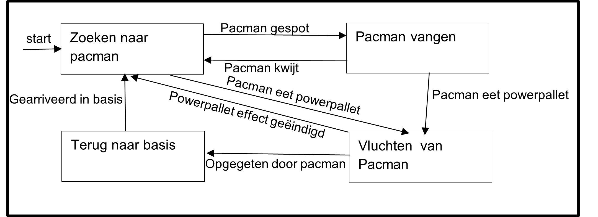

# Wat is informatica

Voordat we beginnen, moeten we iets zeggen over informatica. Wat denk je dat informatica is?

Veel mensen denken dat het *programmeren* of gewoon *leren coderen* is of dat het iets met computers is.

Informatica is het verwerken van informatie. Gegeven een input, hoe verwerken we dat tot een gewenste output? Met andere woorden, het gaat om problemen oplossen. Programmeren is een belangrijk hulpmiddel om de computer de informatie te laten verwerken en tot de oplossing te komen. De truc is om als programmeur de computer uit te leggen hoe hij de data moet verwerken.

## Hoe kan een probleem worden opgelost?

- Kun je het probleem oplossen?
- Kun je een proces ontwerpen om dit soort problemen op te lossen?

Het is niet verstandig om, als er een probleem opgelost moet worden, meteen te gaan programmeren. Probeer eerst het probleem op papier op te lossen met een klein voorbeeld. Welke stappen/instructies zijn er gebruikt om het probleem op te lossen? Dit wordt computational thinking genoemd: de vaardigheid om een set van instructies te ontwikkelen dat een gegeven probleem kan oplossen. Deze set van instructies om van A naar B te komen wordt een algoritme genoemd.

## Strategieën

De strategie die gebruikt kan worden om een oplossing te vinden verschilt per probleem. De ene strategie past beter dan de ander, maar wat wel handig is, is om pen en papier te gebruiken. Hier zijn er een aantal:

1. *Teken het probleem op papier*. Dit werkt vooral als je met ruimtelijke vragen bezig bent.
2. *Maak het probleem kleiner*. Bijvoorbeeld: wordt er gevraagd om een methode te verzinnen om getallen te sorteren? In plaats van het probleem op te lossen met 100 getallen, doe het eerst met twee getallen, daarna met drie, enz.
3. *Probeer alle opties uit*. Deze leent zich vooral als er niet teveel verschillende inputs zijn.

### Longest Common Subsequence (LCS)

Het string-matching probleem in DND:

- 'CGCTGAGCTAGGCC...'
- 'ATCCTAGGTAACTG...' (en $10^9$ meer!)

Wat is de langst *gemeenschappelijke opeenvolging* van karakters? In biologie is dit een werkelijk probleem waar het gaat om het vergelijken van DNA-sequenties. Een subsequence is een reeks karakters die in dezelfde volgorde voorkomen in beide strings, maar niet noodzakelijk aaneengesloten.

In plaats van het probleem op te lossen op een grote dataset is het vaak makkelijker om eerst een kleinere dataset te proberen op te lossen. Bijvoorbeeld twee woorden:
- 'HUMAN'
- 'CHIMPANZEE'

Je zult redelijk snel zien dat 'HAN' de langst gemeenschappelijke opeenvolging van karakters is. Dit is de eerste stap van het oplossen van een probleem: de probeerfase.

Welke stappen heb je gebruikt om tot een oplossing te komen? Zijn deze stappen ook toe te passen op een opeenvolging van 3 miljard karakters? Dit is de planfase waarin het algoritme wordt ontworpen.

Zodra er een algoritme is ontworpen kan het geprogrammeerd worden. Dat is dan de programmeerfase.

## Beslissingsboom

Beslissingsbomen (*behavior trees*) kunnen gebruikt worden om instructies te visualiseren. Het is een vorm die je misschien wel herkent.

Dit is het algoritme van Euclides wat gebruikt kan worden om de grootste gemene deler tussen twee getallen te bepalen. Euclides had ontdekt dat via een paar instructies altijd te berekenen is:

1. Noem het grootste van de beide getallen *m*, het andere *n*.
2. Deel *m* door *n*, bereken hoeveel je overhoudt en noem dat *r*.
3. Wanneer er 0 over blijft zijn we klaar, en is *n* de ggd.
4. Zo niet, herhaal dan het algoritme met *n* en *r*.

Met het algoritme van Euclides kan dus de ggd van 900 en 1140 berekend worden.
Stel dat *m* 1140 is en *n* 900,

$ 1140 = 1 * 900 + 240 $

De rest is 240, wat niet gelijk is aan 0 en dus moet er verder gerekend worden. Deze keer is *m* gelijk aan 900 en *n* gelijk aan 240.

$ 900 = 3 * 240 + 180 $

De rest is 180, wat niet gelijk is aan 0 en dus moet er verder gerekend worden. Deze keer is *m* gelijk aan 240 en *n* gelijk aan 180.

$ 240 = 1 * 180 + 60 $

De rest is 60, wat niet gelijk is aan 0 en dus moet er verder gerekend worden. Deze keer is *m* gelijk aan 180 en *n* gelijk aan 60.

$ 180 = 3 * 60 + 0 $

Nu is de rest 0, en daarmee zijn we aan het einde gekomen. We hebben bepaald dat 60 de grootste gemene deler van 900 en 1140 is.

## State Machine

Een andere methode voor het ontwerpen van programma's is het gebruik van een state machine. Deze manier leent zich er vooral voor om een probleem in kleinere problemen op te breken. Een state machine bestaat uit verschillende states (een staat, of situatie) en heeft altijd een *begin* en *eind* state. Tussen de states zijn overgangen die aangeven wanneer er van state verandert wordt.

Neem bijvoorbeeld de spoken van Pac-Man. Zodra het spel begint zoeken ze naar Pac-Man en als ze hem zien gaan ze achter hem aan. Als Pac-Man een Power Pellet pakt moeten de spoken juist vluchten. Dit idee kan afgebeeld worden in een state machine.

Na het ontwerpen van een de state machine kan er nagedacht worden over hoe de afzonderlijke problemen opgelost kunnen worden en dit kan weer gedaan worden met een beslissingsboom.

## 3 p's

De drie p's van het programmeren:
1. **Probeer**: Probeer het probleem op te lossen in gedachten of op papier.
2. **Plan**: Noteer de stappen die zijn gebruikt om het probleem op te lossen.
3. **Programmeer**: Vertaal de stappen naar een programmeertaal.

## Opdrachten

Deze opdrachten zijn ontworpen om je te helpen denken als een informaticus. Door strategieën te ontwikkelen voor deze spellen, oefen je met het soort probleemoplossend denken dat essentieel is in de informatica.

### Opdracht 1 : Nim

Nim is een spel voor twee spelers. Er liggen 16 lucifers op tafel. Om de beurt pakt een speler 1, 2 of 3 lucifers. Degene die de laatste lucifer van tafel pakt heeft gewonnen. Als de speler die als tweede begint de juiste strategie gebruikt kan hij/zij altijd winnen.

- **Stap 1: Proberen.** Ga uitzoeken welke strategie speler 2 moet gebruiken om altijd te winnen.
- **Stap 2: Plan.** Maak een beslissingsboom voor speler 2.

### Opdracht 2 : Nim variant

Leg 3 groepjes lucifers op tafel. Hoeveel lucifers er in elke groep ligt, dat maakt niet uit. Om de beurt pakt een speler 1, 2 of 3 lucifers **uit dezelfde groep**. Degene die de laatste lucifer van tafel pakt heeft gewonnen. Ook nu kan met de juiste strategie speler 2 altijd winnen.

- **Stap 1: Proberen.** Ga uitzoeken welke strategie speler 2 moet gebruiken om altijd te winnen.
- **Stap 2: Plan.** Maak een beslissingsboom voor speler 2.

### Opdracht 3: SOS

SOS is ook een spel voor twee spelers. Het speelveld is een rij van 100 vakjes. Om de beurt plaatst een speler de letter 'S' of de letter "O" in een vakje. De spelers kiezen zelf welk vakje en welke letter. Het spel is voorbij zodra er 'SOS' gespeld is op het bord. Wie de laatste letter heeft neergezet wint, ongeacht wie de andere twee letters van het woord 'SOS' heeft geplaatst.
Ook hier geldt dat speler 2 met de juiste strategie altijd wint.

- **Stap 1: Proberen.** Ga uitzoeken welke strategie speler 2 moet gebruiken om altijd te winnen.
- **Stap 2: Plan.** Maak een beslissingsboom voor speler 2.