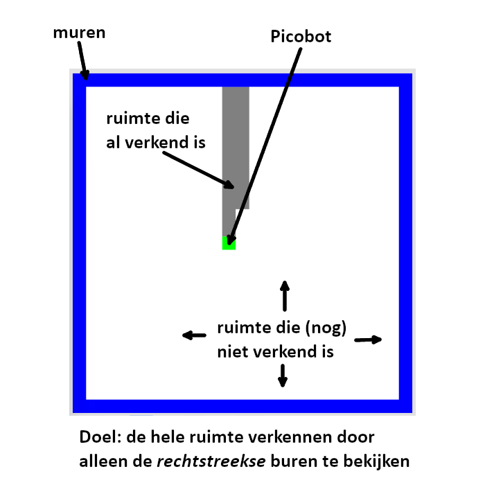
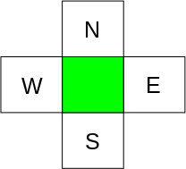
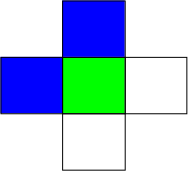
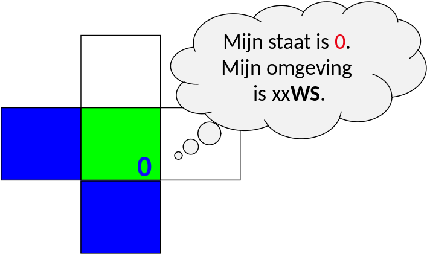

# Picobot

Je hebt vast wel eens gehoord van een robotstofzuiger. Dit is een robot die automatisch door de hele kamer overal omheen kan stofzuigen. De meest eenvoudige robotstofzuiger heeft geen geavanceerde sensoren om de hele kamer te scannen. Ze hebben enkel een bumper om te weten of ze ergens tegenaan rijden. Ze zijn dus vrijwel blind en tóch krijgen ze het voor elkaar de hele kamer te stofzuigen.

Ons doel is om een robot zo te programmeren dat deze overal komt in een lege kamer. Het programma dat we hiervoor gaan gebruiken is Picobot: [www.cs.hmc.edu/picobot](http://www.cs.hmc.edu/picobot). Dit is een zeer bijziend robotje en kan dus alleen een obstakel zien dat heel dichtbij is. Het is ook heel voorzichtig en zal per instructie maar 1 stap zetten.



## Naar de hoek

Picobot staat op een willekeurige locatie in een lege kamer.


Picobot ziet alleen maar het vakje noord, oost, west en zuid en kan bepalen of daar een obstakel is.



Welke set instructies heeft Picobot nodig om de linkerbovenhoek te bereiken?

### Oplossing

1. Rij naar het noorden.
2. Stop als er een obstakel in het noorden ligt.
3. Rij naar het westen.
4. Stop als er een obstakel in het westen ligt.
5. Doel is bereikt.

Hoe ziet de beslissingsboom eruit die bij deze set instructies hoort?


Na het ontwerpen van een plan, in dit geval een beslissingsboom, is de volgende stap om deze daadwerkelijk te programmeren. Picobotjes spreken hun eigen taal. Het doel is dus om de instructies te vertalen zodat Picobot ze uit kan voeren.

## Picotaal

Picobot ziet alleen maar ten N, E, W, en S

(NOWZ? ... Noord, Oost, West, Zuid!)

Picobot kan dus alleen maar ten (N) noorden, (E) oosten, (W) westen en (Z) zuiden kijken, en niet bijvoorbeeld noord-west! We gaan de volgende notatie gebruiken om de omgeving aan te duiden: **`xxxx`**. Als Picobot muren ziet dan zal het in de notatie volgens NEWS worden aangegeven, bijvoorbeeld:



**`NxWx`**

In dit geval geven we aan dat ten (N) noorden en (W) westen zich een muur bevindt en ten oosten en zuiden lege ruimte, daar blijft **`x`** staan. De huidige omgeving kan dus worden beschreven door **`NxWx`**.


### De staat

De huidige staat ("state") waarin Picobot zich bevindt.

Picobot's geheugen is een *enkel* getal en start altijd met `0`. Dit representeert de huidige staat. *Staat* en *omgeving* is alles wat Picobot kent van de wereld!



### De regels

Het combineren van omgeving en staat in regels om door Picobot te worden uitgevoerd.

Bijvoorbeeld, twee mogelijke regels:

|           | Huidige staat | Omgeving   |   Stap   | Richting | Nieuwe staat |
|-----------|---------------|------------|:--------:|----------|--------------|
| *regel A* |    **`0`**    | **`Nxxx`** | **`->`** |  **`S`** |    **`0`**   |
| *regel B* |    **`0`**    | **`xxxx`** | **`->`** |  **`N`** |    **`0`**   |

Lees een regel (bijvoorbeeld regel A) als volgt: *als* de huidige staat van Picobot `0` is en de omgeving gelijk is aan **`Nxxx`**, neem dan één stap richting (S) zuid en zet de *nieuwe* staat op `0`.

Zoals je straks kunt zien, zal je een regel als volgt voor Picobot kunnen schrijven (syntax):

**`0 Nxxx -> S 0`**

Als Picobot een stap heeft genomen, zal het alle regels weer doornemen tot het een regel ziet die overeenkomt met zijn huidige *staat* en *omgeving* en zal deze vervolgens uitvoeren.

### Wildcards

Een optionele aanduiding van de omgeving

|           | Huidige staat | Omgeving   |   Stap   | Richting | Nieuwe staat |
|-----------|---------------|------------|:--------:|----------|--------------|
| *regel A* |    **`0`**    | **`x***️`** | **`->`** |  **`S`** |    **`0`**   |

Met een asterisk (\*) kan je aangeven dat een bepaalde richting optioneel is. In dit voorbeeld **moet** het (N) noorden leeg zijn, (O) oost, (W) west en (Z) zuid **mogen** zowel leeg als gevuld zijn.

## De hoek in

Doel is om Picobot instructies te geven om zich naar de hoek te begeven. Eerst was er een plan opgesteld:


Picobot begint altijd in state 0

1. Check of er een muur in het noorden is. (**`x***`**)
   Als er geen muur is, doe dan een stap naar het noorden. (**`N 0`**)
   **`0 x*** -> N 0`**

2. Als er wel een muur is (**`N***`**), blijf staan en wissel van state.
   **`0 N*** -> X 1`**

3. Check of er een muur in het westen is. (**`**x*`**)
   Als er geen muur is, doe dan een stap naar het westen. (**`W 1`**)
   **`1 **x* -> W 1`**

Volledige code:
```
0 x*** -> N 0
0 N*** -> X 1
1 **x* -> W 1
```

In state 0 wordt er naar het noorden gereden. In state 1 wordt er naar het westen gereden.

## Opdrachten

### Opdracht 1: De lege kamer

- **Stap 1: Proberen.** Ga op papier uitzoeken wat een efficiënte manier is om een lege kamer in zijn geheel te verkennen.
- **Stap 2: Plan.** Maak een beslissingsboom voor het verkennen van een lege kamer.

### Opdracht 2: Doolhof

- **Stap 1: Proberen.** Ga op papier uitzoeken wat een efficiënte manier is om een doolhof te verkennen.
- **Stap 2: Plan.** Maak een beslissingsboom om een doolhof te verkennen.

### Opdracht 3: Picobot

Open de Picobot simulator: [www.cs.hmc.edu/picobot](http://www.cs.hmc.edu/picobot)

1. De simulator heeft een voorbeeldcode. Teken het pad dat Picobot zou lopen.
2. Klik op Go. Klopt jouw voorspelling met wat Picobot laat zien? Zo niet, waar ging het fout met de voorspelling?
3. Schrijf een programma zodat Picobot naar de linkerbovenhoek rijdt.