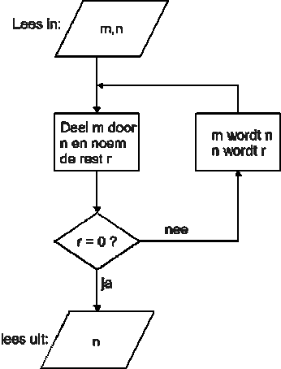
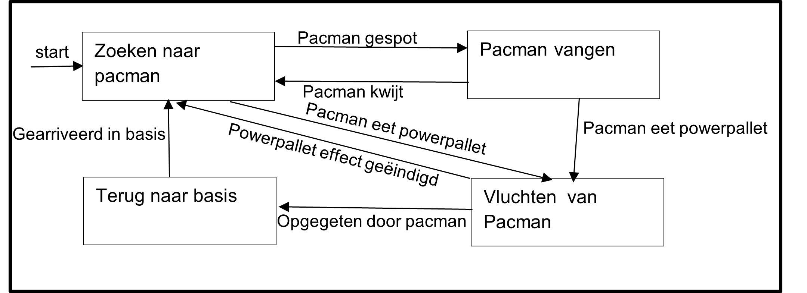
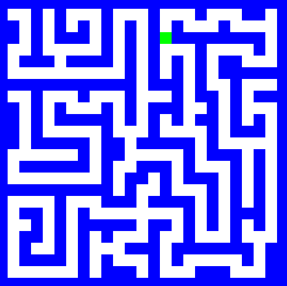
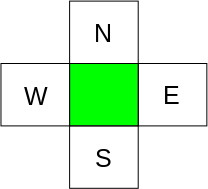
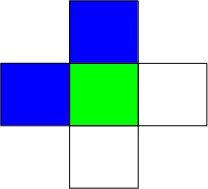
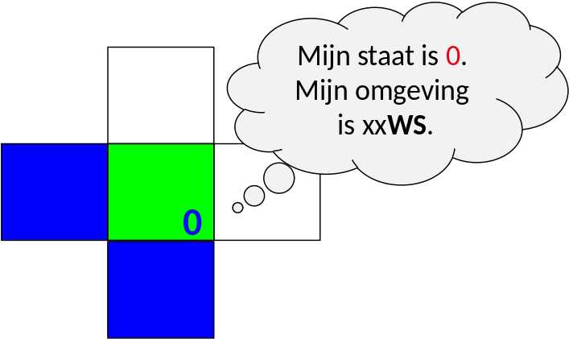

# Picobot

## Doel

Als je een oplossing hebt, hoe zet je dat om tot een plan?  Dat is het doel van dit werkcollege; werken aan computational thinking. De vaardigheid om een set van stappen/instructies te ontwikkelen dat een gegeven probleem kan oplossen. Dit is een belangrijke vaardigheid in programmeren. Zodra er een set van stappen is ontworpen kan het worden geprogrammeerd.

## Beslissingsboom

Beslissingsbomen (*behavior trees*) kunnen gebruikt worden om instructies te visualiseren. Het is een vorm die je misschien wel herkent.

Neem het algoritme van Euclides wat gebruikt kan worden om de grootste gemene deler tusse twee getallen te bepalen. Euclides had ontdekt dat via een paar instructies altijd te berekenen is:

1.	Noem het grootste van de beide getallen $m$, het andere $n$.
2.	Deel $m$ door $n$, bereken hoeveel je overhoudt en noem dat $r$.
3.	Wanneer er 0 over blijft zijn we klaar, en is $n$ de ggd.
4.	Zo niet, herhaal dan het algoritme met $n$ en $r$.

Deze instructies kunnen afgebeeld worden in een beslissingsboom. Zo wordt het heel duidelijk wat de stappen zijn.

Met het algoritme van Euclides kan dus de ggd van 900 en 1140 berekend worden.
Stel dat $m$ 1140 is en $n$ 900,

$ 1140 = 1 * 900 + 240 $

De rest is 240, wat niet gelijk is aan 0 en dus moet er verder gerekend worden. Deze keer is $m$ gelijk aan 900 en $n$ gelijk aan 240.

$ 900 = 3 * 240 + 180 $

De rest is 180, wat niet gelijk is aan 0 en dus moet er verder gerekend worden. Deze keer is $m$ gelijk aan 240 en $n$ gelijk aan 180.

$ 240 = 1 * 180 + 60 $

De rest is 60, wat niet gelijk is aan 0 en dus moet er verder gerekend worden. Deze keer is $m$ gelijk aan 180 en $n$ gelijk aan 60.

$ 180 = 3 * 60 + 0 $

Nu is de rest 0, en daarmee zijn we aan het einde gekomen. We hebben bepaald dat 60 de grootste gemene deler van 900 en 1140 is.

Modulo rekenen is de kunst van het rest rekenen. Modulo is een belangrijk gereedschap voor een programmeur, naast de andere berekeningen zoals optellen, vermenigvuldigen, etc.

$ 1140 mod 900 = 240 $

$ 900 mod 240 = 180 $

$ 240 mod 180 = 60 $

$ 180 mod 60 = 0 $

## State Machine

Een andere methode voor het ontwerpen van programma's is het gebruik van een state machine. Deze manier leent zich er vooral voor om een probleem in kleinere problemen op te breken. Een state machine bestaat uit verschillende states (een staat, of situatie) en heeft altijd een *begin* en *eind* state. Tussen de states zijn overgangen die aangeven wanneer er van state verandert wordt.

Neem bijvoorbeeld de spookjes van Pacman. Zodra het spel begint zoeken ze naar Pacman en als ze hem zien gaan ze achter hem aan. Als Pacman een Powerpallet pakt moeten de spookjes juist vluchten. Dit idee kan afgebeeld worden in een state machine.

Na het ontwerpen van een de state machine kan er nagedacht worden over hoe de afzonderlijke problemen opgelost kunnen worden en dit kan weer gedaan worden met een belissisingsboom.

### Opdracht 1: Instructies aan een blinde

Een geblinddoekte student staat op een willekeurige locatie in een lege kamer.

De student gebruikt zijn/haar handen om obstakels te kunnen voelen, in dit geval dus enkel de muren. De student weet ten alle tijden waar het noorden van de kamer ligt. Welke set instructies geef je aan de student zodat hij/zij eindigt in de linkerbovenhoek? Maak een beslissingsboom en/of state machine.

## Picobot

Je hebt vast wel eens gehoord van een robotstofzuiger. Dit is een robot die automatisch door de hele kamer overal omheen kan stofzuigen. De meest eenvoudige robotstofzuiger heeft geen geavanceerde sensoren om de hele kamer te scannen. Ze hebben enkel een bumper om te weten of ze ergens tegen aan rijden. Ze zijn dus vrijwel blind en tóch krijgen ze het voor elkaar de hele kamer te stofzuigen.

Ons doel is om een robot zo te programmeren dat het overal komt in een lege kamer. Het programma dat we hier voor gaan gebruiken is picobot. Dit zeer bijziend robotje en kan dus alleen een obstakel zien dat heel dichtbij is. Het is ook heel voorzichtig en zal per instructie maar 1 stap zetten.

### Opdracht 2: instructies voor picobot

- **Stap 1: Proberen.** Ga op papier uitzoeken wat een efficiente manier is om een lege kamer in zijn geheel te verkennen.
- **Stap 2: Plan.** Maak een state machine van jouw oplossing en de instructies die bij elke state horen.

### Opdracht 2+: instructies voor picobot

Inplaats van een lege kamer moet een picobot een doolhof in zijn geheel verkennen.

- **Stap 1: Proberen.** Probeer een efficiente manier te bedenken om een doolhof te verkennen. Hoe zou jij zelf geblindoekt zo'n doolhof kunnen verkennen?
- **Stap 2: Plan.** Maak een state machine van jou oplossing en de instructies die bij elke state horen.

Na het ontwerpen van een plan, in dit geval een state machine, is de volgende stap om deze daadwerkelijk te programmeren. Picobotjes spreken hun eigen taal. Het doel is dus om de instructies te vertalen zodat picobot ze uit kan voeren.

## picobot taal

Picobot ziet alleen maar ten N, E, W, en S

(NOWZ? ... Noord, Oost, West, Zuid!)

Picobot kan dus alleen maar ten (N) noorden, (E) oosten, (W) westen en (Z) zuiden kijken, en niet bijvoorbeeld noord-west! We gaan de volgende notatie gebruiken om de omgeving aan te duiden: **`xxxx`**. Als Picobot muren ziet dan zal het in de notatie volgens NEWS worden aangegegven, bijvoorbeeld:

**`NxWx`**

In dit geval geven we aan dat ten (N) noorden en (W) westen zich een muur bevindt en ten oosten en zuiden lege ruimte, daar blijft **`x`** staan. De huidige omgeving kan dus worden beschrven door **`NxWx`**.

In totaal zijn $2^4 == 16$ combinaties van omgevingen mogelijk waar Picobot zich op een enkel moment in kan bevinden. Bedenk ook dat de situatie **`NEWS`** niet zal kunnen gebeuren!

### De staat

De huidige staat ("state") waar Picbot zich in bevindt

Picobot's geheugen is een *enkel* getal en start altijd met `0` en dit representeert de huidige staat. *Staat* en *omgeving* is alles wat picobot kent van de wereld!

### De regels

Het combineren in regels van omgeving en staat om door Picobot te worden uitgevoerd

Bijvoorbeeld, twee mogelijke regels:

|           | Huidige staat | Omgeving   |   Stap   | Richting | Nieuwe staat |
|-----------|---------------|------------|:--------:|----------|--------------|
| *regel A* |    **`0`**    | **`Nxxx`** | **`->`** |  **`S`** |    **`0`**   |
| *regel B* |    **`0`**    | **`xxxx`** | **`->`** |  **`N`** |    **`0`**   |

Lees een regel (bijvoorbeeld regel A) als volgt: *als* de huidige staat van Picobot `0` is en de omgeving gelijk is aan **`Nxxx`**, neem dan één stap richting (S) zuid en zet de *nieuwe* staat op `0`.

Zoals je straks kunt zien zal je een regel als volgt voor Picobot kunnen schrijven (syntax):

**`0 Nxxx -> S 0`**

Als Picobot een stap heeft genomen zal het het alle regels weer doornemen tot het een regel ziet die overeenkomt met zijn huidige *staat* en *omgeving* en zal deze vervolgens uitvoeren.

### Wildcards

Een optionele aanduiding van de omgeving

|           | Huidige staat | Omgeving   |   Stap   | Richting | Nieuwe staat |
|-----------|---------------|------------|:--------:|----------|--------------|
| *regel A* |    **`0`**    | **`x***️`** | **`->`** |  **`S`** |    **`0`**   |

Met een asterisk (\*) kan je aangeven dat een bepaalde richting optioneel is. In dit voorbeeld **moet** het (N) noorden leeg zijn, (O) oost, (W) west en (Z) zuid **mogen** zowel leeg als gevuld zijn.

### Opdracht 3: De hoek in

Open picobot simulator: [www.cs.hmc.edu/picobot](http://www.cs.hmc.edu/picobot)

1.  De simulator heeft een voorbeeld code. Teken het pad wat picobot zou lopen
2.  Klik op Go. Klopt jou voorspelling met wat picobot laat zien? Zo niet, waar ging het fout met de voorspelling?
3.  Schrijf een programma zodat picobot naar de linkerboven hoek rijdt.

Je kan nu de *basis* picobot opdracht: 'De lege kamer' maken. Vind je het nog lastig, dan kan je oefenen met de opstap picobot opdracht: "Rondjes rijden". Daarnaast zijn er meerdere context vragen.:
-   "doolhof". Sommige huizen hebben zoveel gangen dat het op een doolhof lijkt.
-   "Een huis met kamers". Een huis heeft meer dan 1 kamer en deze moeten allemaal gestofzuigd worden.
-   "Picobot in een woonkamer". Het komt zelden voor dat een woonkamer leeg staat. Het zal dus veel voorkomen dat een picobot moet werken met obstakels.