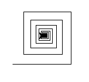
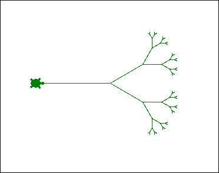
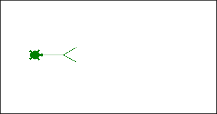

# Turtles!


## Opdracht 1

a. Kopieer onderstaande code over naar een bestand genaamd `wk3wc2.py`

```python
import time
from turtle import *
from random import *

def main():
    """
    Main functie. Roept de andere functies aan om het werk te doen.
    """
    tri()
    done() # tell turtle the drawing is done.

def testing():
    """
    Test functie. Hier staan alle assertions om de functies te testen.
    """

def tri(n=3):
    """Draws n 100-pixel sides of an equilateral triangle.
       Note that n doesn't have to be 3 (!)
    """

    width(5)    # width of the line to draw
    clr = choice(['darkgreen', 'red', 'blue'])  #choose a random color
    color(clr)  # set the color of the line
    shape('turtle') # set the shape of the pencil
    dot(10, 'red')  # set the endpoints of the lines
    if n == 0:
        return      # Geen zijden om te tekenen, dus stop met tekenen
    else:
        forward(100)
        left(120)
        tri(n-1)    # Gebruik recursie om de overige zijden te tekenen!

main()
testing()
```


b. Schrijf de functie `spiral(initial_length, angle, multiplier)`. Hier is de *signature* van deze functie met daaronder de docstring. Maak gebruik van recursie.

```python
def spiral(initial_length, angle, multiplier):
    """Spiral-drawing function.  Arguments:
       initial_length = the length of the first leg of the spiral
       angle = the angle, in degrees, turned after each spiral's leg
       multiplier = the fraction by which each leg of the spiral changes
    """
```

Hier zie je het resultaat van de aanroep `spiral(100, 90, 0.9)`



-   Als de `multiplier` gelijk is aan `0.5` zal elke zijde van de spiraal *half* zo lang zijn als de vorige (ze worden steeds korter)
-   Als de `multiplier` gelijk is aan `1.5` is zal elke zijde van de spiraal *anderhalf keer* zo lang zijn als de vorige zijde (ze worden steeds langer)

Probeer, Plan, Programmeer!
Probeer: Teken zelf een spiraal, Welke stappen maak je?
Plan: Hoe leg je een iemand anders uit welke stappen er gedaan moeten worden? Wat zijn de base cases zodat de turtle stopt met tekenen?
Programmeer!

Probeer bijvoorbeeld een paar van deze aanroepen:

* `spiral(100, 90, 0.9)`
* `spiral(100, 170, 0.95)` (dit lijkt meer op een ster, gebruik Control-C om te functie te onderbreken...)
* `spiral(400, 120, 0.8)` (een driehoekige spiraal)
* `spiral(2, 1, 0.999)` (een ECHTE spiraal, gebruik weer Control-C om te stoppen)

## Opdracht 2

```python
def chai(dist):
    """fn mysterie!
    """
    forward(dist)
    left(45)
    forward(dist / 2)
    right(45)

    right(45)
    forward(dist)
    left(45)

    left(45)
    forward(dist / 2.0)
    right(45)
    backward(dist)
```

Wat is het resultaat van `chai(100)`?

## Opdracht 3

Je gaat nu een ander vertakkend voorbeeld schrijven, een boom in *zijaanzicht*. In dit geval is "vertakken" een heel geschikte beschrijving!

Het idee is om een functie te maken die een *zijaanzicht* van een boom tekent, een *side-view tree* (vandaar `svtree`). Lees deze docstring om een idee te krijgen wat de twee argumenten betekenen. Bekijk daarna het volgende begin en de afbeeldingen daaronder:

```python
def svtree(trunklength, levels):
    """svtree: draws a side-view tree
       trunklength = the length of the first line drawn ("the trunk")
       levels = the depth of recursion to which it continues branching
    """
```

Voordat je begint, bekijk eerst even de volgende twee voorbeelden en de analyse van het probleem. Het eerste voorbeeld is het resultaat wanneer `svtree(128, 6)` wordt aangeroepen:



Merk op dat dit duidelijk een *zij*-aanzicht is! Hier zie je een voorbeeld van een mogelijke uitvoer van `svtree(50, 2)`:



Tot slot, als `svtree(50, 0)` wordt uitgevoerd moet niets getekend worden want de *base case* treedt op als `levels` gelijk is aan 0.

## Opdracht 4

Pas de functie `svtree` (nadat deze werkt met twee takken) aan zodat ze *drie* of *meer* takken heeft, in plaats van slechts twee...

-   Je krijgt heel snel een heel dicht "bladerdak".
-   De resultaten worden "levensechter" als je ongelijke hoeken gebruikt voor de vertakkingen en ongelijke factoren voor de lengte.
-   Je kan ook de `width` of de `color` laten afhangen van de waarde van `levels`.
-   Als je het laatste "niveau" rood maakt, krijg je een appelboom.

    Bekijk het voorbeeld met `dot` in de functie `tri` om nog een manier te zien om fruit toe te voegen.

-   Of, als je het laatste "niveau" een willekeurige kleur geeft, krijg je een effect alsof het herfstbladeren zijn...
