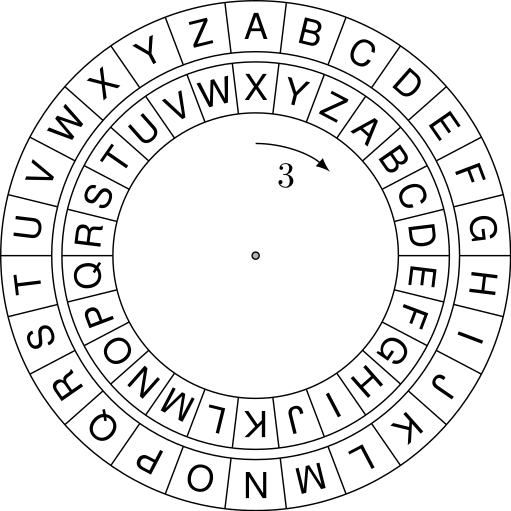

# Caesar op orde!

Het [Caesarcijfer](https://nl.wikipedia.org/wiki/Caesarcijfer) is vernoemd naar de Romein Julius Caesar. Hij gebruikte een versleuteling van berichten op basis van een rotatie van karakters. De sleutel is het aantal stappen van de rotatie.




## Rot13

*Rotate by 13 places*

Waarom 13? Bij gebruik van het alfabet is dertien de waarde waarbij codering en decodering gelijkwaardig zijn (het alfabet telt 26 karakters). Het werd vaak gebruikt op fora om gevoelige posts of spoilers te versleutelen.

```ipython
In [8]: rot13("Don't Panic.")
Out[8]: "Qba'g Cnavp."

In [9]: rot13("Qba'g Cnavp.")
Out[9]: "Don't Panic."
```


| `chr` waarde | a  | b  | c  | ... | z   |
|--------------|----|----|----|-----|-----|
| `ord` waarde | 97 | 98 | 99 | ... | 122 |


Wat is

```python
chr(ord("i") + 13)
```

Het karakter "v" (105 + 13)


| `chr` waarde | A  | B  | C  | ... | Z  |
|--------------|----|----|----|-----|----|
| `ord` waarde | 65 | 66 | 67 | ... | 90 |

Wat is

```python
chr(ord("W") + 13)
```

Het karakter "e" (87 + 13)

Dit betekent `chr(87 + 13)`, maar `chr(100)` valt buiten de reeks! Hoe kan weer terug naar het begin worden doorgeteld? 

We willen net als bij de schijf door kunnen tellen zodat het eerstvolgende karakter na Z (ordinale waarde 90) A (ordinale waarde 65) is.


### Het doel

Een karakter verschuiven met 13 posities en doordraaien indien nodig

```python
assert rot13("n") == "a"
assert rot13("W") == "J"
```

Spaties en andere karakter negeren

```python
assert rot13(" ") == " "
assert rot13("<") == "<"
```

### Een begin

```python
def rot13(c):
    """Roteer c met 13 karakters
    
    "Draai door" indien nodig, negeer NIET alfabetische karakters
    """
    if "a" <= c <= "z":
        if ord(c) + 13 <= ord("z"):
            return chr(ord(c) + 13)
        else:
            return ...
    elif "A" <= c <= "Z":  # hoofdletter test
        ...
    else:
        return ...
```

- Wat doen de tests `"a" <= c <= "z"` en `ord(c) + 13 <= ord("z")`?
- Welke code is nodig om door te draaien als `ord(c) + 13 <= ord("z")` faalt (de `else`)?
- Wat zou anders moeten zijn bij hoofdletters `"A" <= c <= "Z"`?
- Wat zou moeten gebeuren als `c` geen karakter in het alfabet is?


# Opdracht 1: `rot(c, n)`

Schrijf een functie `rot(c, n)` die een enkel karakter `c` `n` plaatsen voorwaarts roteert in het alfabet.

Bedenk dat je soms terug naar het begin van het alfabet moet en dat tekens die geen letter zijn *niet* veranderen. Controleer vervolgens met `assert` statements of de functie `rot(c, n)` werkt:

```python
assert rot("a", 2) == "c"
assert rot("y", 2) == "a"
assert rot("A", 3) == "D"
assert rot("Y", 3) == "B"
assert rot(" ", 4) == " "
```

Bedenk verder dat je de ingebouwde functies `ord` en `chr` die een string met één karakter omzetten naar een integer en omgekeerd kan gebruiken bij het roteren:

* `ord('a')` geeft bijvoorbeeld `97` terug
* ... en `chr(97)` geeft `'a'` terug.

# Opdracht 2: `encipher(s, n)`

Schrijf een functie `encipher(s, n)` die als argumenten een string `s` en een (niet negatieve) integer 'n' met een waarde tussen `0` en `25` verwacht. De functie `encipher` moet een nieuwe string teruggeven waarin de letters in `s` met `n` letters voorwaarts zijn "geroteerd" in het alfabet, en terug naar het begin van het alfabet als dat nodig is.

Bij dit probleem mag je ervan uitgaan dat hoofdletters "geroteerd" worden naar hoofdletters, kleine letters naar kleine letters en dat alle andere tekens *niet* veranderd worden. Als we bijvoorbeeld de letter
`'y'` 3 posities willen verschuiven, krijgen we de `'b'` en als we de letter `'Y'` 3 posities willen verschuiven krijgen we `'B'`.

:::{admonition} Karakters in het alfabet
:class: tip

In Python kan je de test `if "a" <= c <= "z":` gebruiken om te controleren of een karakter `c` tussen de `'a'` en `'z'` in het alfabet zit.
:::

Gebruik de functie `rot()` als hulpfunctie. 

Bedenk verder dat je de ingebouwde functies `ord` en `chr` die een string met één karakter omzetten naar een integer en omgekeerd kan gebruiken bij het roteren:

* `ord('a')` geeft bijvoorbeeld `97` terug
* ... en `chr(97)` geeft `'a'` terug.
:::


Zorg dat je de functie test! Hier is een begin:

```python
assert encipher("xyza", 1) == "yzab"
assert encipher("Z A", 1) == "A B"
```

Hier zijn wat meer voorbeelden, we raden je aan deze om te zetten in `assert` statements en aan jouw tests toe te voegen:

```ipython
In [1]: encipher('xyza', 1)
Out[1]: 'yzab'

In [2]: encipher('Z A', 1)
Out[2]: 'A B'

In [3]: encipher('*ab?', 1)
Out[3]: '*bc?'

In [4]: encipher('Dit is een string!', 1)
Out[4]: 'Eju jt ffo tusjoh!'

In [5]: encipher('Caesarcijfer? Ik heb liever Caesarsalade.', 25)
Out[5]: 'Bzdrzqbhiedq? Hj gda khdudq Bzdrzqrzkzcd.'
```

Tot slot, onthoud dat:

-   Hoofdletters altijd hoofdletters blijven.
-   Kleine letters altijd kleine letters blijven.
-   Andere tekens helemaal niet veranderen!


# De LoL

Lijsten kunnen alle mogelijke datatypes bevatten, dus ook andere lijsten, een zogenaamde LoL. 

We zouden bijvoorbeeld kunnen bijhouden hoeveel letters elk woord heeft:

```python
lol = [[2, "ik"], [3, "hou"],  [3, "van"], [5, "python"]]
lol[1] == [3, "hou"]
lol[1][1] == "hou"
```

## Opdracht 3:  `decipher(s)`

Omgekeerd krijgt `decipher(s)` een string `s` met een (Nederlandstalige) tekst die al versleuteld is. De functie `decipher` moet, voorzover mogelijk, de *originele* tekst teruggeven, dit zal een rotatie (mogelijk ook `0`) zijn van het argument `s`.

Wees bewust dat sommige strings meer dan één "ontsleuteling" kunnen hebben. Bovendien is het moeilijk of soms zelfs onmogelijk om hele korte strings goed te ontsleutelen. De functie `decipher` hoeft dus ook niet *perfect* te zijn, maar moet wel vrijwel altijd werken met langere stukken Nederlandse tekst, bijvoorbeeld zinnen van 8 of meer woorden. Het is dus geen probleem als een enkel woord of een korte zinnen niet goed worden ontsleuteld.


Enkele voorbeelden van `decipher`:

```ipython
In [1]: decipher('Bzdrzqbhiedq? Hj gda khdudq Bzdrzqrzkzcd.')
Out[1]: 'Caesarcijfer? Ik heb liever Caesarsalade.'

In [2]: decipher('Aadxas ue exqotfe pq haadflqffuzs hmz baxufuqw yqf mzpqdq yuppqxqz.')
Out[2]: 'Oorlog is slechts de voortzetting van politiek met andere middelen.'

In [3]: decipher('Lvkeg lvyon')
Out[3]: 'Tdsmo tdgwv'  # Dit is fout! Maar is hier geen probleem...
```

Ook hier raden we jou aan om deze voorbeelden (in ieder geval de eerste twee!) om te zetten naar `assert` statements.

Merk verder op dat het laatste voorbeeld laat zien dat onze ontsleutelaar het niet goed doet bij sommige korte zinnen. Dit is geen probleem!  Naarmate de zinnen langer worden, moet de ontsleutelaar er steeds meer goed hebben, maar hij hoeft enkele woorden of korte zinnen niet goed te hebben, voor korte strings zijn er immers zeer waarschijnlijk rotaties met meer "Nederlandsige" letters dan het origineel!


:::{admonition} Lists of lists
:class: tip
Probeer, Plan, Programmeer! 
- Probeer: Hoe los je dit probleem zelf op op papier?
- Plan: In welke stappen kan je dit probleem opsplitsen? (hulpfuncties) 
_ Programmeer!
:::

