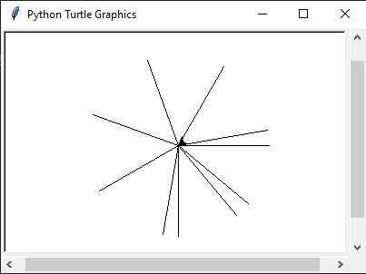

# Turtle

Onderstaande opdrachten gaan allemaal over het tekenen met turtle.

## Opdracht 1

a. Kopieer onderstaande code over naar een bestand genaamd 'wk3ba1.py'. Maak de functie `sq` af zodat het een vierkant tekent met zijdes met 25 pixels. Maak gebruik van recursie om de herhaling van code te voorkomen.

```python
import time
from turtle import *
from random import *

def main():
    """
    Main functie. Roept de andere functies aan om hun werk te doen.
    """
    speed(10) # set the drawing speed to 10
    sq()
    done() # tell turtle the drawing is done.

def testing():
    """
    Test functie. Hier staan alle assertions om de functies te testen.
    """

def sq(n = 4):
    """Draws 100-pixel sides of a square.
    """


main()
testing()
```


b. Schrijf de functie `sqLine(x)`. De parameter x geeft een hoeveel vierkantjes op een rij moeten komen. Maak gebruik van de `sq` functie

**voorbeeld** lineSq(5) tekent:


c. Schrijf de functie `sqSpiral(n)`. De paramater `n` geeft aan met hoeveel vierkantjes de eerste zijde van de spiraal moet hebben.

**voorbeeld** spiralSq(10) tekent:


## Opdracht 2

a. Schrijf de funtie `sqLength(lengte, x=4)`.  Deze functie tekent een vierkant van aangegeven grootte. `sqLength(50)` tekent een vierkant met zijdes van 50 pixels lang.

b. Schrijf de functie `sqRec(start, step)`. De paramater `start` geeft de grootte van het eerste vierkant aan en de `step` geeft aan hoeveel kleiner het volgende vierkant is. Maak gebruik van de `sqLength` functie.

**voorbeeld** sqRec(100, 10) tekent:


c. Schrijf een functie `sqMiddle(start, step)` De paramater `start` geeft de grootte van het eerste vierkant aan en de `step` geeft aan hoeveel kleiner het volgende vierkant is. Maak gebruik van de `sqLength` functie. Dit keer worden de vierkantjes in het midden getekend. Met de `up()` functie stopt de turtle met tekenen. Met de functie `down()` start de turtle weer met tekenen.

**voorbeeld** sqMiddle(200, 20) tekent:


**TIP**: Probeer, plan, programmeer.
Probeer: Hoe tekenen je dit figuur zelf?
Plan: Hoe leg je aan iemand anders uit hoe dit getekend wordt? Wat zijn de stappen om dit lijn voor lijn te tekenen?
Programmeer!

## Opdracht 3

a. Schrijf de functie `lijn(x)` dat een lijn tekent. De x geeft een hoe lang de lijn moet zijn. Aan het einde van de functie staat de turtle weer waar het was begonnen.

**Voorbeeld**  lijn(x)


b. Schrijf de functie `simpleFlake(n, angle, length)`. De n geeft aan hoeveel lijnen er getekend moet worden. Angle geeft aan hoeveel graden er na elke lijn gedraaid wordt. De length geeft aan hoe lang elke lijn moet zijn.

**voorbeeld** simpleFlake(10, 50, 100)

