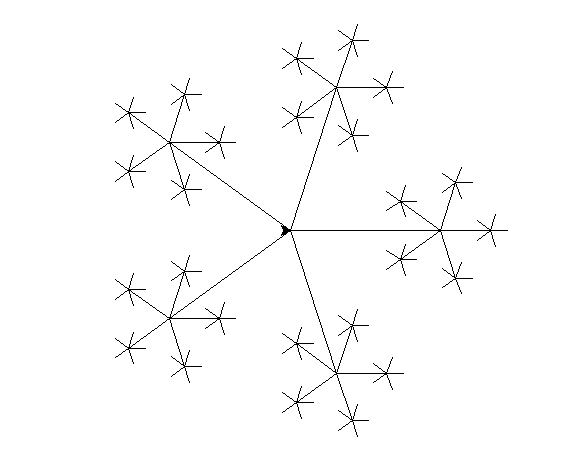
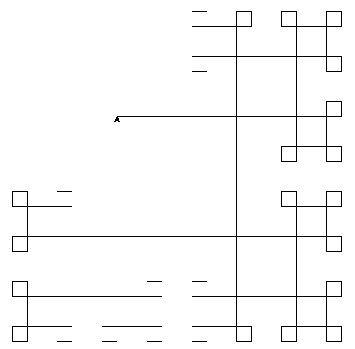

# Turtle

Onderstaande opdrachten gaan allemaal over het tekenen met turtle.

## Opdracht 1

a. Kopieer onderstaande code over naar een bestand genaamd `wk4ba1.py`. Probeer te voorspellen wat het programma zal tekenen.

```python
import time
from turtle import *
from random import *

def main():
    """
    Main functie. Roept de andere functies op om hun werk te doen.
    """
    speed(10)
    drawStar(3, 150)
    done() # tell turtle the drawing is done.

def testing():
    """
    Test functie. Hier staan alle assertions om de functies te testen.
    """

def drawStar(n, distance):
    forward(distance)
    back(distance)
    right(72)

    forward(distance)
    back(distance)
    right(72)

    forward(distance)
    back(distance)
    right(72)

    forward(distance)
    back(distance)
    right(72)

    forward(distance)
    back(distance)
    right(72)

main()
testing()
```

b. Pas de functie drawStaw. Aan elke punt van de ster wordt er een nieuwe ster getekend dat 3 keer zo klein is als de vorige ster.

Voorbeeld output van `drawStar(3, 150)`



## Opdracht 2

Schrijf de functie `squares(n, distance, steps=0):` te schrijven dat onderstaande vierkante fractal maakt. n geeft aan hoe diep de fractal moet gaan. Distance geeft de grootte van het middelste vierkant. Steps houdt bij hoe vaak de functie al is aangeroepen.



Daan heeft een plan opgesteld om dit voor elkaar te krijgen.

```python
def squares(n, distance, steps=0):
    #als n gelijk is aan 0 dan
        # als steps even is, dan moet er 90 graden naar links gedraaid worden
        # als steps oneven is, dan moet er 90 graden naar rechts gedraaid worden.
        # stop met tekenen

    # ga vooruit
    # roep de functie opnieuw op met aangepaste variabelen
    # ga vooruit
    # roep de functie opnieuw op met aangepaste variabelen
    # ga vooruit
    # roep de functie opnieuw op met aangepaste variabelen
    # ga vooruit


Vertaal Daan's plan tot een werkende functie.
