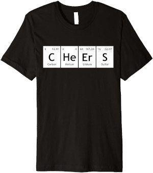
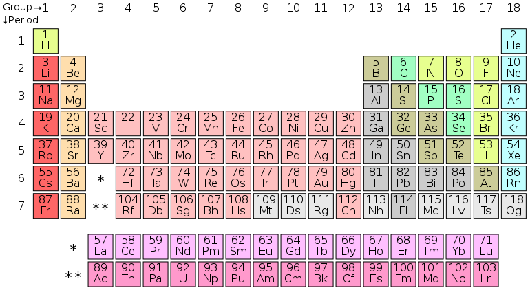

# Periodiek systeem



Je kunt tegenwoordig T-shirts kopen met teksten die bestaan uit de symbolen van elementen van het periodiek systeem. In deze opgave zal moeten nagaan welke woorden kunnen worden samengesteld met behulp van de elementen.

## Inleiding



Het [periodiek systeem](https://nl.wikipedia.org/wiki/Periodiek_systeem), voluit het periodiek systeem der elementen, is een tabel waarin alle bekende chemische elementen systematisch zijn gerangschikt, op grond van hun atoomnummer, ofwel het aantal protonen in hun atoomkern. In dit systeem staat bijvoorbeeld *Au* voor goud, *H* voor waterstof en *Cu* voor koper.

## Het probleem

Deze opgave gaat over welke woorden met de elementen kunnen worden gespeld. Het woord "spannend" zou bijvoorbeeld kunnen worden samengesteld met behulp van de elementen **S** (zwavel), **Pa** (protactinium), **N** (stikstof), **Ne** (neon) en **Nd** (neodymium).

Een woord als "uitdaging" zal niet passen. Het element **Ui** bestaat niet, maar de afzonderlijke elementen **U** en **I** wel maar vervolgens is er geen passend element meer van een of twee karakters lang die passen op "t" of "td".

Tot slot is er nog een categorie woorden waar de beste oplossing niet gelijk duidelijk is, bijvoorbeeld "kranten". Hier heb je de keus te beginnen met het element **K** (kalium) of **Kr** (krypton) en deze keus maakt al heel veel uit; kies je voor **K** dan zullen de elementen op de rest passen maar bij **Kr** niet!

## Opgave

Schrijf een programma dat de gebruiker een woord vraagt en als antwoord teruggeeft of het woord wel of niet met behulp van de elementen uit het periodiek systeem valt samen te stellen. Maak hier gebruik van een recursieve strategie waar je de functie `is_periodical(s, E)` gaat schrijven. Deze functie accepteert een string `s` (het woord van de gebruiker) en een lijst `E` (een lijst met de elementen). Neem aan dat de gebruiker een woord in kleine letters invoert, je hoeft niet rekening te houden met hoofdletters.

Gebruik het volgende voor `E`

```python
E = ["ac", "ag", "al", "am", "ar", "as", "at", "au", "b", "ba", "be", "bh", "bi", "bk", "br", "c", "ca", "cd", "ce", "cf", "cl", "cm", "cn", "co", "cr", "cs", "cu", "db", "ds", "dy", "er", "es", "eu", "f", "fe", "fl", "fm", "fr", "ga", "gd", "ge", "h", "he", "hf", "hg", "ho", "hs", "i", "in", "ir", "k", "kr", "la", "li", "lr", "lu", "lv", "md", "mg", "mn", "mo", "mt", "n", "na", "nb", "nd", "ne", "ni", "no", "np", "o", "os", "p", "pa", "pb", "pd", "pm", "po", "pr", "pt", "pu", "ra", "rb", "re", "rf", "rg", "rh", "rn", "ru", "s", "sb", "sc", "se", "sg", "si", "sm", "sn", "sr", "ta", "tb", "tc", "te", "th", "ti", "tl", "tm", "u", "v", "w", "xe", "y", "yb", "zn", "zr"]
```

Gebruik de volgende assertions om jouw oplossing te testen

```python
assert is_periodical("verkoopactiviteiten", L) is True
assert is_periodical("weggedeelte", L) is False
assert is_periodical("spuwers", L) is True
assert is_periodical("aquaduct", L) is False
assert is_periodical("overhoopgeschoten", L) is True
assert is_periodical("uitdaging", L) is False
assert is_periodical("kranten", L) is True
assert is_periodical("informatica", L) is False
assert is_periodical("conferentieruimtes", L) is True
assert is_periodical("winkel", L) is False
```

```{important}
Je zal steeds moeten opletten of je een keus moeten maken tussen twee mogelijke opties want welke dan te gebruiken? Denk aan het "kranten" voorbeeld want de keus voor **K** of **Kr** maakte daar uit en zal ook het geval zijn voor andere woorden. In elk geval zal je altijd moeten controleren op twee mogelijkheden want elementen kunnen uit één of twee karakters kunnen bestaan.

Dit is een voorbeeld van een *subset-sum* probleem waar je de waarden (de *subset*, in dit geval de elementen) moet zien te vinden die het beste het volledige woord kunnen vormen. Het valt (opvallend) eenvoudig op te lossen met behulp van een recursieve strategie, zie de paragraaf 2.10 *Use It or Lose It* in het boek voor een ander voorbeeld.{cite}`alvarado2019cs`
```

## Uitdaging

Dit probleem valt bijzonder goed met een recursieve strategie op te lossen maar hoe goed (of, hoe eenvoudig) zou je het kunnen oplossen met lussen (dus *imperatief* in plaats van recursief)? Zou je een oplossing kunnen schrijven?
