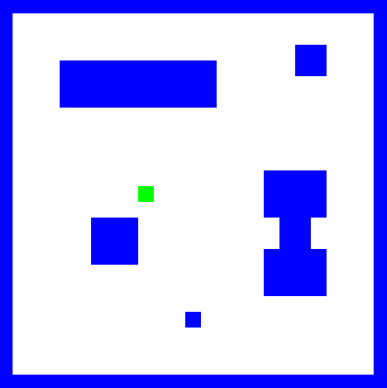

# kamer met meubels

| Naam         | Beschrijving                                                   |
|--------------|----------------------------------------------------------------|
| Onderwerp    | Picobot een grot laten verkennen                               |
| Bestandsnaam | `wk1ex6.txt`                                                   |
| Inleveren    | Lever jouw bestand met de juiste bestandsnaam in op GradeScope |

Ontwerp een verzameling regels om Picobot een woonkamer met meubels te laten verkennen (er zijn geen beperkingen aan het aantal regels).

- Vergeet niet dat jouw oplossing moet werken voor elke mogelijke startpositie van Picobot!
- Klik op "Enter rules for Picobot" voordat je Picobot start

:::{admonition} Let op
:class: warning

Als je Picobot afsluit zijn al jouw regels verdwenen! Kopiëer daarom de regels naar een tekstbestand en sla het op.
:::
