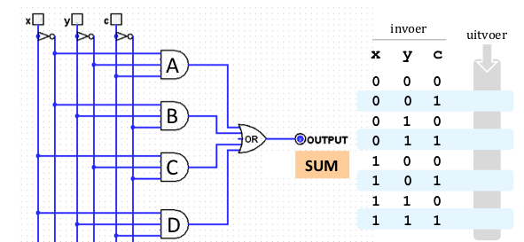

# Optellingen schakelen

<!-- elektrisch schema, een circuitdiagram of schakelschema -->

De opdracht is om een schakeling te maken dat 4 bits bij elkaar kan optellen. Dit ga je doen aan de hand van een aantal stappen.

## Voorbereiding

Check de logisim pagina om voor meer informatie over het instaleren van het programma Logisim dat gebruikt moet worden om de opdrachten te kunnen maken.

## De full adder

*Dubbelklik* op de deelschakeling `FullAdder` in je bestand `wk6ex1-4.circ`, en je zult nu in de verkenner van het `FullAdder`-circuit moeten zijn. Je zult ook zien dat we de gelabelde in- en uitvoer al hebben toegevoegd. Gebruik deze in- en uitvoer, ze helpen ons bij het beoordelen van de opdracht.

-   De invoer `X` en `Y` zijn de twee bits die moeten worden toegevoegd, en `CarryIn` is de carry van de vorige kolom.

-   Op dezelfde manier zijn de twee uitvoeren al aan de onderkant geplaatst. Je kunt deze verplaatsen als dat nodig is, maar behoud hun onderlinge posities, zodat we de schakeling makkelijker kunnen testen!

-   Merk op dat we de ingangs- en uitgangspennen hebben gedraaid vanuit hun normale standaard oriëntatie. Dit is gedaan door op het item te klikken en de gewenste rotatie te selecteren in het attribuutvenster linksonder in het scherm.

Jouw taak is nu om een full adder (FA) te bouwen. Bedenk dat een volledige adder een apparaat is dat *drie* ingangen nodig heeft:

-   twee bits die opgeteld moeten worden, en de "carry in" van de vorige optellingskolom.

-   De FA berekent dan twee uitvoerwaarden: de "som"-bit, en een "carry out"-bit.

### Opdracht 1

Gegeven een schakeling die bij de "som"-bit zou kunnen horen.



Vul de waarheidstabel in en check of de gegeven schakeling klopt. Zo niet, pas de schakeling aan. Zorg ervoor dat je de juiste schakeling in logisim plaatst.


### Opdracht 2

Nu dat de schakeling voor de "som"-bit is gemaakt moet enkel nog die van de "carry out"-bit gemaakt worden.

**Stap 1:** Maak de waarheidstabel en vul deze in.

|   | input | input | input | output   |
|---|-------|-------|-------|----------|
|   | **x** | **y** | **c** | carry |
| A |    |    | |       |
| B |    |    | |       |
| C |    |    | |       |
| D |    |    | |  etc...     |

**Stap 2:** Op basis van de waarheidstabel maak je expressie voor de outputs met waarde 1.

**Stap 3:** Op basis van de expressies maak je een schakeling

-   Probeer de schakeling niet te vereenvoudigen en gebruik geen andere poorten dan `AND`, `OR` en `NOT`. Het doel van dit probleem is om te oefenen met het gebruik van het minterm-expansieprincipe , niet om te optimaliseren!

Zorg ervoor dat je jouw FA grondig test voordat je verder gaat. De FA moet werken, want je zal het gaan gebruiken om de vier-bit ripple-carry adder te bouwen.

## 4-Bit Ripple-Carry Adder

*Dubbelklik* nu op het ripple-carry deelschakeling in jouw `wk6ex1-4.circ` bestand.

Nu je een volledige adder (FA) hebt, ga je een een 4-bit ripple-carry adder bouwen. Bedenk dat dit apparaat twee 4-bits nummers als invoer heeft en deze bij elkaar optelt. Laten we de bits van het eerste getal `X3`, `X2`, `X1` en `X0` noemen, waarbij `X0` het minst significante bit is (het meest rechtse bit) en `X3` het meest significante bit. Op dezelfde manier noemen we de cijfers van het tweede getal `Y3`, `Y2`, `Y1` en `Y0`. We willen het volgende berekenen:

```text
    X3 X2 X1 X0
+   Y3 Y2 Y1 Y0
---------------
```

Let op dat hoewel er slechts 4 bits in elk van de twee getallen zitten, de som 5 bits kan hebben als gevolg van een carry!

Als je dubbelklikt op het "Een 4-bit Ripple-Carry Adder" icoon in de verkenner, kan je full-adders aan jouw 4-bit ripple-carry adder toevoegen met een *enkele* klik op het "Full Adder" icoon in de verkenner (aangezien je de FA al ontworpen hebt).

Dit maakt een "blok" die de FA voorstelt. Immers, nu je de FA hebt ontworpen, wil je niet echt alle details zien elke keer dat je hem gebruikt! Als je met de muis over dit vakje beweegt, kan je zien dat er "FA" staat. Als je met de muis over de "pinnen" (de kleine invoer- en uitvoermarkeringen op het vakje) beweegt, zul je zien wat die pinnen zijn. Dit komt omdat we die pinnen een naam hebben gegeven toen we de FA ontwierpen.

Je kan de in- en uitvoerpins die gegeven zijn verplaatsen, maar behoud de relatieve posities, zodat we ze gemakkelijk kunnen vinden!

:::{admonition} Constanten
:class: tip

Nog een laatste opmerking! Je hebt een 0 als carry-in nodig aan de rechterkant van jouw ripple-carry adder. Een manier om dit te doen is om een extra input toe te voegen en de waarde ervan op 0 te zetten. Dit is niet de beste oplossing, omdat we echt niet willen dat de gebruiker van onze ripple-carry adder deze carry-in waarde kan veranderen. Een betere keuze is om naar het verkenningsvenster te gaan, op de map "Bedrading" te klikken, daar het item "Constant" te kiezen en daar één van toe te voegen aan jouw schakeling. Klik er vervolgens op en je kunt de waarde van die constante in het eigenschappenscherm veranderen. Dit is nu een constante, onveranderlijke waarde die je schakeling kan gebruiken!
:::

### Opdracht 3

Bouw de 4-bit ripple-carry adder.

