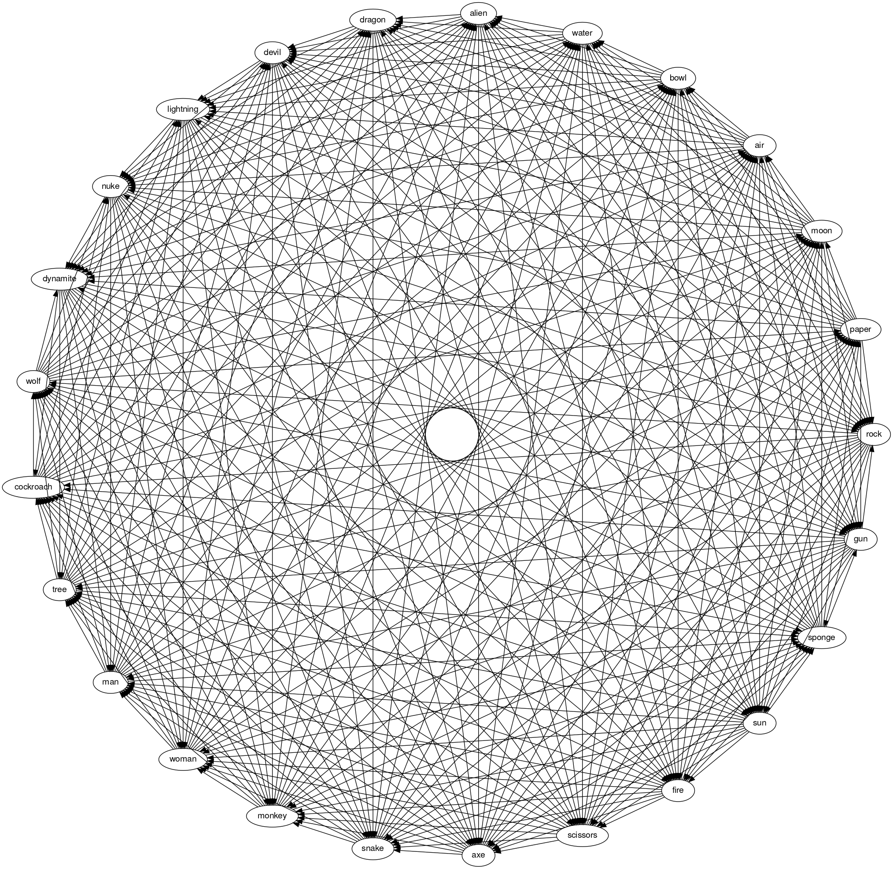

# Rochambeau

Rochambeau, roshambo, Jon Ken Pon of gewoon steen, papier en schaar? Het spel is onder [vele namen](https://www.wrpsa.com/why-do-people-call-rock-paper-scissors-roshambo/) bekend en er bestaat zelfs een heuse organisatie, de [Rock Paper Scissor Association](https://www.wrpsa.com/why-do-people-call-rock-paper-scissors-roshambo/)... In deze opgave ga je een programma schrijven om het spel tegen de computer te spelen!

## Steen, papier en schaar

In deze opgave ga je het volgende oefenen:

- Het maken van nieuwe Python bestanden, in dit geval door oude bestanden te kopiëren of te beginnen met de onderstaande code
- Het schrijven van eigen code door de onderstaande code aan te passen en uit te breiden
- Werken met invoer en uitvoer van tekst in Python
- Het maken van keuzes (op basis van de invoer van een gebruiker, jij!)

## De regels


Bij steen, papier en schaar gaan twee spelers eerst aftellen en vormen daarna tegelijkertijd met de hand een steen (een vuist), een schaar (twee uitgestoken vingers) of papier (een vlakke hand). Hierbij verslaat de steen de schaar, de schaar het papier en het papier de steen. Indien beide spelers dezelfde keuze maken wint geen van beide.

## Een begin

Begin met een leeg bestand in VSCode of een andere tekstverwerker.

Kopiëer en plak het volgende in het bestand, dit is het begin van de code die je in de opdracht verder gaat uitwerken:

```python
import random  # import the module named random

"""Play a game of rock-paper-scissors in Dutch

arguments: no arguments (prompted text doesn't count as an argument)
result: no result       (printing doesn't count as a result)
"""
user = input("Kies een wapen (steen, papier of schaar): ")
comp = random.choice(["steen", "papier", "schaar"])

print("De gebruiker (jij) koos", user)
print("De computer (ik) koos", comp)

if user == "steen":
    print("Haha! Eigenlijk koos ik papier! IK HEB GEWONNEN!")

print("Hopelijk heb je de volgende keer meer geluk...")
```

## En verder!

Voer in terminal vanuit de juiste directory het bestand uit met `python  wk2co1.py`.

Werk de bovenstaande code nu verder uit tot een volledig programma dat:

-   Een gebruiker uitnodigt het spel *steen, papier en schaar* te spelen
-   De gebruiker uit minstens drie opties laat kiezen
    -   dit hoeft niet steen, papier of schaar te zijn, je mag andere wapens kiezen!
    -   maar jouw programma moet wel steeds anders reageren op basis van de drie mogelijke opties die de gebruiker kan invoeren (althans, *minimaal* drie opties)
-   Het spel eerlijk speelt
    - maar je mag het spel ook zo maken dat de speler altijd wint (of verliest)
-   De keuze van de speler afdrukt (*print*)
    -   je mag aannemen dat de gebruiker de keuze foutloos typt, dus altijd één van de mogelijke opties
-   Afdrukt welke keuze het *zelf* heeft gemaakt uit de mogelijke opties (eerlijk of niet)
-   Afdrukt wie het spel heeft gewonnen (of een gelijkspel, of een andere uitkomst)

:::{admonition} Extra commentaar
:class: tip

Het toevoegen van extra commentaar (`# ...`) aan de code is optioneel, maar is aan te raden voor wanneer jouw uitwerking gaat worden beoordeeld!
:::

## Uitbreidingen

Heb je teveel tijd over? Dan vind je hier een aantal mogelijke uitbreidingen!


## Dummie proof
Check of de gebruiker een geldige keuze heeft gemaakt. Zo, niet, wint de computer automatisch.

## Blijven spelen

Als je wilt dat je programma blijft spelen, kan je een lus met `while True:` gebruiken.

We laten twee voorbeelden zien in plaats van een gedetaileerde uitleg:

```python
while True:
    print("Het draait nog steeds...")
    response = input("Nog een keer spelen? ")
    if response == "n":
        break
```

Hier zie je een andere mogelijkheid, een variant met het gebruik van een variabele `running` die aangeeft of het spel nog actief is of niet:

```python
running = True
while running:
    response = input("Nog een keer spelen? ")
    if response == 'n':
        running = False
```

Nogmaals, dit zijn voorbeelden en het is geen probleem als je niet begrijpt wat we hier staat, we komen later uitgebreid terug op het gebruik van *lussen* (een techniek om handelingen te herhalen)!

### RPS-5 (RPSSL)


Sam Kass en Karen Bryla bedachten een uitbreiding van het spel en noemden het steen, papier, schaar, *Spock* en *hagedis* ([RPSSL](http://www.samkass.com/theories/RPSSL.html)). Het werkt volgens hetzelfde principe, maar er komen twee extra wapens bij: een *hagedis* (voorgesteld door met de hand een kousenpopachtige mond te vormen) en *Spock* (voorgesteld door de [Vulcaanse groet](http://nl.wikipedia.org/wiki/Vulcaanse_groet) uit de [Star Trek](https://nl.wikipedia.org/wiki/Star_Trek) reeks te maken). Hierdoor wordt de kans op een gelijkspel kleiner (van 1/3 naar 1/5). In vier afleveringen van de televisiereeks [The Big Bang Theory](https://nl.wikipedia.org/wiki/The_Big_Bang_Theory_%28televisieserie%29) wordt deze uitgebreide variant van het spel vermeld.

<iframe width="560" height="315" src="https://www.youtube.com/embed/x5Q6-wMx-K8" frameborder="0" allow="accelerometer; autoplay; encrypted-media; gyroscope; picture-in-picture" allowfullscreen></iframe>

De regels van steen, papier, schaar, Spock en hagedis zijn:

- schaar snijdt papier

- papier bedekt steen

- steen plet hagedis

- hagedis vergiftigt Spock

- Spock smelt schaar

- schaar onthoofdt hagedis

- hagedis eet papier

- papier weerlegt Spock

- Spock verdampt steen

- steen breekt schaar

### RPS-25

Heb je nog meer tijd over? Je zou [RPS-25](http://www.umop.com/rps25.htm), een superset van steen, papier en schaar kunnen overwegen...



De complexiteit neemt toe maar het probleem blijft hetzelfde!

### RPS-101

Maar als je genoeg tijd hebt voor [RPS-101](http://www.umop.com/rps101/rps101chart.html) heb je echt een probleem!

