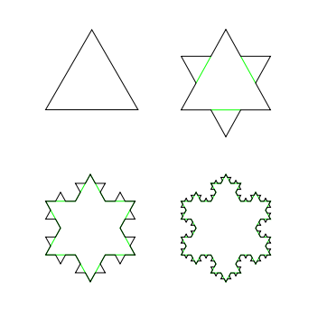

# Recursieve turtles

De Koch-kromme (of Koch-*sneeuwvlok*) is een voorbeeld van recursie met heel diepe vertakkingen. De Koch-sneeuwvlok is een *fractal* met drie identieke zijden en het zijn de zijden zelf die recursief worden gedefinieerd, niet de driehoek.

Voorbeelden van de Koch-Sneeuwvlok:



Elke zijde van de driehoek, wordt een driehoek op getekent. En dan weer op elke zijde van een driehoek, wordt een driehoek getekent, enz.

## Opdracht

a. Maak een nieuw bestand `wk3co1.py` men kopieer onderstaande code.


```python
import time
from turtle import *
from random import *

def main():
    """
    Main functie. Roept de andere functies op om hun werk te doen.
    """
    snowflake(300, 2)
    done() # tell turtle the drawing is done.

def testing():
    """
    Test functie. Hier staan alle assertions om de functies te testen.
    """

def snowflake(sidelength, levels):
    """Fractal snowflake function, complete.
       sidelength: pixels in the largest-scale triangle side
       levels: the number of recursive levels in each side
    """
    flakeside(sidelength, levels)
    left(120)
    flakeside(sidelength, levels)
    left(120)
    flakeside(sidelength, levels)
    left(120)


main()
testing()
```

Merk op dat je het programma niet kan niet draaien tot je `flakeside` gedefiniëerd hebt, en dat is de volgende stap.

b. Het is jouw taak om de functie `flakeside(sidelength, levels)` te implementeren, die *één* zijkant van de Koch-kromme tekent.


## Testen

-   Probeer `flakeside(300, 0)`; zorg dat je een rechte lijn krijgt
-   Probeer `flakeside(300, 1)`; zorg dat je een vorm met vier lijnsegmenten krijgt
-   Probeer `flakeside(300, 2)`; zorg dat je vier "niveau-1"-zijden krijgt
-   Probeer `flakeside(300, 3)`; mooi! en vrij cool!

Vergeet niet dat `flakeside` slechts *één* van de drie zijden van de kromme tekent!

-   Om deze reden hoeft de functie *niet* te eindigen op precies dezelfde plaats als waar zij begonnen is.
-   Als de functie dat wel zou doen zouden immers de drie zijden van de kromme precies bovenop elkaar worden getekend...


Hier zie je een grafische samenvatting wat de functie moet tekenen.


**Tips**

-   De base case van de zijde van de Koch-kromme is simpelweg een rechte lijn van lengte `sidelength`!

- Elk recursief niveau vervangt het *middelste derde deel* van de zijde van de sneeuwvlok door een "punt", d.w.z. twee zijden die deel zouden uitmaken van een gelijkzijdige driehoek van één derde schaal.
-   Merk op dat elke zijde vier *subzijden* bevat. Dat betekent dat `flakeside` zichzelf *vier* keer recursief aanroept!
-   Op de drie plekken *tussen* deze vier aanroepen moet je een geschikte draai maken.
-   De recursive case bevat dus in totaal *zeven* regels (vier recursies en drie draaingen).

c.
Nadat je de functie `flakeside` werkend hebt, kan je `snowflake` gaan proberen!

De functie `snowflake` roept simpelweg de functie `flakeside` drie keer aan. Afhankelijk van de richtingen die `flakeside` gebruikt moet je misschien de `left`s in `snowflake` vervangen door `right`s.

Voorbeelden die je kan proberen zijn `snowflake(300, 2)` en `snowflake(300, 3)`. Hier zijn afbeeldingen van vier verschillende waarden van `levels` voor de kromme, te weten `0`, `1`, `2` en `3`:


