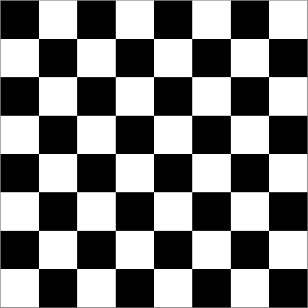

# Compressie

In dit probleem onderzoeken we de weergave van beelden met behulp van 0's en 1's.

## Beeldcompressie

Voor dit deel schrijf je twee functies, `compress(s)` en `uncompress(c)`, samen met een of meer hulpfuncties. Lussen zijn niet toegestaan.

Om te beginnen bekijken we alleen 8 bij 8 zwart-wit afbeeldingen zoals de afbeelding hieronder:



Elke cel in de afbeelding wordt een "pixel" genoemd. Een witte pixel wordt voorgesteld door het cijfer 0 en een zwarte pixel door het cijfer 1. Het eerste cijfer staat voor de pixel in de linkerbovenhoek van de afbeelding. Het volgende cijfer staat voor de pixel in de bovenste rij en de tweede kolom. Het achtste bit (cijfer) staat voor de pixel aan de rechterzijde van de bovenste rij. Het volgende bit staat voor de meest linkse pixel in de tweede rij, enzovoort. Daarom wordt de bovenstaande afbeelding weergegeven door de volgende binaire string met lengte 64:

```python
"1010101001010101101010100101010110101010010101011010101001010101"
```

Een andere manier om deze string voor te stellen in Python is

```python
"1010101001010101" * 4
```

## Achtergrond

Maar wat nu? Stel je voor, je bent ingehuurd door HASA ("Hanze Air and Space Administration"). HASA heeft een satelliet die 8 bij 8 zwart-wit beelden neemt en deze terugstuurt naar de aarde als binaire strings van 64 bits zoals hierboven beschreven. Om kostbare energie te besparen die nodig is voor het verzenden van gegevens, wil HASA de verzonden beelden "comprimeren" in een formaat dat zo weinig mogelijk bits gebruikt. Een manier om dit te doen is door gebruik te maken van het "run-length" coderingsalgoritme.

Stel je voor dat we een beeld hebben dat er als volgt uitziet:


Met behulp van onze standaard opeenvolging van 64 bits wordt dit beeld weergegeven door een binaire reeks die begint met 16 opeenvolgende 0'en (voor twee rijen witte pixels) gevolgd door 16 opeenvolgende 1'en (voor twee rijen zwarte pixels) gevolgd door 16 opeenvolgende 0'en gevolgd door 16 opeenvolgende 1'en.

Run-length codering (die overigens ook wordt gebruikt als onderdeel van het JPEG beeldcompressie-algoritme) stelt voor om dit beeld weer te geven met de code "16 wit, 16 zwart, 16 wit, 16 zwart". Dat is een veel kortere beschrijving dan het opsommen van de reeks van 64 pixels "wit, wit, wit, wit, ...".

### Run-length encoding

In het algemeen stelt onze run-length codering een beeld voor met een sequentie (een rij, of "run-length sequence" genoemd) van 8-bits *bytes*:

-   Het eerste bit van elke byte vertegenwoordigt het *bit* dat als volgende in het beeld zal verschijnen, ofwel 0 ofwel 1.

-   De laatste zeven bits bevatten het nummer in binaire vorm van de bits die achtereenvolgens op de huidige plaats in het beeld verschijnen.

Merk op dat deze run-length codering een relatief klein aantal bits zal gebruiken om het voorbeeld met 4 strepen hierboven weer te geven.

Het zal het echter zeer slecht doen (in termen van het aantal bits dat het gebruikt) in het representeren van de dambord afbeelding die we eerst bekeken hebben. In het algemeen doet de run-length codering het goed om afbeeldingen die grote blokken met effen kleuren hebben te "comprimeren". Gelukkig geldt dit voor veel echte afbeeldingen, zoals de afbeeldingen die HASA ontvangt, die meestal wit zijn met een paar zwarte vlekken die hemellichamen voorstellen.

## Opdracht 1: `compress(s)`

Dat was een hoop informatie! Hier is nu jouw taak.

Schrijf een functie `compress(s)`, waarvan het argument een binaire string `s` is met een lengte van minder dan of gelijk aan 64 en dat als resultaat een andere binaire string teruggeeft. De resulterende binaire string zou een run-length codering van het origineel moeten zijn, zoals hierboven beschreven.

Je hebt misschien één of meerdere hulpfunctie nodig en je mag ze elke naam geven die je wilt. Ook kan het zijn dat je één of meerdere functies uit het werkcollege kan gebruiken.

## Opdracht 2: `uncompress(c)`

Schrijf vervolgens een functie `uncompress(c)` die het comprimeren van de functie `compress` "omkeert" of "ongedaan maakt".

Dat wil zeggen, `uncompress(compress(s))` zou `s` moeten teruggeven. Hier is een leuke test die dat punt illustreert:

```python
assert uncompress(compress(64 * "0")) == 64 * "0"
```

Nogmaals, hulpfuncties zijn toegestaan. Lussen zijn niet toegestaan.

Hier zijn een paar voorbeelden van `compress` en `decompress` in actie:

```ipython
In [1]: compress(64 * "0")
Out[1]: '01000000'

In [2]: uncompress("10000101")   # 5 1'en
Out[2]: '11111'

In [3]: compress("11111")
Out[3]: '10000101'

In [4]: stripes = "0" * 16 + "1" * 16 + "0" * 16 + "1" * 16

In [5]: compress(stripes)
Out[5]: '00010000100100000001000010010000'

In [6]: uncompress("00010000100100000001000010010000")
Out[6]: '0000000000000000111111111111111100000000000000001111111111111111'
```
