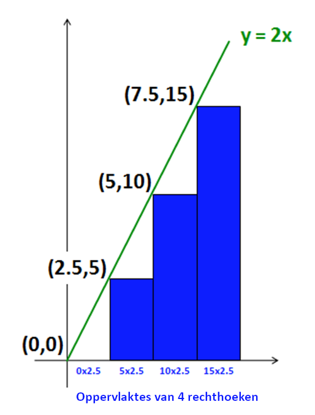

# Numerieke integratie

| Naam         | Beschrijving                                                   |
|--------------|----------------------------------------------------------------|
| Onderwerp    | Beter dan wiskundigen oppervlakten berekenen                   |
| Bestandsnaam | `wk3ex3.py`                                                    |
| Inleveren    | Lever jouw bestand met de juiste bestandsnaam in op GradeScope |

In deze opgave schrijf je een Python programma dat de oppervlakten onder willekeurige wiskundige functies kan berekenen (wiskundigen noemen dit *integralen*).

Door dit te doen oefen je:

* het schrijven van Python-functies
* het gebruik van *list comprehensions*
* het schrijven van hulpfuncties en opbouwen van grotere functies uit kleinere functies

Bovendien bereken je antwoorden waar wiskundigen geen formule voor hebben... en daar heb je niets meer dan vermenigvuldigen voor nodig!

## Een begin

Begin met een nieuw bestand `wk3ex3.py` en plak daar de onderstaande code in:

```python
# Programmeren I, Week 3 Opgave 3
# Bestandsnaam: wk3ex3.py
# Naam:
# Probleemomschrijving: List comprehensions


# hiermee krijgen we functies als sin en cos...
from math import *


# twee extra functies (die niet in de module math hierboven zitten)


def dbl(x):
    """Doubler!  argument: x, a number"""
    return 2 * x


def sq(x):
    """Squarer!  argument: x, a number"""
    return x ** 2


# voorbeelden om aan list comprehensions te wennen...


def lc_mult(n):
    """This example accepts an integer n
       and returns a list of integers
       from 0 to n-1, **each multiplied by 2**
    """
    return [2 * x for x in range(n)]


def lc_idiv(n):
    """This example accepts an integer n
       and returns a list of integers
       from 0 to n-1, **each divided by 2**
       WARNING: this is INTEGER division...!
    """
    return [x // 2 for x in range(n)]


def lc_fdiv(n):
    """This example accepts an integer n
       and returns a list of integers
       from 0 to n-1, **each divided by 2**
       NOTE: this is floating-point division...!
    """
    return [x / 2 for x in range(n)]


assert lc_mult(4) == [0, 2, 4, 6]
assert lc_idiv(4) == [0, 0, 1, 1]
assert lc_fdiv(4) == [0.0, 0.5, 1.0, 1.5]


# Hier begin je met de functies voor deze opgave:


# Stap 1, deel 1
def unitfracs(n):
    """Vergeet niet deze docstring te verbeteren!
    """
    pass  # vervang deze regel (pass is een Python-statement dat niets doet)
```

### List comprehensions

Probeer om te beginnen *list comprehensions* uit op de IPython-prompt. Deze voorbeelden zouden moeten helpen bij het begrijpen hoe list comprehensions werken:

```ipython
In [1]: lc_mult(10)   # voorbeeld met vermenigvuldigen
Out[1]: [0, 2, 4, 6, 8, 10, 12, 14, 16, 18]

In [2]: lc_mult(5)    # een kleiner voorbeeld
Out[2]: [0, 2, 4, 6, 8]

In [3]: lc_idiv(10)   # integerdeling
Out[3]: [0, 0, 1, 1, 2, 2, 3, 3, 4, 4]

In [4]: lc_fdiv(10)   # floating-pointdeling
Out[4]: [0.0, 0.5, 1.0, 1.5, 2.0, 2.5, 3.0, 3.5, 4.0, 4.5]
```

Lees deze drie functies van ieder één regel en zorg dat je echt begrijpt hoe ze werken!

:::{admonition} Integer- en floating-pointdeling
:class: notice

Merk op dat de aanroepen van `lc_idiv(10)` en `lc_fdiv(10)` *verschillende* lijsten teruggeven. De eerste gebruikt *integer*deling (de resultaten worden omlaag afgerond) en de tweede *floating-point*deling (dus de resultaten blijven een kommagetal).
:::

### Aanpassing

Pas de functie `lc_idiv` aan zodat de body gelijk is aan:

```python
return [float(x // 2) for x in range(n)]
```

Bedenk voordat je de functie uitvoert of `lc_idiv(10)` nog hetzelfde of anders dan daarvoor. Zal het `assert` statement hierboven nog slagen, of zal het een fout geven?

Typ nu `run wk3ex3.py` in IPython en probeer `lc_idiv(10)`. Komt dit overeen met wat je verwachtte? Je hoeft hier niets over op te schrijven, maar wees er zeker van dat duidelijk is waarom deze nieuwe uitvoer is zoals het is!

Zie verder voorbeelden van [list comprehensions](/practice/2_list_comprehension) voor meer oefeningen!

## Integreren

Integreren wordt soms beschreven als het vinden van het gebied tussen een wiskundige functie en de horizontale (x-)as.

Meer in het algemeen is een integraal eenvoudigweg de *som* van de resultaten van een numerieke functie, dat wil zeggen de y-waarden over een gekozen bereik.

Dit is belangrijk omdat het aan de hand van één getal een soort van samenvatting geeft van wat de functie "doet" over een interval (een bepaald bereik). Het wordt ook gebruikt om te bepalen hoe verschillende krachten (zwaartekracht, trekkracht, ...) zich gedragen op een bepaald punt, oppervlak of object over een periode van tijd. Het is ook essentieel bij het definiëren van de "gemiddelde waarde" van een functie over een interval of een gebied. Integralen kunnen worden gebruikt om een vliegtuigvleugel te ontwerpen, het weer te voorspellen of te berekenen hoeveel een bankrekening over tien jaar waard zal zijn, zelfs als de rentetarieven veranderen.

Bijvoorbeeld, denk aan de functie `dbl` hierboven (maar nu met een betere docstring):

```python
def dbl(x):
    """Argument: a number x (int or float)
       Return value: twice the argument
    """
    return 2 * x
```

Stel je voor dat je een schatting wilt maken van de integraal van `dbl` op het interval tussen `0.0` en `10.0`. Je zou de volgende (ruwe) benadering kunnen maken met rechthoeken:



1.  Hier wordt het interval verdeeld over 4 delen. De lijst `[0, 2.5, 5, 7.5]` bevat de x-waarde van de *linkergrenzen* van elk van de vier subintervallen.

2.  We bepalen hierna het resultaat van `dbl(x)` voor elke mogelijke `x` uit de lijst hierboven. We noemen deze waarden `y`: `y = [0, 5, 10, 15]`.

3.  We tellen nu de oppervlaktes van de rechthoeken op waarvan de linkerbovenhoek (dus de hoogte) op deze `y`-waarden ligt. Elke rechthoek loopt door tot de x-as. De breedte van elke rechthoek is `2.5`, omdat de vier rechthoeken met gelijke breedte in totaal een breedte van `10` moeten hebben.

4.  We bepalen de oppervlaktes van de rechthoeken op de gebruikelijke manier. Hun hoogtes staan in de lijst `y` en hun breedtes zijn `2.5`, dus de totale oppervlakte is

    ```python
    0 * 2.5 + 5 * 2.5 + 10 * 2.5 + 15 * 2.5
    ```

    of

    ```python
    (0 + 5 + 10 + 15) * 2.5
    ```

    wat gelijk is aan `(30) * 2.5`, of `75`.

Bedenk, dit is een *hele* ruwe benadering van het "oppervlakte onder de lijn", oftewel de integraal. Maar als we de breedte van de rechthoeken kleiner maken, dan zal hun som dat gebied zo goed kunnen benaderen als we zouden willen!

Belangrijker nog is dat aan de hand van dit voorbeeld we een algemene aanpak kunnen uitwerken om de integraal van een functie over een gegeven interval te benaderen:

1.  Deel het interval op in `n` gelijke delen en maak een lijst met de corresponderende `x`-waarden (deze worden het argument van de functie)

2.  Bereken de `y`-waarden (resultaten) van de functie voor elke waarde van `x` uit stap 1.

3.  Bereken de oppervlakte van de rechthoeken onder de kromme. Hun hoogtes zijn de `y`-waarden, hun breedtes de afstand tussen de `x`-waarden.

4.  Tel de oppervlaktes bij elkaar op en geef het resultaat terug. Dit is de integraal, of een schatting daarvan die verder onbeperkt nauwkeurig gemaakt kan worden.

In de rest van deze opgave ga je de functies schrijven voor elk van deze vier stappen, en je gebruikt vervolgens deze functies om vragen over de resultaten te beantwoorden.

## Stap 1: De `x`-waarden berekenen

De eerste stap betreft het berekenen van de `x`-waarden die we gaan gebruiken. Allereerst ga je de functie `unitfracs(n)` schrijven en vervolgens de functie `scaledfracs(low, hi, n)`.

### De functie `unitfracs`

Bekijk hoe `unitfracs(n)` zal moeten gaan werken:

```ipython
In [1]: unitfracs(2)
Out[1]: [0.0, 0.5]

In [2]: unitfracs(4)
Out[2]: [0.0, 0.25, 0.5, 0.75]

In [3]: unitfracs(5)
Out[3]: [0.0, 0.2, 0.4, 0.6, 0.8]

In [4]: unitfracs(3)
Out[4]: [0.0, 0.3333333333333333, 0.6666666666666666]

In [5]: unitfracs(10)
Out[5]: [0.0, 0.1, 0.2, 0.3, 0.4, 0.5, 0.6, 0.7, 0.8, 0.9]
```

Zoals de naam al aangeeft zal de functie een lijst van linkergrenzen (en dit zijn breuken, of *fracties*) op gelijke afstand van elkaar en met elk een waarde tussen `0` en `1` teruggeven. Dat wil zeggen, als `n` 5 is dan zal de lijst 5 waarden moet bevatten, namelijk `0/5`, `1/5`, `2/5`, `3/5` en `4/5`.

:::{admonition} Gebruik `lc_fdiv` als begin
:class: tip

Kopieer en plak de voorbeeldfunctie `lc_fdiv` en pas deze aan om `unitfracs` te schrijven. Je hoeft maar een *enkel* karakter aan te passen in deze code! Vergeet niet de docstring van `unitfracs` aan te passen om aan te geven wat de functie doet.
:::

Schrijf ten slotte ten minste drie `assert` statements om tests te implementeren, je mag een aantal van de voorbeelden hierboven gebruiken.

### De functie `scaledfracs`

Bekijk nu hoe de functie `scaledfracs(low, hi, n)` zal moeten gaan werken:

```ipython
In [1]: scaledfracs(10, 30, 5)
Out[1]: [10.0, 14.0, 18.0, 22.0, 26.0]

In [2]: scaledfracs(41, 43, 8)
Out[2]: [41.0, 41.25, 41.5, 41.75, 42.0, 42.25, 42.5, 42.75]

In [3]: scaledfracs(0, 10, 4)
Out[3]: [0.0, 2.5, 5.0, 7.5]
```

Schrijf `scaledfracs(low, hi, n)`. De functie geeft een lijst met `n` linkergrenzen terug die evenredig verdeeld zijn over een interval dat van `low` tot `hi` loopt.

Schrijf ook `assert` statements om de voorbeelden hierboven te testen.

:::{admonition} Hoe `scaledfracs` uit te werken
:class: tip

De functie `scaledfracs` is lastig om uit te werken, we geven je extra uitleg en tips. Om te beginnen, *gebruik* `unitfracs`, de functie die al hebt geschreven. De volgende regel geeft een idee hoe je dit zou kunnen doen:

```python
return [... for x in unitfracs(n)]
```

Op deze manier hoef je het werk van `unitfracs` niet opnieuw te doen! Je zal ook misschien hebben zien dat `scaledfracs` erg lijkt op de functie `interp` die je eerder hebt geschreven, en dat klopt!

De functie `interp` hoef je niet te gebruiken, maar je kan er wel ideeën uit opdoen! Hier is de functie, ter herinnering:

```python
def interp(low, hi, fraction):
    """Returns a value frac of the way from low to hi"""
    return low + (hi - low) * fraction
```

Merk op dat de rol van `fraction` hierboven is om aan te geven hoe ver je op de weg bent van `low` naar `hi` en dat is precies wat `x` doet in de list comprehension!

Vergeet niet een docstring toe te voegen die beschrijft wat `scaledfracs` doet.
:::

## Stap 2: De `y`-waarden berekenen

De functie `scaledfracs` kan allerlei lijsten met `x`-waarden op gelijke afstand maken.

Je moet nu de `y`-waarden (de resultaten) van een functie op elk van deze `x`-posities berekenen. Ook hier gebruik je list comprehensions om dit proces simpel en snel te maken!

Het doel is om elke functie te kunnen verwerken, maar we beginnen met een concreet voorbeeld dat later verder uitgebreid gaat worden.

### De functie `sqfracs`

Schrijf een functie `sqfracs(low, hi, n)` die als volgt werkt:

```ipython
In [1]: sqfracs(4, 10, 6)
Out[1]: [16.0, 25.0, 36.0, 49.0, 64.0, 81.0]

In [2]: sqfracs(0, 10, 5)
Out[2]: [0.0, 4.0, 16.0, 36.0, 64.0]
```

Deze functie `sqfracs` lijkt heel erg op `scaledfracs`, alleen is elke waarde *gekwadrateerd*.

:::{admonition} Gebruik `scaledfracs`
:class: tip

Gebruik hier `scaledfracs` hier. `sqfracs` kan `scaledfracs` op dezelfde manier gebruiken als de manier waarop `scaledfracs` gebruikmaakt van `unitfracs`! Bekijk dit stukje code:

```python
for x in scaledfracs(low, hi, n)
```
:::

Zoals altijd, schrijf aantal `assert` statements om `sqfracs` te testen. Bedenk ook zelf een aantal voorbeelden om te testen!

### De functie `f_of_fracs`

Schrijf een functie `f_of_fracs(f, low, hi, n)` die als volgt werkt:

```ipython
In [1]: f_of_fracs(dbl, 10, 20, 5)
Out[1]: [20.0, 24.0, 28.0, 32.0, 36.0]

In [2]: f_of_fracs(sq, 4, 10, 6)
Out[2]: [16.0, 25.0, 36.0, 49.0, 64.0, 81.0]

In [3]: f_of_fracs(sin, 0, pi, 2)   # de sinusfunctie
Out[3]: [0.0, 1.0]
# de waardes hierboven zijn afgeronde versies van
# wat je misschien zelf ziet...
```

Merk op dat `f_of_fracs` als eerste argument een *functie* accepteert, dat kan in Python (zie ook [list comprehensions](/practice/2_list_comprehension) voor voorbeelden hoe je functies als argument kan doorgeven).

Je kan `sqfracs` kopiëren en plakken als *basis* voor deze functie, je hoeft maar een paar tekens aan te passen! Gebruik net als in de eerdere delen van deze opgave de voorbeelden hierboven om ten minste drie `assert` statements voor `f_of_fracs` te schrijven.

## Stap 3: berekenen en combineren

Je hebt nu functies die zowel de `x`-, en belangrijker nog, de `y`-waarden voor een functie berekenen op gelijke afstanden.

Je gaat nu een functie `integrate(f, low, hi, n)` schrijven die de uiteindelijke gewenste waarde teruggeeft, de integraal over `f` van `low` naar `hi`, benaderd met `n` stappen.

Bekijk de voorbeelden en hints hieronder. Zoals je kan zien aan de voorbeelden geeft `integrate` geen lijst terug, maar geeft het een enkel floating-point getal terug:

```ipython
In [1]: import math                  # om math.pi en math.sin te gebruiken

In [2]: integrate(dbl, 0, 10, 4)
Out[2]: 75.0                         # het voorbeeld van het begin van deze opgave

In [3]: integrate(dbl, 0, 10, 1000)
Out[3]: 99.9                         # afgerond van 99.8999... (precieze waarde: 100)

In [4]: integrate(sq, 0, 3, 1000000) # Python heeft wel even nodig voor een miljoen stappen
Out[4]: 8.9999865000044963           # bijna! (precieze waarde: 9.0)

In [5]: integrate(math.sin, 0, math.pi, 1000)
Out[5]: 1.9999983550656628           # best goed! (precieze waarde: 2.0)
```

Maak je geen zorgen over kleine fouten in de meest rechtse cijfers achter de komma. Deze komen door afrondfouten, dit kan je niet voorkomen omdat de nauwkeurigheid van floating-point getallen beperkt is.

Om te beginnen is hier de *signature* (de regel met `def`) en de docstring voor `integrate`. Voel je vrij dit te gebruiken:

```python
def integrate(f, low, hi, n):
    """Integrate returns an estimate of the definite integral
       of the function f (the first argument)
       with lower limit low (the second argument)
       and upper limit hi (the third argument)
       where n steps are taken (the fourth argument)

       integrate simply returns the sum of the areas of rectangles
       under f, drawn at the left endpoints of n uniform steps
       from low to hi
    """


assert integrate(dbl, 0, 10, 4) == 75
assert integrate(sq, 0, 10, 4) == 2.5 * sum([0, 2.5*2.5, 5*5, 7.5*7.5])
```

Deze keer gaan we "test-driven development" gebruiken, waarin je *eerst* de tests schrijft en daarna zorgt dat je functie aan de tests voldoet. Daarom hebben we de `assert` statements hierboven toegevoegd! Merk op dat de tweede `assert` een voorbeeld is van hoe je kan testen ook als je niet weet wat het numerieke antwoord is!

:::{admonition} Hoe `integrate` uit te werken
:class: tip

Om te beginnen, gebruik GEEN list comprehensions, er wordt hier geen lijst gemaakt. Gebruik in plaats daarvan `f_of_fracs` om een lijst van hoogtes te maken.

Onthoud dat het resultaat van `f_of_fracs` een grote lijst `y`-waarden is! Je moet deze `y`-waarden (hoogtes) vermenigvuldigen met de breedtes van de rechthoeken. Maar alle breedtes zijn hetzelfde! Je kan dus eerst de hoogtes optellen en daarna vermenigvuldigen met de breedte!

Gebruik de ingebouwde Python functie `sum`. `sum(L)` geeft de som van de elementen in `L` terug. Een paar voorbeelden van hoe `sum` werkt:

```ipython
In [1]: sum([10, 4, 1])
Out[1]: 15

In [2]: sum(range(0, 101))
Out[2]: 5050
```
:::

Als jouw functie `integrate`werkt, gefeliciteerd! Je hebt een algemeen bruikbare routine geschreven om integralen te berekenen voor elke functie die je kan berekenen (ook waarvoor geen formule van de integraal bestaat, dat wil zeggen, waarvoor zelfs de beste wiskundigen ter wereld niet weten hoe je een precies antwoord moet berekenen).

Je gaat nu `integrate` toepassen...

## Vragen

Neem jouw antwoorden op in het bestand `wk3ex3.py` als commentaar (met het `#` teken) of *eenvoudiger* door ze in een triple-quoted string op te nemen die je kent van docstrings (omdat daar regelafbrekingen in mogen voorkomen)

Je hoeft geen antwoord te geven op de "nulde" vraag, we hebben het antwoord hier neergezet als voorbeeld van hoe je de andere twee kan beantwoorden:

### Vraag 0 (voorbeeld)

Leg uit waarom `integrate(dbl, 0, 10, n)` steeds dichter naar 100 nadert als `n` groter wordt.

Het antwoord zou er als volgt uit kunnen zien (merk op dat dit een matig antwoord is, omdat het niet echt de vraag beantwoordt):

```python
"""Vraag 0.

De waarde van integrate(dbl, 0, 10, n) waarbij n steeds groter wordt is
gelijk aan de oppervlakte onder de functie dbl, de lijn y = 2*x tussen
x = 0.0 en x = 10.0

Deze waarde is de oppervlakte van de driehoek in de afbeelding bovenaan
de pagina met de opgave.

Die oppervlakte is 100, omdat de hoogte van de driehoek 20 is en de
breedte 10 is.

Voor een driehoek geldt dat A = 0.5*h*w.
"""
```

### Vraag 1

Zoals opgemerkt is de exacte waarde van de integraal van de functie `dbl`, `y = 2x`, van `x = 0,0` tot `x = 10,0` gelijk aan 100, wat de oppervlakte is van de driehoek in de afbeelding bovenaan deze pagina. Die oppervlakte is 100, want de hoogte van de driehoek is 20 en de breedte is 10.

De oproepen `integrate(dbl, 0, 10, 4)` en `integrate(dbl, 0, 10, 1000)`, zoals hierboven weergegeven, geven als resultaat waarden die *kleiner* dan 100 zijn.

Leg in één zin uit waarom `integrate` altijd een *onderschatting* maakt van de exacte waarde van deze specifieke integraal.

Als een vervolgvraag, kan je een functie bedenkten waarvan de integraal altijd *overschat* wordt op hetzelfde bereik, van `0` tot `10`? (Als je hier niet uitkomt kan je eerst naar de volgende vraag kijken.)

### Vraag 2

De volgende functie `c` volgt de bovenste helft van een cirkel met straal 2.

```python
def c(x):
    """c is a semicircular function of radius two"""
    return (4 - x ** 2) ** 0.5
```

Voeg deze functie toe aan jouw bestand `wk3ex3.py` en controleer onderstaande waardes.

```ipython
In [1]: integrate(c, 0, 2, 2)
Out[1]: 3.732                    # afgerond...

In [2]: integrate(c, 0, 2, 20)
Out[2]: 3.228                    # afgerond...
```

Bepaal de waardes van `integrate(c, 0, 2, 200)` en `integrate(c, 0, 2, 2000)` en noteer ze in jouw antwoord.

Als `n` naar oneindig gaat (dat wil zeggen, steeds groter wordt), wat gebeurt er dan met de waarde van deze integraal? Waarom?
