# Finite state machines

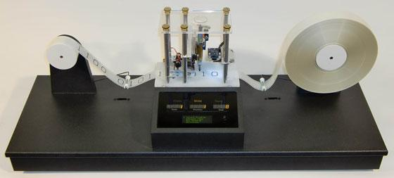

En Turingmachines!

| Naam         | Beschrijving                                                   |
|--------------|----------------------------------------------------------------|
| Onderwerp    | Toestanden, overgangen en acties                               |
| Bestandsnaam | `wk12ex1a.jff` t/m `wk12ex1j.jff`                              |
| Inleveren    | Lever jouw bestand met de juiste bestandsnaam in op GradeScope |

Voor deze opgave moet je beginnen met het downloaden van deze twee bestanden:

* De applicatie JFLAP [`JFLAP_Thin.jar`](https://github.com/hanze-hbo-ict/programmeren/raw/master/problems/assets/JFLAP_Thin.jar)
* Het zipbestand [`wk12ex1.zip`](https://github.com/hanze-hbo-ict/programmeren/raw/master/problems/assets/wk12ex1.zip); dit bevat een startbestand voor elk van de opgaven van deze week, en een complete oplossing van de eerste opgave als voorbeeld.

Pak het bestand `wk12ex1.zip` uit en controleer dat je **zowel** de tests als de startbestanden hebt:

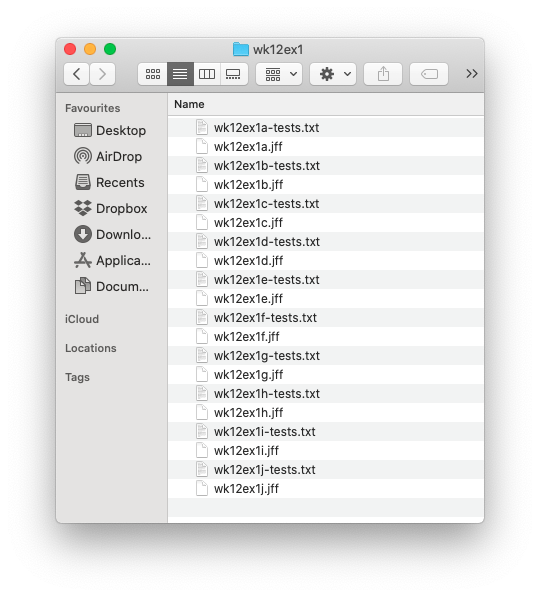

## JFLAP

We gaan deze "machines" maken in de softwaresimulator JFLAP. Als je Logisim kon laten werken op je systeem, dan zal JFLAP ook werken.

We hebben een versie hiervan, met de naam `JFLAP_Thin.jar`, beschikbaar gesteld; je kan de link hierboven vinden.

Vergeet niet, voordat je begint, het zipbestand `wk12ex1.zip` **uit te pakken**. Je kan in Windows de bestanden **wel** bekijken als ze gezipt zijn, maar je kan ze **niet** gebruiken tot je ze daadwerkelijk uitpakt. Nadat je de map `wk12ex1` hebt uitgepakt kan je JFLAP starten en één van de bestanden in die map openen.

Je kan JFLAP starten door te dubbelklikken op `JFLAP_Thin.jar`. Je ziet dan een menu met opties als
  "Finite Automaton" (een andere naam voor een finite state machine) en "Turing Machine".

Als je JFLAP gestart hebt kan je via het menu `"File"`...`"Open"` kiezen om het bestand `wk12ex1a.jff` te openen; dit bestand kan je vinden in de zojuist uitgepakte map `wk12ex1`. Nu kun je deze finite state machine uitproberen.

!!! notice "Gebruik je een Mac?"
    Het kan zijn dat je Mac je niet toestaat JFLAP te openen door te dubbelklikken; als dat zo is, kan je op het bestand `JFLAP_Thin.jar` rechtsklikken en *Openen...* kiezen.

!!! danger "Werkt dit niet?"
    Het kan zijn dat je JFLAP van de command line moet draaien; `cd` hiervoor in de terminal naar de map waar `JFLAP_Thin.jar` in staat, en voer vanuit die locatie het commando `java -jar JFLAP_Thin.jar` uit. Overleg even met je docent als dit ook niet werkt.

!!! tip "Tutorial"
    Er is ook een stap-voor-stapuitleg en tutorial beschikbaar op https://www.cs.duke.edu/csed/jflap/tutorial/.

## Een finite state machine *testen*

In het bestand met de naam `week12ex1a.jff` vind je een reeds geïmplementeerde, deterministische finite state machine die bitstrings accepteert waarvan *de derde bit een `1` is*. Dat wil zeggen, de derde bit van links, oftewel de derde bit die de machine tegenkomt, is een `1`.

Hier is een afbeelding van de gegeven machine:

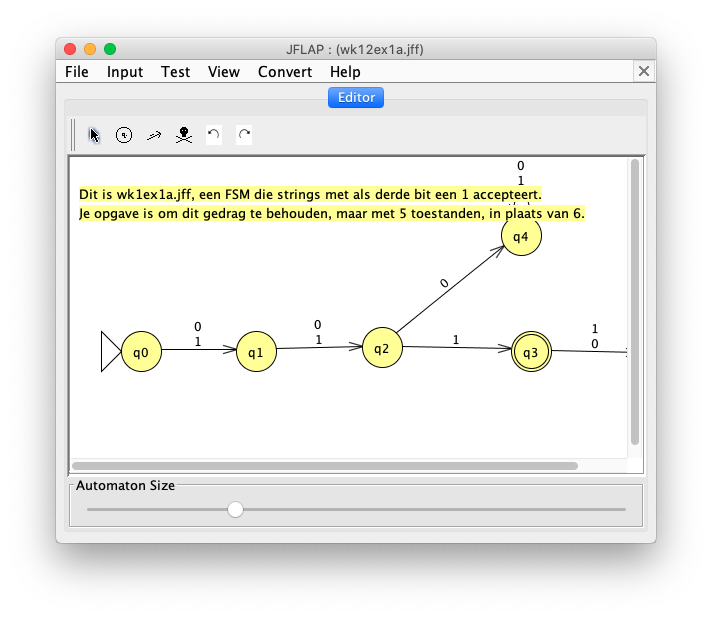

De machine **kan** met vijf states gebouwd worden, maar is nu geïmplementeerd met zes.

De opgave is om deze machine te verbeteren zodat ze nog steeds correct werkt, maar maar vijf states gebruikt, en bovendien (en dat is voor straks heel handig) de **BATCH mode** te gebruiken om het resultaat te testen.

!!! danger "Transities maken"
    Als je twee verschillende tekens wilt gebruiken voor een transitie van de ene state naar de andere, dan moet je twee verschillende lijnen tekenen en de beide transitietekens los van elkaar opgeven. JFLAP zal dan de transitietekens boven elkaar weergeven, zoals je in de afbeelding hierboven kan zien.

    Als je een komma of een ander scheidingsteken gebuikt om de transitie in te voeren, denkt JFLAP dat je de **gehele** tekst wil gebruiken voor de transitie, in plaats van de **individuele tekens**. JFLAP ondersteunt transities met meerdere tekens, maar die zijn hier niet van toepassing.

### Testen in Batch mode!

Als je klaar bent om te gaan testen, **sla dan je bestand op** en sluit het af. Je moet het bestand wel sluiten, *maar niet de hele applicatie.* Je komt terug op het hoofdmenu van JFLAP:

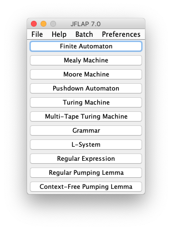

Kies dan onder het menu *Batch* de optie *Batch Test*:

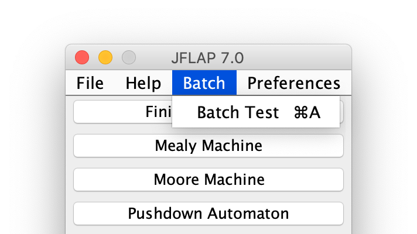

Navigeer in het dialoogvenster naar de map `wk12ex1` en kies het bestand `wk12ex1a.jff` dat je zojuist hebt opgeslagen:

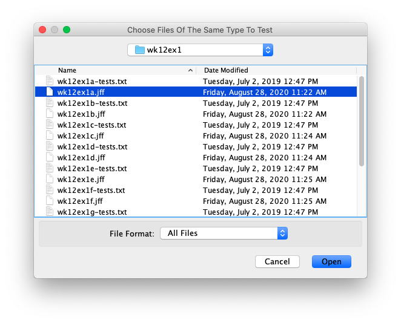

Navigeer in het volgende dialoogvenster weer naar de map `wk12ex1` en kies het testbestand met de naam `wk12ex1a-tests.txt`:

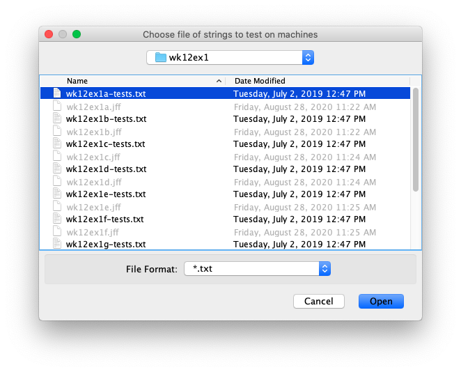

Je ziet zowel de machine als alle tests. Klik op *Run Inputs* onder de tests:

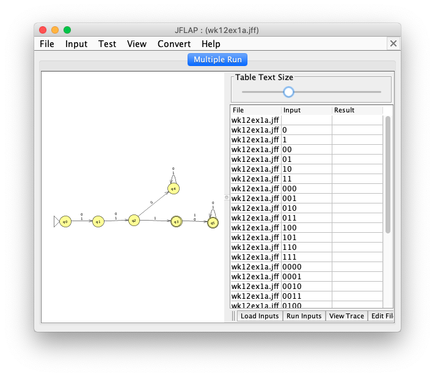

Je ziet dan de resultaten. **Als er geen fouten zijn** zijn de resultaten een simpele kolom met uitvoer, zoals:

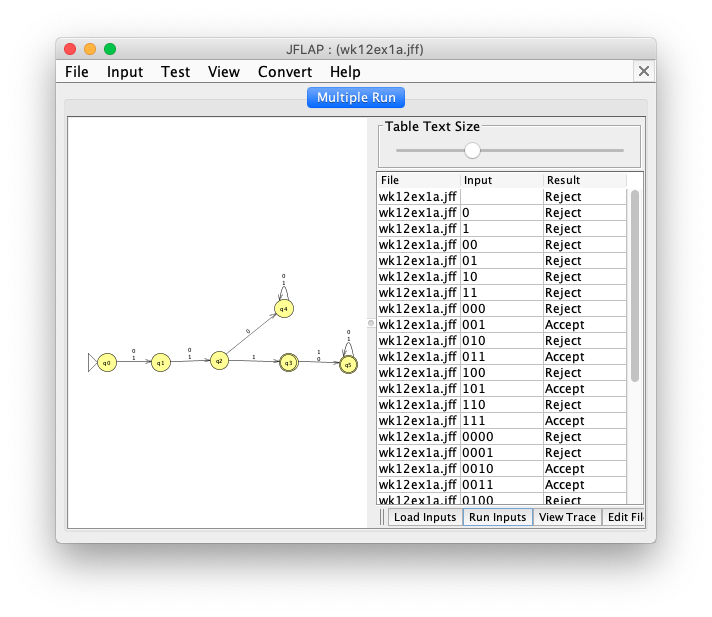

Je zal de resultaten zien. **Als er *wel* fouten zijn** staat achter elke foute uitkomsten de goede uitkomst tussen haakjes.

* In dit voorbeeld zijn alle ringen voor de accepterende toestanden verwijderd, dus elke toestand verwerpt de string.
* Sommige zouden echter **wel** geaccpeteerd moeten worden, en die fouten worden getoond:

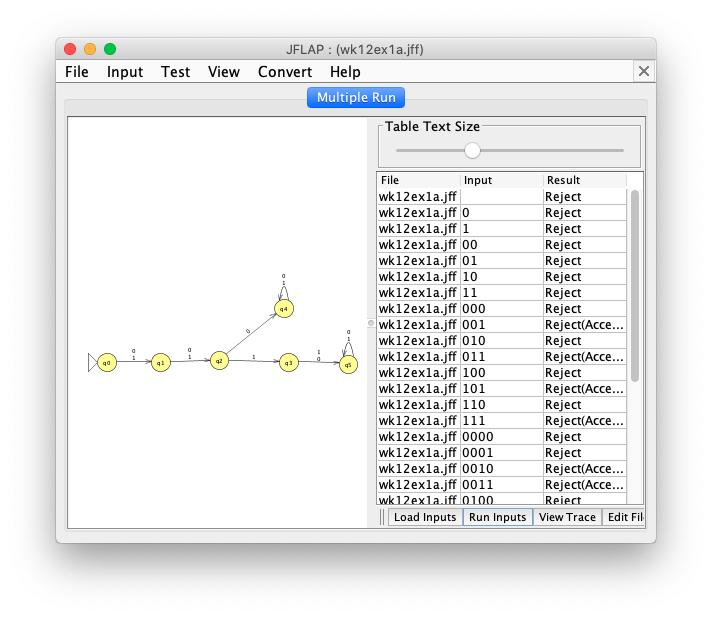

Dat is alles! Nu kan je al je JFLAP-machines testen met behulp van ***Batch mode***... het is belangrijk dat je dit echt doet!

## Opgaven

In de volgende opgaven ga je je eigen finite state machines maken!

### Ten minste twee `0`'en en maximaal één `1`

Het doel van deze opgave is om in het bestand `wk12ex1b.jff` een deterministische finite state machine te maken die precies die bitstrings accepteert met **ten minste twee** `0`'en en **maximaal één** `1`. Je mag zoveel states gebruiken als je wilt, maar minder states is zeker beter! Als tip zie je hier het begin van een mogelijke oplossing (De aanpak hier is om "nullen" naar rechts te tellen en "enen" naar benenden...).

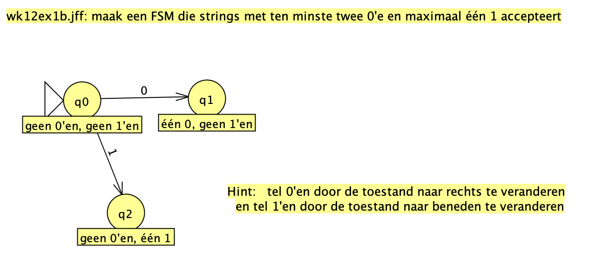

Hier zijn drie voorbeelden van strings die geaccepteerd moeten worden:

```
00
0000100
00000
```

Hier zijn drie strings die verworpen moeten worden:

```
0
0010010
1
```

Deze machine vereist ten minste *zeven* states. Het is geen probleem als je er meer gebruikt.

!!! notice "Testen"
    Vergeet niet je machine in Batch mode te testen met de tests in `wk12ex1b-tests.txt`!

### Eerste en laatste bit gelijk

Het doel van deze opgave is om in het bestand `wk12ex1c.jff` een deterministische finite state machine te maken die precies die bitstrings accepteert waarvan de eerste en laatste bit **gelijk** zijn. Je mag zoveel states gebruiken als je wilt, maar minder states is zeker beter! Hier zijn drie voorbeelden van strings die geaccepteerd moeten worden:

```
01010
1
11101
```

Hier zijn drie strings die verworpen moeten worden:

```
01
0010011
11110
```

Deze machine vereist ten minste *vijf* states, maar meer is ook goed!

!!! notice "Testen"
    Vergeet niet je machine in Batch mode te testen met de tests in `wk12ex1c-tests.txt`!

### Aantal `0`'en een veelvoud van twee of drie

Het doel van deze opgave is om in het bestand `wk12ex1d.jff` een deterministische finite state machine te maken die precies die bitstrings accepteert waarvan het **aantal** `0`'en een veelvoud van **twee**, een veelvoud van **drie** of een veelvoud van zowel **twee** als **drie** is. Alle `1`-bits worden **genegeerd**. Je mag ook hier zoveel states gebruiken als je wilt, maar het is aardig om te kijken hoe klein je de machine kan maken! Hier zijn drie voorbeelden van strings die geaccepteerd moeten worden:

```
111
0111011111110
11110100000111
```

Hier zijn drie strings die verworpen moeten worden:

```
1011
0010010
1000100001
```

Deze machine vereist ten minste *zes* states, maar meer is ook goed!.

!!! notice "Testen"
    Vergeet niet je machine in Batch mode te testen met de tests in `wk12ex1d-tests.txt`!

## Twee-na-laatste bit een `1`

Het doel van deze opgave is om in het bestand `wk12ex1e.jff` een deterministische finite state machine te maken die precies die bitstrings accepteert waarvan de **twee-na-laatste** bit een `1` is. Dit voorbeeld is tijdens het college besproken, maar het is wat lastig. Het minimale aantal states waarmee deze machine gebouwd kan worden is *acht*. Grotere machines zijn ook goed. Hier zijn drie voorbeelden van strings die geaccepteerd moeten worden:

```
0101
100
11110101000100
```

Hier zijn drie strings die verworpen moeten worden:

```
10
11111001
011011
```

Deze machine vereist ten minste **acht** states, maar meer is ook goed!

!!! notice "Testen"
    Vergeet niet je machine in Batch mode te testen met de tests in `wk12ex1e-tests.txt`!


### Inleveren

Je bent nu klaar! Vergeet niet al je `.jff`-bestanden samen in te leveren in Gradescope. Zorg dat, als je een zip-bestand gebruikt, de bestanden niet **in een map** in het zip-bestand zitten!

## Bonusopgaven

Er zijn drie uitdagende bonusopgaven om finite state machines te maken en twee om Turingmachines te maken, die ieder 6 bonuspunten waard zijn.

### Eerste en laatste twee bits gelijk

Het doel van deze opgave is om in het bestand `wk12ex1f.jff` een deterministische finite state machine te maken (*geen Turingmachine*; dat doen we later pas) die precies die bitstrings accepteert waarvan de **eerste twee** bits gelijk zijn aan de **laatste twee** bits. De **volgorde** van de bits is hier van belang. Hier zijn drie voorbeelden van strings die geaccepteerd moeten worden:

```
010000010101
10111110010
11110101011011
```

Hier zijn drie strings die verworpen moeten worden:

```
0110
11111001
011100
```

Elke string met minder dan twee bits moet verworpen worden; elke string met precies twee bits moet geaccepteerd worden; langere strings worden geaccepteerd of verworpen aan de hand van de gegeven criteria.

Het maakt niet uit hoeveel states je gebruikt! De kleinst mogelijke oplossing bestaat uit *vijftien* states, en het kan niet kleiner dan dat gedaan worden!

### Binair getal deelbaar door drie

Het doel van deze opgave is om in het bestand `wk12ex1g.jff` een deterministische finite state machine te maken (*geen Turingmachine*; dat doen we later pas) die precies die bitstrings accepteert die, *als je ze leest als een binair getal*, precies deelbaar zijn door **drie**! De lege string zien we als `0`. Omdat `0` precies deelbaar is door drie, moeten zowel de string `0` als de lege string geaccepteerd worden door je finite state machine in `wk12ex1g.jff`. Voorloopnullen worden genegeerd, die veranderen de waarde van het getal immers niet.

Hier zijn drie voorbeelden van strings die **geaccepteerd** moeten worden (met wat commentaar erbij!):

```
01001       # negen
101010      # twee-en-veertig
100001      # drie-en-dertig
```

Hier zijn een aantal strings die **verworpen** moeten worden:

```
0000010     # twee, met een aantal voorloopnullen
100         # vier
111         # zeven
1010        # tien
1011        # elf
```

Wat in elk van deze gevallen gebeurt is dat we de string interpreteren als een binair getal en dan, als dat nummer deelbaar is door drie, dat de string geaccepteerd moet worden. Als het niet deelbaar is door drie moet de string verworpen worden.

!!! tip "Drie states!"
    Je hebt maar drie states nodig voor deze machine! *Je moet zowel in binair als met `mod` denken!*

    * Als je een `0` ziet wordt de waarde van het binaire getal ***verdubbeld***!
    * Als je een `1` ziet wordt de waarde van het binaire getal ***verdubbeld en één groter***!

    De sleutel is dat *dezelfde relaties ook gelden voor de resten na deling*!

    * Als je in de *deelbaar-door-drie*-state bent en een `0` ziet, dan verdubbel je; *dus ben je nog steeds deelbaar door drie!*
    * Als je in de *rest-1*-state bent en een `0` ziet, dan verdubbel je; *dus je moet naar de rest-2-state*!
    * Als je in de *rest-1*-state bent en een `1` ziet, dan verdubbel je en verhoog je met één; *dus nu ben je weer deelbaar door drie!*
    * ... en zo verder...

Het is de moeite waard om over alle gevallen na te denken. Als je de interacties helemaal begrijpt, kan je ook de volgende uitdaging aan...

### Binair getal deelbaar door zeven

Het doel van deze opgave is om in het bestand `wk12ex1h.jff` een deterministische finite state machine te maken (nog steeds *geen Turingmachine*) die precies die bitstrings accepteert die, *als je ze leest als een binair getal*, precies deelbaar zijn door **zeven**! Net als hierhoven wordt de lege string gezien als `0`. Omdat `0` precies deelbaar is door zeven, moeten zowel de string `0` als de lege string geaccepteerd worden door je finite state machine in `wk12ex1h.jff`. Voorloopnullen worden net als in de vorige opgave genegeerd.

Hier zijn drie voorbeelden van strings die **geaccepteerd** moeten worden (met wat commentaar erbij!):

```
111        # zeven
101010     # twee-en-veertig
1000110    # zeventig
```

Hier zijn een aantal strings die **verworpen** moeten worden:

```
0000010    # twee, met een aantal voorloopnullen
100        # vier
10000      # zestien
10001      # zeventien
1010       # tien
1011       # elf
1000111    # één-en-zeventig
```

Wat in elk van deze gevallen gebeurt is dat we de string interpreteren als een binair getal en dan, als dat nummer deelbaar is door zeven, dat de string geaccepteerd moet worden. Als het niet deelbaar is door zeven moet de string verworpen worden.

!!! tip "Zeven states!"
    Je hebt maar zeven states nodig voor deze machine! Het idee lijkt heel erg op dat van de vorige!

### Turingmachine voor palindromen

!!! notice "Turingmachines"
    We bespreken Turingmachines pas in het *tweede* college van deze week...

Maak in het bestand `wk12ex1i.jff` een *Turingmachine* die precies die bitstrings accepteert die een **palindroom** zijn (die dus hetzelfde zijn of je ze nou vooruit of achteruit leest). De palindromen zelf bestaan alleen uit 0'en en 1'en en zullen geen spaties bevatten. Je kan hierdoor de lege ruimtes in de tape gebruiken om te weten wanneer de Turingmachine het einde van de invoerstring bereikt heeft aan de linker- of rechterkant.

Het is onmogelijk om met een finite state machine palindromen te identificeren: dit is een voorbeeld van een probleem waarvoor het krachtigere model van de Turingmachine nodig is.

### Turingmachine die aantal `0`'en en `1`'en vergelijkt

Maak in het bestand `wk12ex1j.jff` een *Turingmachine* die precies die bitstrings accepteert met een gelijk aantal `0`'en en `1`'en, *ongeacht de volgorde*. De invoerstring bevat geen spaties. De strings `010101100111101000` en `110001` moeten dus geaccepteerd worden, maar de strings `011` en `1` moeten verworpen worden.

!!! tip "Mogelijke strategie"
    Een mogelijke strategie is om corresponderende `0`'en en `1`'en te wissen. Dit zou echter spaties kunnen creëren in de invoerstring! In plaats van ze te wissen, zou je dus kunnen overwegen om "gebruikte" tekens te veranderen in een ander niet-leeg teken, bijvoorbeeld een `2`, die je dan kan negeren bij de verdere verwerking.

Aangezien finite state machines niet kunnen "tellen", is dit nog een probleem dat een Turingmachine vereist; het is niet mogelijk dit te bepalen met alleen maar een finite state machine.

Succes met JFLAP!
