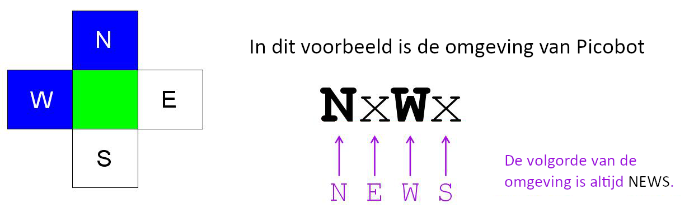
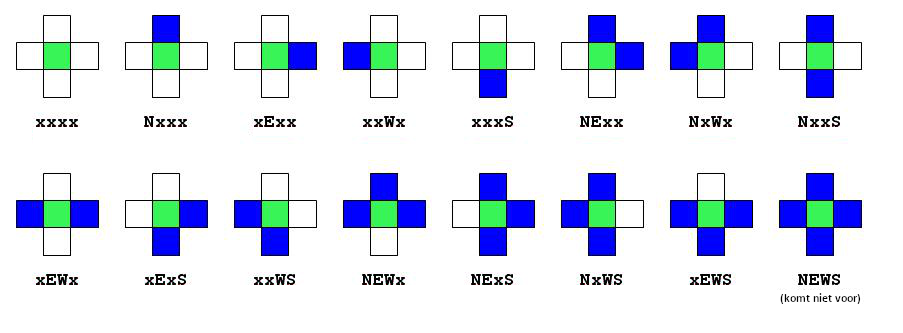

# Picobot

| Naam         | Beschrijving                                                   |
|--------------|----------------------------------------------------------------|
| Onderwerp    | Een eerste kennismaking met Picobot                            |
| Bestandsnaam | `wk1ex3.txt`                                                   |
| Inleveren    | Lever jouw bestand met de juiste bestandsnaam in op GradeScope |

In dit probleem maak je kennis met Picobot, een eenvoudige "robot". Zijn doel is om een omgeving volledig te verkennen en geen pixel mag onbezocht blijven!

Picobot kan je vinden op [https://www.cs.hmc.edu/picobot/](https://www.cs.hmc.edu/picobot/)

## Kennismaken

Picobot begint op een willekeurige locatie in een ruimte. Je kan de beginpositie van Picobot niet bepalen, deze kiest Picobot zelf. De muren van de ruimte zijn blauw, picobot is groen, en de lege ruimte is wit. Elke keer als Picobot een stap maakt laat hij een grijs spoor achter. Als Picobot zijn hele omgebing heeft verkend, stopt hij automatisch.


## Omgeving

Picobot heeft maar beperkte mogelijkheden om zijn omgeving waar te nemen. Hij kan alleen zijn directe omgeving zien, ten *noorden*, *oosten*, *westen* en *zuiden* van zijn locatie.



In de omgeving hierboven ziet Picobot een muur ten *noorden* en *westen* en niets ten oosten en zuiden. Deze omgeving wordt weergegeven als:

```text
NxWx
```

De vier posities om Picobot heen worden altijd in de volgorde NEWS (North, East, West en South) beschreven. Een `x` stelt een lege ruimte voor, en de specifieke letter (`N`, `E`, `W` en `S`) staat voor een muur in die richting. Hier zijn alle mogelijke omgevingen van Picobot:



## Toestand

Het geheugen van Picobot is ook beperkt. Het kan zelfs maar een enkel getal van 0 tot en met 99 bevatten. Dit nummer wordt de *toestand* (of *state*) van Picobot genoemd. In het algemeen verwijst de toestand naar de relevante context waarin een berekening plaatsvindt. In dit geval kan je elke toestand beschouwen als één gedraging die de robot gebruikt om zijn doel te bereiken.

Picobot begint altijd in toestand 0.

De toestand en de omgeving zijn alle informatie die Picobot tot zijn beschikking heeft om beslissingen te kunnne nemen!

## Regels

Picobot beweegt volgens een verzameling regels van de volgende vorm

```text
HuidigeToestand  Omgeving  ->  Bewegingsrichting  NieuweToestand
```

Bijvoorbeeld, de regel

```
0  xxxS  ->  N  0
```

stelt dat "als Picobot begint in toestand `0` en de omgeving `xxxS` ziet, hij naar het `N`oorden moet bewegen en in toestand `0` moet blijven".

De `Bewegingsrichting` kan `N`, `E`, `W`, `S`, of `X` zijn, wat de richting voorstelt waarin bewogen moet worden, of in het geval van `X` de keuze om helemaal *niet* te bewegen.

Als dit de enige regel van Picobot zou zijn en Picobot aan de onderkant, in het midden van een lege kamer zou beginnen (in toestand `0`), dan zou hij één positie omhoog (naar het noorden) bewegen en in toestand `0` blijven. Picobot zal dan *niet* meer verder bewegen want de omgeving is veranderd in `xxxx`, en dat is niet hetzelfde als in de regel hierboven.

## Wildcards

Het sterretje `*` kan gebruikt worden om in een omgeving aan te geven dat "het niet uitmaakt of er wel of geen muur is in die richting". `xE**` betekent bijvoorbeeld dat "er geen muur is ten noorden, *wel* een muur is ten oosten, en er *wel of geen* muur mag zijn ten westen en zuiden".

De volgende regel zegt bijvoorbeeld dat "als Picobot in toestand `0` begint en een omgeving *zonder muur ten noorden* ziet, dat hij naar het `N`oorden moet bewegen en in toestand `0` moet blijven":

```text
0  x***  ->  N  0
```

Als deze nieuwe versie (met sterretjes als wildcards) de enige regel van Picobot zou zijn en Picobot aan de onderkant van een lege kamer zou beginnen (in toestand `0`), dan zou hij eerst de omgeving `xxxS` zien. Deze komt overeen met de bovenstaande regel, dus Picobot zou naar het `N`oorden bewegen en in toestand 0 blijven. Daarna zou de toestand `xxxx` zijn. Deze komt *ook* overeen met de bovenstaande regel, dus Picobot zou opnieuw naar het `N`oorden bewegen en in toestand 0 blijven. Dit proces zou doorgaan totdat Picobot de bij bovenkant van de kamer aankomt, waar de omgeving `Nxxx` *niet* meer overeen met de bovenstaande regel.

## Commentaar

Alles wat op een regel na een hekje (`#`, ook bekend als een hashtag) staat is commentaar (net als in Python). Commentaar is een voor mensen leesbare uitleg van wat gebeurt, maar wordt genegeerd door Picobot. Lege regels worden ook genegeerd.

## Een voorbeeld

Bekijk de volgende verzameling regels:

```text
# toestand 0 gaat zo ver mogelijk naar het noorden
0 x*** -> N 0   # als er niks is ten noorden, ga naar het noorden
0 N*** -> X 1   # als het noorden geblokkeerd is, ga naar toestand 1

# toestand 1 gaat zo ver mogelijk naar het zuiden
1 ***x -> S 1   # als er niks is ten zuiden, ga naar het zuiden
1 ***S -> X 0   # ga anders naar toestand 0
```

Onthoud dat Picobot altijd begint in toestand 0. Picobot leest nu de regels van *boven* naar *beneden* totdat hij de eerste regel vindt die van toepassing is. Hij gebruikt die regel om te bewegen en naar de volgende toestand te gaan. Hij begint daarna weer opnieuw de regels te lezen en de eerste van boven te vinden die van toepassing is.

In dit geval gebruikt Picobot de eerste regel totdat hij aan de "bovenkant" van zijn omgeving aankomt, waarbij hij steeds naar het noorden beweegt en in toestand 0 blijft. Daarna geldt de bovenste regel niet meer, maar de volgende regel "`0 N*** -> X 1`" geldt nu wel!

Picobot gebruikt dus deze regel, waardoor hij niet beweegt (door de "`X`") en *naar toestand `1` gaat*. Nu hij in toestand `1` is, gelden de bovenste twee regels niet meer. Picobot gebruikt nu de regels van toestand `1` die hem terugbrengen naar de "onderkant" van de omgeving. En zo steeds verder...

## De uitdaging

In de kern probeert informatica vragen over complexiteit te  beantwoorden door proberen aan te tonen dat problemen makkelijker zijn dan eerder gedacht of, soms, door te bewijzen dat ze *niet* efficiënter kunnen worden opgelost.

Je zou kunnen bepalen hoe *efficiënt* jouw oplossing is door te kijken naar het aantal toestanden of het aantal regels dat je hebt gebruikt. Je kan ook op andere manieren efficiëntie meten (bijvoorbeeld snelheid).

De uitdaging is om deze opgave in slechts *6 regels* voor Picobot op te lossen.

:::{admonition} De perfecte oplossing
:class: notice

Let op, de 6 regels zouden kunnen gelden als een meest efficënte, of misschien zelfs perfecte oplossing voor dit probleem. Dit is een streven, maar het is *geen* probleem als jouw oplossing meer regels nodig heeft!
:::

## Opgave

Voor deze opdracht is het jouw taak om een verzameling regels te ontwerpen om Picobot een lege vierkante ruimte volledig te laten verkennen.

- Vergeet niet dat jouw oplossing moet werken voor elke mogelijke startpositie van Picobot!
- Klik op "Enter rules for Picobot" voordat je Picobot start

:::{admonition} Let op
:class: warning

Als je Picobot afsluit zijn al jouw regels verdwenen! Kopiëeer daarom de regels naar een tekstbestand en sla het op.
:::
