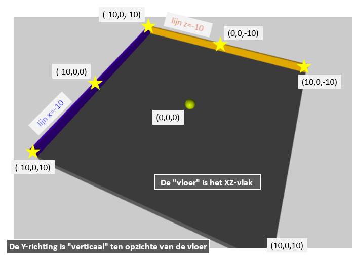

# Buitenaards Python

| Naam         | Beschrijving                                                   |
|--------------|----------------------------------------------------------------|
| Onderwerp    | Objecten en 3D modellen                                        |
| Bestandsnaam | `wk11ex1.py`                                                   |
| Inleveren    | Lever jouw bestand met de juiste bestandsnaam in op GradeScope |

In deze opgave ga je een variant van Python verkennen, die VPython of Glowscript VPython heet, die:

* Object-georiënteerd is (alles is georganiseerd met objecten en klassen),
* Web-gebaseerd is (alles wordt uitgevoerd op een publieke website), en
* Grafisch is (je gaat 3D-modellen bouwen en hun gedrag programmeren)

Het doel van dit practicum is de module VPython te verkennen om een 3D-interactie te begrijpen, en uit te breiden. Als je het leuk vindt om met VPython te werken kan je ook overwegen om het [project](/projects/vpython.md) over VPython te doen in de komende weken. In dit project maak je een spel of interactie naar je eigen ontwerp.

## Documentatie

Hieronder hebben we een aantal handige links verzameld:

* https://www.glowscript.org/: De startpagina waar je inlogt en je programma's kan vinden
* https://www.glowscript.org/docs/VPythonDocs/index.html: Documentatie voor alle objecten, scenes en andere functionaliteiten van VPython en GlowScript.
* https://www.glowscript.org/#/user/GlowScriptDemos/folder/Examples/: Voorbeelden (de linkertab die standaard geselecteerd is is voor GlowScript-voorbeelden, dus die heb je nodig).

Je kan altijd nog terugkomen naar deze links; we gaan eerst met een voorbeeld beginnen...

## VPython uitvoeren in de browser

Open [Glowscript](https://www.glowscript.org/) in je browser. Je hebt een Google-account nodig om in te loggen. Maak als je bent ingelogd een nieuw programma aan en plak deze code erin:

```python
GlowScript 2.8 VPython
# Je hebt de regel hierboven nodig voor VPython in de browser

# Het meest eenvoudige VPython-programma:
box(color=vector(1.0, 1.0, 1.0))

# Je kan de kleur aan passen: de drie getallen zijn
#   rood, groen, blauw    elk van 0.0 tot en met 1.0

# Voeg daarna een tweede parameter toe:   size=vector(2.0, 1.0, 0.1)
#       De volgorde van deze getallen: lengte, hoogte, diepte

# Daarna een derde parameter:  axis=vector(2, 5, 1)
#       De volgorde van deze drie getallen: x, y, z
```

Je kan het programma nu uitvoeren. Je kan

* De kubus draaien (rechtermuisknop, of Command-klik op een Mac)
* In- en uitzoomen op de kubus (met het scrollwiel of door te slepen met twee vingers)

### De kleur aanpassen

De kleur wordt opgegeven als een "vector"; je kan dit zien aan de constructor `vector(...)`. De volgorde van de drie elementen van de vector is **rood, groen, blauw**, en ieder element is een getal van `0.0` tot en met `1.0`. Probeer eens wat andere kleuren uit!

### De grootte aanpassen

Naast de kleur kan je ook het formaat van de kubus aanpassen. Dit doe je door middel van de parameter `size`; kopieer deze uit het voorbeeld, en plak deze in de aanroep van `box` (er moet wel een komma tussen de twee parameters, zoals gebruikelijk). Dit komt er dan als volgt uit te zien:

```python
box(color=vector(1.0, 1.0, 1.0), size=vector(2.0, 1.0, 0.1))
```

Ook hier zie je dat size een `vector` is; de volgorde hier is **lengte, hoogte, diepte**. Probeer ook het formaat van de kubus aan te passen!

### De richting aanpassen

Je kan ook de richting van de kubus aanpassen, door middel van de parameter `axis`; kopieer deze ook uit het voorbeeld naar de aanroep van `box`. Nu ziet de aanroep er zo uit:

```python
box(color=vector(1.0, 1.0, 1.0), size=vector(2.0, 1.0, 0.1), axis=vector(2.0, 5.0, 1.0))
```

Experimenteer hier ook mee; de volgorde van de parameters van `vector` is **x, y, z**. Door deze richting aan te passen bepaal je ook hoe de lengte van `size` geïnterpreteerd wordt, maar dit kan je eventueel aanpassen met de paramter `up`. Je kan hier meer informatie over vinden op de [naslagpagina voor box()](https://www.glowscript.org/docs/VPythonDocs/box.html).

Hierna gaan je een animatie maken met een beetje physics...

## Een physics-simulatie in VPython

Maak een nieuw programma en plak de volgende (lange!) code erin:

```python
GlowScript 2.8 VPython
#
# physics_starter.py
#
# Een interactie met 3D graphics bouwen met Python
#   Documentatie: https://www.glowscript.org/docs/VPythonDocs/index.html
#   Voorbeelden:  https://www.glowscript.org/#/user/GlowScriptDemos/folder/Examples/
#

scene.bind('keydown', keydown_fun)      # Functie voor toetsaanslagen
scene.bind('click', click_fun)          # Functie voor muiskliks
scene.background = 0.8*vector(1, 1, 1)  # Lichtgrijs (0.8 van 1.0)
scene.width = 640                       # Maak het 3D-scherm groter
scene.height = 480


# +++ Begin van het AANMAKEN van OBJECTEN


# We maken de grond door middel van een box (VPython's rechthoekige vorm)
# https://www.glowscript.org/docs/VPythonDocs/box.html
# Merk op dat we deze keer het object dat door "box" wordt gemaakt opslaan in
# een variabele met de naam "ground".
ground = box(size=vector(20, 1, 20), pos=vector(0, -1, 0), color=.4*vector(1, 1, 1))

# Laat de x- en z-as zien (om inzicht te verkrijgen)
# https://www.glowscript.org/docs/VPythonDocs/label.html
x_axis = arrow(axis=vector(5, 0, 0), color=vector(0, 0, .5))  # donkerblauw
x_axis_label = label(pos=vec(6, 0, 0), text='x', color=vector(0, 0, .5))
# x_axis_text = text(pos=vec(7, 0, 0), text='x', color=vector(0, 0, .5))
z_axis = arrow(axis=vector(0, 0, 5), color=vector(0, .5, 0))  # donkergroen
z_axis_label = label(pos=vec(0, 0, 6), text='z', color=vector(0, .5, 0))

# Maak een bol, die we gaan laten bewegen.
# https://www.glowscript.org/docs/VPythonDocs/sphere.html
# Ook nu slaan we de bol op als "ball" zodat we deze later kunnen aanpassen.
ball = sphere(size=1.0*vector(1, 1, 1), color=vector(0.8, 0.5, 0.0))   # ball is een object van de klasse sphere
ball.vel = vector(4.2, 0, 0)           # Dit is de beginsnelheid
print("snelheid is nu:", ball.vel)     # Afdrukken werkt gewoon


# +++ Eind van het AANMAKEN van OBJECTEN


# +++ Begin van de ANIMATIE

# Andere constanten
RATE = 30                 # Het aantal keer dat de while-lus per seconde wordt uitgevoerd
dt = 1.0/RATE             # De tijdstap per keer dat de while-lus wordt uitgevoerd
scene.autoscale = False   # Voorkomen dat het beeld automatisch wordt aangepast
scene.forward = vector(0, -3, -2)  # De scene vanuit de lucht wordt bekeken...
origin = vector(0, 0, 0)  # Het is handig om een naam te hebben voor de oorsprong

# Dit is de "event loop" ("gebeurtenissenlus") of "animatielus"
# Elke keer dat deze lus uitgevoerd wordt beweegt alles één tijdstap van dt seconden
#
while True:

    rate(RATE)   # Maximaal aantal keer per seconden dat de while-lus uitgevoerd wordt

    # +++ Begin van het UITVOEREN van de PHYSICS -- werk alle posities elke tijdstap bij


    ball.pos = ball.pos + ball.vel*dt      # verplaatsing = snelheid*tijd


    # +++ Eind van het UITVOEREN van de PHYSICS -- zorg dat alle objecten goed zijn bijgewerkt!


    # +++ Begin van BOTSINGEN -- zorg voor botsingen & doe het "goede"


    # Als de bol te ver verplaats is, stel dan een nieuwe positie en willekeurige snelheid in
    if mag(ball.pos - origin) > 10.0:      # mag == lengte van een vector
        ball.pos = vector(0, 0, 0)         # Stel ball.pos (de positie) opnieuw in
        ball.vel = 4.2*vector.random()     # Stel een willekeurige snelheid in
        ball.vel.y = 0.0                   # Zet de y-waarde op nul (geen verticale snelheid)
        print("snelheid is nu:", ball.vel)


    # +++ Einde van BOTSINGEN


# +++ Begin van het AFHANDELEN van EVENTS -- aparte functies voor
#                                          toetsaanslagen and muiskliks...


def keydown_fun(event):
    """This function is called each time a key is pressed."""
    key = event.key
    print("toets ingedrukt:", key)    # Druk af welke toets is ingedrukt...

    if key in 'cC':               # Kies een nieuwe kleur voor de bol...
        ball.color = randcolor()  # Zo kan je je eigen functie aanroepen...

    elif key in 'rR':             # Stel de snelheid can de bol opnieuw in...
        ball.pos = vector(0, 0, 0)         # Stel ball.pos (de positie) opnieuw in
        ball.vel = 4.2*vector.random()     # Stel een willekeurige snelheid in
        ball.vel.y = 0.0                   # Zet de y-waarde op nul (geen verticale snelheid)
        print("snelheid is nu:", ball.vel)


def click_fun(event):
    """This function is called each time the mouse is clicked."""
    print("event is", event.event, event.which)


# +++ Einde van het AFHANDELEN van EVENTS


# +++ Andere functies kan je hier neerzetten...


def randcolor():
    """Returns a vector of (r, g, b), randomly selected from 0.0 to 1.0."""
    r = random(0.0, 1.0)    # Dit is een anders dan random.uniform van Python
    g = random(0.0, 1.0)    # Maar maar een klein beetje...
    b = random(0.0, 1.0)
    return vector(r, g, b)  # Een kleur is een tuple met drie elementen
    # Zie het volgende voorbeeld van implementaties van choice en randint
```

Probeer maar!

Kijk dan of je kan vinden waar de verschillende functionaliteiten terugkomen in de code. Lees de broncode, waar je\ een aantal zaken kan zien:

* Een paar algemene variabelen voor de scene en de achtergrond (gebaseerd op `scene`).
* Twee objecten, `ground` en `ball`, van respectievelijke de klassen `box` en `sphere`.
* Een paar variabelen om met de animatie te helpen.
* De animatielus of "event loop" met `while True`.
* Wat physics (posities bijwerken en controles op botsingen)
* Twee functies die events afhandelen: één voor toetsaanslagen, één voor muiskliks.
    * Probeer wat toetsen in het 3D-scherm om te zien wat er afgedrukt wordt...
* Eén extra functie (die een willekeurige kleur genereert).

!!! danger "Event loop"
    Je programma mag maar één event loop, een lus met `while True`, hebben. Als je probeert om een andere `while True` binnen de eerste te zetten, zal je programma "vast" komen te zitten in de binnenste lus en dus niet goed werken (de gebeurtenissen en graphics in de buitenste lus worden niet bijgewerkt).

Maak nu onderstaande aanpassingen aan de code en probeer ze uit, zodat je de code beter snapt
en weet hoe elk gedeelte van dit programma werkt:

### De achtergrondkleur en schermgrootte aanpassen

Pas de waarde van `scene.background` aan om de achtergrondkleur te veranderen, en de waarde van `scene.width` en `scene.height` aan om de schermgrootte aan te passen. Probeer ze alledrie!

:::{admonition} Handigheidje
:class: tip
De expressie `0.42 * vector(1, 1, 1)` is een snelle manier om `vector(0.42, 0.42, 0.42)`, oftewel donker grijs, te krijgen...
:::

:::{admonition} Python-fouten
:class: danger
Frustrerend genoeg negeert de browser-Python fouten soms gewoon; dan is het debuggen een stuk lastiger! Test daarom één verandering per keer, en test het vaak!
:::

### De klasse van het bewegende object veranderen

Verander de *klasse* van het bewegende object van `sphere` naar `box`; pas de naam van het object niet aan! Hierdoor blijft de rest van de code gewoon werken. Probeer ook vooral de kleur, beginpositie, beginsnelheid, richting, grootte etc. aan te passen!

:::{admonition} Andere vormen
:class: tip
Probeer twee of meer andere vormen! De documentatie van Glowscript bevat een [overzicht van de vormen](https://www.glowscript.org/docs/VPythonDocs/primitives.html). In het linkerdropdownmenu op deze pagina kan je een vorm kiezen, en je krijgt dan de details van die vorm, oftwel *klasse* te zien...
:::

### Verander het universum! (Of in ieder geval de *natuurwetten*...)

Pas de instellingen voorafgaand aan de animatielus ("event loop") nu nog even **niet** aan! Je ziet dat hier een aantal instellingen zijn:

* `RATE` is het aantal frames per second dat getoond wordt (de browser gaat dit in ieder geval proberen te halen).
* `scene.autoscale = False` betekent dat je handmatig moet zoomen (`True` zoomt automatisch, maar dit is eerder vervelend dan handig).
* `scene.forward` is de vector met de richting van de camera; die staat voor nu wel goed.
* `origin` is een handig punt, dus die hebben we een naam gegeven (dit is optioneel, maar kan handig zijn).

Voeg **wel** wrijving toe, **na** de regel die de verplaatsing bepaalt met `ball.pos = ball.pos + ball.vel * dt`.
Hiervoor moet je een extra tegel toevoegen die de vector `ball.vel` aanpast:

```python
ball.vel = ball.vel * 0.98
```

Bekijk wat er gebeurt: je hebt nu wrijving in de wereld geprogrammeerd! Je kan de wrijving ook *omkeren*, dat wil zeggen, zorgen dat de bal juist steeds sneller beweegt:

```python
ball.vel = ball.vel * 1.05
```

Je hebt de complete vrijheid om je natuurwetten zo in te richten als je wilt! Je mag de wrijving laten staan of weghalen voor de volgende opgaves, hoe je maar wilt.

### Botsingen en interacties maken

We gaan nu de code die botsingen berekent bekijken en veranderen. Je ziet in de eerste plaats de functie `mag`; deze functie berekent de lengte (*magnitude*) van een vector aan de hand van de stelling van Pythagoras (dit heet ook wel "Euclidische afstand"). We berekenen met `mag(ball.pos - origin)` dus de totale ***afstand*** van `ball.pos` naar `origin`. Kijk eens wat er gebeurt als je het getal waarmee vergeleken wordt van `10.0` in `20.0` verandert!

Probeer nu de positie waarop de bal wordt teruggezet te veranderen, en de snelheid waarmee de bal wordt teruggezet groter te maken. Kijk ook eens wat er gebeurt als je de regel `ball.vel.y = 0.0` in commentaar zet; *spacy*!

### De event handlers aanpassen

Lees eerst de onderste drie functies. Je ziet nu bijvoorbeeld dat `keydown_fun` de variabele `ball` gebruikt *maar dat die niet wordt meegegeven aan de functie*! We noemen `ball` ook wel een **globale** variabele, wat betekent dat deze automatisch beschikbaar is in alle functies die gedefinieerd zijn nadat de variabele gedefinieerd is.

Probeer ook eens te veranderen wat er afgedrukt wordt in `keydown_fun`; je ziet dat je hier volledige controle hebt. Je kan bijvoorbeeld proberen het `print`-statement zo aan te passen dat je kan *zien* wat de r-, g- en b-waardes van de nieuwe kleur zijn.

De andere twee functies zijn op zich goed, maar als je andere dingen wilt proberen kan dat natuurlijk... Vergeet dan niet vaak te testen!

Ok, je hebt nu een idee van hoe VPython physics en interacties tussen objecten ondersteund en kunt hier aan sleutelen...

Je gaat hierna een eigen interactie (of spel...) maken. Laten we eerst echter beginnen met een wat uitgebreider beginpunt in het volgende deel...

## Een eigen spel in VPython

Maak weer een nieuw programma en plak de volgende (opnieuw lange) code erin:

```python
GlowScript 2.8 VPython
#
# game_starter.py
#
# Een interactie met 3D graphics bouwen met Python
#   Documentatie: https://www.glowscript.org/docs/VPythonDocs/index.html
#   Voorbeelden:  https://www.glowscript.org/#/user/GlowScriptDemos/folder/Examples/
#

scene.bind('keydown', keydown_fun)        # Functie voor toetsaanslagen
scene.bind('click', click_fun)            # Functie voor muiskliks
scene.background = 0.8 * vector(1, 1, 1)  # Lichtgrijs (0.8 van 1.0)
scene.width = 640                         # Maak het 3D-scherm groter
scene.height = 480


# +++ Begin van het AANMAKEN van OBJECTEN
# Deze functies maken "container"-objecten, ofwel "compounds"


def make_alien(starting_position, starting_vel=vector(0, 0, 0)):
    """The lines below make a new "frame", which is a container with a
       local coordinate system.
       The arguments to make_alien allow for any initial starting position
       and initial starting velocity, with a default starting velocity
       of vector(0, 0, 0).

       Compounds can have any number of components.  Here are the
       alien's components:
    """
    alien_body = sphere(size=1.0 * vector(1, 1, 1), pos=vector(0, 0, 0), color=color.green)
    alien_eye1 = sphere(size=0.3 * vector(1, 1, 1), pos=.42 * vector(.7, .5, .2), color=color.white)
    alien_eye2 = sphere(size=0.3 * vector(1, 1, 1), pos=.42 * vector(.2, .5, .7), color=color.white)
    alien_hat = cylinder(pos=0.42 * vector(0, .9, -.2), axis=vector(.02, .2, -.02), size=vector(0.2, 0.7, 0.7), color=color.magenta)
    alien_objects = [alien_body, alien_eye1, alien_eye2, alien_hat]  # maak een lijst die we "aan elkaar plakken" met een compound
    # we gaan nu een compound maken -- we noemen hem com_alien:
    com_alien = compound(alien_objects, pos=starting_position)
    com_alien.vel = starting_vel   # stel de beginsnelheid in
    return com_alien


# We maken de grond door middel van een box (VPython's rechthoekige vorm)
# https://www.glowscript.org/docs/VPythonDocs/box.html
ground = box(size=vector(20, 1, 20), pos=vector(0, -1, 0), color=.4*vector(1, 1, 1))

# We maken twee muren, ook met een box
wall_a = box(pos=vector(0, 0, -10), axis=vector(1, 0, 0), size=vector(20, 1, .2), color=vector(1.0, 0.7, 0.3))  # geel
wall_b = box(pos=vector(-10, 0, 0), axis=vector(0, 0, 1), size=vector(20, 1, .2), color=color.blue)   # blauw

# Een bal die we kunnen besturen
ball = sphere(size=1.0*vector(1, 1, 1), color=vector(0.8, 0.5, 0.0))   # ball is een object van de klasse sphere
ball.vel = vector(0, 0, 0)     # dit is de beginsnelheid

# We maken twee aliens met twee aanroepen naar de functie make_alien (hierboven)
alien = make_alien(starting_position=vector(6, 0, -6), starting_vel=vector(0, 0, -1))
alien2 = make_alien(starting_position=vector(-10, 5, -10))  # geen startsnelheid


# +++ Eind van het AANMAKEN van OBJECTEN


# +++ Begin van de ANIMATIE

# Andere constanten
RATE = 30                # Het aantal keer dat de while-lus per seconde wordt uitgevoerd
dt = 1.0/RATE            # De tijdstap per keer dat de while-lus wordt uitgevoerd
scene.autoscale = False  # Voorkomen dat het beeld automatisch wordt aangepast
scene.forward = vector(0, -3, -2)  # De scene vanuit de lucht wordt bekeken...

# Dit is de "event loop" ("gebeurtenissenlus") of "animatielus"
# Elke keer dat deze lus uitgevoerd wordt beweegt alles één tijdstap van dt seconden
#
while True:

    rate(RATE)   # Maximaal aantal keer per seconden dat de while-lus uitgevoerd wordt

    # +++ Begin van het UITVOEREN van de PHYSICS -- werk alle posities elke tijdstap bij

    alien.pos = alien.pos + alien.vel*dt   # Werk de positie van de alien bij
    ball.pos = ball.pos + ball.vel*dt      # Werk de positie van de bal bij

    # +++ Eind van het UITVOEREN van de PHYSICS -- zorg dat alle objecten goed zijn bijgewerkt!


    # +++ Begin van BOTSINGEN -- zorg voor botsingen & doe het "goede"

    # Als de bal wall_a raakt
    if ball.pos.z < wall_a.pos.z:  # Geraakt -- vergelijk de z-positie
        ball.pos.z = wall_a.pos.z  # Zorg dat de bal binnen de grenzen blijft
        ball.vel.z *= -1.0        # Draai de z-snelheid om

    # Als de ball wall_b raakt
    if ball.pos.x < wall_b.pos.x:  # Geraakt -- vergelijk de x-positie
        ball.pos.x = wall_b.pos.x  # Zorg dat de bal binnen de grenzen blijft
        ball.vel.x *= -1.0        # Draai de x-snelheid om


    # Geef de alien verticale snelheid als de bal de alien raakt
    if mag(ball.pos - alien.pos) < 1.0:
        print("Op naar de sterren, en daar voorbij!")
        alien.color = color.gray(.8)
        alien.vel = vector(0, 1, 0)

    # Als de alien te ver loopt, stel deze dan willekeurige opnieuw in -- maar alleen
    # als deze niet verticaal beweegt.
    if mag(alien.pos) > 10 and alien.vel.y < 1:
        alien.pos.x = choice([-6, 6])
        alien.pos.z = choice([-6, 6])
        alien.vel = 2*vector.random()  # Willekeurige vector uit de module
        alien.vel.y = 0.0              # Geen verticale snelheid

    # +++ Einde van BOTSINGEN


# +++ Begin van het AFHANDELEN van EVENTS -- aparte functies voor
#                                          toetsaanslagen and muiskliks...


def keydown_fun(event):
    """This function is called each time a key is pressed."""
    ball.color = randcolor()
    key = event.key
    ri = randint(0, 10)
    print("toets:", key, ri)  # Drukt de ingedrukte toets af

    amt = 0.42              # Hoeveel de snelheid per toetsaanslag wordt aangepast
    if key == 'up' or key in 'wWiI':
        ball.vel = ball.vel + vector(0, 0, -amt)
    elif key == 'left' or key in 'aAjJ':
        ball.vel = ball.vel + vector(-amt, 0, 0)
    elif key == 'down' or key in 'sSkK':
        ball.vel = ball.vel + vector(0, 0, amt)
    elif key == 'right' or key in "dDlL":
        ball.vel = ball.vel + vector(amt, 0, 0)
    elif key in ' rR':
        ball.vel = vector(0, 0, 0)  # Opnieuw beginne! via de spatiebalk, " "
        ball.pos = vector(0, 0, 0)


def click_fun(event):
    """This function is called each time the mouse is clicked."""
    print("event is", event.event, event.which)


# +++ Einde van het AFHANDELEN van EVENTS


# +++ Andere functies kan je hier neerzetten...


def choice(L):
    """Implements Python's choice using the random() function."""
    length = len(L)              # Haal de lengte op
    random_index = int(length * random())  # Kies een willekeurige index
    return L[random_index]       # Geef dat element terug


def randint(low, hi):
    """Implements Python's randint using the random() function.
       returns an int from low to hi _inclusive_ (so, it's not 100% Pythonic)
    """
    if hi < low:
        low, hi = hi, low                   # Draai ze om als ze verkeerd om staan!
    length = int(hi) - int(low) + 1.        # Bereken het verschil en voeg 1 toe
    rand_value = length * random() + int(low)  # Kies een willekeurige waarde
    return int(rand_value)                  # Geef het integergedeelte terug


def randcolor():
    """Returns a vector of (r, g, b) random from 0.0 to 1.0."""
    r = random(0.0, 1.0)
    g = random(0.0, 1.0)
    b = random(0.0, 1.0)
    return vector(r, g, b)  # Een kleur is een tuple met drie elementen
```

Dit is een behoorlijk lang stuk code! Laten we de code stukje voor stukje bekijken en aanpassen, zodat je kan zien hoe het werkt en hoe je het kan gebruiken.

Probeer het eerst uit, en probeer een gevoel te krijgen voor hoe de gebruikte coördinaten werken:



### Probeer het spel uit

We slaan eerst de bovenste instellingen van `scene` en de functie `make_alien` over... Hier komen we later op terug. Scroll door naar de regels waar deze objecten gemaakt worden:

* `ground` en `ball`, zoals eerder
* `wall_a` en `wall_b` zijn nieuwe objecten, allebei zijn ze een box, met aparte kleuren (geel en blauw)
* `alien` en `alien2` zijn nieuwe objecten die *samengesteld* zijn uit andere objecten; tof! We bespreken samenvoegen later...

Probeer het spel nu uit: gebruik de pijltjestoetsen (of `ijkl` of `wasd`) om de `ball` snelheid te geven. Je ziet dat de computer de `alien` bestuurt, maar jij kan de `ball` besturen. Het doel van het spel is de alien met de bal te raken; als dat lukt, stijgt de alien op en drukt een bericht af...

Meer is er nog niet! *Ja, dit spel heeft nog wat werk nodig!!* Laten we dus maar beginnen...

### Maak je eigen muren en botsingen

Probeer eerst uit te zoeken hoe de code die de muren maakt werkt. Maak dan twee extra muren om de "tafel" of "arena" af te maken; gebruik hier duidelijke kleuren voor!

Lees daarna de code die de botsingen met de muren regelt, en zoek uit hoe deze werkt. Je ziet dat de positie van de bal *aangepast* wordt zodat deze niet langer "achter de muur" is na een botsing. Als je dat niet zou doen, kan de bal "vast komen te zitten" in de muur... Voeg vervolgens code toe voor botsingen met de twee *nieuwe* muren.

Probeer het spel weer uit! Het spel speelt zich nu grotendeels vanzelf: de bal kan rondstuiteren door de arena en komt uiteindelijk de alien tegen...

:::{admonition} Ongedaan maken?
:class: tip
Je zult merken dat er in de editor van Glowscript geen functie voor "ongedaan maken" is; kopieer daarom regelmatig het hele programma naar een bestand op je computer (met je teksteditor, bijvoorbeeld VSCode). Het is belangrijk om een werkende versie te hebben waar je op kan terugvallen; dit is bovendien hoe je straks je programma gaat inleveren!
:::

### Een hulpfunctie voor botsingen met de arena

De code voor botsingen met de muren van de arena is nu nog specifiek voor het object `ball`. We gaan hier nu een aparte hulpfunctie voor maken, zodat deze code door **alle** bewegende objecten gebruikt kan worden.

:::{admonition} Don't repeat yourself
:class: tip
"Don't repeat yourself" is een programmeursmantra; het wordt ook wel het *DRY*-principe genoemd. Goede programmeurs zijn een beetje lui: ze willen liever niet dezelfde code herhalen, dus maken ze er een hulpfunctie voor!
:::

Je ziet dat de code die deze botsingen nu regelt de variabele `ball` gebruikt om te kijken of de muren geraakt zijn; we gaan daar een *argument* van de functie van maken! Je kan dit doen door de code voor de botsingen met de arena (dit zijn vermoedelijk vier `if`-statements) te verplaatsen naar het gedeelte met "andere functies" onderaan het bestand. Voeg daarna een functie-signature met docstring toe boven deze regels:

```python
def arena_collide(ball):
    """Arena collisions!
       Ball must have a .vel field and a .pos field.
    """
```

Voeg nu een aanroep `arena_collide(ball)` toe waar je de originele regels hebt weggeknipt, zodat de code die je verplaatst hebt nog wel op de goede plek wordt aangeroepen. Je kan nu ook de regel `arena_collide(alien)` toevoegen; probeer dit eens! Hiervoor is het wel nodig dat je het stuk code dat de alien verplaatst ***weghaalt of in commentaar zet***. Dit begint met dit commentaar: `# Als de alien te ver loopt, stel deze dan willekeurige opnieuw in`. Zowel de alien als de bal moeten nu rondstuiteren... yay!

## Bedenk zelf een interactie of spel!

Je hebt nu een scala aan 3D objecten die je allemaal kan onderwerpen aan physics, botsingen en toetsaanslagen... De rest van de opdracht is om een aantal aanpassingen te maken aan de startcode om je eigen spel of interactie te maken. Wat het spel doet en hoe het eruit ziet mag je helemaal zelf bedenken; maar je moet ten minste ***TWEE*** van de onderstaande opties toevoegen (of meer; je kan VPython als [project](../project/vpool.md) kiezen, als je dat wilt):

* Voeg één of meer extra niet-bewegende objecten toe aan het "speelveld" (bomen, ruimteschepen, bedenk het maar...).
* Maak ten minste één nieuw object dat *uit zichzelf beweegt* (meer aliens; of andere dingen?!).
* Voeg een extra interactie toe tussen de nieuwe objecten en het door de gebruiker bestuurde object (botsen of stuiteren, bijvoorbeeld).
* Breid het bestaande `compound`-object (hiermee behandel je meerdere objecten als één object) uit of voeg een nieuwe toe (zie hieronder).
* Verander het door de gebruiker bestuurde object (of voeg een extra bestuurbaar object toe, met een manier om tussen de objecten te wisselen...). Dit kan lastig zijn, maar wel leuk!

Vergeet niet regelmatig te testen, en zo vaak als je kan verdragen het hele programma naar een bestand op je computer te kopiëren!

### Compound-objecten

Je kan in VPython samengestelde of `compound`-objecten bouwen; als je wilt proberen deze zelf te bouwen of een bestaande uit te breiden, kijk dan naar de functie `make_alien` bovenaan het bestand. Deze functie maakt een aantal onderdelen *in hun eigen coördinatensysteem*.

Eerst maakt ze maakt een lijst met deze onderdelen en roept dan `com_alien = compound(alien_objects, pos=starting_position)` aan. Dit maak een object aan met de naam `com_alien`, die van de klasse (of type) `compound` is, en plakt vervoplgens alle onderdelen aan elkaar vast en geeft ze een **gedeeld bestaan**; ze kunnen niet langer los van elkaar verplaatst worden, maar *het geheel* kan wel verplaatst worden.

Probeer eens je eigen karakter te maken; het kan een variatie op de alien zijn (een derde oog, misschien? of nog meer detail...), maar ook iets compleet anders...

:::{admonition} Beginpositie
:class: notice
Merk op dat door de vector `starting_position` mee te geven, deze enkele functie zoveel verschillende samengestelde objecten kan maken als je maar wilt. Deze techniek wordt gedemonstreerd door de twee aliens in het oorspronkelijke programma...
:::

### Andere handige functies

[Deze pagina bevat een aantal functies die je misschien wilt gebruiken, proberen of aanpassen...](../support/vpython.md). Hij bevat nu:

* Een functie `wall_collide(wall, object)` voor muren onder elke hoek in het *xz*-vlak. De y-componenten worden genegeerd, maar je zou de functie kunnen aanpassen om hier ook rekening mee te houden als je wilt.

Als je andere handige functies gemaakt hebt, laat het ons weten, dan voegen we ze toe!

## Inleveren

Gefeliciteerd! Je hebt de 3D-interactie (of spel) van dit practicum gemaakt. Kopieer nu alle code van je spel of interactie naar een tekstbestand en sla het op je computer op als `wk11ex1.py`. Je kan zelf voor de zekerheid ook kopieën bewaren met andere namen (het kan leuk zijn om kopieën van verschillende versies te bewaren...). Maak daarna **twee respresentatieve screenshots** van je interactie of spel, en lever alle drie de bestanden samen in in Gradescope.

Cool! Als je VPython en GlowScript leuk vond is het goed om te weten dat één van de mogelijke projecten [het bouwen van een uitgebreidere interactie](/projects/vpython.md) (of spel) is ...