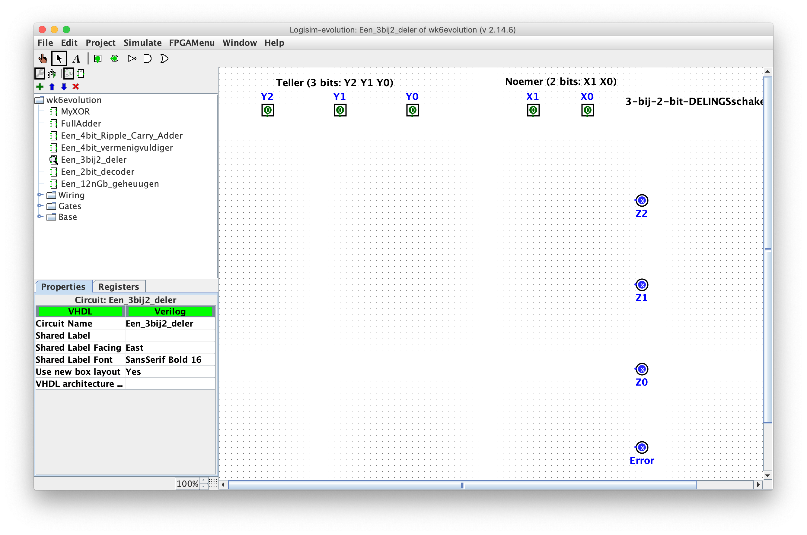

# Een eerlijke verdeling

| Naam         | Beschrijving                                                                                          |
|--------------|-------------------------------------------------------------------------------------------------------|
| Onderwerp    | Delen met schakelingen                                                                                |
| Bestandsnaam | `wk6ex1-4.circ`                                                                                       |
| Inleveren    | Lever jouw bestand met de juiste bestandsnaam in op GradeScope                                        |
| Opmerking    | Dit is hetzelfde bestand dat je hebt gebruikt bij het [practicum](/problems/optellingen_schakelen.md) |

Net als bij de vorige opgaves moet deze opgave uitgevoerd worden in het bestand `wk6ex1-4.circ`, specifiek in de deelschakeling "Een_3bij2_deler".

## Je delingsschakeling opzetten

Gebruik hiervoor de invoer- en uitvoerpins die al beschikbaar zijn in de deelschakeling *Een_3bij2_deler* in `wk6ex1-4.circ`.

De invoer van het circuit is als volgt:

*   **Het deeltal** kan een integer van 0 tot en met 7 zijn en moet daarom bestaan uit drie invoerbits, genaamd `Y2 Y1 Y0`, waarbij `Y2` de meest significante bit is en `Y0` de minst significante.
*   **De deler** kan een integer van 0 tot en met 3 zijn en moet daarom bestaan uit twee invoerbits, genaamd `X1 X0`, waarbij `X1` de meest significante bit is en `X0` de minst significante.
*   **Het quotiënt** bestaat uit vier bits:
    * Er zijn drie uitvoerbits die het quotiënt voorstellen, genaamd `Z2 Z1 Z0`, waarbij `Z2` de meest significante bit is en `Z0` de minst significante.
    * Er is ook één ***error***-bit, genaamd `error`. Deze bit moet nul zijn al het quotiënt geldig is, en één als het ongeldig is; dit gebeurt dan en slechts dan als de waarde van de deler 0 is.

Hier is een screenshot van de schakeling "Een_3bij2_deler" in Logisim:

## Integerdeling...

Het staat je vrij deze schakeling aan te pakken met het minterm-expansieprincipe of een andere combinatie van technieken naar eigen keuze. Hieronder staan wat tips met aanvullende ideeën.

Onthoud dat je schakeling een *integerdeling* berekend, dit heeft de volgende consequenties:

*   Het ***error***-bit moet aan zijn dan en slechts dan als de waarde van de deler nul is. Als de errorbit aan is maakt het niet uit of de andere bits in het quotiënt aan of uit zijn.
*   Het quotiënt moet *omlaag afronden* en een eventuele rest negeren. Bijvoorbeeld geldt dat
    -   *7 gedeeld door 2 is 3*,
    -   *7 gedeeld door 3 is 2*,
    -   *5 gedeeld door 2 is 2*,
    -   *5 gedeeld door 3 is 1*, en zo verder..

### Idee 1: simpele minterm-expansie

Dit wordt wel een vrij uitgebreide minterm-expansie...

In deze strategie gebruik je een groot aantal AND-poorten, één voor elke `1` in de waarheidstabel van de delingsschakeling (zoals besproken op het college). Je kan een AND-poort hebben voor elke `1` of een AND-poort voor elke rij met een `1` (en die dan hergebruiken...).

Hiermee implementeer je de volledige waarheidstabel via het standaard minterm-expansieprincipe, wat de naam is voor "één AND-poort per `1`."

*   Als je dit doet, moet je één OR-poort gebruiken voor elk uitvoerbit (om alle manieren waarop dat bit aan zou kunnen zijn samen te "OR"-en).
*   Het aardige aan Logisim is dat je *het aantal invoerdraden van de OR-poorten kan aanpassen*!
*   Om dit te doen, moet je een OR-poort toevoegen aan het canvas.
*   In het eigenschappenscherm linksonder moet je dan op zoek naar de eigenschap *number of inputs*.
*   Je kan hier een groot aantal invoerdraden kiezen.

### Idee 2: bouw een deelschakeling voor elke waarde van de deler

Als alternatief kan je het probleem opdelen in kleinere delen door elk geval te beschouwen:

*   (*deler is 0*): delen door 0 geeft een fout...
*   (*deler is 1*): bij elk deeltal gedeeld door 1 wordt dat deeltal rechtstreeks doorgezet naar de uitvoer (het quotiënt).
*   (*deler is 2*): delen door 2 is hetzelfde als het deeltal "één naar rechts" te verschuiven op zijn weg naar het quotiënt.
*   (*deler is 3*): en delen door 3 is gewoon lastig...

Elk van deze vier delen zou een deelschakeling kunnen zijn, die los gebouwd en getest is. (Waarbij we nog kunnen opmerken dat een deelschakeling maken voor delen door 0 wat overbodig is.)

Om de deelschakelingen te bouwen, raden we het volgende aan:

*   Maak eerst elk van deze schakelingen als nieuwe schakeling.
*   Kopieer de vijf invoerpins en (in ieder geval) de uitvoerpins Z2, Z1 en Z0 vanuit de oorspronkelijke delingsschakeling.
*   Plak deze vijf invoerpins en de gekozen uitvoerpins in elke deelschakeling.
*   Verbind ze met elkaar om de onderdelen van de deling te implementeren.
*   Zorg dat elke subschakeling allemaal nullen als uitvoer heeft als hij niet actief is (omdat de deler een andere waarde heeft).
*   Deze laatste eigenschap is wat **AND**-poorten doen!
    -   Als voorbeeld is de uitvoer Z0 van de schakeling voor delen door één de AND van (NOT X1), (X0) en (Y0).
    -   De uitvoer Z1 van dezelfde schakeling is de AND van (NOT X1), (X0) en (Y1).
    -   De uitvoer Z2 van dezelfde schakeling is de AND van (NOT X1), (X0) en (Y2).
    -   Je kan de andere schakelingen op dezelfde manier aanpakken, *mits je de waardes correct aanpast!*

### De onderdelen samenvoegen

De laatste vraag is hoe je de vier deelschakelingen ***gecombineerd*** kunnen worden om de correcte uitvoerbits te geven!

Het antwoord is dat je OR moet nemen van de uitvoer (Z2, Z1, Z0) van de vier deelschakelingen. De uitkomsten van deze OR's moeten dan aangesloten worden op de uitvoerpins van de hoofdschakeling.
* Dit werkt *alleen maar* als de uitvoer van de deelschakelingen allemaal nullen is als de deler *anders* is dan degene die de betreffende schakeling moet behandelen.

Veel succes met de deling!