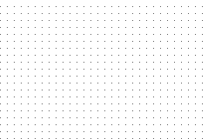
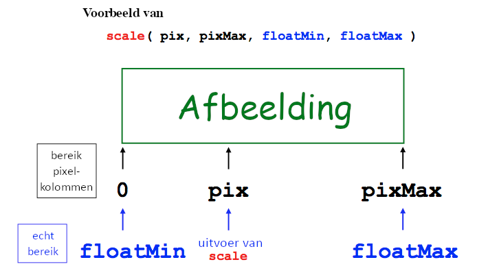
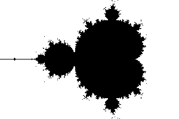

# Mandelbrot

| Naam         | Beschrijving                                                   |
|--------------|----------------------------------------------------------------|
| Onderwerp    | De mandelbrotset en afbeeldingen                               |
| Bestandsnaam | `wk8ex1.py`                                                    |
| Inleveren    | Lever jouw bestand met de juiste bestandsnaam in op GradeScope |


Tijdens dit practicum ga je een programma schrijven om de punten in en rond de mandelbrotverzameling weer te geven en te verkennen. Hierbij ga je:

* Lussen en geneste lussen te gebruiken om *complexe* problemen op te lossen (vrij letterlijk!)
* Een programma te ontwikkelen door middel van een *incrementeel ontwerp*, dat wil zeggen, je begint met een simpele taak en voegt steeds meer complexiteit toe
* Een idee te krijgen van wiskunde en andere vakgebieden die fractaal modelleren toepassen

## Inleiding op `for`-lussen

Omdat je afbeeldingen gaat maken in dit practicum heb je wat extra code nodig om mee te beginnen; download [wk8ex1.zip](https://github.com/hanze-hbo-ict/programmeren/raw/master/problems/assets/wk8ex1.zip) en pak het uit.

Om wat inzicht in lussen te krijgen, schrijf je eerst twee korte functies in `wk8ex1.py`:

### De functie `mult`

Schrijf een functie genaamd `mult(c, n)` die het product `c` keer `n` teruggeeft, maar zonder gebruik te maken van vermenigvuldigen. In plaats daarvan moet de functie een waarde (genaamd `result`) eerst op 0 zetten en daarna herhaaldelijk de waarde van `c` *optellen* bij `result`. Ze moet een `for`-lus gebruiken om te zorgen dat `c` het goede aantal keer wordt opgeteld. Nadat de lus klaar is, moet de functie het resultaat teruggeven.

De waarde van `n` is een positieve integer. Om je te helpen is hier een deel van de functie dat de waarde van `result` op 0 zet en de lus bevat:

```python
def mult(c, n):
    """Mult uses only a loop and addition
       to multiply c by the positive integer n
    """
    result = 0
    for i in range(n):
        ...  # pas de waarde van result aan in deze lus

assert mult(3, 5) == 15
```

Hier zijn een paar testgevallen:

```ipython
In [1]: mult(6, 7)
Out[1]: 42

In [2]: mult(1.5, 28)
Out[2]: 42.0
```

### De functie `update`

De volgende functie bevat de basisstap van de mandelbrotverzameling, namelijk `z = z ** 2 + c` voor een gegeven constante `c`.

Schrijf hiervoor een functie genaamd `update(c, n)` waar je een nieuwe waarde `z` op 0 laat beginnen en dan herhaaldelijk de waarde van `z` bijwerkt met behulp van de toekenning `z = z ** 2 + c`; laat dit `n` keer herhaald worden. Aan het eind moet de functie de laatste waarde van `z` teruggeven. De waarde van `n` is een positieve integer. Hieronder zie je de signature en de docstring:

```python
def update(c, n):
    """Update starts with z = 0 and runs z = z**2 + c
       for a total of n times. It returns the final z.
    """
```

Hier zijn een paar testgevallen:

```ipython
In [1]: update(1, 3)
Out[1]: 5

In [2]: update(-1, 3)
Out[2]: -1

In [3]: update(1, 10)
Out[3]: 3791862310265926082868235028027893277370233152247388584761734150717768254410341175325352026

In [4]: update(-1, 10)
Out[4]: 0
```

Je gaat de ideeën achter deze functies (door middel van een variant van de functie `update`) hierna gebruiken
bij het bouwen van de mandelbrotverzameling.

## Inleiding op de mandelbrotverzameling

[What's so special about the Mandelbrot Set?](https://www.youtube.com/watch?v=FFftmWSzgmk) geeft een goede, eerste inleiding in  mandelbrotverzameling.

De *mandelbrotverzameling* is een verzameling punten op het complexe vlak die een interessante eigenschap delen die het makkelijkst is uit te leggen aan de hand van het volgende proces:

* Kies een complex getal *c*.
* Met deze *c* in het achterhoofd, start met *z*<sub>0</sub> = 0.
* Herhaal dan de volgende berekening:
* *z*<sub>*n*+1</sub> = *z<sub>n</sub>*<sup>2</sup> + *c*

:::{admonition} Complexe getallen
:class: notice

Je weet misschien dat het met normale getallen niet mogelijk is om de wortel van een negatief getal te nemen. Dit is voor wiskundigen een onwenselijke situatie, dus hebben ze een stelsel getallen bedacht waarbij dit wel kan. We noemen deze getallen "complexe getallen". Waar je de normale getallen op een getallenlijn kan zetten, kan je de complexe getallen op een getallen*vlak* zetten, met een *x*- en een *y*-as. Elk complex getal kan je dus aangeven als een combinatie van een *x*- en een *y*-coördinaat. De *x*-waarde noemen we **reëel** en de *y*-waarde **imaginair**, en je schrijft dit als *c* = *x* + *iy*; *i* is de eenheid van imaginaire getallen, en is het antwoord op de vraag wat de wortel van -1 is.

Je kan je afvragen of dit nog nut buiten de wiskunde heeft; en het antwoord hierop is ja: het blijkt dat bij de berekeneningen over sommige natuurkundige processen je tijdens de berekening imaginaire getallen krijgt, maar als je dat dan allemaal netjes doorrekent, je toch weer op "echte" getallen uitkomt, die bovendien blijken te kloppen met wat we in de werkelijkheid zien.
:::

De mandelbrotverzameling is de verzameling van alle complexe getallen *c* waarvoor geldt dat dit proces **niet** *divergeert* naar oneindigheid naar mate *n* groter wordt. In andere woorden, voor een gegeven *c*, als *z<sub>n</sub>* divergeert naar oneindigheid (dat wil zeggen, als je *z<sub>n</sub>* onbeperkt groot kan maken door *n* steeds groter te kiezen), dan hoort *c* *niet* in de verzameling; anders wel.

Je zou kunnen denken dat dit voor alle waardes van *c* zo is, maar dat blijkt niet zo te zijn: in sommige gevallen blijft de waarde bijvoorbeeld rond een bepaald punt cirkelen, of komt het getal juist steeds dichter bij 0.

Er zijn andere, equivalente definities van de mandelbrotverzameling. De mandelbrotverzameling bestaat bij voorbeeld precies uit die punten in het complexe vlak waarvoor de bijbehorende *Juliaverzameling* verbonden is. Toegegeven, dit zou vereisen dat we definiëren wat Juliaverzamelingen zijn, wat we hier niet zullen doen...

De mandelbrotverzameling is een *fractal*, wat betekent dat zijn grens zo complex is dat deze niet goed benaderd kan worden door ééndimensionale lijnstukken, ongeacht hoe ver je inzoomt. Er zijn [veel beschikbare referenties](https://nl.wikipedia.org/wiki/Mandelbrotverzameling).

## De functie `in_mset`

De volgende taak is om een functie genaamd `in_mset(c, n)` te schrijven die als argumenten een complex getal `c` en een integer `n` heeft.

Deze functie geeft een boolean terug:

* `True` als het complexe getal `c` onderdeel is van de mandelbrotverzameling en
* `False` als dat niet zo is.

Eerst introduceren we de ingebouwde ondersteuning voor complexe getallen in Python.

### Python en complexe getallen

In Python wordt een complex getal gerepresenteerd door middel van zijn reële deel `x` en zijn imaginaire deel `y`. De wiskundige notatie hiervoor zou *x* + *yi* zijn, maar in Python wordt de imaginaire eenheid weergegeven als `1.0j` of `1j`, zodat

```python
c = x + y*1j
```

aan de variabele `c` het complexe getal met reeël deel `x` en imaginair deel `y` zou toekennen.

Helaas werkt `x + yj` niet, omdat Python dan denkt dat je een variabele *met de naam* `yj` probeert te gebruiken.

Ook de waarde `1 + j` is geen complex getal: Python gaat ervan uit dat je een variabele `j` bedoelt als er geen getal meteen voor staat. Gebruik in plaats hiervan `1 + 1j`.

Je hoef zelf verder niet te weten wat bijvoorbeeld de rekenregels voor vermenigvuldigen, optellen en machtsverheffen zijn met complexe getallen, Python zorgt er wel voor dat ze goed gebruikt worden!

:::{admonition} *i* of *j*?
:class: notice

Wiskundigen gebruiken *i*; elektrotechnici gebruiken *j* omdat in de elektrotechniek *i* gebruikt wordt voor elektrische stroom. Python gebruikt deze laatste conventie, wat een bron van *oneidinge* verwarring kan zijn!
:::

Probeer zelf even te oefenen met complexe getallen, bijvoorbeeld op de Python-prompt:

```ipython
In [1]: c = 3 + 4j

In [2]: c
Out[2]: (3+4j)

In [3]: abs(c)
Out[3]: 5.0

In [4]: c**2
Out[4]: (-7+24j)
```

Python gebruikt zonder problemen de machtsverheffingsoperator (`**`) en andere operatoren op complexe getallen. Merk echter op dat je complexe getallen niet zonder meer kan vergelijken; het zijn 2D-punten, dus er bestaat niet zoiets als "groter dan"! Je kan dus niet `c > 2` schrijven voor een complexe `c` (dit geeft een `TypeError`).

Je kan echter **wel** de magnitude, of lengte (tussen de oorsprong van het complexe vlak en het punt *c*), vergelijken: `abs(c) > 2`. We kunnen blijkbaar de ingebouwde functie `abs` gebruiken om de magnitude van een complex getal te bepalen.

:::{admonition} Absolute waarde
:class: notice

Eerder hebben we `abs` gebruikt om te zorgen dat een getal altijd positief is: `abs(-5)` wordt 5, maar `abs(5)` is ook 5. Dit is consistent met deze nieuwe definitie: immers, de lengte op de getallen lijn tussen 0 en 5 is 5, maar de lengte tussen 0 en -5 is dat ook!
:::

### `in_mset` ontwerpen

Om te bepalen of een getal `c` wel of geen onderdeel van de mandelbrotverzameling is, moet je

* Beginnen met *z*<sub>0</sub> = 0 + 0*j* en dan
* de berekening *z*<sub>*n*+1</sub> = *z<sub>n</sub>*<sup>2</sup> + *c* blijven herhalen

om te zien of de reeks *z*<sub>0</sub>, *z*<sub>1</sub>, *z*<sub>2</sub>, enz. begrensd blijft.

Anders gezegd, we moeten weten of de magnitude van deze waardes *z<sub>k</sub>* oneindig groot worden.

Echt bepalen of deze reeks oneindig groot wordt is niet mogelijk. Om een redelijke gok te maken, moeten we twee keuzes maken:

* Het aantal keer dat we bereid zijn *z*<sub>*n*+1</sub> = *z<sub>n</sub>*<sup>2</sup> + *c* te berekenen
* Een waarde die we als "oneindig" beschouwen

We gaan de berekening `n` keer uitvoeren. De `n` is het tweede argument van de functie `in_mset(c, n)`. Met deze waarde kan je experimenteren, maar 25 is een goed startpunt.

De waarde voor oneindig kan verrassend laag zijn! Het is bewezen dat als de absolute waarde van een complex getal *z* ooit groter dan `2` wordt tijdens de herhaalde berekening, we *met zekerheid* kunnen zeggen dat de reeks naar oneindig divergeert.

Er is geen gelijksoortige regel die ons vertelt dat de reeks met zekerheid *niet* divergeert, maar het is *heel waarschijnlijk* dat ze begrendsd is als `abs(z)` niet groter dan 2 wordt na een redelijk aantal iteraties, en `n` is dat "redelijke" nummer, beginnend bij 25.

### `in_mset` schrijven

Je kan het beste je functie `update` **kopiëren** en de naam veranderen in `in_mset`. Roep de functie `update` **niet** direct aan in `in_mset`, en laat de oude functie `update` in je bestand staan!

Om je op weg te helpen is hier de signature en een docstring voor `in_mset`:

```python
def in_mset(c, n):
    """in_mset accepts

    c for the update step of z = z**2+c
    n, the maximum number of times to run that step

    Then, it returns

    False as soon as abs(z) gets larger than 2
    True if abs(z) never gets larger than 2 (for n iterations)
    """
```

De functie `in_mset` moet `False` teruggeven als de reeks *z*<sub>*n*+1</sub> = *z<sub>n</sub>*<sup>2</sup> + *c* ooit een waarde *z* opgeeft waarvan de magnitude groter is dan 2. Anders geeft de functie `True` terug.

Merk op dat je ***geen*** verschillende variabelen nodig hebt voor *z*<sub>0</sub>, *z*<sub>1</sub>, *z*<sub>2</sub>, en zo verder. Je gebruikt in plaats daarvan een enkele variabele `z`. Je kan `z` bijwerken in een lus, net als in `update`.

:::{admonition} `True` of `False`?
:class: tip

Zorg ervoor dat je `return False` ergens *in* je lus hebt staan. Je weet echter pas zeker dat het antword `True` is **nadat** de lus al haar iteraties heeft uitgevoerd, dus dan kan je pas `return True` doen!
:::

Controleer de functie `in_mset` aan de hand van de volgende voorbeelden:

```ipython
In [1]: c = 0 + 0j         # deze is onderdeel van de verzameling

In [2]: in_mset(c, 25)
Out[2]: True

In [3]: c = 3 + 4j        # deze is GEEN onderdeel van de verzameling
# WAARSCHUWING: deze kan Python laten hangen of crashen
# BEHALVE als je functie False terug geeft *meteen wanneer* de magnitude groter dan 2 is
# dat betekent dat je False moet teruggeven _in_ de lus (in de if of else, wat van toepassing is)!

In [4]: in_mset(c, 25)
False

In [5]: c = 0.3 + -0.5j    # deze is ook onderdeel van de verzameling

In [6]: in_mset(c, 25)
Out[6]: True

In [7]: c = -0.7 + 0.3j    # deze is GEEN onderdeel van de verzameling

In [8]: in_mset(c, 25)
Out[8]: False


In [9]: c = 0.42 + 0.2j

In [10]: in_mset(c, 25)      # deze _lijkt_ onderdeel van de verzameling te zijn
Out[10]: True

In [11]: in_mset(c, 50)      # maar bij 50 pogingen blijkt dat niet zo te zijn!
Out[11]: False
```

:::{admonition} Krijg je teveel `True`s?
:class: tip

Als dat zo is, kan het zijn dat je `abs(z) > 2` pas controleert nadat de `for`-lus klaar is. Zorg dat je *in* de lus controleert!

Er is een subtiele reden dat je in de lus moet controleren:

Veel waardes worden zo snel zo groot dat ze de grenzen van floating-point getallen in Python overschrijden. Als dat gebeurt, *dan werken de groter-dan- en kleiner-dan-vergelijkingen niet meer*, en de test zal falen. De oplossing is om ***in*** de lus te controleren of de magnitude van `z` ooit groter wordt dan 2, en in dat geval meteen `False` terug te geven.
:::

## Afbeeldingen maken met Python

### Een begin maken

Probeer om te beginnen deze code:

```python
from png import *   # Je hebt deze regel misschien al bovenaan je bestand...


def we_want_this_pixel(col, row):
    """This function returns True if we want to show
       the pixel at col, row and False otherwise.
    """
    if col % 10 == 0 and row % 10 == 0:
        return True
    else:
        return False


def test():
    """This function demonstrates how
       to create and save a PNG image.
    """
    width = 300
    height = 200
    image = PNGImage(width, height)

    # maak een lus om wat pixels te tekenen

    for col in range(width):
        for row in range(height):
            if we_want_this_pixel(col, row):
                image.plot_point(col, row)

    # we hebben door alle pixels gelust; nu schrijven we het bestand

    image.save_file()
```

Sla deze code op en voer het uit door `test()`, met haakjes, in te typen in de Pythonshell.

:::{admonition} `ModuleNotFoundError`
:class: warning

Als je een `ModuleNotFoundError` krijgt, betekent dit dat de Python-module `pillow` niet geïnstalleerd is. Als je Anaconda Python gebruikt zou deze al geïnstalleerd moeten zijn, maar mogelijk heb je nog een Python-installatie op je systeem. Je kan dat `conda activate base` proberen om Anaconda te activeren. Als je geen Anaconda Python hebt, moet je `pillow` zelf installeren met het commando `pip install pillow`.
:::

Als alles goed gaat zal `test()` de geneste lussen uitvoeren en een bericht afdrukken dat het bestand `test.png` aangemaakt is. Dat bestand zou moeten verschijnen in dezelfde directory als het bestand `wk8ex1.py`.

Zowel Windows- en Mac-computers hebben goede ingebouwde ondersteuning om PNG-bestanden te bekijken; `png` is een afkorting voor *portable network graphics*. Voor de meeste mensen zal het dubbelklikken op het icoon van `test.png` deze afbeelding weergeven. Je kan er ook nog voor kiezen het in een browser te openen.

In ieder geval zou voor de bovenstaande functie de afbeelding helemaal wit moeten zijn, met uitzondering van een regelmatig puntenveld, waarvan de rij- en kolomnummers beide een veelvoud van 10 waren:



Je kan afbeeldingen ook in- en uitzoomen met de menu-opties of snelkoppelingen.

### Een gedachtenexperiment over afbeeldingen

Schrijf, voordat je bovenstaande code aanpast, **een kort commentaar** onder de functie `test` in je bestand `wk8ex1.py` dat beschrijft hoe de afbeelding zal veranderen als je de regel

```python
if col % 10 == 0 and row % 10 == 0:
```

**verandert naar**

```python
if col % 10 == 0 or row % 10 == 0:
```

Maak daarna de verandering van `and` naar `or` en probeer deze uit. Op zowel Macs als PC's hoeft de afbeelding niet opnieuw te worden geopend: als je het vorige afbeeldingsvenster open laat staan wordt de afbeelding automatisch ververst.

Om te oefenen kan je proberen om andere patronen in je afbeelding te maken door de functies `test` en `we_want_this_pixel` op de bijpassende manier aan te passen.

### Een paar opmerkingen over hoe de functie `test` werkt...

Er zijn drie regels in de functie `test` waar we nader naar kijken:

* `image = PNGImage(width, height)` Deze regel code maakt een variabele van het type `PNGImage` met de gegeven hoogte en breedte. De variabele `image` bevat *de hele afbeelding*! Dit lijkt op de manier waarop een enkele variabele, vaak met de naam `L`, een onbeperkt grote lijst kan bevatten. Als informatie samengenomen wordt in een lijst of andere structuur noemen we dit een *software-object* of gewoon *object*.

  We zullen over een paar weken onze eigen objecten gaan ontwerpen; in dit practicum gebruiken we ze zonder te hoeven bedenken hoe we ze uit het niets kunnen maken.

* `image.plot_point(col, row)` Een belangrijke eigenschap van *objecten* is dat ze hun eigen functies meenemen en kunnen aanroepen! Dit doen ze middels de puntoperator `.`. Hier roept het object `image` zijn eigen functie `plot_point` aan om een pixel op de gegeven kolom en rij te tekenen. Functies die op deze manier worden aangeroepen worden ook wel `methodes` genoemd.

* `image.save_file()` Deze regel maakt een nieuw bestand `test.png` aan die de PNG-afbeelding bevat. Dit is een andere *methode* (d.w.z., functie) van het software-object genaamd `image`.

## Van pixelcoördinaten naar complexe coördinaten

### Het probleem

Uitendelijk moeten de mandelbrotverzameling tekenen in het complexe vlak. Als we echter punten in de afbeelding tekenen, moeten we *pixels* in hun eigen coördinatensysteem manipuleren.

Zoals het voorbeeld `test_image()` laat zien, beginnen pixelcoördinaten bij (0, 0) (in de linkeronderhoek) en lopen ze tot (breedte - 1, hoogte - 1) in de rechterbovenhoek. In het voorbeeld hierboven was `width` 300 en `height` 200, zodat we een vrij kleine afbeelding krijgen die snel gegenereerd wordt.

De mandelbrotverzameling bestaat echter in het gebied
```
-2.0 ≤ x (de reële coördinaat) ≤ +1.0
-1.0 ≤ y (de imaginaire coördinaat) ≤ +1.0
```
Dit vormt dus een rechthoek van 3.0 bij 2.0.

We moeten dus de integerwaarde `col` van elke pixel omzetten naar een floating-pointwaarde `x`. Bovendien moeten we de integerwaarde `row` van elke pixel omzetten naar een floating-pointwaarde `y`.

### De oplossing

Eén functie, genaamd `scale`, zal gebruikt worden om coördinaten in het algemeen om te zetten.

Je moet dus deze functie `scale` schrijven:

```python
def scale(pix, pix_max, float_min, float_max)
    ...
```

die als volgt gebruikt kan worden:

```ipython
In [1]: scale(150, 200, -1.0, 1.0)
```

De argumenten betekenen hier het volgende:

* Het eerste argument is de huidige pixelwaarde: we zijn bij rij 150 of kolom 150
* Het tweede argument is de maximum mogelijke pixelwaarde: pixels lopen in dit geval van 0 tot 200
* Het derde argument is de minimale floating-pointwaarde. *Dit is wat de functie zal teruggeven als het eerste argument gelijk is aan* `0`.
* Het vierde argument is de maximale floating-pointwaarde. *Dit is wat de functie zal teruggeven als het eerste argument gelijk is aan* `pix_max`.

De ***returnwaarde*** ten slotte moet de floating-pointwaarde zijn die overeenkomt met de integerwaarde van de pixel in het eerste argument.

De returnwaarde zal altijd ergens van `float_min` tot en met `float_max` liggen.

!!! warning "Deze functie gebruikt geen lus!"
    Het is in feite slechts wat rekenwerk. Je moet jezelf bedenken

    * Hoe je de waarde `pix / pix_max` kan gebruiken
    * Hoe je de waarde `float_max - float_min` kan gebruiken

!!! tip "Dit hebben we al gedaan bij Programmeren I!"
    Je hebt een vrijwel dezelfde functie (`interp`) geschreven in het vorige blok, tijdens het practicum van week 3.

### Een begin van de functie `scale`

Om deze omzetting tussen pixelcoördinaten en complexe coördinaten te berekenen schrijf je een functie
die als volgt begint:

```python
def scale(pix, pix_max, float_min, float_max):
    """scale accepts

    pix, the CURRENT pixel column (or row)
    pix_max, the total # of pixel columns
    float_min, the min floating-point value
    float_max, the max floating-point value
    scale returns the floating-point value
        that corresponds to pix
    """
```

De docstring beschrijft de argumenten:

* `pix`, een integer die de pixelkolom bevat
* `pix_max`, het totaal aantal beschikbare pixelkolommen
* `float_min`, de ondergrens van de afbeelding als floating-pointgetal
* `float_max`, de bovengrens van de afbeelding als floating-pointgetal

Merk op dat er geen `pix_min` is omdat de pixels altijd bij 0 beginnen.

Nogmaals, het idee is dat `scale` de floating-pointwaarde tussen `float_min` en `float_max` teruggeeft die
overeenkomt met de positie van de pixel `pix`, die ergens tussen `0` en `pix_max` valt. Dit diagram illustreert hoe
dit er concreet uitziet:



Als je je functie `scale` geschreven hebt, kan je deze testgevallen gebruiken om te kijken of hij werkt:

```ipython
In [1]: scale(100, 200, -2.0, 1.0)  # halverwege tussen -2 en 1 is -0.5
Out[1]: -0.5

In [2]: scale(100, 200, -1.5, 1.5)  # halverwege tussen -1.5 en 1.5 is 0.0
Out[2]: 0.0

In [3]: scale(100, 300, -2.0, 1.0)  # een derde van -2 naar 1 is -1.0
Out[3]: -1.0

In [4]: scale(25, 300, -2.0, 1.0)   # een twaalfde van -2 naar 1 is -1.75
Out[4]: -1.75

In [5]: scale(299, 300, -2.0, 1.0)  # de precieze uitkomst kan een beetje verschillen...
Out[5]: 0.99
```

:::{admonition} Opmerking
:class: notice

We hebben `scale` beschreven in termen van het berekenen van floating-pointwaardes voor de x-coördinaat (de reële as), maar de functie `scale` werkt ook voor de y-dimensie. Je hebt geen aparte functie nodig voor de verticale as!
:::

## De mandelbrotverzameling weergeven in zwart-wit: `mset`

In dit gedeelte ga je de onderdelen uit de bovenstaande paragrafen samenvoegen in een functie met de naam `mset()` die de verzameling punten op het complexe vlak die onderdeel zijn van de mandelbrotverzameling berekent en er een bitmapafbeelding van maakt, met als formaat `width` bij `height`.

### x- en y-bereik

Om ons te richten op het interessante gedeelte van het complexe vlak, begrenzen we de bereiken van `x` en `y` tot

```
-2.0 ≤ x- of reële coördinaat ≤ +1.0
-1.0  y- of imaginaire coördinaat ≤ +1.0
```
Dit vormt een rechthoek van 3.0 bij 2.0.

Begin door de code uit de functie `test` te kopiëren en te hernoemen naar `mset`:

```python
def mset():
    """Creates a 300x200 image of the Mandelbrot set
    """
    width = 300
    height = 200
    image = PNGImage(width, height)

    # maak een lus om wat pixels te tekenen

    for col in range(width):
        for row in range(height):
            # Gebruik scale twee keer:
            #   één keer om het reële deel van c te bepalen (x)
            x = scale(..., ..., ..., ...)
            #   één keer om het imaginaire deel van c te bepalen (y)
            y = scale(..., ..., ..., ...)
            # DAARNA ken je c toe, kies je n en test je:
            c = x + y*1j
            n = 25
            if in_mset(c, n):
                image.plot_point(col, row)

    # we hebben door alle pixels gelust; nu schrijven we het bestand
    image.save_file()
```

Om de mandelbrotverzameling te maken, moet je een aantal onderdelen van deze functie aanpassen. Begin met waar het commentaar voorstelt om `scale` twee keer te gebruiken:

* Voor elke pixel `col` moet je de *reële (x-) coördinaat* van die pixel in het complexe vlak berekenen. Gebruik de variabele `x` om deze *x*-coördinaat op te slaan, en gebruik de functie `scale` om hem te vinden!
* Voor elke pixel `row` moet je de *imaginaire (y-) coördinaat* van die pixel in het complexe vlak berekenen. Gebruik de variabele `y` om deze *y*-coördinaat op te slaan, en gebruik opnieuw de functie `scale` om hem te vinden! Ondanks dat dit het imaginaire *deel* van een complex getal gaat worden, is het simpelweg een gewone floating-pointwaarde.
* Gebruik de reële en imaginaire delen die je in de vorige twee stappen berekend hebt om een variabele `c` te maken die een ***complexe*** waarde bevat met respectievelijke dat reële (`x`) en imaginaire (`y`) deel. Onthoud dat je de vermenigvuldiging `y * 1j` moet gebruiken, niet `y * j`!
* Ten slotte zal de test voor welke pixelwaardes `col` en `row` punten getekend moeten worden de functie `in_mset` gebruiken, die je eerder geschreven hebt. Je moet een waarde voor het argument `n` van deze functie `in_mset` kiezen. Je kan bijvoorbeeld beginnen met `25`.

Nadat je de functie geschreven hebt, kan je

```ipython
In [1]:  mset()
```

proberen en controleren of de afbeelding die je krijgt een zwart-witte versie van de
mandelbrotverzameling is, bijvoorbeeld zoals deze afbeelding:



## `mset` uitbreiden

### Kleuren veranderen...

Je hoeft niet alleen zwart en wit te gebruiken!

De methode `image.plot_point` kan een optioneel derde argument meekrijgen die de *kleur* van het punt dat je wil tekenen bevat. Hier is een voorbeeld:

```python
image.plot_point(col, row, (0, 0, 255))
```

Het derde argument is hier een lijst die *ronde haakjes* gebruikt in plaats van vierkante haken. Lijsten tussen haakjes worden in Python *tuples* genoemd. Tuples kunnen sneller benaderd worden dan lijsten, maar hun elementen kunnen niet vervangen worden, dus ze worden vaak gebruikt voor constanten zoals kleuren.

De drie elementen van de kleurtuple hierboven zijn *rood*, gevolgd door *groen*, gevolgd door *blauw*: elk van die drie kleurcomponenten moet een integer zijn van 0 tot en met 255. De tuple hierboven, `(0, 0, 255)`, is dus puur blauw.

Om de *achtergrond* van de verzameling te veranderen, voeg je de regels

```python
else:
    image.plot_point(col, row, (0, 0, 0))
```

toe aan de lussen die lopen over de waardes voor `col` en `row`. Dit maakt alle punten die *geen* onderdeel zijn van de mandelbrotverzameing expliciet zwart.

Probeer het zelf, misschien door eerst je mandelbrotverzameling te veranderen naar oranje `(255, 175, 0)` op een zwarte achtegrond `(0, 0, 0)`.


Pas daarna de kleuren naar je eigen smaak aan!

Je kan de afbeelding ook gerust vergroten; het zal langer duren om de afbeelding te maken, maar je kan meer detail zien in het resultaat!

### Geen magische constanten!

*Magische constanten* zijn gewoon letterlijke getalswaarden die je in je code geschreven hebt. Ze worden *magisch* genoemd omdat als iemand je code probeert te lezen, de waarde en het nut ervan uit een hoge hoed getrokken lijkt te zijn. Je functie `mset` roept bijvoorbeeld misschien `in_mset(c, 25)` aan (dat deed die van ons wel). Iemand die je code (en deze opgave) niet eerder gezien heeft heeft geen idee waar die `25` voor staat en waarom je die gekozen hebt.

Om je code zo flexibel en uitbreidbaar mogelijk te houden, is het een goed idee om het gebruik van deze "magische constanten" te voorkomen voor belangrijke waardes op verschillende plekken in je functies. Het is beter om alle magische constanten te verzamelen aan het begin van de functie (na de docstring) en ze handige namen te geven om hun doel te laten zien. Het is gebruikelijk, maar niet verplicht, om hoofdletters te gebruiken voor deze waardes. Je code kan bijvoorbeeld onderstaande regel bevatten:

```python
NUM_ITER = 25  # aantal updates
```

waar `NUM_ITER` het aantal iteraties is die gebruikt wordt in de functie `in_mset`. De aanroep zou er dan als volgt uitzien:

```python
in_mset(c, NUM_ITER)
```

Niet alleen is dit overzichtelijker, het is bovendien *veel* makkelijker om functionaliteit toe te voegen of te wijzigen in je code: alle belangrijke getallen zijn **één keer** en op **één plaats** gedefinieerd.

In dit deel van het practicum moet je **al je magische constanten naar het begin van de functie verplaatsen en ze beschrijvende namen geven**. Deze vijf regels zijn bijvoorbeed een goed begin:

```python
NUM_ITER = 25  # aantal updates, zie hierboven
XMIN = -2.0   # de kleinste waarde voor de reële coördinaat
XMAX = 1.0    # de grootste waarde voor de reële coördinaat
YMIN = -1.0   # de kleinste waarde voor de imaginaire coördinaat
YMAX = 1.0    # de grootste waarde voor de imaginaire coördinaat
```

Deze variabelen kunnen dan op één plaats aangepast worden om het "venster" op de mandelbrotverzameling dat getekend wordt te veranderen.

In het volgende deel zal je deze waardes aanpassen om in te zoomen op de mandelbrotverzameling.

### Inzoomen!

In dit deel kun je gewoon je functie `mset` uitvoeren met wat andere waardes voor `XMAX`, `XMIN`, `YMAX` en `YMIN` om afbeeldingen te maken van verschillende delen van de mandelbrotverzameling.

Je kan bijvoorbeeld deze waardes proberen:

```python
NUM_ITER = 25
XMIN = -1.3
XMAX = -1.0
YMIN = .1
YMAX = .3
```

Probeer daarna dit bereik opnieuw, maar nu met `NUM_ITER = 50`; je zal zien dat de verzameling minder punten bevat omdat er meer tijd is om te ontsnappen!

Een ander interessant bereik is dat van de "oneindige sneeuwpoppen":

```python
NUM_ITER = 25
XMIN = -1.2
XMAX = -.6
YMIN = -.5
YMAX = -.1
```

:::{admonition} Zeepaardjes?!?
:class: notice

Kijk ook eens of je andere waardes kan vinden die een interessant deel van de verzameling tonen; en benoem ze in commentaar in je bestand `wk8ex1.py`. Als richtlijn kun je de suggesties proberen op [deze pagina over de "Vallei der Zeepaarden"](http://mrob.com/pub/muency/seahorsevalley.html)
:::

Merk op dat de *aspectratio* van de afbeelding 3:2 (horizontaal:vertikaal) is; als je deze aspectratio aanhoudt, dan wordt de verzameling op een natuurlijke manier geschaald.

Het werkt wel met andere verhoudingen, maar om natuurlijke schaling te behouden zou je dan ook de hoogte en breedte van de afbeelding op de juiste manier moeten aanpassen. Of je kan de hoogte en breedte *berekenen*, maar dat is niet verplicht voor dit practicum.

### Inleveren

Je hebt nu dit practicum, `wk8ex1.py`, voltooid; vergeet niet dit in te leveren in Gradescope!

## Nog niet genoeg Mandelbrot?

Als je verschillende *ontsnappingssnelheden* wilt visualiseren, de resolutie wilt aanpassen of misschien een andere afbeelding wilt *vermandelbrotten*, kan je in de volgende paragrafen zie hoe je je mandelbrotverzamelingprogramma kan uitbreiden. Ze zijn **volledig** optioneel, maar wel leuk!

### Ontsnappingssnelheden *visualiseren*

Deze uitbreidingen zijn optioneel (maar leuk!); in de eerste kan je zien hoe snel de verschillende punten in en/of rond de mandelbrotverzameling naar oneindig ontsnappen.

Afbeeldingen van fractals gebruiken vaak kleuren om weer te geven *hoe snel* punten naar oneindig divergeren als ze geen onderdeel zijn van de fractal zelf. Maak voor deze opgave een nieuwe versie van `mset` met de naam `mset_color`. Je kan de bestaande code kopiëren en plakken, omdat het gedrag in de basis hetzelfde is. Je gaat echter `mset_color` aanpassen zodat punten die *sneller* naar oneindig ontsnappen in andere kleuren getekend worden.

Laat dus je functie `mset_color` de mandelbrotverzameling tekenen zoals eerst. Gebruik hiernaast echter minimaal drie verschillende kleuren om te tonen hoe snel punten buiten de verzameling divergeren; dit is hun "ontsnappingssnelheid". Deze aanpassing zal ook een aanpassing vereisen aan de hulpfunctie `in_mset`. Het beste is om deze te kopiëren, plakken en hernoemen zodat je de nieuwe versie kan aanpassen zonder de oude te veranderen, zodat ook de code die je voor het practicum moet inleveren nog werkt.

Er zijn meerdere manieren om de "ontsnappingssnelheid" van een bepaald punt te meten. Een mogelijkheid is om te kijken naar de berekende magnitude na de iteratieve updates. Een andere is om het aantal iteraties te tellen die nodig zijn voordat het punt ontsnapt naar een magnitude groter dan 2. Een voordeel van de tweede methode is dat er minder ontsnappingssnelheden zijn om rekening mee te houden.

Kies één van deze methodes, of ontwerp je eigen methode, om `mset_color` te implementeren.

### Een andere afbeelding vermandelbrotten

De PNG-module kan ook afbeeldingen lezen. (Ze is echter niet heel snel in het omzetten ervan naar Pythonlijsten...)

Het resultaat hiervan is dat je de pixels uit een andere afbeelding kan gebruiken om de weergave van de punten die wel (of geen) onderdeel zijn van de mandelbrotverzameling te bepalen, zoals,


Hier is een voorbeeld dat laat zien hoe je een afbeelding kan laden (de afbeelding `alien.png` uit de map `pngs`):

```python
def example():
    """Shows how to access the pixels of an image.

    input_pixels is a list of rows, each of which is a list of columns,
        each of which is a list [r,g,b]
    """

    input_pixels = get_rgb("./pngs/alien.png")
    input_pixels = input_pixels[::-1]  # de rijen zijn omgekeerd

    height = len(input_pixels)
    width = len(input_pixels[0])
    image = PNGImage(width, height)

    for col in range(width):
        for row in range(height):
            if col % 10 < 5 and row % 10 < 5:  # teken maar een deel van de pixels
                image.plot_point(col, row, input_pixels[row][col])

    image.save_file()
```

De code hierboven produceert de volgende afbeelding:


Probeer deze afbeelding, of een andere `png` die je wilt gebruiken, te *vermandelbrotten*...

Als je dit gedaan hebt, en dit kan verbazingwekkend verslavend zijn, ben je klaar met het practicum!
