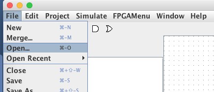
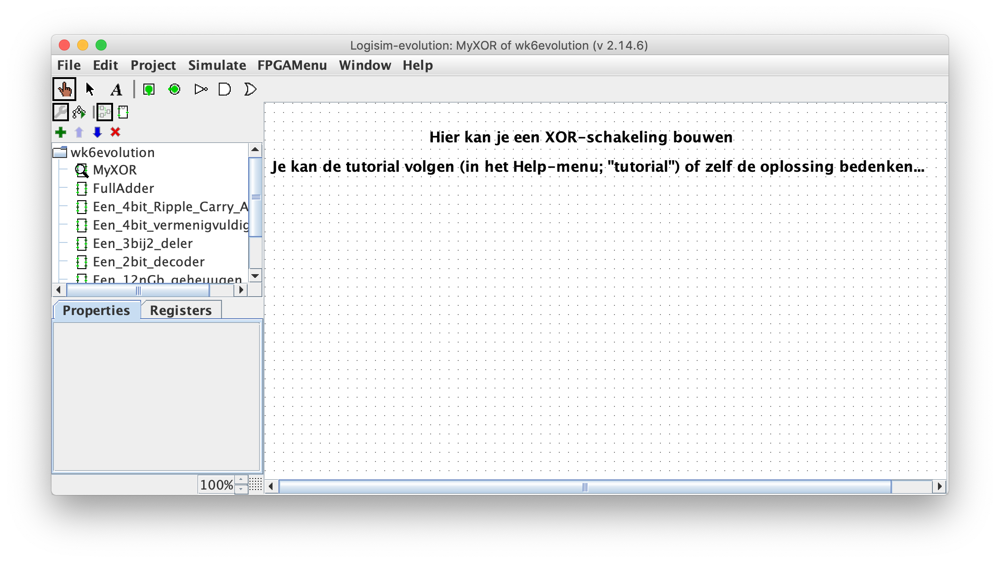
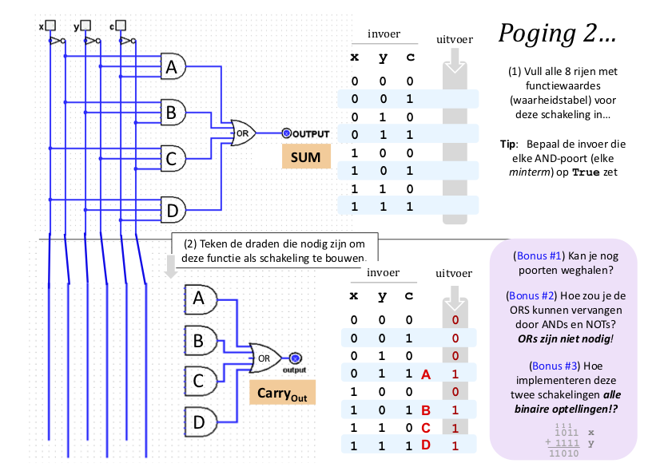
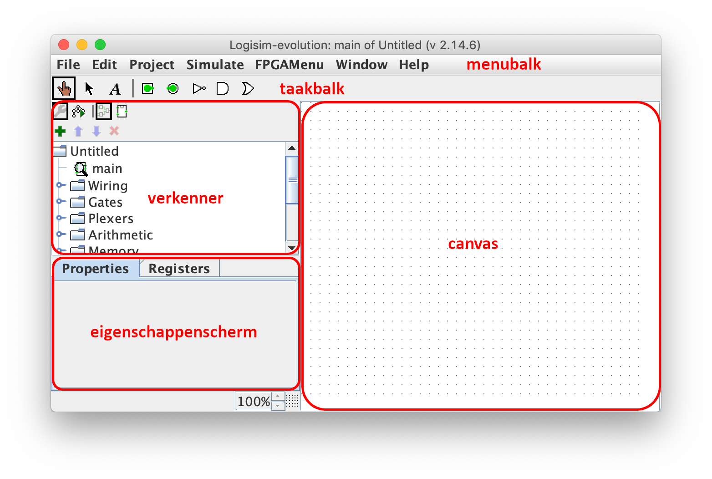

# Optellingen schakelen

<!-- elektrisch schema, een circuitdiagram of schakelschema -->

| Naam         | Beschrijving                                                   |
|--------------|----------------------------------------------------------------|
| Onderwerp    | Schakelingen ontwerpen                                         |
| Bestandsnaam | `wk6ex1-4.circ`                                                |
| Inleveren    | Lever jouw bestand met de juiste bestandsnaam in op GradeScope |

Deze week ga je verschillende logische schakelingen ontwerpen met behulp van *Logisim Evolution*, een programma om schakelingen te ontwerpen.

## Voorbereiding

Download de volgende bestanden:

<!-- https://github.com/reds-heig/logisim-evolution/releases/download/v3.3.1/logisim-evolution-3.3.1.jar -->

-   Het Java-applicatiebestand: [logisim-evolution-3.3.4-all.jar](https://github.com/hanze-hbo-ict/programmeren/raw/master/problems/assets/logisim-evolution-3.3.4-all.jar)
-   Het startbestand (pakt dit uit en gebruik het!): [wk6ex1-4.circ.zip](https://github.com/hanze-hbo-ict/programmeren/raw/master/problems/assets/wk6ex1-4.circ.zip)

### Java

Voor Logisim zal je Java geïnstalleerd moeten hebben. Als je dit nog niet hebt kan je het downloaden van de [Adoptium](https://adoptium.net/temurin/releases/) website:

-   kies versie 11 of hoger voor jouw systeem
-   bij architectuur is x64 een goede keuze (voor nieuwere Macs kies je arm)
-   indien gevraagd, kies bij installatie om `JAVA_HOME` aan het pad toe te voegen!
-   indien gevraagd, *negeer* bij installatie de optie om Oracle licentiesleutels toe te voegen!

### Logisim Evolution starten

Als je Java geïnstalleerd hebt, zou je Logisim Evolution moeten kunnen starten door te dubbelklikken op `logisim-evolution-3.3.4-all.jar` (Windows en macOS). Als dit niet werkt, kan je ook het commando `java -jar logisim-evolution-3.3.4-all.jar` vanuit de Terminal gebruiken. Zorg dan wel dat je in de goede directory staat!

### Permissies op macOS

Als je op een Mac werkt en het klaagt dat je geen toestemming hebt om de applicatie te starten (omdat het van een door Apple erkende ontwikkelaar is), hoef je je geen zorgen te maken. Het klopt dat deze applicatie niet door een "formele" ontwikkelaar gemaakt is, het is een "open source" project, maar is zeker niet schadelijk. Rechts-klik (of met Command (⌘) en klik) op het icoon, en kies **Open**. Je moet nu een optie krijgen om de applicatie te starten.


of


Nog steeds geen toestemming? Je zal dan waarschijnlijk in *Systeemvoorkeuren* onder *Beveiliging en privacy* moeten toestaan dat de applicatie mag worden uitgevoerd.

### Projectbestand

Deze en alle verdere opgaven ga je uitwerken in hetzelfde bestand:

-   *Begin niet met een nieuw bestand!*
-   Gebruik *in plaats daarvan* het bestand `wk6ex1-4.circ` dat je hebt gedownload.

Je kan *niet* op het bestand dubbelklikken om het te openen, in plaats daarvan moet je *Logisim Evolution* starten (zie boven) en *File (of "Dossier"), Open* gebruiken uit het menu van Logisim Evolution:



Vervolgens navigeer je naar het bestand `wk6ex1-4.circ` en open je het:


Zorg ervoor dat links een schakelingenmenu staat dat er als volgt uitziet:



## Schakelingen optellen

### Schakelingen ontwerpen

Nogmaals, het bestand `wk6ex1-4.circ` is de plaats waar je al jouw schakelingen voor deze opdracht schrijft en in bewaart.

*Merk op* dat je in de verkenner van Logisim (het linkerbovendeel van het scherm) iconen met de teksten `MyXOR`, `FullAdder`, `Een_4bit_Ripple_Carry_Adder`, `Een_4bit_vermenigvuldiger`, `Een_3bij2_deler` en mogelijk nog wat meer ziet. Dit zijn de onderdelen ("deelschakelingen") van de opgaven die je gaat maken. In deze opdracht gebruikenwe alleen de eerste *drie* deelschakelingen.

:::{admonition} Schakeling of circuit
:class: notice

We gebruiken de woorden *schakeling* en *circuit* afwisselend, maar bedoelen daar hetzelfde mee, het zijn synoniemen!
:::

## Deel 1: Tutorial en XOR

Nu je `wk6ex1-4.circ` geopend hebt, dubbelklik op het icoon `MyXOR` in het Logisism verkenningsvenster. Voorlopig werk je aan deze deelschakeling. Jouw taak hier is om een circuit te bouwen om de `XOR`-functie te berekenen met alleen `AND`, `OR` en `NOT` poorten.

-   Ga naar het menu "Help" en selecteer "Tutorial". Lees de handleiding tot en met stap 4 door en test jouw schakeling. Maak daarbij de `XOR`-circuit aan die in de tutorial wordt beschreven. Doe dit in het tabblad "MyXOR" van jouw Logisim-bestand. Dit is een vrij korte introductie, en maak je geen zorgen nog niet elk "bit" bij je landt!

-   Je weet nu tenminste wat er in de tutorial staat, zodat je later terug kunt gaan en de details kunt vinden als je ze nodig hebt.

-   Zorg ervoor dat je jouw `XOR`-circuit test door de waarden van de invoer te veranderen met de "poke" tool (het handje linksboven in de menubalk). Controleer of je de juiste uitvoer voor jouw inver krijgt. Sla het bestand op door naar het menu "File" (of "Dossier") te gaan en op "Opslaan" te klikken.

## Deel 2: Full Adder

*Dubbelklik* nu op de deelschakeling `FullAdder` in je bestand `wk6ex1-4.circ`, en je zult nu in de verkenner van het `FullAdder`-circuit moeten zijn. Je zult ook zien dat we de gelabelde in- en uitvoer al hebben toegevoegd. Gebruik deze in- en uitvoer, ze helpen ons bij het beoordelen van de opdracht.

-   De invoer `X` en `Y` zijn de twee bits die moeten worden toegevoegd, en `CarryIn` is de carry van de vorige kolom.

-   Op dezelfde manier zijn de twee uitvoeren al aan de onderkant geplaatst. Je kunt deze verplaatsen als dat nodig is, maar behoud hun onderlinge posities, zodat we de schakeling makkelijker kunnen testen!

-   Merk op dat we de ingangs- en uitgangspennen hebben gedraaid vanuit hun normale standaard oriëntatie. Dit is gedaan door op het item te klikken en de gewenste rotatie te selecteren in het attribuutvenster linksonder in het scherm.

<!-- TODO verwijzing naar FullAdder schema in college -->

Jouw taak is nu om een full adder (FA) te bouwen, een circuit dat je eerder op papier hebt ontworpen. Bedenk dat een volledige adder een apparaat is dat *drie* ingangen nodig heeft:

-   twee bits die opgeteld moeten worden, en de "carry in" van de vorige optellingskolom.

-   De FA berekent dan twee uitvoerwaarden: de "som"-bit, en een "carry out"-bit.

<!-- TODO verwijzing naar HM slide, omzetten -->

De eerste stap is dus het opzoeken van de volledige waarheidstabel van de FA (full adder), bijvoorbeeld met behulp van aantekeningen die je eerder hebt gemaakt. De onderstaande afbeelding heeft het grootste deel ervan:

<!-- TODO gebruik van HM slide, omzetten -->



De volledige adder moet het minterm-expansieprincipe gebruiken om vier `AND`-poorten te maken voor de "sum"-bit en vier `AND`-poorten voor de "carry out" bit. Je hebt (op papier) eerder een volledige adder ontworpen, nu ga je het implementeren zodat je kan controleren of het werkt!

-   Je zult de twee "rails" voor het invoerbit `Y` willen maken en nog twee "rails" voor het invoerbit `CarryIn`

-   Er zullen vier `AND`-poorten zijn waarvan de uitgangen verbonden zijn met één `OR`-poort en vervolgens het uitvoerbit `Sum`.

-   Er zijn vier `AND`-poorten waarvan de uitvoer verbonden wordt met één `OR`-poort en vervolgens het uitvoersbit `CarryOut`.

Elk van de twee uitvoetbits `CarryIn` en `CarryOut` is een op zichzelf staande toepassing van het minterm-expansieprincipe.

-   Probeer de schakeling niet te vereenvoudigen en gebruik geen andere poorten dan `AND`, `OR` en `NOT`. Het doel van dit probleem is om te oefenen met het gebruik van het minterm-expansieprincipe , niet om te optimaliseren!

Zorg ervoor dat je jouw FA grondig test voordat je verder gaat. De FA moet werken, want je zal het gaan gebruiken om de vier-bit ripple-carry adder te bouwen.

## Deel 3: 4-Bit Ripple-Carry Adder

*Dubbelklik* nu op het ripple-carry deelschakeling in jouw `wk6ex1-4.circ` bestand.

Nu je een volledige adder (FA) hebt, ga je een een 4-bit ripple-carry adder bouwen. Bedenk dat dit apparaat twee 4-bits nummers als invoer heeft en deze bij elkaar optelt. Laten we de bits van het eerste getal `X3`, `X2`, `X1` en `X0` noemen, waarbij `X0` het minst significante bit is (het meest rechtse bit) en `X3` het meest significante bit. Op dezelfde manier noemen we de cijfers van het tweede getal `Y3`, `Y2`, `Y1` en `Y0`. We willen het volgende berekenen:

```text
    X3 X2 X1 X0
+   Y3 Y2 Y1 Y0
---------------
```

Let op dat hoewel er slechts 4 bits in elk van de twee getallen zitten, de som 5 bits kan hebben als gevolg van een carry!

Als je dubbelklikt op het "Een 4-bit Ripple-Carry Adder" icoon in de verkenner, kan je full-adders aan jouw 4-bit ripple-carry adder toevoegen met een *enkele* klik op het "Full Adder" icoon in de verkenner (aangezien je de FA al ontworpen hebt).

Dit maakt een "blok" die de FA voorstelt. Immers, nu je de FA hebt ontworpen, wil je niet echt alle details zien elke keer dat je hem gebruikt! Als je met de muis over dit vakje beweegt, kan je zien dat er "FA" staat. Als je met de muis over de "pinnen" (de kleine invoer- en uitvoermarkeringen op het vakje) beweegt, zul je zien wat die pinnen zijn. Dit komt omdat we die pinnen een naam hebben gegeven toen we de FA ontwierpen.

Je kan de in- en uitvoerpins die gegeven zijn verplaatsen, maar behoud de relatieve posities, zodat we ze gemakkelijk kunnen vinden!

:::{admonition} Constanten
:class: tip

Nog een laatste opmerking! Je hebt een 0 als carry-in nodig aan de rechterkant van jouw ripple-carry adder. Een manier om dit te doen is om een extra input toe te voegen en de waarde ervan op 0 te zetten. Dit is niet de beste oplossing, omdat we echt niet willen dat de gebruiker van onze ripple-carry adder deze carry-in waarde kan veranderen. Een betere keuze is om naar het verkenningsvenster te gaan, op de map "Bedrading" te klikken, daar het item "Constant" te kiezen en daar één van toe te voegen aan jouw schakeling. Klik er vervolgens op en je kunt de waarde van die constante in het eigenschappenscherm veranderen. Dit is nu een constante, onveranderlijke waarde die je schakeling kan gebruiken!
:::
<!-- TODO course (niet boek) opgaven hebben verwijzing naar college waar een 4-bit ripple-carry adder zou zijn geschetst: https://www.cs.hmc.edu/twiki/pub/CS5/AdvancedAdditionGold/rca.png -->

## Inleveren

Test je schakeling en vergeet niet hem op te slaan! Als je hem instuurt zonder op te slaan lever je het oorspronkelijke, lege bestand in, in plaats van je uitwerking!

## Schermen of menu's kwijt in Mac OS?

Als je per ongeluk de verkenner of het eigenschappenscherm aan de linkerkant hebt geminimaliseerd:



Het kan lastig zijn om deze terug te krijgen! Een commando (vanaf de command line) dat op de Mac werkt om het terug te
krijgen is:

```text
defaults delete com.cburch.logisim
```

Om de default domeinen te zien kan je onderstaand commando gebruiken.

```text
defaults domains | tr , "\n" | grep -v  com.apple
```

*Soms* kan het ook helpen om de applicatie opnieuw te starten, dan komen ze misschien terug.
