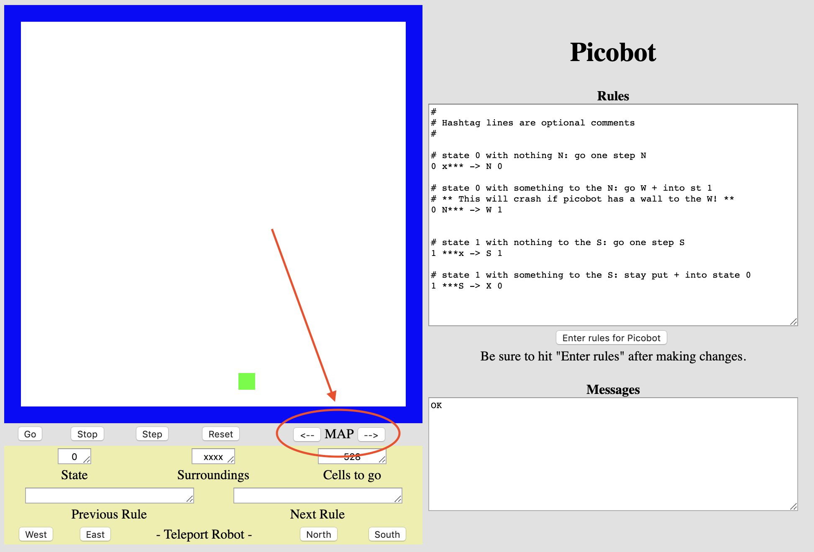

# Dolende Picobot

Heb je Picobot de lege kamer kunnen laten verkennen? Dan is het nu tijd voor andere omgevingen, waaronder een doolhof!

Picobot kan je vinden op [https://www.cs.hmc.edu/picobot/](https://www.cs.hmc.edu/picobot/)

Klik op de pijlen naast MAP om de omgeving van Picobot te veranderen, de eerstvolgende omgeving is een doolhof waar Picobot volledig moet gaan doorlopen.



## De uitdaging

Net als bij de opgave met de lege ruimte is de uitdaging een meest efficiënte oplossing te vinden. Let op, ook hier geldt dat het *geen* probleem is als jouw oplossing meer regels nodig heeft!

De uitdaging is om deze opgave in slechts *8 regels* voor Picobot op te lossen.

## Opdracht


Voor deze opdracht is het jouw taak om een verzameling regels te ontwerpen om Picobot een doolhof te laten doorlopen. Het doolhof is een ruimte waar de breedte van de gangen één vierkant is en *alle* muren aansluiten op de rand van de kamer. Jouw programma zou op deze manier moeten werken voor alle doolhoven zonder volledig ingesloten open ruimtes.

-   Vergeet niet dat jouw oplossing moet werken voor elke mogelijke startpositie van Picobot!
-   Klik op "*Enter rules for Picobot*" voordat je Picobot start

```{tip}
Bedenk dat je kan hier de [Right Hand Rule](https://en.wikipedia.org/wiki/Maze_solving_algorithm) strategie kan gebruiken waar je Picobot de wand steeds aan één kant laat blijven volgen (rechts of links maakt niet uit, zolang je maar consequent blijft). Je zal met het ontwerpen van jouw regels rekening moeten houden met de volgende drie situaties:

-   Picobot bevindt zich in een gang
-   Picobot bevindt zich op een splitsing
-   Picobot bevindt zich op een doodlopend punt

Naast de richtingen `N`, `E`, `W` en `S` is er ook een richting `X` die betekent *blijf staan*. Deze zou je bijvoorbeeld kunnen gebruiken bij een doodlopend punt waar je geen stap neemt en Picobot alleen maar laat overgaan naar een andere staat. Zie ook de verdere [tips en regels](picobot-maze-algorithm) om Picobot door een doolhof te laten lopen!
```

```{attention}
Als je Picobot afsluit zijn al jouw regels verdwenen! Kopieer daarom de regels naar een tekstbestand en sla het op.
```
