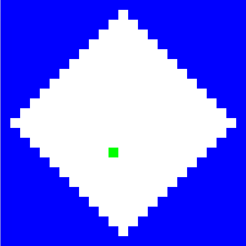

# Briljante Picobot

Picobot kan je vinden op [https://www.cs.hmc.edu/picobot/](https://www.cs.hmc.edu/picobot/)

Klik op de pijlen naast MAP om de omgeving van Picobot te veranderen en kies omgeving waar Picobot een ruit moet gaan doorlopen.



## Opdracht

Ontwerp een verzameling regels om Picobot een ruimte in de vorm van een ruit te laten verkennen (er is *geen* beperking aan het aantal regels).

-   Vergeet niet dat jouw oplossing moet werken voor elke mogelijke startpositie van Picobot!
-   Klik op "*Enter rules for Picobot*" voordat je Picobot start

```{attention}
Als je Picobot afsluit zijn al jouw regels verdwenen! Kopieer daarom de regels naar een tekstbestand en sla het op.
```
