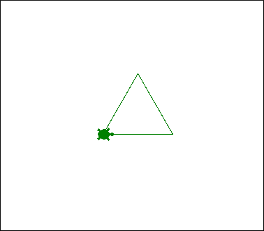
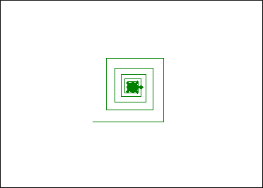
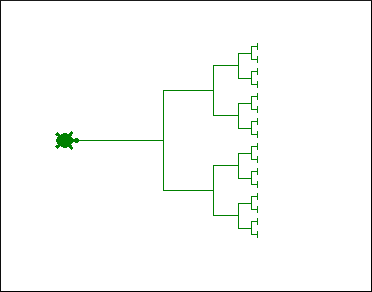
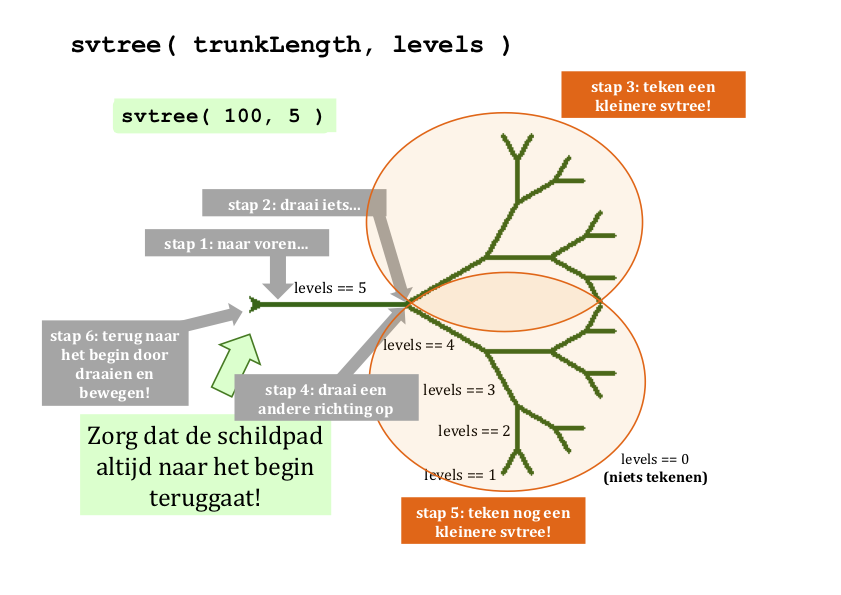
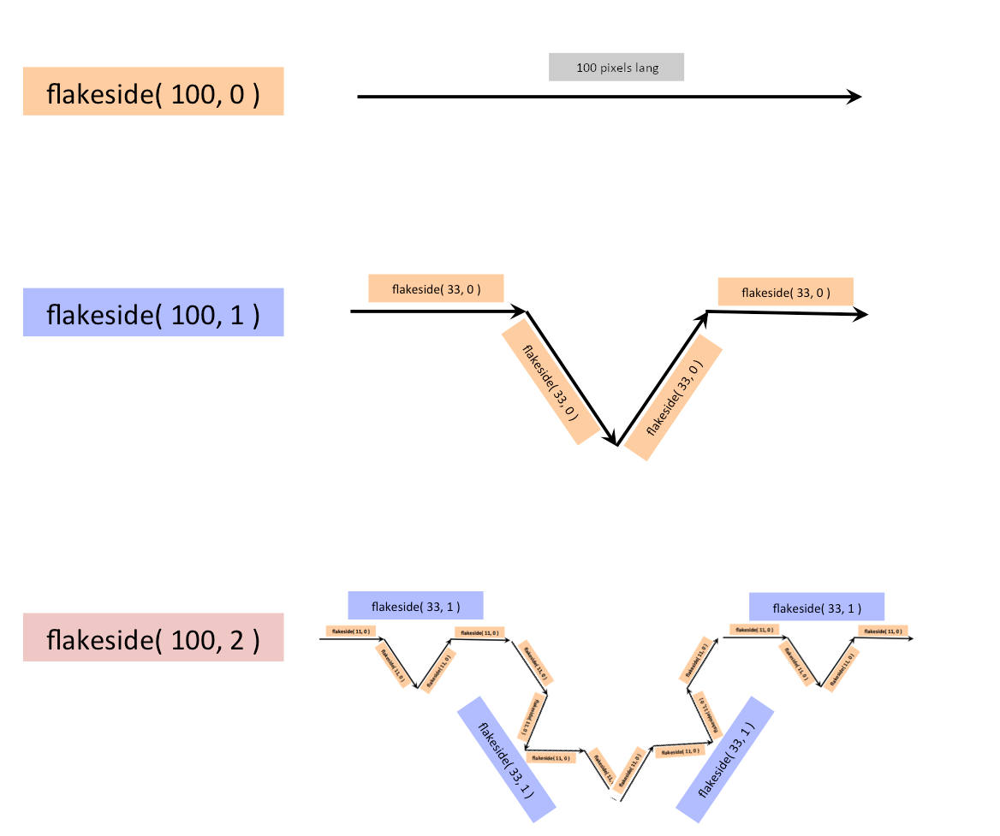

# Python Turtles!

| Naam         | Beschrijving                                                   |
|--------------|----------------------------------------------------------------|
| Onderwerp    | Tekenen met turtle                                             |
| Bestandsnaam | `wk3ex1.py`                                                    |
| Inleveren    | Lever jouw bestand met de juiste bestandsnaam in op GradeScope |

## Het `tri` voorbeeld

Eerst ga je zien hoe turtle's grafische (visuele) uitvoer werkt in jouw versie van Python.

Begin door een nieuw bestand te maken in je teksteditor met de naam `wk3ex1.py`. Plak de onderstaande code inclusief commentaar en voorbeeldfunctie `tri(n)` in dit bestand:


```python
#
# wk3ex1.py
#
# Naam:
#
# Turtle graphics en recursie
#

import time
from turtle import *
from random import *


def tri(n):
    """Draws n 100-pixel sides of an equilateral triangle.
       Note that n doesn't have to be 3 (!)
    """
    if n == 0:
        return      # Geen zijden om te tekenen, dus stop met tekenen
    else:
        forward(100)
        left(120)
        tri(n-1)    # Gebruik recursie om de overige zijden te tekenen!
```

Probeer dan het volgende:

-   Typ `run wk3ex1.py` op de IPython prompt.
-   Plak of typ vervolgens `tri(3); done()`.
    -   Je kan in Python twee commando's uitvoeren door ze te scheiden met een puntkomma
-   Je zal nu een schildpad (turtle!) zien die een driehoek tekent...

    

    Let op, soms wordt het turtle venster *achter* andere applicaties geopend, je zal deze dan naar de voorgrond moeten halen.

-   Als het programma klaar is, probeer dan het venster te sluiten.
-   Als alles werkt (en de prompt van `ipython` komt terug en werkt weer), mooi!
-   Als de prompt van ipython ***niet*** terugkomt of het venster niet gesloten kan worden,
    -   Probeer het dan zonder `done()`
    -   Sommige Macs kunnen er niet goed tegen als je `done()` uitvoert...

Nu komt de truc: ***probeer het nu opnieuw***!

-   Typ of gebruik pijltje omhoog om de functie `tri(3); done()` opnieuw uit te voeren
-   ***Misschien krijg je een "Terminator"-fout***; dat is geen probleem!
-   Als je die krijgt, type (of gebruik pijltje omhoog) `tri(3) ; done()` opnieuw en voer het opnieuw uit.
-   Het werkt bijna altijd bij de tweede poging.
-   Dit komt omdat het sluiten van het venster het systeem niet volledig reset (maar de fout wel).

Als twee keer uitvoeren werkt op jouw computer, is het ***prima*** om turtle-functies of -commando's
twee keer uit te voeren!

:::{admonition} Buggy turtle!
:class: danger

Turtle in Python is leuk maar kan zich soms eigenaardig gedragen (ook omdat het een al wat oudere Python module is). Vraag ons om hulp als je computer of het turtle-venster toch niet meer reageert, of als je tegen andere problemen aanloopt.

Als dingen echt helemaal de mist ingaan kan je altijd de terminal met iptyhon geforceerd beëindigen, maar we hopen dat dat niet nodig is! (Vraag om hulp als het wel nodig lijkt te zijn.)
:::

:::{admonition} Waarschuwing!
:class: warning

Voeg `done()` niet toe aan de broncode van je functies.

Als je functie recursief is, zou het hierdoor te vroeg stoppen met uitvoeren!
:::

Voor we verder gaan, laten we kort stilstaan bij wat hier allemaal gebeurt, want je ziet een een aantal nieuwe dingen! Bijvoorbeeld `t.forward(100)`: wat doet die punt daar nu?!? We vragen je een paar dingen aan te nemen:

-   `Turtle` (Turtleness, Turtlality, Turtlation, Turtlocity, ... meestal als een naam begint met een hoofdletter) is een "klasse" in Python en we gaan dit concept nog uitgebreid bekijken (maar niet nu!)
-   Neem voor nu aan dat (en niet meer dan dat) `t` een "object" is van de klasse `Turtle`
-   En dat dit voor nu voldoende is om te weten hoe je turtle te kan laten bewegen of eigenschappen kan aanpassen met `t.een_commando`, bijvoorbeeld `t.forward(100)`
-   Kijk nog eens goed naar de code waar je dit ziet gebeuren!
## Opties en kleur

Nu gaan we turtlen!

Pas steeds de functie `tri` aan en voer het opnieuw uit om een aantal van de `turtle` opties te proberen.

### Lijndikte

-   Voeg de regel `t.width(10)` toe als eerste regel van de functie.
-   *Of* voeg de regel `t.width(2 * n + 1)` toe als eerste regel van het `else`-blok.

### Kleur

Voeg de regel `t.color('darkgreen')` toe als de eerste regel van de functie. *Of* voeg deze twee regels toe als eerste regels van de functie:

```python
clr = choice(['darkgreen', 'red', 'blue'])
t.color(clr)
```
Op deze [pagina](https://www.tcl.tk/man/tcl8.4/TkCmd/colors.htm) vind je alle beschikbare kleuren.

Je kan ook zelf kleuren maken (kleuren mengen, eigenlijk!). Bijvoorbeeld, `clr = (0.8, 0.6, 0.0)`, gevolgd door `color(clr)` maakt een goudachtige kleur, met een verhouding rood op 80% (0.8 van de 1), groen op 60% (0.6 uit 1) en blauw op 0% (0.0 uit 1).

### Turtle vorm

Voeg de regel `t.shape('turtle')` toe als eerste regel van de functie, andere vormen die je kan uitproberen zijn:

- arrow
- turtle
- circle
- square
- triangle

### Andere opties

Voeg de regel `dot(10, 'red')` toe als de eerste regel in het `else`-blok.

-   Dit moet een gevulde cirkel (een stip) tekenen net voordat de rest van de regels in het `else`-blok uitgevoerd worden.
-   Merk op dat je de stip een andere kleur kan geven dan de lijnkleur door de kleur als tweede argument van `dot` mee te geven.

Verder zijn de twee functies `t.clear()` en `t.reset()` handig! Probeer ze beide uit, `t.reset()` is de meest "grondige" van deze twee! Verder is er nog de functie `clearscreen()` (let op, *geen* `t.clearscreen()`) die het scherm *volledig* wist. Wil je nóg meer van turtle weten dan kan je de online turtle [documentatie](https://docs.python.org/3/library/turtle.html) lezen.

:::{admonition} Achterliggend idee
:class: notice

Spelen met turrtle is leuk, maar even terug naar wat je hier écht met turtle gaat doen. Het voorbeeld `tri` laat recursie zien met een *enkel pad*: er is steeds maar één recursieve aanroep, waardoor er precies één pad is dat stap voor stap wordt doorlopen.
:::

## De functie `spiral`

Je gaat nu een andere recursieve functie met een *enkel pad* schrijven,`spiral` en deze functie lijkt heel erg op `tri`.

Begin door onder de functie `tri` een andere functie `spiral` te schrijven. Hier is de *signature* van deze functie met daaronder
een begin met een docstring, die je eenvoudig kan kopiëren en plakken.

```python
def spiral(initial_length, angle, multiplier):
    """Spiral-drawing function.  Arguments:
       initial_length = the length of the first leg of the spiral
       angle = the angle, in degrees, turned after each spiral's leg
       multiplier = the fraction by which each leg of the spiral changes
    """
    if initial_length <= 1:
        return      # Niets meer te tekenen, dus beëindig deze aanroep naar spiral
    else:
        # Hier moet je de functie forward aanroepen...
        # Hier moet je een draai maken...
        # Hier komt je recursie! Dat betekent dat je hier een nieuwe aanroep naar spiral doet...
```
Hier zie je het resultaat van de aanroep `spiral(100, 90, 0.9)`



De functie `spiral` moet de tekenfuncties uit `turtle` gebruiken om een spiraal te tekenen waarbij:

-   Het eerste lijnsegment de lengte `initial_length` heeft, en daarna
-   Een draai maakt van `angle` graden naar links na het tekenen van het lijnsegment, en daarna
-   Een recursieve aanroep doet van `spiral`, waarbij `multiplier` gebruikt wordt om het eerste argument aan te passen (het tweede en derde argument veranderen niet!)

Bijvoorbeeld,

-   Als de `multiplier` gelijk is aan `0.5` zal elke zijde van de spiraal *half* zo lang zijn als de vorige (ze worden steeds korter)
-   Als de `multiplier` gelijk is aan `1.5` is zal elke zijde van de spiraal *anderhalf keer* zo lang zijn als de vorige zijde (ze worden steeds langer)

### Basisgevallen

Voor de basisgevallen (base cases) gebruik je een `return` om te zorgen dat de spiraal niet verder getekend wordt als de *lengte* van de zijde die getekend moet worden:

-   *Kleiner* is dan 1 pixel (deze is hierboven al geïmplementeerd!), of
-   *Groter* is dan 1000 pixels. Je kan hiervoor de test voor de  bovenstaande base case (1 pixel) verder aanvullen met `or initial_length ...` (en vervang `...` met de notatie voor groter dan 1000).

Probeer bijvoorbeeld een paar van deze aanroepen:

* `spiral(100, 90, 0.9)`
* `spiral(100, 170, 0.95)` (dit lijkt meer op een ster, gebruik Control-C om te functie te onderbreken...)
* `spiral(400, 120, 0.8)` (een driehoekige spiraal)
* `spiral(2, 1, 0.999)` (een ECHTE spiraal, gebruik weer Control-C om te stoppen)

## De functie `chai`

Je gaat nu een voorbeeld maken van *vertakkende* recursie. Met vertakkingen wordt recursie haast "magisch" en het schrijven van deze vormen van recursie is duizelingwekkend (of, mindf*cks) en je zal zien dat het is lastig te volgen wat nu allemaal precies gebeurt! Maar net als bij het ontleden van een truc van een goochelaar valt het uiteindelijk goed te begrijpen, als je stap voor stap de magie van vertakkende recursie ontrafelt!

Begin met het volgende in jouw bestand te plakken:

```python
def chai(size):
    """Our chai function!"""
    if size < 5:
        return
    else:
        forward(size)
        left(90)
        forward(size/2)
        right(90)

        right(90)
        forward(size)
        left(90)

        left(90)
        forward(size/2.0)
        right(90)
        backward(size)
        return
```

Probeer het vervolgens uit met `chai(100)`.

### Vertakkingen

Voeg nu *één* recursieve vertakking toe aan `chai`:

-   voeg de recursieve aanroep `chai(size / 2)` toe tussen de twee aanroepen naar `right(90)` en probeer het uit!

Voeg vervolgens een *extra* vertakking toe.

Je voegt maar een enkele tak toe, maar omdat deze recursief wordt aangeroepen op *alle* subtakken wordt de resulterende hoeveelheid werk (en visuele complexiteit) meer dan verdubbeld!

Om deze tweede tak toe te voegen, moet je

* een tweede recursive aanroep `chai(size / 2)` toevoegen tussen de twee aanroepen naar `left(90)`.

Probeer het opnieuw uit, het resultaat zal er als volgt uitzien, magisch!:


:::{admonition} Eindigen waar je begint
:class: info

Vertakkende recursie werkt door een kleinere versie van de structuur te maken op *meerdere plekken* binnen dezelfde structuur. De sleutel om vertakkende recursie te laten werken is ervoor zorgen dat de schildpad *eindigt* op plaats waar ze *begon*, en dat ze in dezelfde *richting* eindigt.
:::

## De functie `svtree`

Je gaat nu een ander vertakkend voorbeeld schrijven, een boom in *zijaanzicht*. In dit geval is "vertakken" een heel geschikte beschrijving!

Het idee is om een functie te maken die een *zijaanzicht* van een boom tekent, een *side-view tree* (vandaar `svtree`). Lees deze docstring om een idee te krijgen wat de twee argumenten betekenen. Bekijk daarna het volgende begin en de afbeeldingen daaronder:

```python
def svtree(trunklength, levels):
    """svtree: draws a side-view tree
       trunklength = the length of the first line drawn ("the trunk")
       levels = the depth of recursion to which it continues branching
    """
    if levels == 0:
        return
    else:
        # Teken de oorspronkelijke stam (1 regel)
        # Draai een stukje om de eerste subboom te positioneren (1 regel)
        # Voer recursie uit! met een kleinere stam en minder niveaus (1 line)
        # Draai de andere kant op om de tweede subboom te positioneren (1 regel)
        # Voer opnieuw recursie uit! (1 regel)
        # Draai en ga TERUG (2 stappen: 2 regels)
```

Voordat je begint, bekijk eerst even de volgende twee voorbeelden en de analyse van het probleem. Het eerste voorbeeld is het resultaat wanneer `svtree(128, 6)` wordt aangeroepen:


Merk op dat dit duidelijk een *zij*-aanzicht is! Hier zie je een voorbeeld van een mogelijke uitvoer van `svtree(50, 2)`:


Tot slot, als `svtree(50, 0)` wordt uitgevoerd moet niets getekend worden want de *base case* treedt op als `levels` gelijk is aan 0.

### Analyse

**Base case:** je wilt dat `svtree` niets tekent (en de verdere loop van de functie stopt) als `levels == 0`

**Recursive case:**: we bekijken dit nu conceptueel

Hier zie je een afbeelding die de zelfgelijkvormigheid van `svtree` toont. Dit is in feite een vrijwel *compleet* overzicht van de code van `svtree`!



We herhalen het nog een keer, de sleutel tot geluk voor recursief tekenen is de volgende: de pen (turtle in ons geval) moet terugkeren naar het begin (wortel) van de boom aan het einde van de functieaanroep, en de schildpad moet in de oorspronkelijke richting wijzen! Op deze manier zorgt elk deel van de recursie "voor zichzelf" ten opzichte van de andere delen in deze afbeelding. Dit zijn de stappen:

-   Ga `trunklength` naar voren
-   Draai een stukje naar links
-   Voer de recursie uit! (roep `svtree` met een fractie van de `trunklength` aan en 1 niveau minder).
-   Draai een stukje naar rechts (als je een symmetrische boom wilt, moet je twee keer zoveel naar rechts draaien als je  naar links bent gedraaid).
-   Voer de recursie opnieuw uit! (doe dezelfde aanroep naar `svtree` met een fractie van de `trunklength` en 1 niveau minder).
-   *Afronding, deel 1:* Draai naar links zodat de schildpad weer in de oorspronkelijke richting kijkt (dit zou evenveel moeten
  zijn als de eerste draai naar links).
-   *Afronding, deel 2:* Ga de oorspronkelijke `trunklength` naar *achteren*.

Maak je geen zorgen over de precieze hoek die je gebruikt voor de aftakkingen of hoeveel je de `trunklength` korter maakt in subtakken, etc. Ontwerp jouw boom door hier keuzes voor te maken die er mooi uitzien. En door `t.left(90); svtree(100, 5)` aan te roepen krijg je een meer traditionele, omhoog wijzende boom!

:::{admonition} Meerdere opdrachten op één regel
:class: tip

Je kan op de IPython prompt meerdere opdrachten in één keer uitvoeren door ze te scheiden met een puntkomma (`;`), bijvoorbeeld `t.left(90); svtree(100, 5)`. Je zegt hier in één regel "draai 90 graden naar links en roep direct daarna `svtree` aan met de parameters `100` en `5`"
:::

### Meer vertakkingen

Pas de functie `svtree` (nadat deze werkt met twee takken) aan zodat ze *drie* of *meer* takken heeft, in plaats van slechts twee...

-   Je krijgt heel snel een heel dicht "bladerdak".
-   De resultaten worden "levensechter" als je ongelijke hoeken gebruikt voor de vertakkingen en ongelijke factoren voor de lengte.
-   Je kan ook de `width` of de `color` laten afhangen van de waarde van `levels`.
-   Als je het laatste "niveau" rood maakt, krijg je een appelboom.

    Bekijk het voorbeeld met `dot` in de functie `tri` om nog een manier te zien om fruit toe te voegen.

-   Of, als je het laatste "niveau" een willekeurige kleur geeft, krijg je een effect alsof het herfstbladeren zijn...

## Opgave

Een uitdaging! De Koch-kromme (of Koch-*sneeuwvlok*) is een voorbeeld van recursie met heel diepe vertakkingen. De Koch-sneeuwvlok is een *fractal* met drie identieke zijden en het zijn de zijden zelf die recursief worden gedefinieerd, niet de driehoek.

### De functie `snowflake`

Om deze reden geven we je hier de `snowflake` functie in zijn geheel om te gebruiken, kopiëer deze in jouw bestand:

```python
def snowflake(sidelength, levels):
    """Fractal snowflake function, complete.
       sidelength: pixels in the largest-scale triangle side
       levels: the number of recursive levels in each side
    """
    flakeside(sidelength, levels)
    left(120)
    flakeside(sidelength, levels)
    left(120)
    flakeside(sidelength, levels)
    left(120)
```

Merk op dat je de functie niet kan gebruiken tot je `flakeside` gedefiniëerd hebt, en dat is de volgende stap.

### De functie `flakeside`

Het is jouw taak om de functie `flakeside(sidelength, levels)` te implementeren, die *één* zijkant van de Koch-kromme tekent.

Hier zie je een grafische samenvatting van de structuur van de zijkant van de kromme:



### Tips

-   De base case van de zijde van de Koch-kromme is simpelweg een rechte lijn van lengte `sidelength`!

- Elk recursief niveau vervangt het *middelste derde deel* van de zijde van de sneeuwvlok door een "punt", d.w.z. twee zijden die deel zouden uitmaken van een gelijkzijdige driehoek van één derde schaal.
-   Merk op dat elke zijde vier *subzijden* bevat. Dat betekent dat `flakeside` zichzelf *vier* keer recursief aanroept!
-   Op de drie plekken *tussen* deze vier aanroepen moet je een geschikte draai maken.
-   De recursive case bevat dus in totaal *zeven* regels (vier recursies en drie draaingen).

### Testen

-   Probeer `flakeside(300, 0)`; zorg dat je een rechte lijn krijgt
-   Probeer `flakeside(300, 1)`; zorg dat je een vorm met vier lijnsegmenten krijgt
-   Probeer `flakeside(300, 2)`; zorg dat je vier "niveau-1"-zijden krijgt
-   Probeer `flakeside(300, 3)`; mooi! en vrij cool!

Vergeet niet dat `flakeside` slechts *één* van de drie zijden van de kromme tekent!

-   Om deze reden hoeft de functie *niet* te eindigen op precies dezelfde plaats als waar zij begonnen is.
-   Als de functie dat wel zou doen zouden immers de drie zijden van de kromme precies bovenop elkaar worden getekend...

### Combineren

Nadat je de functie `flakeside` werkend hebt, kan je `snowflake` gaan proberen!

De functie `snowflake` roept simpelweg de functie `flakeside` drie keer aan. Afhankelijk van de richtingen die `flakeside` gebruikt moet je misschien de `left`s in `snowflake` vervangen door `right`s.

Voorbeelden die je kan proberen zijn `snowflake(300, 2)` en `snowflake(300, 3)`. Hier zijn afbeeldingen van vier verschillende waarden van `levels` voor de kromme, te weten `0`, `1`, `2` en `3`:


Veel (recursief) turtle plezier!
