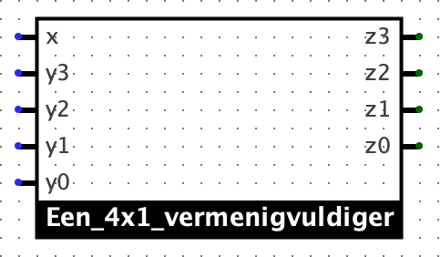
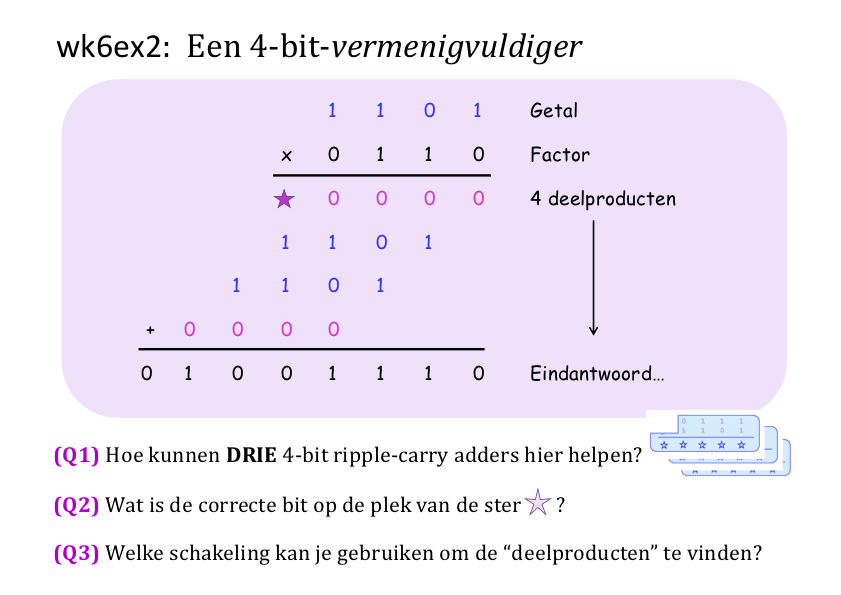

# Vermenigvuldigingswaanzin

In deze opgave ga je een *vermenigvuldigingsschakeling* (dit is een goed Scrabble-woord!) in Logisim Evolution bouwen. Om je antwoorden te controleren heb je een rekenmachine nodig die binair kan vermenigvuldigen. De standaard Windows en macOS rekenmachines kunnen dit, verder zijn er verschillende online rekenmachines waar je dit ook mee kan doen. Je zou zelfs een functie in Python kunnen schrijven die gebruik maakt van de omzetting in [verschillende grondtallen](wisselende_stelsels.md) uit een eerdere opgave.

Denk eraan dat het vermenigvuldigen van binaire getallen eigenlijk precies hetzelfde algoritme is dat we allemaal op de lagere school hebben geleerd voor het vermenigvuldigen van decimale getallen! Jouw taak is hier een schakeling te bouwen om het product (een vermenigvuldiging) van twee 4-bit getallen te berekenen.

 In het bestand `wk6ex1-4.circ` dat je eerder hebt gedownload voor het [practicum](optellingen_schakelen.md) vind je ook een deelschakeling "Een_4bit_vermenigvuldiger". Ontwerp daar jouw schakeling voor deze opgave.

*Gebruik de gegeven in- en uitvoerpins*: ze helpen om de opdrachten gemakkelijker te beoordelen, omdat ze gestandaardiseerd zijn!

## 4-Bit binaire vermenigvuldiging

Bij deze opgave hoef je *geen* gebruik te maken van het interm-expansieprincipe. In plaats daarvan ga je componenten die je al gebouwd hebt aan elkaar "plakken", met maar een beperkt aantal extra logische poorten (maar wel veel bedrading!).

De namen van de twee getallen die vermenigvuldigd gaan worden zijn `X3 X2 X1 X0` en `Y3 Y2 Y1 Y0`, waar `X0` en `Y0` de minst significante bits zijn van beide getallen.

Om het product te berekenen, moeten we eerst het product van het getal `X3 X2 X1 X0` met de bit `Y0` berekenen. Het resultaat heet een *partieel product*. Dit partiële product kan eenvoudig berekend worden, door gebruik te maken van precies vier poorten.

### Een 4x1-vermenigvuldiger als "hulpcircuit"

Het kan helpen om een "hulpcircuit" te bouwen dat een 4-bits getal vermenigvuldigt met een 1-bits getal. Hiermee kan je het probleem aanzienlijk vereenvoudigen. Je kan dit als een ontwerpstrategie gebruiken, als je wilt.

Om een nieuwe schakeling in de linkerkolom aan te maken, ga je naar het menu "Project" en kiest je voor "Voeg Circuit toe...". Noem het bijvoorbeeld "Een_4x1_vermenigvuldiger", zodat wij bij het nakijken kunnen zien dat je deze strategie hebt gekozen. (Merk op dat je in Logisim Evolution de naam van een schakeling niet kan beginnen met een getal).

Zorg ervoor dat je de ingangen van de 4x1-vermenigvuldiger namen geeft met de labeltool (niet met de teksttool), zodat je ze kan gebruiken in de 4x4-vermenigvuldiger!

### De vier deelproducten toevoegen

Nu moeten we de resterende deelproducten vinden en de resultaten optellen. Je zult merken dat het het gemakkelijkst is om de deelproducten op te tellen terwijl je ze berekent, in plaats van te wachten tot je ze all vier hebt!

Jouw circuit moet vier ingangen hebben met de namen `X3`, `X2`, `X1`, `X0` en vier ingangen met de namen `Y3`, `Y2`, `Y1`, `Y0`. Gebruik de 4-bit ripple-carry adder die je al eerder hebt gebouwd, een klein aantal extra logische poorten en verder veel draad om jouw vermenigvuldiger te bouwen.

Merk op dat er *twee* vormen zijn waar je uit kan kiezen voor je 4x1-vermenigvuldigers:

*   De standaardlayout ziet er "rupsachtig" uit:

    

*   De kleinere, oude layout is ook beschikbaar (zet de eigenschap *Use new box layout* op  **No**); je kan hier vrij tussen kiezen.

In totaal heb je vier 4x1-vermenigvuldigers en drie 4-bit ripple-carry adders nodig om de vermenigvuldiger te bouwen.

### Hoe helpt de ripple-carry adder?

De volgende afbeelding toont een grafisch overzicht van de vermenigvuldiging:

Merk specifiek op dat de blauwe "bus"-achtige constructies precies de 4-bit ripple-carry adders zijn die je eerder hebt gebouwd.

Wees verder voorzichtig! Het is belangrijk om te zorgen dat de bedrading op de goede plaats is aangesloten!

## Ontwerpstrategieën

Je zult jouw schakeling netjes en zorgvuldig willen inrichten om het leesbaar en gemakkelijk uitbreidbaar blijft. Hiervoor kan het nuttig zijn om de `X`-ingangen horizontaal en de `Y`-ingangen verticaal te plaatsen en zo een 2-dimensionaal dradenraster te bouwen. Je kunt het echter ook doen zoals je zelf wilt. Als je zorgvuldig bent, zul je merken dat de schakeling eigenlijk heel mooi is in zijn geometrische structuur en vrij gemakkelijk te verklaren is. Als je niet zorgvuldig bent, kan het veranderen in een grote wirwar van draden!
