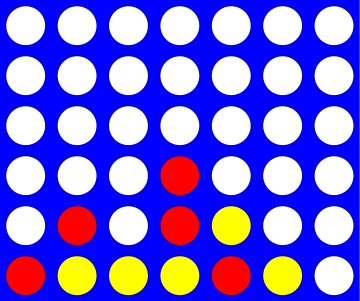

# Vier op een rij

Voor deze opgave moet je met een nieuw bestand `wk10ex2.py` beginnen.

Vier op een rij is een variant van Boter, kaas en eieren dat gespeeld wordt op een rechthoekig bord van 7 bij 6:



Het spel wordt gespeeld door twee spelers, die om de beurt een zet doen, waarbij beide spelers proberen om vier stenen op een verticale, horizontale of diagonale rij te krijgen. Eén voorwaarde bij het spelen is dat, omdat het bord verticaal opgesteld staat, de stenen niet zomaar overal geplaatst kunnen worden. Een stee mag alleen maar bovenaan een bestaande kolom stenen gespeeld worden (of het mag een nieuwe kolom stenen beginnen).

## De klasse `Board`

In deze opgave ga je een klasse genaamd `Board` maken die sommige eigenschappen van het spel Vier op een rij implementeert. De klasse `Board` heeft drie instantievariabelen: er is een tweedimensionale lijst (een lijst van lijsten) met karakters die het spelbord voorstelt, en twee variabelen die het aantal rijen en kolommen op het bord bijhouden (6 rijen en 7 kolommen is standaard, maar je klasse `Board` kan elk formaat bord aan).

Zelfs als we onbeperkt grote borden toestaan blijft de regel echter bestaan dat je vier stenen op een rij nodig hebt om te winnen. Toegegeven, dit maakt het wel lastig om het spel te winnen op een bord van 3 bij 3...

Je klasse `Board` heeft minstens drie instantievariabelen:

* Een variabele met de naam `data` waarin de tweedimensionale array (lijst van lijsten) met het spelbord wordt opgeslagen
* Een variabele `height` waarin het aantal rijen op het bord wordt opgeslagen
* Een variabele `width` waarin het aantal kolommen op het bord wordt opgeslagen

Merk op dat de tweedimensionale lijst een tweedimensionale lijst van *karakters* is; dit zijn gewoon strings van lengte 1. Je moet een leeg veld laten voorstellen door `' '`, een spatieteken; niet de lege string. Je moet de stenen van speler X laten voorstellen door een `'X'` (de hoofdletter x) en je moet de stenen van speler O laten voorstellen door een `'O'` (de hoofdletter o).

:::{admonition} Waarschuwing
:class: danger

Een **heel** moeilijk te vinden bug treedt op als je het ***nulteken*** `'0'` gebruikt in plaats van het teken `'O'` (hoofdletter o) om één van de spelers voor te stellen. Het probleem treedt op als door jou, of tijdens het nakijken, de waardes in het bord vergeleken worden met de verkeerde karakters! Zorg ervoor dat je consistent bent in het gebruik van de hoofdletter o.
:::

Je moet een aantal methodes implementeren in de klasse `Board`. Vergeet niet de tips over hoe je ze kan testen te gebruiken nadat je ze geschreven hebt! De eerste twee methodes zijn in het college behandeld en zijn hieronder gegeven zodat je ze kan kopiëren en plakken.

```python
class Board:
    """A data type representing a Connect-4 board
       with an arbitrary number of rows and columns.
    """

    def __init__(self, width, height):
        """Construct objects of type Board, with the given width and height."""
        self.width = width
        self.height = height
        self.data = [[' ']*width for row in range(height)]

        # We hoeven niets terug te geven vanuit een constructor!

    def __repr__(self):
        """This method returns a string representation
           for an object of type Board.
        """
        s = ''                          # de string om terug te geven
        for row in range(0, self.height):
            s += '|'
            for col in range(0, self.width):
                s += self.data[row][col] + '|'
            s += '\n'

        s += (2*self.width + 1) * '-'   # onderkant van het bord

        # hier moeten de nummers nog onder gezet worden

        return s       # het bord is compleet, geef het terug

```

Implementeer vervolgens de volgende methodes in je klasse `Board`. Vergeet niet ze allemaal te testen nadat je ze geschreven hebt; het is veel makkelijker om ze elk onafhankelijk te testen dan om te proberen een grote verzameling methodes tegelijk te debuggen.

### De constructror `__init__`

De klasse `Board` heeft een constructor `__init__(self, width, height)` die twee argumenten meekrijgt. (Onthoud dat `self` verwijst naar het object dat aangemaakt wordt en dat het niet expliciet wordt meegegeven aan de constructor.) De constructor krijgt een aantal kolommen en rijen mee (7 en 6 zijn de standaard in Vier op een rij, maar ons datatype kan alle bordformaten aan). De constructor stelt de waardes van de instantievariabelen van het object in. Het maakt bovendien de tweedimensionale lijst aan die gebruikt wordt om het bord op te slaan. Je maakt hiervoor een lijst van lijsten *op een manier die erg lijkt op die van het practicum over Game of Life*.

Merk op dat `self.data` niet alle karakters bevat die gebruikt worden om het bord af te drukken; alleen de karakters die nodig zijn om het spel te spelen. De extra karakters worden gegenereerd in de methode `__repr__`.

### De methode `__repr__`

De methode `__repr__(self)` geeft een string`repr`esentatie terug van het `Board`-object dat de methode aanroept. Elke "steen" neemt één teken in beslag, en alle kolommen worden gescheiden door verticale lijnen (`|`). De kolommen worden aan de onderkant gelabeld. Hier is een voorbeeld voor een bord met 6 rijen en 7 kolommen, 6 bij 7 dus (zie de onderstaande code voor meer details...)

```text
| | | | | | | |
| | | | | | | |
| | | | | | | |
| | | | | | | |
| | | | | | | |
| | | | | | | |
---------------
 0 1 2 3 4 5 6
```

Om te zorgen dat alles netjes onder elkaar blijft staan, moet de kolomnummering "modulo 10" gedaan worden,
zoals te zien in dit grotere voorbeeld met 5 rijen en 15 kolommen (5 bij 15):

```
| | | | | | | | | | | | | | | |
| | | | | | | | | | | | | | | |
| | | | | | | | | | | | | | | |
| | | | | | | | | | | | | | | |
| | | | | | | | | | | | | | | |
-------------------------------
 0 1 2 3 4 5 6 7 8 9 0 1 2 3 4
```

:::{admonition} Eén string, meerdere regels?
:class: tip

De string `'\n'` stelt het *newline*-karakter voor in Python. Je kan dus meerdere regels in een enkele string zetten door `'\n'` toe te voegen. Bijvoorbeeld met

```ipython
In [1]: s = 'Dit is de bovenste regel.'
In [2]: s += '\n'
In [3]: s += 'Dit is de tweede regel!\n'
In [4]: print(s)
Dit is de bovenste regel.
Dit is de tweede regel!
```

Merk op dat `'\n'` ook *in* een string gebruikt kan worden. In dit geval voegt het een extra lege regel toe aan het einde van de string.
:::

### De methode `add_move`

De methode `add_move(self, col, ox)` krijgt twee argumenten mee: het eerste, `col`, geeft de kolom aan waaraan de steen moet worden toegevoegd. Het tweede argument, `ox`, is een string van 1 karakter die de steen aangeeft die aan het bord moet worden toegevoegd. Dat wil zeggen, `ox` moet `'X'` of `'O'` zijn (hoofdletter O dus, niet nul).

:::{admonition} Onthoud dat de stenen van bovenaf in het bord vallen!
:class: notice

Je code moet dus het geschikte rijnummer vinden die beschikbaar is in kolom `col` en de steen in die rij toevoegen. Je hoeft in `add_move` **niet** te controleren of `col` een geldig kolomnummer is en of er ruimte is in kolom `col`. Die controles zijn wel belangrijk: ze worden in een toekomstige methode, `allows_move`, gedaan.
:::

Hier is een reeks zetten om `add_move` mee te testen; probeer ze uit!

```ipython
In [1]: b = Board(7, 6)
In [2]: b.add_move(0, 'X')
In [3]: b.add_move(0, 'O')
In [4]: b.add_move(0, 'X')
In [5]: b.add_move(3, 'O')
In [6]: b.add_move(4, 'O')  # Valsspelen door O opnieuw te laten zetten!
In [7]: b.add_move(5, 'O')
In [8]: b.add_move(6, 'O')
In [9]: print(b)
```

En wat hieruit moet komen is:

```text
| | | | | | | |
| | | | | | | |
| | | | | | | |
|X| | | | | | |
|O| | | | | | |
|X| | |O|O|O|O|
---------------
 0 1 2 3 4 5 6
```

### De methode `clear`

De methode `clear(self)` moet het aanroepende bord leeg maken; er valt hier verder weinig over te zeggen, maar de methode is wel nuttig!

### De methode `set_board`

De methode `set_board(self, move_string)` is erg handig om snel een bord te maken om de methode `wins_for` te testen in het volgende deel. Hier is de code die we voor `set_board` gebruikt hebben; voeg dit toe aan
je klasse `Board`, het maakt het testen veel simpeler!

```python
def set_board(self, move_string):
    """Accepts a string of columns and places
       alternating checkers in those columns,
       starting with 'X'.

       For example, call b.set_board('012345')
       to see 'X's and 'O's alternate on the
       bottom row, or b.set_board('000000') to
       see them alternate in the left column.

       move_string must be a string of one-digit integers.
    """
    next_checker = 'X'   # we starten door een 'X' te spelen
    for col_char in move_string:
        col = int(col_char)
        if 0 <= col <= self.width:
            self.add_move(col, next_checker)
        if next_checker == 'X':
            next_checker = 'O'
        else:
            next_checker = 'X'
```

### De methode `allows_move`

De methode `allows_move(self, col)` methode moet `True` teruggeven als in het aanroepende `Board`-object een zet in kolom `col` *wel** geldig is. Ze moet `False` teruggeven als kolom `col` geen geldig kolomnummer is voor het aanroepende object. Ze moet ook `False` teruggeven als kolom `col` vol is. De methode moet dus controleren dat `col` in het bereik van 0 tot de laatste kolom valt *en* dat er nog ruimte over is in de kolom!

Hier is een voorbeeldreeks om mee te testen; probeer hem uit!

```ipython
In [1]: b = Board(2, 2)

In [2]: b
Out[2]:
| | |
| | |
-----
 0 1

In [3]: b.add_move(0, 'X')

In [4]: b.add_move(0, 'O')

In [5]: b
Out[5]:
|O| |
|X| |
-----
 0 1

In [6]: b.allows_move(-1)
Out[6]: False

In [7]: b.allows_move(0)
Out[7]: False

In [8]: b.allows_move(1)
Out[8]: True

In [9]: b.allows_move(2)
Out[9]: False
```

### De methode `is_full`

De methode `is_full(self)` moet `True` teruggeven als het aanroepende `Board`-object volledig gevuld is met stenen. Ze moet anders `False` teruggeven. Merk op dat je `allows_move` kan gebruiken om deze methode heel kort te schrijven! Als je niet buitengewoon geduldig bent is het handiger om dit op kleinere borden te testen!

Hier is een voorbeeldreeks om mee te testen; hij gebruikt de methode `set_board` die je hierboven kan vinden.

```ipython
In [1]: b = Board(2, 2)

In [2]: b.is_full()
Out[2]: False

In [3]: b.set_board('0011')

In [4]: b
Out[4]:
|O|O|
|X|X|
-----
 0 1

In [5]: b.is_full()
Out[5]: True
```

### De methode `del_move`

De methode `del_move(self, col)` moet het omgekeerde doen van `add_move`. Ze moet de bovenste steen van kolom `col` verwijderen. Als de kolom leeg is moet `del_move` *niets* doen. Deze functie lijkt nu niet handig, maar het zal *erg* handig zijn als je je eigen computerspeler voor Vier op een rij wilt implementeren...

Hier is een voorbeeldreeks om mee te testen:

```ipython
In [1]: b = Board(2, 2)

In [2]: b.set_board('0011')

In [3]: b.del_move(1)

In [4]: b.del_move(1)

In [5]: b.del_move(1)

In [6]: b.del_move(0)

In [7]: b
Out[7]:
| | |
|X| |
-----
 0 1
```

### De methode `wins_for`

De methode `wins_for(self, ox)` controleert of iemand het spel gewonnen heeft. Het argument `ox` van deze methode is een steen van 1 karakter: `'X'` of `'O'`. De methode moet `True` teruggeven als er vier stenen van het type `ox` op een rij zijn op het bord. Ze moet anders `False` teruggeven.

:::{admonition} Let op
:class: danger

Je moet controleren of de speler horizontaal, verticaal of diagonaal gewonnen heeft (en er zijn twee verschillende richtingen voor een diagonale overwinning).

Eén mogelijke manier om dit aan te pakken is om je functies uit week 9 te gebruiken in een paar geneste lussen om alle mogelijke manieren om te winnen te controleren. [Hier is een pagina met een aanzet voor deze strategie](../support/wins_for.md)
:::

:::{admonition} Waarschuwing
:class: warning

De in-een-rij-functies moeten ***buiten*** de klasse staan; ze zijn globaal, en geen onderdeel van de klasse `Board`!
:::

Als je opgave 2 van week 9 niet gedaan hebt, kan je ook een aanpak kiezen waarbij je deze functies niet nodig hebt. Hierbij is het nodig om te bedenken welke stenen als een mogelijk *"anker"* zouden kunnen dienen om een reeks van vier op een rij te beginnen. Alle "ankers" die een horizontale rij kunnen beginnen (van links naar rechts) moeten bijvoorbeeld vallen in kolommen die *minstens vier plaatsen van het eind van het bord af liggen*. Die begrenzing kan je helpen om te voorkomen dat je code buiten de grenzen van de array loopt. Hier is wat begincode om deze techniek toe te lichten (maar deze controleert nu nog alleen op horizontale overwinningen):

```python
# Controleren op horizontale overwinningen
for row in range(0, self.height):
    for col in range(0, self.width - 3):
        if self.data[row][col] == ox and \
           self.data[row][col + 1] == ox and \
           self.data[row][col + 2] == ox and \
           self.data[row][col + 3] == ox:
            return True
```

Let op de backslashes; deze vertellen Python dat de coderegel doorloopt naar de volgende regel in het bestand.

Let ook op de "`- 3`" die ervoor zorgt dat de code niet buiten de grenzen loopt. Andere richtingen zullen andere condities nodig hebben om binnen de grenzen te blijven.

:::{admonition} Waarschuwing
:class: warning

Het is beter om de stenen *niet* expliciet te gaan tellen om te zien of je er vier hebt. Het probleem is dan dat je elke steen in de goede volgorde moet bezoeken. Verticaal en horizontaal is dat nog niet zo lastig, maar elke steen in diagonale volgorde bezoeken is lastig en bovendien niet zo praktisch. Het is makkelijker om alle vier stenen tegelijk te controleren, zoals in het voorbeeld hierboven.
:::

Dit is een belangrijke methode die goed getest moet worden! Hier is een voorbeeldreeks om mee te testen:

```ipython
In [1]: b = Board(7, 6)

In [2]: b.set_board('00102030')

In [3]: b.wins_for('X')
Out[3]: True

In [4]: b.wins_for('O')
Out[4]: True

In [5]: b = Board(7, 6)

In [6]: b.set_board('23344545515')

In [7]: b
Out[7]:
| | | | | | | |
| | | | | | | |
| | | | | |X| |
| | | | |X|X| |
| | | |X|X|O| |
| |O|X|O|O|O| |
---------------
 0 1 2 3 4 5 6

In [8]: b.wins_for('X')  # diagonaal
Out[8]: True

In [9]: b.wins_for('O')
Out[9]: False
```

### De methode `host_game`

De methode `host_game(self)` voegt alles samen tot het complete spel Vier op een rij. Ze moet de gebruiker Vier op een rij laten spelen, en hiervoor de bovenstaande methodes gebruiken. In het bijzonder moeten `'X'` (die altijd als eerste is) en `'O'` (die altijd als tweede is) afwisselend aan de beurt zijn. De methode moet de gebruiker (door middel van de functie `input`) vragen een kolomnummer te selecteren voor elke zet. Hieronder kan je een voorbeeld zien van hoe deze interactie moet werken, maar hier zijn een paar belangrijke punten om in de gaten te houden:

* Deze methode moet elke keer het bord afdrukken voordat de zet gevraagd wordt.
* Het is handig om een grote `while`-lus te gebruiken om het spel te structureren. `'X'` is eerst aan de beurt en daarna `'O'`. We stellen voor dat je beurt van zowel `'X'` als `'O'` in de body van de lus zet. Op die manier speelt één iteratie twee zetten in Vier op een rij.
* Je kan ook een oneindige lus `while True:` gebruiken en dan ergens in de body van de lus `break` gebruiken als het spel eindigt.

Controleer na elke `input` of de gekozen kolom geldig is. Deze methode moet dus ongeldige zetten, zowel als de kolom niet bestaat of als deze vol is, herkennen, en de gebruiker om een andere kolom vragren. Je hoeft echter niet te controleren of de invoer van de gebruiker een integer is; je mag ervan uitgaan dat dit altijd zo is.

Je kan als richtlijn voor het voorkomen van *ongeldige* zetten onderstaande kleine lus gebruiken:

```python
users_col = -1
while not self.allows_move(users_col):
    users_col = int(input("Kies een kolom: "))
```

Bovenstaande code vraagt de gebruiker simpelweg net zo lang om een geldig kolomnummer tot hij er één ontvangt.

Let op de elegante constructie `while not self.allows_move(...)`. Dit is exact hetzelfde als `while self.allows_move(...) == False`. Het beschrijft echter heel mooi het idee om door te gaan zolang de zet NIET geldig is".

De methode `host_game` moet elke steen in de door de gebruiker gekozen (geldige!) kolom zetten. Gebruik hiervoor `add_move`! Daarna moet ze controleren of die speler gewonnen heeft; als dat zo is, moet er een bericht worden afgedrukt en moet de lus afgebroken worden met `break`. Ook moet je controleren of het bord nu vol is; als dat zo is, moet er een bericht worden afgedrukt en moet de lus afgebroken worden met `break`.

Als het spel dus afgelopen is voor één van deze redenen, moet het spel stoppen, het bord moet nog een laatste keer worden afgedrukt en het programma moet vertellen wie er gewonnen heeft (of dat het een gelijkspel was.) Merk op dat je `break` kan gebruiken om uit een lus te komen; zelfs als die `break` in een `if`-`else`-statement staat.

Als het spel niet over is, moet de andere speler gevraagd worden een zet te doen, en zo verder...

Vergeet niet de methode te testen door het spel een paar keer te spelen (met elke mogelijke uitkomst...)!

Hier is een voorbeelduitvoer, om een idee te geven van de invoer en uitvoer:

```ipython
In [1]: b = Board(7, 6)

In [2]: b.host_game()

Welkom bij Vier op een rij!

| | | | | | | |
| | | | | | | |
| | | | | | | |
| | | | | | | |
| | | | | | | |
| | | | | | | |
---------------
 0 1 2 3 4 5 6

Keuze van X:  3

| | | | | | | |
| | | | | | | |
| | | | | | | |
| | | | | | | |
| | | | | | | |
| | | |X| | | |
---------------
 0 1 2 3 4 5 6

Keuze van O:  4

| | | | | | | |
| | | | | | | |
| | | | | | | |
| | | | | | | |
| | | | | | | |
| | | |X|O| | |
---------------
 0 1 2 3 4 5 6

Keuze van X:  2

| | | | | | | |
| | | | | | | |
| | | | | | | |
| | | | | | | |
| | | | | | | |
| | |X|X|O| | |
---------------
 0 1 2 3 4 5 6

Keuze van O:  4

| | | | | | | |
| | | | | | | |
| | | | | | | |
| | | | | | | |
| | | | |O| | |
| | |X|X|O| | |
---------------
 0 1 2 3 4 5 6

Keuze van X:  1

| | | | | | | |
| | | | | | | |
| | | | | | | |
| | | | | | | |
| | | | |O| | |
| |X|X|X|O| | |
---------------
 0 1 2 3 4 5 6

Keuze van O:  2

| | | | | | | |
| | | | | | | |
| | | | | | | |
| | | | | | | |
| | |O| |O| | |
| |X|X|X|O| | |
---------------
 0 1 2 3 4 5 6

Keuze van X:  0


X wint -- Gefeliciteerd!

| | | | | | | |
| | | | | | | |
| | | | | | | |
| | | | | | | |
| | |O| |O| | |
|X|X|X|X|O| | |
---------------
 0 1 2 3 4 5 6

In [3]:
```
