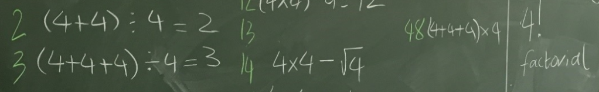

# Vier vieren



Het *vier vieren* probleem is een puzzel. Het doel is om steeds de meest *eenvoudige* rekenkundige uitdrukking te vinden voor elk geheel getal tussen 0 en een bepaald maximum door alleen maar rekenkundige symbolen (denk aan $+$ , $-$, $n^x$, $\sqrt{}$, $\times$, $!$, $\div$) en vier keer het cijfer 4 te gebruiken. Bijvoorbeeld, in de uitdrukking

$$
4 + 4 - 4 - 4 = 0
$$

zie je een combinatie van *vier vieren* en de symbolen $+$ en $-$ die gelijk is aan 0.

$$
\ldots = 1
$$

Het doel van deze opdracht is om

- een nieuw bestand aan kunnen maken
- dit bestand te bewerken in een teksteditor
-
- een resultaat op scherm krijgen met `print`
- en *niet* om jouw wiskundige kennis te testen!

```python
from math import *

print("Nul is", 4 + 4 - 4 - 4)
```

* Het **vier-vierenprobleem!** Voeg nu een aantal regels toe die lijken op die met nul om de waardes van `0` tot en met `20` te berekenen met ***precies vier vieren***. (Je kan ook een voldoende halen als je er een aantal overslaat waar je niet uitkomt!) Je mag alle rekenkundige bewerkingen van Python gebruiken:
    * `+` optellen
    * `-` aftrekken (of getal negatief maken)
    * `*` vermenigvuldigen
    * `/` delen
    * `( )` haakjes om de volgorde van de berekening aan te passen
    * `**` machtsverheffen
* Resultaten met een decimale punt: `1.0`, `2.0`, enz. zijn geen probleem!
* Je mag ook `44` of `4.4` gebruiken, die ieder als twee vieren tellen,
* of `.4`, die als één vier telt.
* of `sqrt`, bijvoorbeeld `sqrt(4)` (of andere wortels)
    * De waarde van `sqrt(4)`, de wortel van 4, is dat getal wat je met zichzelf moet vermenigvuldigen om 4 te krijgen. `2*2 == 4`, dus `sqrt(4) == 2`. Een ander voorbeeld: `sqrt(9) == 3`, want `3*3 == 9`.
* of `factorial`, bijvoorbeeld `factorial(4)` (of andere faculteiten)
    * De waarde van `factorial(4)`, 4 faculteit (ook wel geschreven als 4!) is `4*3*2*1`, dus `24`. Net zo is `factorial(2)` gelijk aan `2*1`, dus `2`, en `factorial(5)` gelijk aan `5*4*3*2*1`, dus `120`.
* `sqrt` en `factorial` komen allebei uit de module `math` van Python
* terzijde, de regel `from math import *` zorgt dat deze module beschikbaar is in de code

* Dit is hoe het resultaat, *maar niet je broncode*, eruit komt te zien.

  ```console
  Nul is 0
  Een is 1
  Twee is 2
  Drie is 3
  Vier is 4
  Vijf is 5
  Zes is 6
  Zeven is 7
  Acht is 8
  Negen is 9
  Tien is 10
  Elf is 11
  Twaalf is 12
  Dertien is 13
  Veertien is 14
  Vijftien is 15
  Zestien is 16
  Zeventien is 17
  Achttien is 18
  Negentien is 19
  Twintig is 20
  ```

* Misschien vind je de vier-vierenpuzzle verslavend, frustrerend, of allebei!

:::{admonition} Tip
:class: tip

Vergeet `sqrt` en `factorial` niet!
:::
