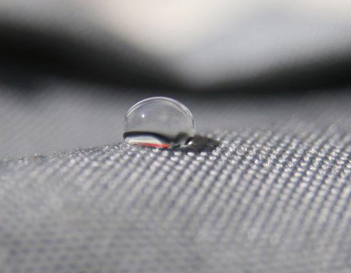

# Just add water

| Naam         | Beschrijving                                                   |
|--------------|----------------------------------------------------------------|
| Onderwerp    | Rekenen met water                                              |
| Bestandsnaam | `wk6ex0.txt`                                                   |
| Inleveren    | Lever jouw bestand met de juiste bestandsnaam in op GradeScope |

## Achtergrond

Je hebt inmiddels de lagere abstractielagen in een computer gezien. We bekijken hoe de basis van bijna alle kunstmatige computers het element silicium is, en specifiek hoe schakelingen worden ontworpen om functies met binaire invoer en uitvoer te berekenen.

***Maar*** informatie weergeven als binaire getallen in silicium schakelingen is slechts de manier die tegenwoordig het meest gebruikelijk is, het is zeker niet de enige!

## Het artikel

In het artikel van deze week krijg je een korte blik op een alternatief voor silicum-gebaseerde berekeningen: namelijk, computers die waterdruppels, bestuurd door een magnetisch veld, gebruiken als hun mechanisme voor het opslaan en manipuleren van informatie:

* [Just add water: Stanford engineers develop a computer that operates on water droplets](http://news.stanford.edu/news/2015/june/computer-water-drops-060815.html)

Als deze link niet werkt, kun je hier een gecachete pdf-versie vinden:

* [lokaal opgeslagen pdf-versie](https://github.com/misja/programmeren/raw/master/readings/assets/water_computer.pdf)

## De vragen

Schrijf, nadat je bovenstaande vragen gelezen hebt, een reactie die de onderstaande vragen beantwoordt. Lever dit in als een *plain text*-bestand `wk6ex0.txt`.

1.  Het artikel claimt dat de waterdruppelcomputer "universeel" is. Welke functionaliteit, op schakelingniveau, hebben de onderzoekers moeten laten zien om te kunnen beweren dat hun computer universeel is, dat wil zeggen, dat hun computer *alles* kan berekenen dat een normale computer ook kan?

2.  Het artikel vergelijkt de waterdruppelcomputer met onze normale siliciumcomputers door op te merken dat de druppelcomputer werkt door het verplaatsen van fysieke materie (water in plaats van electronen, in ieder geval). Voor zover biologische wezens "een soort computer" zijn (daar kunnen de meningen nog over verdeeld zijn), is de manier waarop ze berekeningen uitvoeren via het verplaatsen van materie, het verplaatsen van electronen, of een andere soort van fysieke interactie? Dit is ***geen*** vraag over neurowetenschap, en er is ook geen goed of fout antwoord. Het is een perspectiefvraag: wat denk jij dat het materiaal is dat biologsische computers manipuleren?

Ook hiervoor geldt dat je niet heel veel hoeft te schrijven: een alinea met iets van 4 of 5 zinnen is genoeg. Je antwoord moet *wel* laten zien dat je zorgvuldig over hebt nagedacht over de ideeën uit het artikel.
