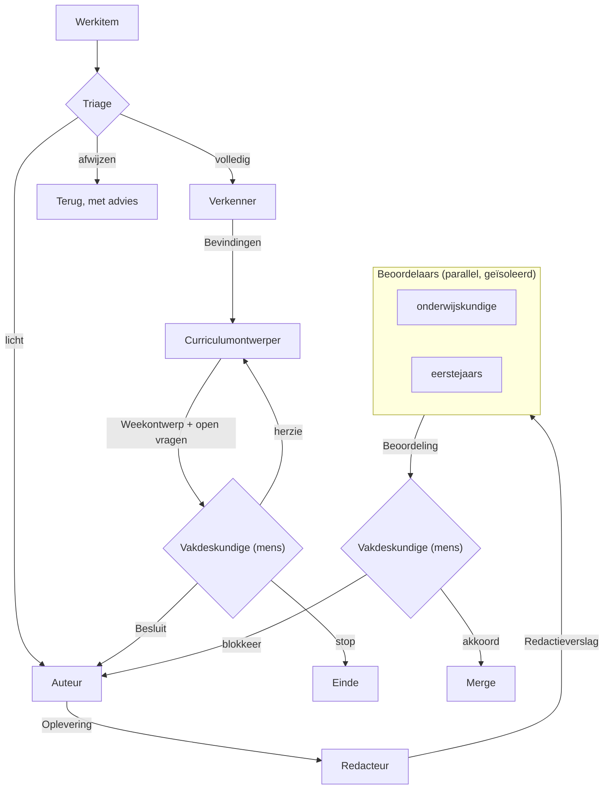

# Rollen

Dit document beschrijft hoe een herziening van het cursusmateriaal verloopt: in
welke stappen, wie wat doet, en wat er tussen die stappen wordt overgedragen.

Het is een bewerking van het [role loop](https://github.com/misja/agent-role-loop)-model
voor een redactieproces in plaats van een softwareproject. De vier principes
daaruit gelden onverkort; de rollen en de overdrachten zijn andere.

Dit document is voor auteurs en docenten, niet voor studenten. Het staat buiten
`source/` en maakt geen deel uit van het boek.

## Waarom dit er is

Deze repo is niet stukgegaan aan één slechte wijziging. Ze is stukgegaan aan
veel wijzigingen die ieder op zich verdedigbaar waren en samen de samenhang
hebben opgegeten. Opgaven verhuisd zonder hun context, een niveau hernoemd
waardoor de bedoeling verschoof, een opgave gehalveerd zonder de rest bij te
werken.

Daar helpt geen betere reviewer tegen. Daar helpt tegen dat iemand vóór elke
wijziging meet wat er staat, en dat elk besluit ergens landt waar de volgende
het terugvindt.

## De vier principes

Overgenomen uit het bronmodel, met wat ze hier betekenen.

**Contextisolatie.** Elke rol krijgt een eigen, verse context. Wie meet, moet
niet weten wat de uitkomst zou moeten zijn. Wie beoordeelt, moet niet de
worsteling van de auteur hebben gezien.

**Expliciete overdrachten.** Tussen twee rollen gaat precies één artefact. Wat
niet in dat artefact staat, is niet overgedragen. "Zoals besproken" bestaat niet.

**Proportionaliteit.** Een typefout doorloopt niet zeven stappen. Een hele week
herzien wel.

**De mens in de lus.** Bij dit materiaal is dat geen formaliteit maar een
noodzaak, en op een manier die het bronmodel niet kent. Zie hieronder.

## Twee afwijkingen van het bronmodel

### Meten is een eigen stap, en komt eerst

In het bronmodel verkent de planner terwijl hij plant. Dat werkt hier niet.

Bij het herzien van de weken 3 en 6 werd zes keer een aanname omvergeworpen door
een meting, en dat waren geen kleinigheden: recursie bleek niet verkeerd
geplaatst maar bewust smal gehouden; muterende lijstmethodes bleken in PGM1
helemaal niet voor te komen; de leesopgaven bleken geen vergeten maar een
besluit; de dunste week van de cursus bleek dun door een besluit en niet door
slordigheid.

Wie meet met een hypothese in het hoofd, meet naar die hypothese toe. Daarom is
de **verkenner** een aparte rol die alleen feiten oplevert en geen voorstellen
doet.

### De vakdeskundige is een bron, geen poort

In het bronmodel keurt de mens een plan goed. Hier houdt de vakdeskundige
informatie vast die nergens anders bestaat: waarom recursie is verplaatst, dat
de leesopgaven zijn losgelaten, dat een vraag met opzet onoplosbaar is, welke
besluiten politiek zijn en dus niet met argumenten te heropenen.

Die kennis is niet af te leiden uit de repo. Ze moet gevraagd worden, en
daarom staat de vakdeskundige niet alleen achteraan als poort maar ook
vooraan als bron. Elke ontwerpstap eindigt met de vragen die alleen hij kan
beantwoorden.

Daaruit volgt een harde regel: **een besluit dat niet in `curriculum/` landt, is
niet genomen.** Dat is precies wat er eerder is misgegaan.

## De stappen



| Stap | Rol | Krijgt | Levert |
|---|---|---|---|
| Triage | [triage](triage.md) | werkitem | route |
| Meten | [verkenner](verkenner.md) | werkitem | bevindingen |
| Ontwerpen | [curriculumontwerper](curriculumontwerper.md) | bevindingen, `curriculum/` | weekontwerp, open vragen |
| Beslissen | [vakdeskundige](vakdeskundige.md) — **mens** | weekontwerp | besluit, vastgelegd |
| Schrijven | [auteur](auteur.md) | besluit, `conventies/` | oplevering |
| Repareren | [redacteur](redacteur.md) | oplevering | redactieverslag |
| Beoordelen | [onderwijskundige](onderwijskundige.md), [eerstejaars](eerstejaars.md) | oplevering | beoordeling |
| Vegen | [eindredacteur](eindredacteur.md) | de hele cursus | bevindingen |

De eindredacteur staat buiten de lus. Die draait periodiek over het geheel, niet
per werkitem, omdat samenhang over weken heen niet zichtbaar is vanuit één week.

Zijn bevindingen worden meestal geen losse werkitems maar **doorlopende** issues:
staande zorgen die overal spelen en nooit af zijn. Die blijven open als
verzamelplek, en het werk eraan gaat mee met de sectie die toch al herzien wordt.
Zie [triage](triage.md).

## Hoe dit op GitHub loopt

De overdrachten zijn geen losse bestanden maar GitHub-artefacten. Daarmee staat
de hele geschiedenis van een wijziging op één plek, en is te zien wie wat wanneer
heeft besloten.

| Overdracht | Waar het staat |
|---|---|
| Werkitem | Een **issue**, aangemaakt met het sjabloon |
| Route | Label `route: doen`, `route: licht` of `route: volledig` |
| Bevindingen | Reactie op de issue |
| Weekontwerp | Reactie op de issue, met de open vragen apart |
| Besluit | Reactie van de vakdeskundige, plus de verwijzing naar wat er in `curriculum/` is vastgelegd |
| Oplevering | Een **pull request**, met het sjabloon ingevuld |
| Redactieverslag | Reactie op de pull request |
| Beoordeling | Een **review** op de pull request, per beoordelaar één |
| Akkoord | De vakdeskundige merget |

De stap waarin een werkitem zit, staat in het veld **Status** op het
[projectbord](https://github.com/orgs/hanze-hbo-ict/projects/4): Triage, Meten,
Ontwerpen, Besluit, Schrijven, Redactie, Beoordeling, Klaar.

Wie een stap afrondt, plaatst zijn artefact en zet de status door. Blijft een
werkitem op *Besluit* staan, dan wacht het op een mens, en dat hoort zichtbaar te
zijn.

### Branches en pull requests

Commits op `master` zijn geblokkeerd door een pre-commit hook. Elk werkitem
krijgt dus een eigen branch, genoemd naar waar het over gaat: `week-6`,
`bestanden-in-pgm1`, `midterm-mutatie`.

De pull request sluit de issue, zodat het werkitem dichtgaat op het moment dat
het werk erin zit en niet eerder. Schrijf daarvoor bovenaan de beschrijving:

```text
Closes #12
```

Dat sleutelwoord moet **Engels** zijn. GitHub herkent `close`, `closes`,
`closed`, `fix`, `fixes`, `fixed`, `resolve`, `resolves` en `resolved`, en verder
niets. Een Nederlandse variant als *Sluit #12* leest prima en doet niets: de
issue blijft dan gewoon openstaan nadat de pull request is gemerged.

Eén pull request per werkitem. Een tweede onderwerp erbij nemen omdat je er toch
zit, maakt de beoordeling onmogelijk: dat is een nieuw werkitem.

### Een pull request bekijken

Een diff laat zien wat er is veranderd, niet hoe het eruitziet. Bij een diagram,
een tabel of een admonition is dat precies het verkeerde: je moet de pagina zien.

```bash
make review PR=87   # haalt de branch op, bouwt, en opent de gewijzigde pagina's
make terug          # terug naar master
```

Dat is goedkoper dan het lijkt. De notebookcache staat buiten git en overleeft
een branchwissel, dus een build waarin geen notebooks zijn veranderd duurt een
paar seconden. Alleen als er notebooks bij zitten die opnieuw uitgevoerd moeten
worden, loopt het op.

`make review` opent precies de pagina's die de pull request raakt, niet de hele
site. Levert een gewijzigd bronbestand geen pagina op, dan zegt het dat: meestal
betekent dat het bestand niet in de inhoudsopgave staat.

:::{note}
Een preview-URL per pull request zou nog prettiger zijn, maar deze site
publiceert via GitHub Pages met workflow-deployment, en daarbij vervangt elke
deployment de hele site. Previews naast productie zouden terug moeten naar een
`gh-pages`-branch of naar een externe dienst. Dat weegt niet op tegen een build
van een paar seconden.
:::

### Wat er ondanks GitHub geldt

**Een reactie is een artefact, geen gesprek.** De bevindingen zijn één reactie
met alles erin, niet zeven losse opmerkingen door de draad heen. Wie later
terugleest moet de overdracht in één keer kunnen lezen.

**Wat niet in het artefact staat, is niet overgedragen.** Ook niet als het
ergens anders in de draad staat, en zeker niet als het buiten GitHub is
besproken.

**Een besluit hoort in `curriculum/`, niet alleen in de issue.** Een issue wordt
gesloten en verdwijnt uit het zicht; het besluitenregister is waar de volgende
persoon kijkt.

## De overdrachten

Wat er in elk artefact hoort. Een veld dat je niet kunt invullen laat je leeg
met `<geen>`; er iets plausibels neerzetten is erger, want dat is verzonnen
precisie waar de volgende rol op vertrouwt.

**Bevindingen** — feiten, geen oordeel.

- Wat er staat: bestanden, omvang, structuur, per niveau
- Wat het materiaal doet tegenover wat `conventies/` voorschrijft
- Wat de leerlijn en de toetsmatrijs voor deze week vragen
- Wat `v1.0.0` op deze plek had, en wat daarvan over is
- Vooruitverwijzingen: begrippen die eerder gebruikt worden dan geïntroduceerd
- Elke bewering met de meting erbij

**Weekontwerp** — wat de week wordt.

- Per niveau wat er komt te staan, en waarom dat de leeruitkomst dekt
- Wat blijft, wat verdwijnt, wat wordt teruggehaald uit `v1.0.0`
- De spanningen, benoemd, met een aanbeveling per stuk
- **Open vragen voor de vakdeskundige**, expliciet gescheiden van de rest
- Wat dit doet met de weken ervoor en erna

**Besluit** — van de mens.

- Antwoord op elke open vraag, of expliciet uitstel
- Wat er in `curriculum/` is vastgelegd, met verwijzing
- Akkoord, herziening met genoemde wijzigingen, of stop

**Oplevering** — van de auteur.

- De gewijzigde bestanden
- Bewijs dat het werkt: welke assertions draaien, dat de build schoon is, dat de
  hooks slagen
- Waar van het ontwerp is afgeweken, en waarom

**Redactieverslag** — wat er is gerepareerd, en wat opzettelijk is blijven staan.

**Beoordeling** — bevindingen, geen correcties, elk met de plek in het materiaal.

## Verificatie

Een oplevering zonder bewijs is geen oplevering. Wat hier telt als bewijs:

| Soort materiaal | Bewijs |
|---|---|
| Opgave met testcellen | De uitwerking draait tijdens de build en alle assertions slagen |
| Opgave met verwachte uitvoer | Die uitvoer is nagerekend tegen de echte databestanden |
| Elk bestand | `uv run pre-commit run --files ...` slaagt |
| Elke wijziging | `uv run make html` bouwt zonder waarschuwingen |

Verwachte uitvoer die niet is nagerekend, is een fout die wacht. In week 6 stond
er `139.3` waar Python `139.29999999999998` zegt.

## Proportionaliteit

| Omvang | Route |
|---|---|
| Een typefout, een dode link, een naam rechtzetten | Doen. Hooks en build zijn genoeg. |
| Eén opgave herzien, een sectie toevoegen | Licht: auteur, redacteur, mens. |
| Een week herzien | De volledige lus. |
| Een vak herindelen | Te groot. Eerst opsplitsen in weken. |
| Beeldkwaliteit, terminologie, dode verwijzingen | Doorlopend. Blijft open, gaat mee met de sectie die toch herzien wordt. |

Bij twijfel tussen licht en volledig telt hoe moeilijk het terug te draaien is.
Materiaal weggooien of een leeruitkomst verplaatsen verdient de volledige lus,
ook als de wijziging klein oogt.
