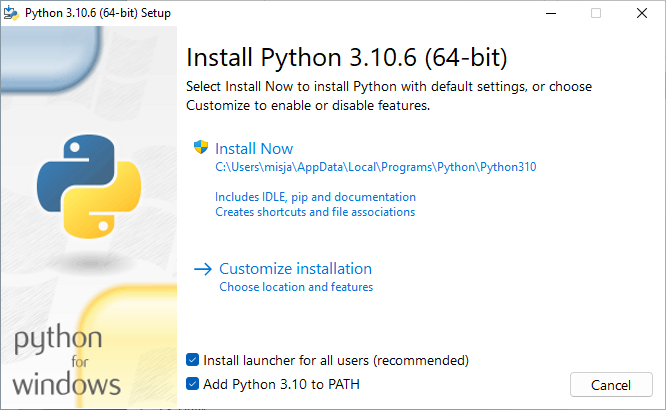
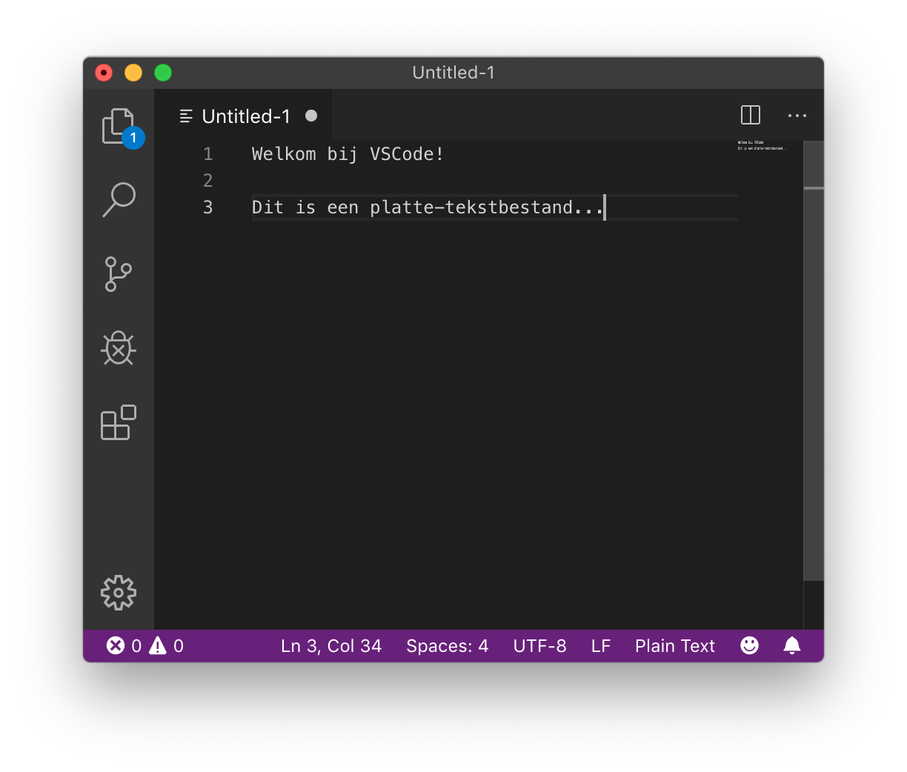
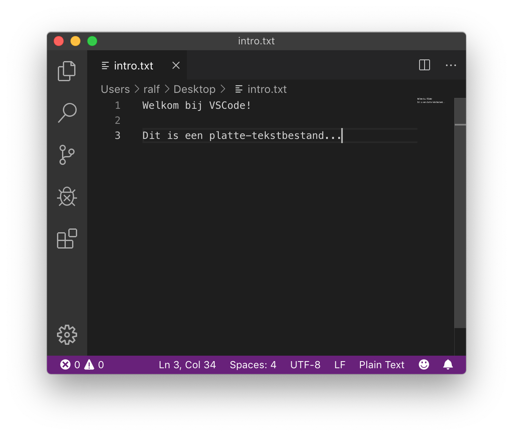
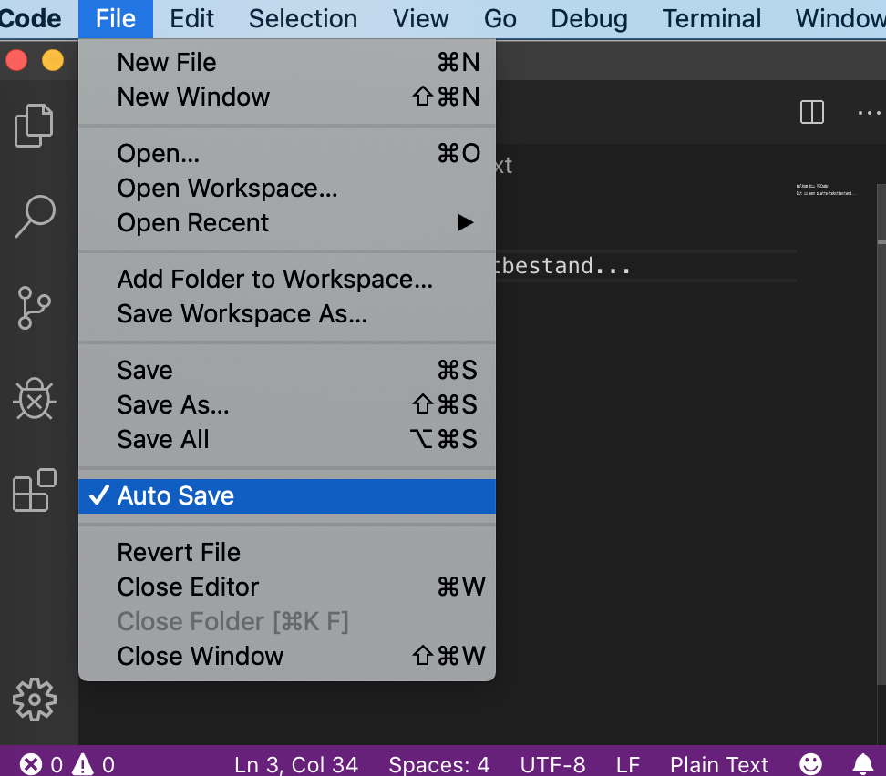
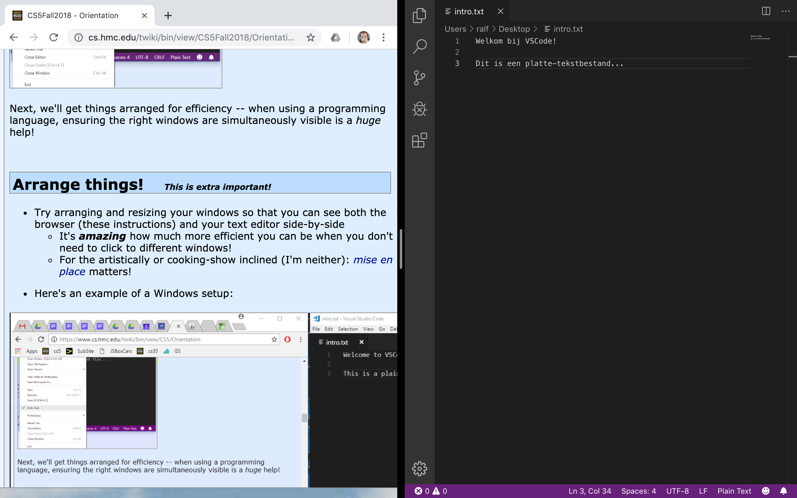
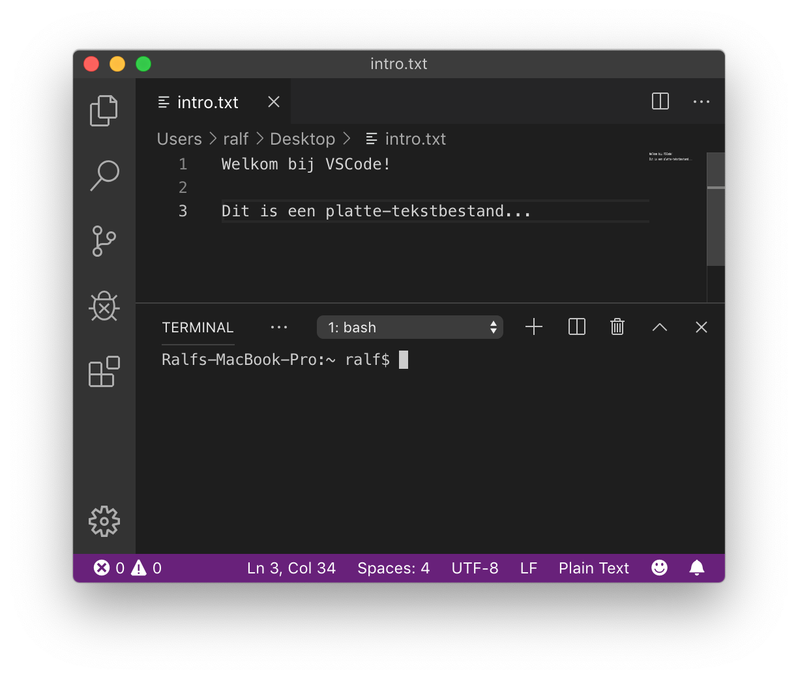
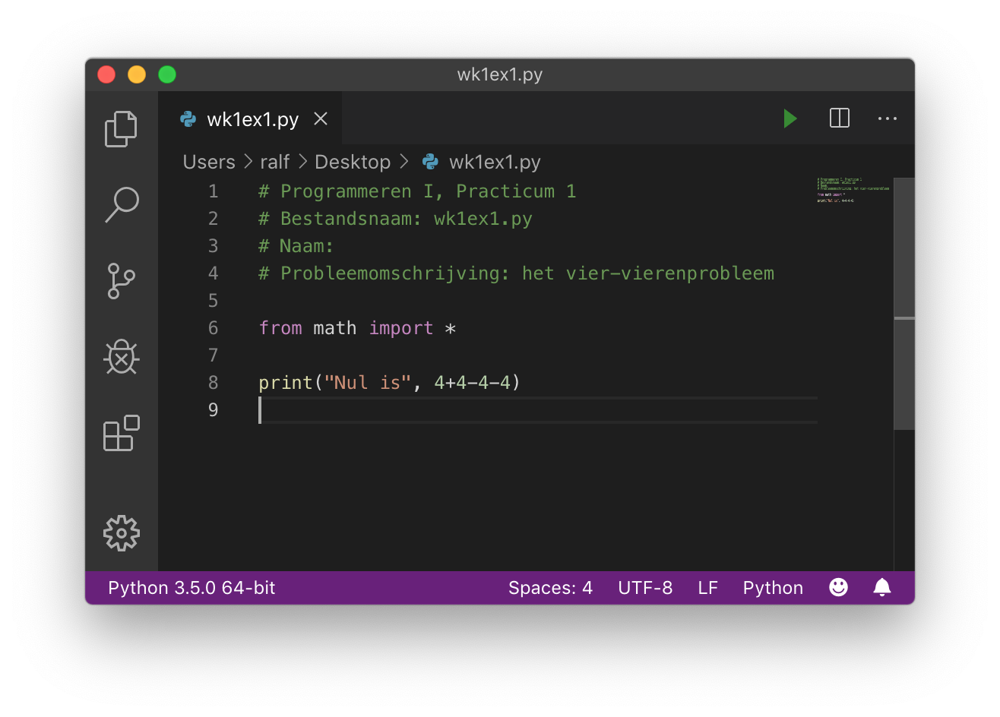

# Python installeren

Het **doel** van deze opgave is om:

* Te zorgen dat je Python en een teksteditor geïnstalleerd krijgt op je computer
* Om een "Hallo"-programma te lezen, bewerken en uitvoeren in Python

## De software installeren

### Welke software gebruiken we?

We gebruiken bij Programmeren software die je misschien nog niet hebt. Je hebt de volgende programma's nodig:

* **Python**; wij gebruiken de laatste versie van [python.org](https://python.org).
* **Een teksteditor**; geen tekstverwerker; om je Python-bestanden te bewerken. We raden [VSCode](https://code.visualstudio.com/) aan, een gratis, veel gebruikte tekstverwerker die beschikbaar is voor alle besturingssystemen (macOS, Windows en Linux). *Als je al een favoriete teksteditor hebt, kan je die ook gebruiken.*

### Downloaden en installeren

`````{tab-set}

````{tab-item} Windows
Download en installeer Python van [python.org](https://www.python.org/downloads/windows/).

```{caution}
Tijdens het installeren zal worden gevraagd of je Python aan `PATH` zou willen toevoegen, kies hier voor!


```
````

````{tab-item} macOS
Sinds macOS 11.0 ("Big Sur") is Python versie 3 op macOS standaard geïnstalleerd maar dit is vaak een oudere versie. We raden je aan de laatste versie van [python.org](https://www.python.org/downloads/macos/) te downloaden en te installeren.
````

````{tab-item} Linux
Linux gebruikers hebben het gemakkelijker, als je een up-to-date distributie als bijvoorbeeld Ubuntu, Mint of Arch hebt dan zal je ook een recente Python versie standaard al geïnstalleerd hebben. Controleer dit als volgt op een terminal:

```console
python3 --version
```
````

`````

### Wacht, ik heb Python al

Geen probleem! Zorg er in ieder geval voor dat het een recente versie is.

## VSCode installeren

Visual Studio Code (VSCode) is een gratis teksteditor, met hulpmiddelen voor het bewerken van software broncode, bijvoorbeeld Python.

Download en installeer VSCode van [https://code.visualstudio.com/](https://code.visualstudio.com/).

## VSCode als editor gebruiken

### Probeer VSCode, een *teksteditor*

* Teksteditors zijn niet hetzelfde als tekstverwerkers.
  * Microsoft Word, Google Docs, Pages van Apple of elke andere *tekstverwerker* kan tekst mooi opmaken
    * Maar ze geven je *geen* rechtstreekse toegang tot de daadwerkelijke inhoud van een bestand!
  * Ze bevatten speciale, onzichtbare tekens met informatie over de opmaak
  * Aangezien programmeertalen ***platte tekst*** (strings met karakters) gebruiken, zijn (platte-)teksteditors de geschikte tool om in te programmeren!
* Start dus je teksteditor op; vermoedelijk VSCode, als je die net geïnstalleerd hebt...
* Sluit de introductietabs (je kan VSCode vertellen deze niet meer te tonen) en zorg dat je een "leeg bestand" (een leeg venster) ziet.
  * Type daarna wat tekst, zoals bijvoorbeeld:

    
* Sla dit bestand op als `intro.txt`
  * Dat kan op je bureaublad of in een speciale directory voor Programmeren I; dat mag je zelf bepalen. Dit ziet er dan ongeveer zo uit:

    
* ***Automatisch opslaan!***; het is een goed idee om VSCode in te stellen zodat deze al je bestanden automatisch opslaat
  Deze optie kan je hier vinden:

  

## VSCode configureren

Het mooiste van een editor als VSCode is dat het extensies ondersteunt. Extensies zijn toevoegingen, soms geschreven door de VSCode ontwikkelaars, soms gebruikers zoals jij en ik. Deze toevoegingen zorgen ervoor dat jij nog makkelijker kan leren programmeren!

### Extensies toevoegen

Als je VSCode geopend hebt, kan je in de linker balk het extensies menu openen. Bovenin heeft deze een zoek balk. De volgende extensies kunnen we van harte aanraden:

* **'Python' van Microsoft.** Deze bevat een paar losse tools, en maakt het vooral mogelijk voor andere python tools om te functioneren. Deze module komt met 'Pylance' en 'Python Debugger' (allebei ook van Microsoft).
* **Een linter.** Je kan kiezen voor 'Pylance' die meegeleverd wordt met de 'Python' extensie, of een andere gebruiken. In het docenten team worden 'Flake8' (Microsoft) en 'Black' (Mikoz) gebruikt.

### Extensies verwijderen

Wanneer je VSCode installeert, worden automatisch een aantal extensies mee geïnstalleerd. Terwijl deze extensies heel handig kunnen zijn op de werkvloer, zitten ze het leerproces dwars. Daarom raden we je aan ze voor nu te deïnstalleren of uit te zetten:

* **'GitHub Copilot' van GitHub.** Zet deze uit. Niet omdat AI verboden is in deze opleiding, maar omdat automatische suggesties precies dat wegnemen waar je nu voor komt.

  Programmeren leer je door vast te lopen. Je typt iets, het werkt niet, je zoekt uit waarom, en dát is het moment waarop je iets leert. Een suggestie die verschijnt voordat je hebt nagedacht, slaat dat moment over. Je krijgt code die werkt en je hebt niets geleerd, en dat merk je pas bij het tentamen.

  Er is een tweede reden, en die is praktischer: je kan een suggestie nu nog niet beoordelen. Copilot heeft er geen moeite mee om met grote stelligheid iets voor te stellen dat subtiel fout is. Wie de taal kent ziet dat; wie hem leert niet. Later in de opleiding, als je wél kan zien of een suggestie deugt, wordt hetzelfde gereedschap juist nuttig.

### Instellingen instellen

VSCode kent twee soorten instellingen: **per user** (voor alles wat je opent) en **per workspace** (alleen voor die ene projectmap). Zet deze **per user**, dan gelden ze het hele vak door en hoef je er niet meer aan te denken.

Dat je het per user uitzet, betekent niet dat je vastzit. Werk je aan een eigen project waar je AI wél wil gebruiken, dan zet je het daar per workspace weer aan; de instelling van dat project wint dan van je algemene instelling. De keuze blijft dus van jou. Voor het materiaal van dit vak raden we aan het uit te laten.

Deze instellingen zijn heel handig:

* **Autosave.** Zie hierboven.
* **chat: disable AI features**. Om deze instelling te vinden, zoek je op 'chat.disable'. Hiermee verdwijnen ook de chat- en suggestievensters die los van Copilot meekomen.

We gaan nu je vensters herschikken zodat je efficiënter kan gebruiken; als je aan het programmeren bent kan het *erg veel* helpen als je zorgt dat de goede vensters tegelijk zichtbaar zijn!

## AI gebruiken in dit vak

Je hebt hierboven de automatische suggesties uitgezet. Dat betekent niet dat je geen AI mag gebruiken, wel dat je hem anders inzet dan je misschien gewend bent.

**Niet als antwoordmachine.** Vraag hem niet je opgave op te lossen. Je krijgt dan code die je niet begrijpt, waar je in de volgende week op vastloopt, en die je bij het tentamen niet hebt.

**Wel als tutor.** Een taalmodel is geduldig, legt hetzelfde vier keer op vier manieren uit, en klaagt niet als je iets vraagt dat je eigenlijk al zou moeten weten. Dat is precies wat je nodig hebt.

Het verschil zit in hoe je het vraagt. Vergelijk:

```text
Schrijf een functie die het grootste van drie getallen teruggeeft.
```

```text
Ik moet een functie schrijven die het grootste van drie getallen teruggeeft.
Geef me alsjeblieft geen code en geen antwoord. Stel me vragen die me stap
voor stap naar de oplossing leiden, en laat me het zelf bedenken. Ik ken op
dit moment alleen variabelen, if/elif/else en print.
```

De tweede vraag levert je een gesprek op waarin je zelf op het antwoord komt. Dat kost meer tijd dan de eerste, en dat is de bedoeling: die tijd *is* het leren.

Twee dingen die daarbij helpen:

* **Zeg wat je al kent.** Anders krijg je een oplossing met gereedschap dat je nog niet hebt gehad, en dan snap je het antwoord niet en je eigen code ook niet meer.
* **Vraag om uitleg van je eigen code, niet om nieuwe code.** "Waarom geeft dit een foutmelding?" en "wat doet deze regel precies?" zijn goede vragen. Daar leer je van, en je houdt de code van jezelf.

## Vensters herschikken! (dit is handig!)

* Probeer je vensters zo te herschikken en in grootte aan te passen zodat je tegelijk je browser (met deze instructies) en je teksteditor, naast elkaar, kan zien.
  * Het is ***belachelijk*** hoe veel efficiënter je wordt als je niet steeds tussen vensters hoeft te wisselen.
  * Mocht je artistiek zijn of van kookprogramma's houden: [*mise-en-place*](https://nl.wikipedia.org/wiki/Mise-en-place) is belangrijk!
* Hier is een voorbeeld van een Mac-omgeving:

  

* Neem even een kijkje in de menu's van VSCode. Je kan bijkvoorbeeld in *View* de optie *Hide Status Bar* en *Hide Activity Bar* kiezen, maar het kleurenschema veranderen is nog leuker!
* **Kleurenschema!** Besteed niet te veel tijd hieraan, maar voel je vrij om je favoriete kleurenschema te kiezen voor VSCode (menu's: File/Code ... Preferences ... Color Theme). Dit is erg leuk, misschien zelfs [te leuk](https://code.visualstudio.com/docs/getstarted/themes)...

Hierna ga je een *terminalvenster* openen...

## Het terminalvenster

In de teksteditor VSCode kan je een terminal open door in het menu *View* en dan *Terminal* te kiezen. Je scherm wordt nu opgesplitst:



De bovenste helft is nog steeds de teksteditor.

***De onderste helft is nu je terminalvenster.***

Ok! We zijn nu klaar voor Python.

## Python in een *bestand* uitvoeren

We hebben al een teksteditor open staan!

Maak dus in een nieuwe tab een nieuw, leeg bestand (via het menu *File* en daaronder *New File*)

Plak (of typ) onderstaande code in het nieuwe bestand

```python
# Programmeren I, Practicum 0
# Naam:
# Probleemomschrijving: Hello world

print("Hello World")
```

Sla dit bestand op als `hello.py` in je programmeerdirectory.

* Hierna kan je je Python-programma's overal opslaan; het is handig om ze te organiseren in directories.
* Vergeet **niet** om de extensie `.py` toe te voegen
* Als je het bestand opslaat met de extensie `.py` (zoals we dat noemen), zie je dat de Python-code *gekleurd* wordt.
  * Dit wordt ook wel *syntax highlighting* genoemd
  * Als je code niet kleurt, vraag het ons! Het is belangrijk dat je deze kleurrijke aanwijzingen hebt voor de structuur van je programma. Hier is een voorbeeld:

    

* **Een bestand uitvoeren!**

  Om een bestand uit te voeren, moet je weer naar de terminal gaan.
  * Type `ls`( mac) of `dir` (windows) om de bestanden in de huidige directory te zien
  * Zorg dat je je bestand `hello.py` ziet!
    * Als je hem niet zien, gebruik dan `cd ..` of `cd Desktop` of andere combinaties om naar de juiste directory te gaan.
  * Typ op de prompt `python hello.py` (je kan hier tab completion voor gebruiken). Als je de melding krijgt dat python niet gevonden is kan het zijn dat de Path variabele niet goed is ingesteld (Windows).
  * Dit voert het bestand `hello.py` uit.
  * Als alles goed gaat wordt het programma uitgevoerd en zie je de uitvoer.
  * Je kan nu je bestand bewerken, opnieuw opslaan en *pijltje omhoog* drukken om het opnieuw uit te voeren.
