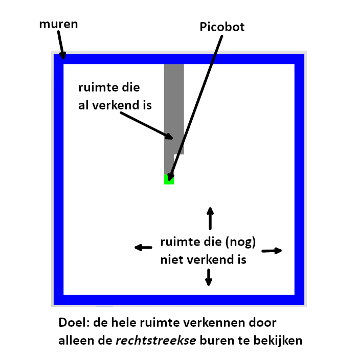
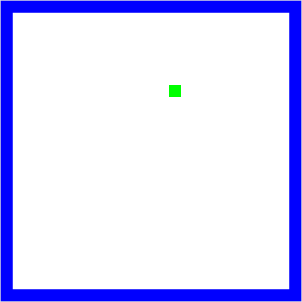
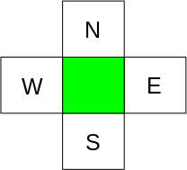
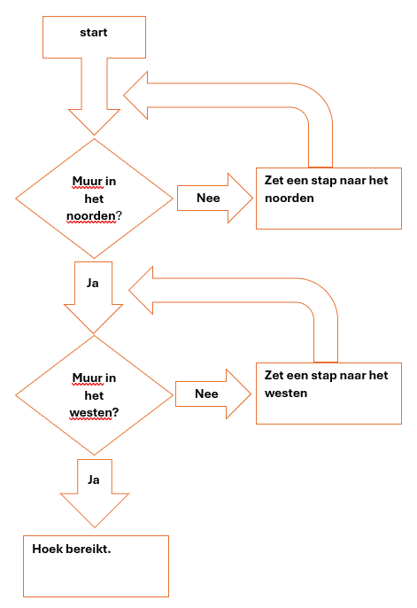
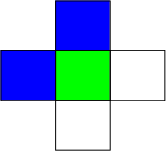
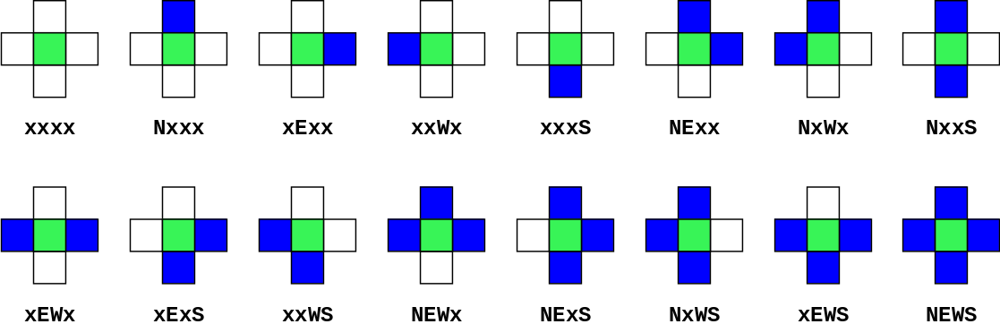
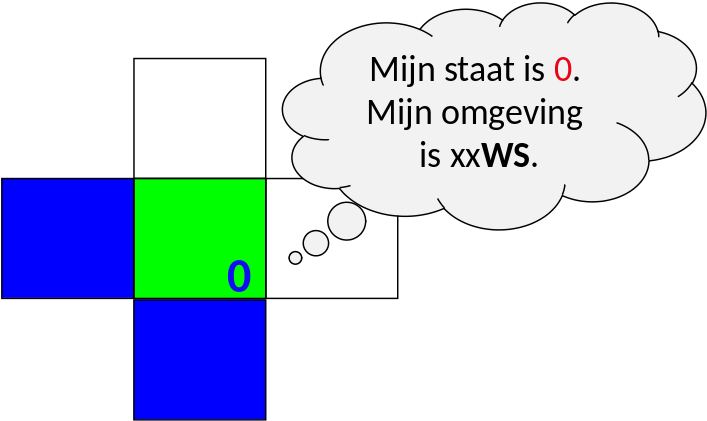
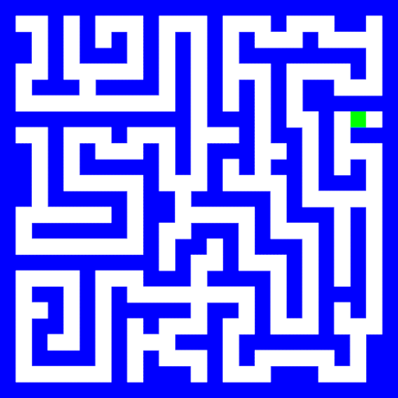

# Picobot

Je hebt vast wel eens gehoord van een robotstofzuiger. Dit is een robot die automatisch door de hele kamer overal omheen kan stofzuigen. De meest eenvoudige robotstofzuiger heeft geen geavanceerde sensoren om de hele kamer te scannen. Ze hebben enkel een bumper om te weten of ze ergens tegenaan rijden. Ze zijn dus vrijwel blind en tóch krijgen ze het voor elkaar de hele kamer te stofzuigen.

Ons doel is om een robot zo te programmeren dat deze overal komt in een lege kamer. Het programma dat we hiervoor gaan gebruiken is Picobot: [https://www.cs.hmc.edu/picobot/](https://www.cs.hmc.edu/picobot/). Dit is een zeer bijziend robotje en kan dus alleen een obstakel zien dat heel dichtbij is. Het is ook heel voorzichtig en zal per instructie maar 1 stap zetten.



Picobot is een [state machine](/lectures/1a_intro_programmeren.md#state-machine): hij onthoudt één ding, zijn staat, en wat hij doet hangt af van die staat en van wat hij om zich heen ziet.

## Naar de hoek

Picobot staat op een willekeurige locatie in een lege kamer.



Picobot ziet alleen maar het vakje noord, oost, west en zuid en kan bepalen of daar een obstakel is.



Welke set instructies heeft Picobot nodig om de linkerbovenhoek te bereiken?

### Oplossing

1. Rij naar het noorden.
2. Stop als er een obstakel in het noorden ligt.
3. Rij naar het westen.
4. Stop als er een obstakel in het westen ligt.
5. Doel is bereikt.

Hoe ziet de [beslissingsboom](/lectures/1a_intro_programmeren.md#beslissingsboom) eruit die bij deze set instructies hoort?



Na het ontwerpen van een plan, in dit geval een beslissingsboom, is de volgende stap om deze daadwerkelijk te programmeren. Picobotjes spreken hun eigen taal. Het doel is dus om de instructies te vertalen zodat Picobot ze uit kan voeren.

## Picotaal

Picobot ziet alleen maar ten N, E, W, en S

(In het Nederlands zou dat NOWZ zijn: Noord, Oost, West, Zuid. Maar je typt de Engelse letters, dus **NEWS**.)

Picobot kan dus alleen maar ten (N) noorden, (E) oosten, (W) westen en (S) zuiden kijken, en niet bijvoorbeeld noord-west! We gaan de volgende notatie gebruiken om de omgeving aan te duiden: **`xxxx`**. Als Picobot muren ziet dan zal het in de notatie volgens NEWS worden aangegeven, bijvoorbeeld:



**`NxWx`**

In dit geval geven we aan dat ten (N) noorden en (W) westen zich een muur bevindt en ten oosten en zuiden lege ruimte, daar blijft **`x`** staan. De huidige omgeving kan dus worden beschreven door **`NxWx`**.



### De staat

De huidige staat waarin Picobot zich bevindt.

Het geheugen van Picobot is een *enkel* getal en start altijd met `0`. Dit representeert de huidige staat. *Staat* en *omgeving* is alles wat Picobot kent van de wereld!



Dat getal loopt van `0` tot en met `99`; meer geheugen heeft Picobot niet. Een staat zegt in welke situatie een berekening zich bevindt; bij Picobot lees je elke staat als één gedrag. In het uitgewerkte voorbeeld verderop, [De hoek in](#de-hoek-in), is staat `0` "rij naar het noorden" en staat `1` "rij naar het westen". Welk gedrag bij welk nummer hoort kies je zelf; het staat nergens vast.

### De regels

Het combineren van omgeving en staat in regels om door Picobot te worden uitgevoerd.

Bijvoorbeeld, twee mogelijke regels:

|           | Huidige staat | Omgeving   |   Stap   | Richting | Nieuwe staat |
|-----------|---------------|------------|:--------:|----------|--------------|
| *regel A* |    **`0`**    | **`Nxxx`** | **`->`** |  **`S`** |    **`0`**   |
| *regel B* |    **`0`**    | **`xxxx`** | **`->`** |  **`N`** |    **`0`**   |

Lees een regel (bijvoorbeeld regel A) als volgt: *als* de huidige staat van Picobot `0` is en de omgeving gelijk is aan **`Nxxx`**, neem dan één stap richting (S) zuid en zet de *nieuwe* staat op `0`.

Zoals je straks kunt zien, zal je een regel als volgt voor Picobot kunnen schrijven (syntax):

**`0 Nxxx -> S 0`**

De richting is `N`, `E`, `W`, `S` of `X`. De eerste vier zijn de kant waarop Picobot een stap zet; **`X`** betekent *blijf staan*, en die heb je nodig als je alleen van staat wilt wisselen.

Na elke stap zoekt Picobot opnieuw de regel die bij zijn *staat* en *omgeving* hoort, en voert die uit.

### Wildcards

Een optionele aanduiding van de omgeving

|           | Huidige staat | Omgeving   |   Stap   | Richting | Nieuwe staat |
|-----------|---------------|------------|:--------:|----------|--------------|
| *regel A* |    **`0`**    | **`x***`** | **`->`** |  **`S`** |    **`0`**   |

Met een asterisk (\*) kan je aangeven dat een bepaalde richting optioneel is. In dit voorbeeld **moet** het (N) noorden leeg zijn, (E) oost, (W) west en (S) zuid **mogen** zowel leeg als gevuld zijn.

Eén regel met sterretjes vervangt dus een reeks regels zonder. Stel dat **`0 x*** -> N 0`** de enige regel is en Picobot start onderin een lege kamer. Hij ziet **`xxxS`**: geen muur ten noorden, dus hij rijdt naar het noorden. Daarna **`xxxx`**: de regel past opnieuw. Zo rijdt hij door tot hij bovenin **`Nxxx`** ziet; nu is er wél een muur ten noorden en staat hij stil.

## De hoek in

Doel is om Picobot instructies te geven om zich naar de hoek te begeven. Eerst was er een plan opgesteld:


Picobot begint altijd in staat 0

1. Check of er een muur in het noorden is. (**`x***`**)
   Als er geen muur is, doe dan een stap naar het noorden. (**`N 0`**)
   **`0 x*** -> N 0`**

2. Als er wel een muur is (**`N***`**), blijf staan en wissel van staat.
   **`0 N*** -> X 1`**

3. Check of er een muur in het westen is. (**`**x*`**)
   Als er geen muur is, doe dan een stap naar het westen. (**`W 1`**)
   **`1 **x* -> W 1`**

Volledige code:

```text
# staat 0 rijdt naar het noorden
0 x*** -> N 0   # geen muur ten noorden: stap naar het noorden
0 N*** -> X 1   # muur ten noorden: blijf staan en ga naar staat 1

# staat 1 rijdt naar het westen
1 **x* -> W 1   # geen muur ten westen: stap naar het westen
```

In staat 0 wordt er naar het noorden gereden. In staat 1 wordt er naar het westen gereden.

Alles na een hekje (`#`) is commentaar: uitleg voor jou, die Picobot overslaat. Lege regels ook. Schrijf er per staat bij welk gedrag die staat vertoont; dat is wat je bij vier of vijf staten overeind houdt.

Voor elke combinatie van staat en omgeving mag er **precies één** regel zijn. Past er geen, dan stopt Picobot; overlappen er twee, dan weigert de simulator je hele programma met de melding `Repeat Rule!`. Hierboven dekken **`0 x***`** en **`0 N***`** samen alle zestien omgevingen van staat 0, zonder overlap. De volgorde waarin je typt maakt dus niets uit: de sterretjes bepalen alles.

## Opdracht 1: De lege kamer

- **Stap 1: Proberen.** Ga op papier uitzoeken wat een efficiënte manier is om een lege kamer in zijn geheel te verkennen.
- **Stap 2: Plan.** Maak een beslissingsboom voor het verkennen van een lege kamer.

Je bent klaar als je je eigen boom kan volgen vanaf drie startvakjes - bij een muur, in een hoek en middenin - zonder ergens uit te komen waar de boom geen tak heeft.

## Opdracht 2: Het doolhof



- **Stap 1: Proberen.** Ga op papier uitzoeken wat een efficiënte manier is om een doolhof te verkennen.
- **Stap 2: Plan.** Maak een beslissingsboom om een doolhof te verkennen.

Je bent klaar als je plan voor elke situatie in het doolhof zegt wat Picobot doet: een gang, een splitsing en een doodlopend punt. Loop ze alle drie op de tekening na.

## Complexiteit

Doe eerst Opdracht 2 zelf. Hieronder staat een strategie voorgedaan, en die is minder leerzaam als je hem leest voordat je zelf hebt geprobeerd.

In de kern probeert informatica vragen over complexiteit te beantwoorden door aan te tonen dat problemen makkelijker zijn dan gedacht of, soms, door te bewijzen dat ze *niet* efficiënter kunnen worden opgelost.

Hoe *efficiënt* jouw oplossing is kan je meten aan het aantal staten of het aantal regels dat je gebruikt. Het kortste programma voor een lege ruimte telt **6 regels**, dat voor het doolhof hierboven **8 regels**. Met maar *twee* extra regels valt dit ogenschijnlijk veel complexere probleem dus op te lossen.

### De right hand rule

Eén mogelijke strategie is de *right hand rule*: volg de wand steeds aan één kant. Dat mag links of rechts zijn, zolang je maar consequent dezelfde kant aanhoudt. Zie [Maze solving algorithm](https://en.wikipedia.org/wiki/Maze_solving_algorithm) op Wikipedia.

Om links van rechts te onderscheiden moet Picobot weten welke kant hij op kijkt, en daar heeft hij één plek voor: zijn staat.

- staat **`0`** = hij kijkt naar (N) noord
- staat **`1`** = hij kijkt naar (E) oost
- staat **`2`** = hij kijkt naar (W) west
- staat **`3`** = hij kijkt naar (S) zuid

Blijft de omgeving (**`NEWS`**). Bekijk het doolhof: er zijn maar drie situaties. Picobot staat in een gang, op een splitsing of op een doodlopend punt.

### Drie situaties, drie regels

Per situatie - de combinatie van *staat* en *omgeving* - stel je een regel op. Hieronder de drie regels voor staat `0`: Picobot kijkt naar het noorden, dus rechts van hem is het oosten.

**A. De gang**

| Huidige staat | Omgeving   |   Stap   | Richting | Nieuwe staat |
|---------------|------------|:--------:|----------|--------------|
|    **`0`**    | **`xE**`** | **`->`** |  **`N`** |    **`0`**   |

Wand rechts, open ruimte vooruit: neem een stap vooruit.

**B. De splitsing**

| Huidige staat | Omgeving   |   Stap   | Richting | Nieuwe staat |
|---------------|------------|:--------:|----------|--------------|
|    **`0`**    | **`*x**`** | **`->`** |  **`E`** |    **`1`**   |

*Geen* wand rechts: stap naar (E) oost om de wand te blijven volgen, en zet de staat op `1`, want nu kijkt hij naar het oosten.

**C. Het doodlopende punt**

| Huidige staat | Omgeving   |   Stap   | Richting | Nieuwe staat |
|---------------|------------|:--------:|----------|--------------|
|    **`0`**    | **`NE**`** | **`->`** |  **`X`** |    **`2`**   |

Wand vooruit én rechts: blijf staan (**`X`**) en draai naar links, naar het westen, staat `2`.

Deze drie regels dekken samen alle zestien omgevingen van staat `0`, zonder overlap.

Herhaal dit principe voor de andere drie richtingen en je hebt een complete verzameling regels. Zou je die daarna slim kunnen reduceren tot 8 regels, ons record?

## Opdracht 3: Picobot

Open de Picobot-simulator: [https://www.cs.hmc.edu/picobot/](https://www.cs.hmc.edu/picobot/)

1. De simulator heeft een voorbeeldcode. Teken het pad dat Picobot zou lopen.
2. Klik op Go. Klopt jouw voorspelling met wat Picobot laat zien? Zo niet, waar ging het fout met de voorspelling?

Deze regels ga je nu zelf schrijven, in het [practicum](/practicals/1_picobot).
