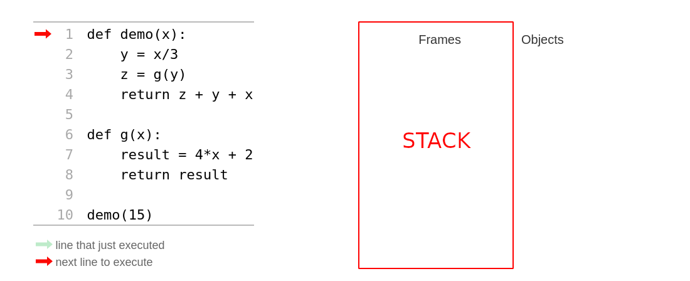
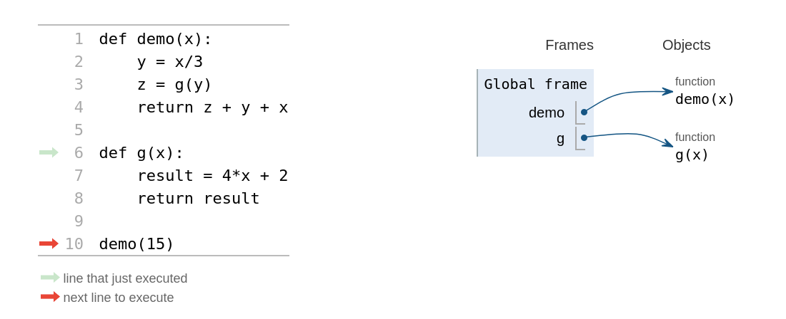
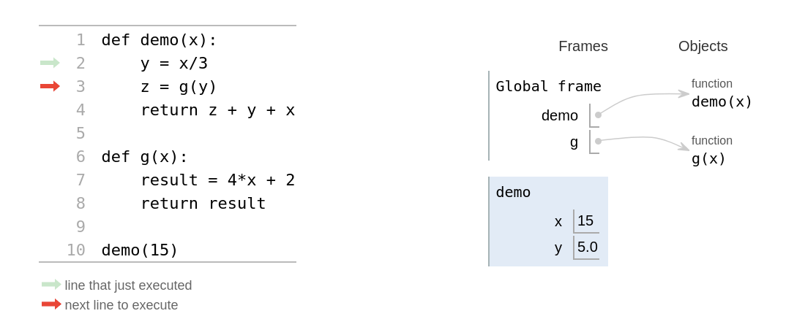
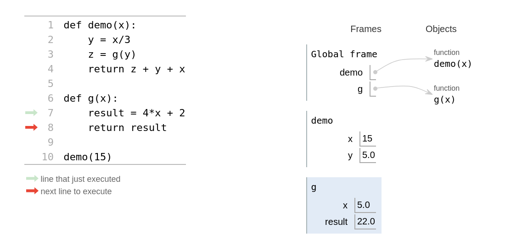
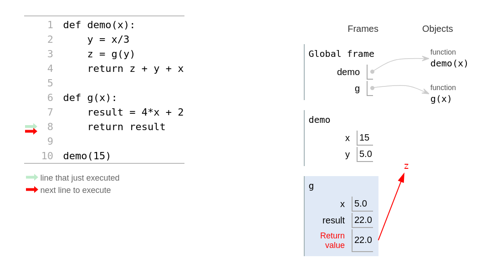
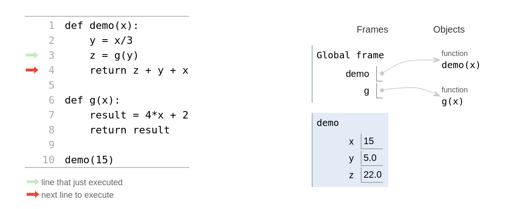
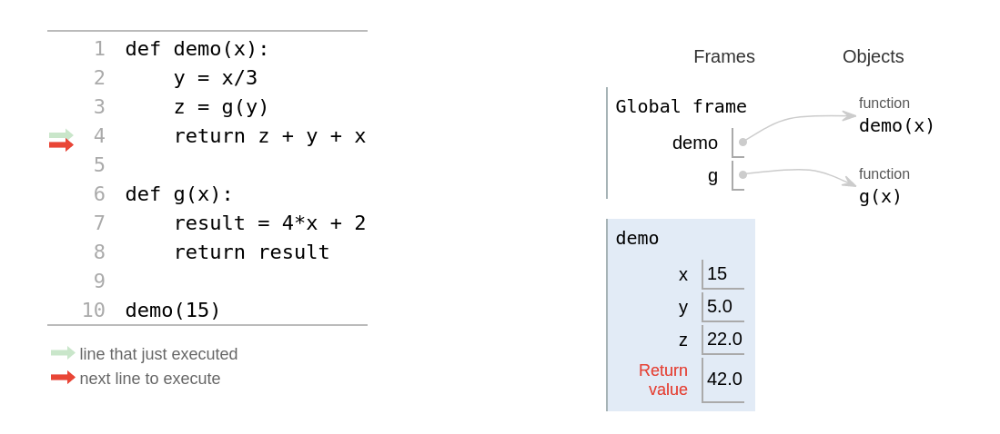

# Functies aanroepen

## Quiz

### Vraag

Functies kunnen andere functies aanroepen!

```python
def demo(x):
    y = x / 3
    z = g(y)
    return z + y + x


def g(x):
    result = 4 * x + 2
    return result
```

Wat is het resultaat van `demo(15)`?

Probeer regel voor regel het programma zelf te volgen om tot het antwoord te komen!

Bedenk dat `demo` pas een antwoord (een returnwaarde) kan geven nadat het een antwoord van `g` heeft ontvangen. Hier ontstaat dus een kleine *wachtrij*, waar de ene functie op de ander moet wachten voordat het weer verder kan. ([book](https://allendowney.github.io/ThinkPython/chap03.html#calling-functions)) Hoe deze wachtrij in een computer werkt ga je zo zien wanneer we het gaan hebben over de *stack*.

### Antwoord

42.0

## Hoe functies werken

Hoe functies worden uitgevoerd: ze stapelen!

Python gebruikt speciaal deel van het geheugen dat de *stack* wordt genoemd waar het voor elke functie de *variabelen* een bijbehorende *waarden* in een *frame* zet (een *stack frame*). Op deze manier stapelen de frames zich op in de stack, traditioneel van onderen naar boven (onhandig als het om een stapel borden zou gaan!).



Je herkent hier de vraag van de quiz die we stap voor stap gaan doorlopen. Rechts van de code zie je de stack waar de frames worden geplaatst.



Het programma is nu ingelezen door Python en het eerste (algemene) frame is gezet, dit zijn de namen van de functies (dit zijn uiteindelijk ook variabelen) en een verwijzing naar waar de functies in het geheugen zijn opgeslagen. Dit is overigens een meer algemeen type geheugen dat de *heap* wordt genoemd. Functies moeten eerst geladen zijn voordat ze aangeroepen kunnen worden. Volgorde is dus belangrijk!



De frame voor de aanroep van `demo` is nu toegevoegd met de variabelen `x` (de waarde die bij de aanroep als argument is meegegeven) en `y`. Maar wat nu te doen met de variabele `z`? De waarde van `z` is pas bekend als de functie `g(y)` een resultaat teruggeeft ... Python plaatst nu een nieuw frame op de stack van precies deze aanroep.



In dit derde frame worden ook de variabelen gezet die horen bij de aanroep van `g(5.0)` en het resultaat zal worden teruggegeven.

Let op dat de `x` in dit frame een andere variabele is dan de `x` in het frame van `demo`: elke aanroep krijgt zijn eigen frame, en de namen daarin zijn **lokale variabelen** die alleen in dat ene frame bestaan.



`z` is nog niet zichtbaar in het tweede frame (voor de duidelijkheid is dit weggelaten) maar het is er zeker wel als een verwijzing aanwezig naar het de returnwaarde van het volgende frame!



Het resultaat van het derde frame wordt gezet als waarde van `z` van het tweede frame en het derde frame wordt vervolgens van de stack verwijderd.



Tot slot geeft het tweede frame de returnwaarde terug aan het eerste frame en zal het vervolgens ook van de stack worden verwijderd. Het programma is nu beeindigd en wordt ook het eerste frame van de stack verwijderd zodat we weer terug zijn bij de beginsituatie.

Let op, je ziet dat variabele `x` type `int` en `y` en `z` type `float` (decimale getallen) zijn. Python zal altijd kiezen voor het type met de hoogste precisie als type voor het resultaat als het gaat om numerieke waarden (in dit geval de optelling van verschillende typen).

## De main-functie

Functies kunnen gebruikt worden om code overzichtelijker te maken. Daarnaast zijn functies herbruikbaar. Ze kunnen zo vaak als we willen aangeroepen worden en zelfs hergebruikt worden in andere programma's.

Een belangrijke functie om code overzichtelijk te houden is de main-functie. Onthoud dat een functie eerst geladen moet worden voordat deze uitgevoerd kan worden.

```python
print(dbl(21))


def dbl(x):
    """Geeft het dubbele van x terug"""
    return 2 * x
```

De bovenstaande code gaat niet werken, aangezien de functieaanroep wordt gedaan voordat de functie is gedeclareerd. De functie is dus nog niet geladen in het geheugen en geeft een `NameError`.

```text
NameError: name 'dbl' is not defined
```

Deze fout krijg je ook als je probeert een variabele te gebruiken die nog niet bestaat.

```python
def dbl(x):
    """Geeft het dubbele van x terug"""
    return 2 * x


print(dbl(21))
```

De functieaanroep moet dus onder de functie zelf staan. Dit geeft wel het nadeel dat als je een heel lang programma hebt met meerdere functies, de start van het programma helemaal onderaan komt te staan. Dat is niet prettig, en daarom gebruiken veel Python-programmeurs een zogenaamde main-functie die helemaal bovenaan komt te staan. In de main-functie wordt het programma aangestuurd.

```python
def main():
    """Roept de andere functies aan om hun werk te doen."""
    print(dbl(21))
    print(dbl(4))


def dbl(x):
    """Geeft het dubbele van x terug"""
    return 2 * x


main()
```

Alle functies worden dus eerst geladen, daarna wordt de main-functie aangeroepen. De main-functie zorgt ervoor dat de juiste functies worden aangeroepen en dat het gewenste resultaat wordt afgedrukt.

## Assertions in een eigen functie

De uitleg over `assert` staat in [het eerste college](/lectures/3a_functies.ipynb#testen). Hier gaat het om de plek waar je die assertions neerzet: net als de aanroepen horen ze in een functie thuis, zodat je in één oogopslag ziet waar getest wordt.

```python
def main():
    """Roept de andere functies aan om hun werk te doen."""
    print(dbl(21))


def testing():
    """Test de functies met assertions."""
    assert dbl(21) == 42
    assert dbl(0) == 0


def dbl(x):
    """Geeft het dubbele van x terug"""
    return 2 * x


main()
testing()
```

## Opdracht 1

```python
def main():
    """Roept de andere functies aan om hun werk te doen."""
    print(triangle(5))


def testing():
    """Test de functies met assertions."""


def triangle(n):
    lst = list(range(n + 1))
    return sum(lst)


main()
testing()
```

a. Wat doet de functie `triangle`?  
b. Wat is de output van dit programma?  
c. De functie `testing` doet nog niets. Vul haar met minstens twee assertions over `triangle`, waarvan er één een randgeval dekt.  
d. Gebruik de [Python Tutor](http://www.pythontutor.com/visualize.html) om je antwoord op a en b te controleren.

## Opdracht 2

a. Kopieer onderstaande code over naar een bestand genaamd `wk3wc2.py`.

```python
import time
from turtle import *
from random import *


def main():
    """Roept de andere functies aan om hun werk te doen."""
    tri()
    done()  # tell turtle the drawing is done.


def testing():
    """Test de functies met assertions."""


def tri():
    """Tekent de zijden van een gelijkzijdige driehoek van 100 pixels."""
    width(5)  # width of the line to draw
    clr = choice(["darkgreen", "red", "blue"])  # choose a random color
    color(clr)  # set the color of the line
    shape("turtle")  # set the shape of the pencil
    dot(10, "red")  # set the endpoints of the lines

    forward(100)  # move forward
    left(120)  # turn 120 degrees left
    forward(100)  # move forward
    left(120)  # turn 120 degrees left
    forward(100)  # move forward
    left(120)  # turn 120 degrees left


main()
testing()
```

b. Voer het programma uit. Als alles goed gaat wordt er in een nieuw scherm een driehoek getekend.  
c. Pas de functie `tri()` aan zodat zij een parameter accepteert die de lengte van de zijden van de driehoek aangeeft. Vergeet niet de docstring aan te passen.  
d. `tri()` tekent en geeft niets terug, dus over de tekening kan een assertion niets zeggen. Over de returnwaarde wel: leg met minstens twee assertions in `testing()` vast dat `tri()` inderdaad `None` teruggeeft, voor twee verschillende zijdelengtes.
