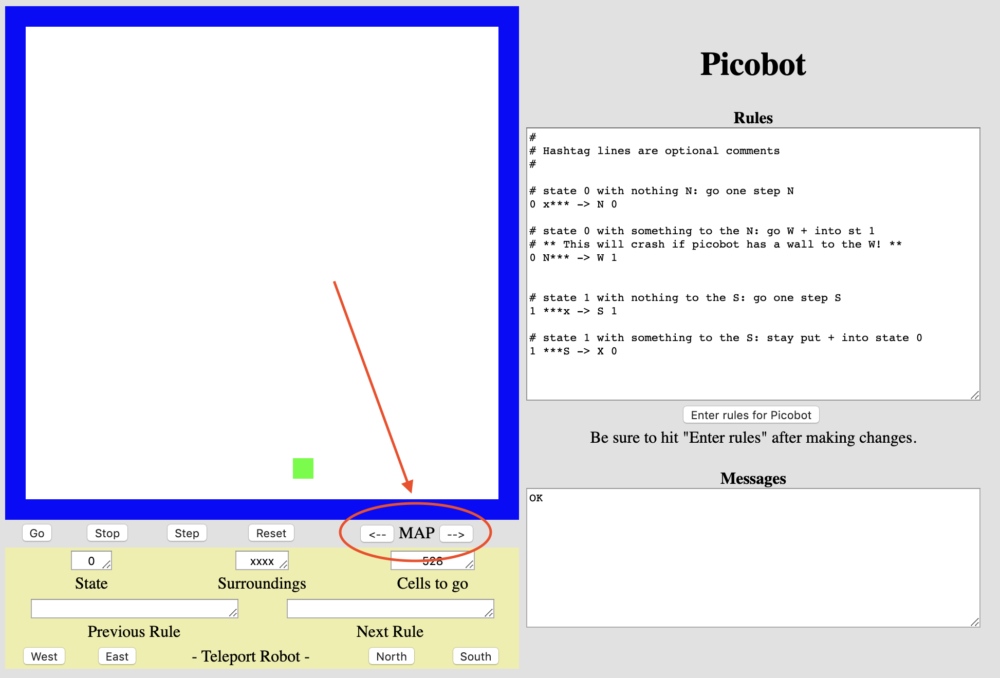
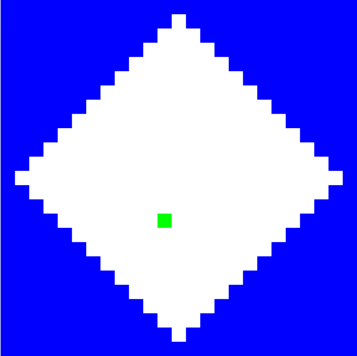
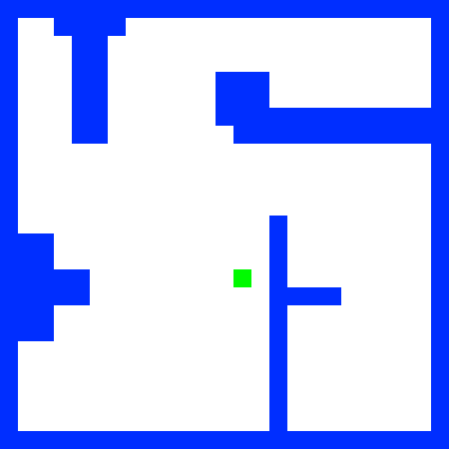

# Picobot programmeren

In het college heb je plannen gemaakt voor Picobot. Hier vertaal je die plannen naar regels die Picobot uitvoert. Zijn doel is om een omgeving volledig te verkennen en geen pixel mag onbezocht blijven!

Picobot kan je vinden op [https://www.cs.hmc.edu/picobot/](https://www.cs.hmc.edu/picobot/)

## Kennismaken

Picobot begint op een willekeurige locatie in een ruimte. Je kan de beginpositie van Picobot niet bepalen, deze kiest Picobot zelf. De muren van de ruimte zijn blauw, Picobot is groen, en de lege ruimte is wit. Elke keer als Picobot een stap maakt laat hij een grijs spoor achter. Als Picobot zijn hele omgeving heeft verkend, stopt hij automatisch.


Zo werk je met de simulator:

1. Typ je regels in het grote vak rechts.
2. Klik op "Enter rules for Picobot". Zitten er fouten in, dan verschijnt daaronder een melding met het regelnummer; de regels zijn dan *niet* geladen.
3. Klik op Go.

Aan dat grijze spoor zie je bij elke opdracht of het gelukt is: **kleurt de hele ruimte grijs en stopt Picobot vanzelf, dan is de omgeving volledig verkend**. Blijft er wit over of blijft Picobot doorlopen, dan is je verzameling regels nog niet compleet.

:::{admonition} Let op
:class: warning

Als je Picobot afsluit zijn al jouw regels verdwenen! Kopieer daarom de regels naar een tekstbestand en sla het op.
:::

## De regelvorm

Elke regel heeft deze vorm:

```text
HuidigeStaat  Omgeving  ->  Bewegingsrichting  NieuweStaat

0  xxxS  ->  N  0
```

Weet je niet meer wat een staat, een omgeving of een sterretje precies is? Dat staat in het college, bij [Picotaal](/lectures/1b_picobot.md#picotaal).

## Opdracht 1: De lege kamer

Ontwerp een verzameling regels om Picobot een lege vierkante ruimte volledig te laten verkennen.

- **Stap 3: Programmeer.** Vertaal de beslissingsboom die je bij Opdracht 1 van het [college](/lectures/1b_picobot.md#opdracht-1-de-lege-kamer) hebt gemaakt naar regels voor Picobot.
- Vergeet niet dat jouw oplossing moet werken voor elke mogelijke startpositie van Picobot!

De uitdaging is om deze opdracht in slechts *6 regels* voor Picobot op te lossen.

:::{admonition} De perfecte oplossing
:class: note

Let op, de 6 regels zouden kunnen gelden als een meest efficiënte, of misschien zelfs perfecte oplossing voor dit probleem. Dit is een streven, maar het is *geen* probleem als jouw oplossing meer regels nodig heeft!
:::

**Klaar wanneer** de hele kamer grijs kleurt en Picobot vanzelf stopt, en dat vanaf drie verschillende startposities. Klik op Reset om Picobot ergens anders neer te zetten.

## Opdracht 2: Het doolhof

Heb je Picobot de lege kamer kunnen laten verkennen? Dan is het nu tijd voor andere omgevingen, waaronder een doolhof!


Ontwerp een verzameling regels om Picobot een doolhof te laten doorlopen. Het doolhof is een ruimte waar de breedte van de gangen één vierkant is en *alle* muren aansluiten op de rand van de kamer. Jouw programma zou op deze manier moeten werken voor alle doolhoven zonder volledig ingesloten open ruimtes.

- **Stap 3: Programmeer.** Vertaal de beslissingsboom die je bij Opdracht 2 van het [college](/lectures/1b_picobot.md#opdracht-2-het-doolhof) hebt gemaakt naar regels voor Picobot.

Klik op de pijlen naast MAP om de omgeving van Picobot te veranderen, de eerstvolgende omgeving is een doolhof waar Picobot volledig moet gaan doorlopen.



Kwam je er bij het plannen niet uit, kijk dan naar de strategie die bij [Complexiteit](/lectures/1b_picobot.md#complexiteit) is voorgedaan: daar staan de drie regels voor één richting, en mag je ze zelf voor de andere richtingen afmaken.

Net als bij de opdracht met de lege ruimte is de uitdaging een meest efficiënte oplossing te vinden. De uitdaging is om deze opdracht in slechts *8 regels* op te lossen; ook hier geldt dat het *geen* probleem is als jouw oplossing meer regels nodig heeft.

**Klaar wanneer** het hele doolhof grijs kleurt en Picobot vanzelf stopt, vanaf drie verschillende startposities.

## Opdracht 3: De ruit

Deze opdracht en de volgende zijn **verdieping**: er hoort geen plan uit het college bij en er is geen regelbudget. Je zet Stap 1, Stap 2 en Stap 3 hier helemaal zelf: eerst proberen, dan plannen, dan programmeren.



Ontwerp een verzameling regels om Picobot een ruimte in de vorm van een ruit te laten verkennen. Er zijn geen beperkingen aan het aantal regels.

**Klaar wanneer** de hele ruit grijs kleurt en Picobot vanzelf stopt, vanaf drie verschillende startposities.

## Opdracht 4: De grot



Ontwerp een verzameling regels om Picobot een ruimte in de vorm van een grot te laten verkennen. Er zijn geen beperkingen aan het aantal regels. Ook deze opdracht is verdieping: **Stap 1, Stap 2 en Stap 3** zet je zelf.

**Klaar wanneer** de hele grot grijs kleurt en Picobot vanzelf stopt, vanaf drie verschillende startposities.
