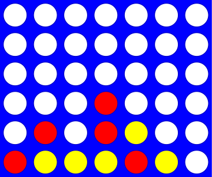

# Extra

## Vier op een rij: de klasse `Board`

Vier op een rij is een variant van Boter, kaas en eieren die gespeeld wordt op
een rechtopstaand bord van 7 kolommen en 6 rijen:



Twee spelers doen om de beurt een zet, en allebei proberen ze vier stenen op een
rij te krijgen: horizontaal, verticaal of diagonaal. Omdat het bord rechtop
staat, kun je een steen niet zomaar overal neerleggen. Je laat hem in een kolom
vallen, en hij komt terecht op de bovenste steen die daar al ligt, of op de
bodem.

In deze opgave schrijf je een klasse `Board` die het bord voorstelt en de regels
van het spel kent. Begin met een nieuw bestand, `vier_op_een_rij.py`.

### De attributen

Een `Board` heeft drie attributen:

| Attribuut | Bevat |
|---|---|
| `self.data` | het bord zelf: een lijst van lijsten met tekens |
| `self.height` | het aantal rijen |
| `self.width` | het aantal kolommen |

Zes rijen en zeven kolommen is de standaard, maar je klasse kan elk formaat aan.
Ook op een groter bord win je met vier op een rij; op een bord van 3 bij 3 wordt
dat lastig.

Elk vakje in `self.data` is een string van één teken. Een leeg vakje is `" "`,
een spatie, en niet de lege string. De stenen van de twee spelers zijn `"X"` en
`"O"`: de hoofdletters x en o.

:::{admonition} Waarschuwing
:class: danger

Een **heel** moeilijk te vinden bug ontstaat als je het cijfer nul, `"0"`,
gebruikt in plaats van de hoofdletter o, `"O"`. Dan vergelijk je ergens de
waarden op het bord met het verkeerde teken. Gebruik overal de hoofdletter o.
:::

### Wat je gaat maken

| Stap | Methode | Doet |
|---|---|---|
| 1 | `__init__` | een leeg bord maken |
| 2 | `__repr__` | het bord als string, met kolomnummers |
| 3 | `add_move` | een steen in een kolom laten vallen |
| 4 | `clear` | het bord leegmaken |
| 5 | `set_board` | snel een bord opzetten om mee te testen |
| 6 | `allows_move` | kijken of een zet in een kolom mag |
| 7 | `is_full` | kijken of het bord vol is |
| 8 | `del_move` | de bovenste steen uit een kolom halen |
| 9 | `wins_for` | kijken of iemand vier op een rij heeft |
| 10 | `host_game` | twee mensen het spel laten spelen |

Test elke methode meteen nadat je haar geschreven hebt. Eén methode tegelijk
debuggen is veel makkelijker dan tien.

## Stap 1: de constructor `__init__(self, width, height)`

De constructor krijgt een aantal kolommen en een aantal rijen, en geeft de
attributen hun beginwaarde. Hij maakt ook de lijst van lijsten voor het bord,
met een list comprehension.

De constructor en een eerste versie van `__repr__` krijg je cadeau:

```python
class Board:
    """Een bord voor Vier op een rij, met een willekeurig aantal rijen en kolommen."""

    def __init__(self, width, height):
        """Maak een leeg bord met de gegeven breedte en hoogte."""
        self.width = width
        self.height = height
        self.data = [[" "] * width for row in range(height)]

        # een constructor geeft niets terug

    def __repr__(self):
        """Geeft het bord als string."""
        s = ""  # de string die we teruggeven
        for row in range(0, self.height):
            s += "|"
            for col in range(0, self.width):
                s += self.data[row][col] + "|"
            s += "\n"

        s += (2 * self.width + 1) * "-"  # de onderkant van het bord

        # hier moeten de kolomnummers nog onder

        return s  # het bord is compleet, geef het terug
```

`self.data` bevat alleen wat nodig is om het spel te spelen: de stenen en de lege
vakjes. De lijnen en de nummers eromheen maakt `__repr__`.

## Stap 2: `__repr__(self)`

Maak `__repr__` af, zodat de kolommen onderaan genummerd zijn. Elke steen neemt
één teken in, en de kolommen worden gescheiden door `|`. Een bord van 6 rijen en
7 kolommen ziet er zo uit:

```text
| | | | | | | |
| | | | | | | |
| | | | | | | |
| | | | | | | |
| | | | | | | |
| | | | | | | |
---------------
 0 1 2 3 4 5 6
```

Nummer de kolommen modulo 10, zodat alles ook op een breed bord netjes onder
elkaar blijft staan. Een bord van 5 rijen en 15 kolommen:

```text
| | | | | | | | | | | | | | | |
| | | | | | | | | | | | | | | |
| | | | | | | | | | | | | | | |
| | | | | | | | | | | | | | | |
| | | | | | | | | | | | | | | |
-------------------------------
 0 1 2 3 4 5 6 7 8 9 0 1 2 3 4
```

:::{admonition} Eén string, meerdere regels
:class: tip

`"\n"` is het teken voor een nieuwe regel. Zet je het in een string, dan komt
wat erna staat op de volgende regel:

```text
In [1]: s = "Dit is de bovenste regel."
In [2]: s += "\n"
In [3]: s += "Dit is de tweede regel!\n"
In [4]: print(s)
Dit is de bovenste regel.
Dit is de tweede regel!

```

De `"\n"` aan het eind van de tweede regel levert onderaan een lege regel op.
:::

## Stap 3: `add_move(self, col, ox)`

Laat een steen vallen in kolom `col`. `ox` is de steen: `"X"` of `"O"`.

De stenen vallen van boven in het bord. Zoek dus in kolom `col` de onderste rij
die nog leeg is, en zet de steen daar. Je hoeft in `add_move` **niet** te
controleren of `col` een geldige kolom is en of er nog ruimte is; dat doet
`allows_move` in stap 6.

```ipython
In [1]: b = Board(7, 6)
In [2]: b.add_move(0, "X")
In [3]: b.add_move(0, "O")
In [4]: b.add_move(0, "X")
In [5]: b.add_move(3, "O")
In [6]: b.add_move(4, "O")  # valsspelen: O is nog een keer aan de beurt
In [7]: b.add_move(5, "O")
In [8]: b.add_move(6, "O")
In [9]: print(b)
| | | | | | | |
| | | | | | | |
| | | | | | | |
|X| | | | | | |
|O| | | | | | |
|X| | |O|O|O|O|
---------------
 0 1 2 3 4 5 6
```

## Stap 4: `clear(self)`

Maakt het bord leeg. Er valt weinig over te zeggen, maar je gaat de methode vaak
gebruiken.

## Stap 5: `set_board(self, move_string)`

Met deze methode zet je snel een bord op om `wins_for` mee te testen. Neem haar
over in je klasse:

```python
    def set_board(self, move_string):
        """Speelt de kolommen in move_string, om en om X en O, te beginnen met X.

        b.set_board("012345") zet X en O om en om op de onderste rij,
        b.set_board("000000") zet ze om en om in de linkerkolom.
        move_string bestaat uit cijfers van één teken.
        """
        next_checker = "X"  # X begint
        for col_char in move_string:
            col = int(col_char)
            if 0 <= col < self.width:
                self.add_move(col, next_checker)
            if next_checker == "X":
                next_checker = "O"
            else:
                next_checker = "X"
```

## Stap 6: `allows_move(self, col)`

Geeft `True` als een zet in kolom `col` mag. Dat is zo als `col` een bestaande
kolom is, van `0` tot en met de laatste, **en** er in die kolom nog ruimte is.
Anders geeft de methode `False`.

```ipython
In [1]: b = Board(2, 2)

In [2]: b
Out[2]:
| | |
| | |
-----
 0 1

In [3]: b.add_move(0, "X")

In [4]: b.add_move(0, "O")

In [5]: b
Out[5]:
|O| |
|X| |
-----
 0 1

In [6]: b.allows_move(-1)
Out[6]: False

In [7]: b.allows_move(0)
Out[7]: False

In [8]: b.allows_move(1)
Out[8]: True

In [9]: b.allows_move(2)
Out[9]: False
```

## Stap 7: `is_full(self)`

Geeft `True` als het bord helemaal vol is, en anders `False`. Met `allows_move`
wordt deze methode heel kort. Test haar op een klein bord, tenzij je veel geduld
hebt.

```ipython
In [1]: b = Board(2, 2)

In [2]: b.is_full()
Out[2]: False

In [3]: b.set_board("0011")

In [4]: b
Out[4]:
|O|O|
|X|X|
-----
 0 1

In [5]: b.is_full()
Out[5]: True
```

## Stap 8: `del_move(self, col)`

Het omgekeerde van `add_move`: haalt de bovenste steen uit kolom `col`. Is de
kolom leeg, dan doet de methode niets. Nu lijkt dat nutteloos, maar wie later
een computerspeler bouwt, heeft er veel aan.

```ipython
In [1]: b = Board(2, 2)

In [2]: b.set_board("0011")

In [3]: b.del_move(1)

In [4]: b.del_move(1)

In [5]: b.del_move(1)

In [6]: b.del_move(0)

In [7]: b
Out[7]:
| | |
|X| |
-----
 0 1
```

## Stap 9: `wins_for(self, ox)`

Geeft `True` als er ergens vier stenen `ox` op een rij liggen, en anders
`False`. `ox` is `"X"` of `"O"`.

:::{admonition} Let op
:class: danger

Controleer horizontaal, verticaal en diagonaal, en er zijn twee richtingen voor
een diagonaal.

Je kunt hiervoor je in-een-rij-functies uit Programmeren 1 week 5 gebruiken, in
een paar geneste lussen. [Hier staat een aanzet voor die aanpak](/support/wins_for).
:::

:::{admonition} Waarschuwing
:class: warning

Zet die in-een-rij-functies ***buiten*** de klasse. Het zijn gewone functies,
geen methoden van `Board`.
:::

Dit is een belangrijke methode: test haar goed.

```ipython
In [1]: b = Board(7, 6)

In [2]: b.set_board("00102030")

In [3]: b.wins_for("X")
Out[3]: True

In [4]: b.wins_for("O")
Out[4]: True

In [5]: b = Board(7, 6)

In [6]: b.set_board("23344545515")

In [7]: b
Out[7]:
| | | | | | | |
| | | | | | | |
| | | | | |X| |
| | | | |X|X| |
| | | |X|X|O| |
| |O|X|O|O|O| |
---------------
 0 1 2 3 4 5 6

In [8]: b.wins_for("X")  # diagonaal
Out[8]: True

In [9]: b.wins_for("O")
Out[9]: False
```

## Stap 10: `host_game(self)`

Brengt alles samen tot het complete spel. `"X"` begint altijd, `"O"` is daarna
aan de beurt, en zo om en om. Voor elke zet vraagt de methode met `input` om een
kolomnummer.

1. Druk het bord af voordat je om een zet vraagt.
2. Controleer na elke `input` of de zet mag. Bestaat de kolom niet, of is hij
   vol, vraag dan opnieuw. Of de invoer een integer is, hoef je niet te
   controleren.
3. Zet de steen met `add_move`.
4. Kijk of de speler die net zette gewonnen heeft, en daarna of het bord vol is.
   In beide gevallen druk je het bord nog één keer af, meld je de uitslag en stop
   je met `break`.
5. Anders is de andere speler aan de beurt.

Een grote lus `while True:` met een `break` erin is een handige vorm voor het
spel. Een ongeldige zet vang je af met deze kleine lus:

```python
users_col = -1
while not self.allows_move(users_col):
    users_col = int(input("Kies een kolom: "))
```

Die vraagt net zo lang om een kolomnummer tot er een geldig nummer komt. Lees
`while not self.allows_move(...)` als: ga door zolang de zet *niet* mag. Het is
hetzelfde als `while self.allows_move(...) == False`.

Speel het spel een paar keer, zodat je elke uitslag een keer ziet. Zo kan het
eruitzien:

```text
In [1]: b = Board(7, 6)

In [2]: b.host_game()

Welkom bij Vier op een rij!

| | | | | | | |
| | | | | | | |
| | | | | | | |
| | | | | | | |
| | | | | | | |
| | | | | | | |
---------------
 0 1 2 3 4 5 6

Keuze van X: 3

| | | | | | | |
| | | | | | | |
| | | | | | | |
| | | | | | | |
| | | | | | | |
| | | |X| | | |
---------------
 0 1 2 3 4 5 6

Keuze van O: 4

| | | | | | | |
| | | | | | | |
| | | | | | | |
| | | | | | | |
| | | | | | | |
| | | |X|O| | |
---------------
 0 1 2 3 4 5 6

Keuze van X: 2

| | | | | | | |
| | | | | | | |
| | | | | | | |
| | | | | | | |
| | | | | | | |
| | |X|X|O| | |
---------------
 0 1 2 3 4 5 6

Keuze van O: 4

| | | | | | | |
| | | | | | | |
| | | | | | | |
| | | | | | | |
| | | | |O| | |
| | |X|X|O| | |
---------------
 0 1 2 3 4 5 6

Keuze van X: 1

| | | | | | | |
| | | | | | | |
| | | | | | | |
| | | | | | | |
| | | | |O| | |
| |X|X|X|O| | |
---------------
 0 1 2 3 4 5 6

Keuze van O: 2

| | | | | | | |
| | | | | | | |
| | | | | | | |
| | | | | | | |
| | |O| |O| | |
| |X|X|X|O| | |
---------------
 0 1 2 3 4 5 6

Keuze van X: 0

| | | | | | | |
| | | | | | | |
| | | | | | | |
| | | | | | | |
| | |O| |O| | |
|X|X|X|X|O| | |
---------------
 0 1 2 3 4 5 6

X wint -- Gefeliciteerd!
```

## Tot slot

Je hebt een klasse die het bord van Vier op een rij bijhoudt en de regels van het
spel kent: waar een steen terechtkomt, welke zet mag en wanneer iemand gewonnen
heeft. `host_game` gebruikt alleen die methoden, en hoeft zelf niet te weten hoe
het bord is opgeslagen.
