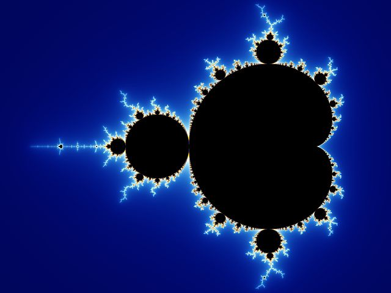

# Extra: Mandelbrot verkennen

## Mandelbrot



In de [opstap](5_mandelbrot_opstap) en de [basis](5_mandelbrot_basis) heb je de
berekening voor de mandelbrotverzameling opgebouwd. In deze extra laag maak je
er een afbeelding van en onderzoek je wat er gebeurt als het venster, het
aantal iteraties of de kleuren veranderen.

Je gebruikt hiervoor de verstrekte `PNGImage`-API uit
{download}`mandelbrot.zip <assets/mandelbrot.zip>`. Gebruik deze aanroepen:

```python
image = PNGImage(width, height)
image.plot_point(col, row, (red, green, blue))
image.save_file("mset.png")
```

De code van de API hoef je niet te wijzigen. De drie aanroepen maken de
afbeelding, kleuren één pixel en schrijven het bestand.

## Een afbeelding tekenen

Kopieer je functies uit de basislaag naar `mandelbrot.py`. Schrijf daarna
`mset()` met twee geneste lussen. Gebruik `scale` om iedere pixel naar een
complex getal in het bereik `-2.0 <= x <= 1.0` en `-1.0 <= y <= 1.0` te
vertalen. Kleur punten waarvoor `in_mset(c, 50)` `True` geeft oranje en de
andere punten zwart.

```python
def mset():
    """Schrijft een afbeelding van de mandelbrotverzameling."""
    width = 300
    height = 200
    image = PNGImage(width, height)
    for col in range(width):
        for row in range(height):
            x = scale(col, width, -2.0, 1.0)
            y = scale(row, height, -1.0, 1.0)
            c = x + y * 1j
            if in_mset(c, 50):
                image.plot_point(col, row, (255, 175, 0))
            else:
                image.plot_point(col, row, (0, 0, 0))
    image.save_file("mset.png")
```

Controleer dat `mset.png` 300 pixels breed en 200 pixels hoog is. Voer de
functie daarna uit met `mset()`.

## Verkennen

Maak drie varianten. Verander telkens één waarde en noteer wat je in de
afbeelding ziet:

1. Teken alleen het venster `-0.8 <= x <= -0.6` en `0.0 <= y <= 0.2`.
2. Gebruik 10, 25 en 100 iteraties. Welke rand wordt scherper?
3. Geef ontsnappende punten een andere kleur dan punten die binnen de
   verzameling blijven.

Bewaar alleen de variant die je wilt bekijken. De afbeelding is het zichtbare
resultaat van je geneste lussen en je eerdere functies. Deze extra laag is
oefenmateriaal; er is geen inleverroute.
