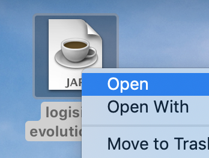
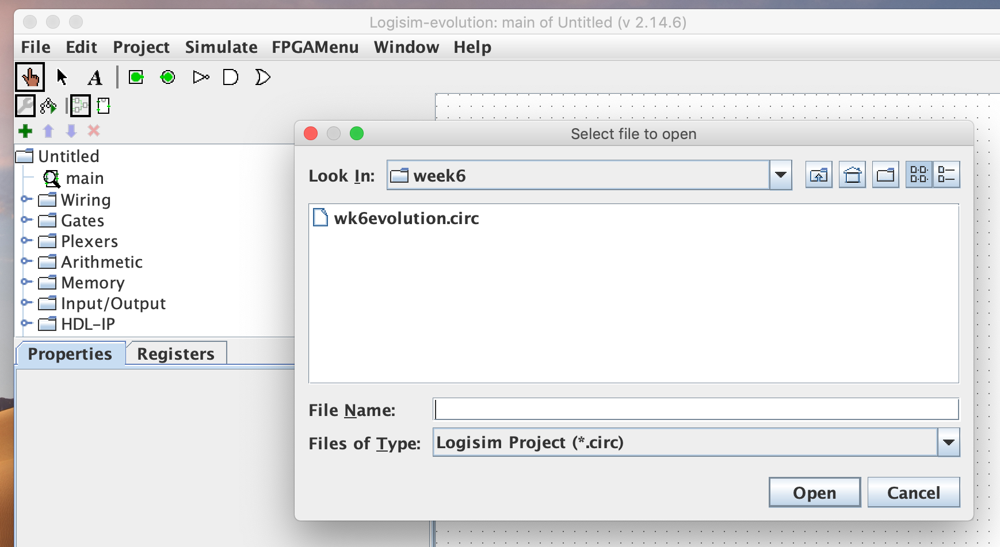

# Logisim

<!--
elektrisch schema, een circuitdiagram of schakelschema
bestand: wk6ex1-4.circ
-->

## Voorbereiding

Download de volgende bestanden:

<!-- https://github.com/reds-heig/logisim-evolution/releases/download/v3.3.1/logisim-evolution-3.3.1.jar -->

-   Het Java-applicatiebestand: [logisim-evolution-3.3.4-all.jar](https://github.com/hanze-hbo-ict/programmeren/raw/master/support/assets/logisim-evolution-3.3.4-all.jar)
-   Het startbestand (pakt dit uit en gebruik het!): [wk6ex1-4.circ.zip](https://github.com/hanze-hbo-ict/programmeren/raw/master/support/assets/wk6ex1-4.circ.zip)

### Java

Voor Logisim zal je Java geïnstalleerd moeten hebben. Als je dit nog niet hebt kan je het downloaden van de [Adoptium](https://adoptium.net/temurin/releases/) website:

-   kies versie 11 of hoger voor jouw systeem
-   bij architectuur is x64 een goede keuze (voor nieuwere Macs kies je arm)
-   indien gevraagd, kies bij installatie om `JAVA_HOME` aan het pad toe te voegen!
-   indien gevraagd, *negeer* bij installatie de optie om Oracle licentiesleutels toe te voegen!

### Logisim Evolution starten

Als je Java geïnstalleerd hebt, zou je Logisim Evolution moeten kunnen starten door te dubbelklikken op `logisim-evolution-3.3.4-all.jar` (Windows en macOS). Als dit niet werkt, kan je ook het commando `java -jar logisim-evolution-3.3.4-all.jar` vanuit de Terminal gebruiken. Zorg dan wel dat je in de goede directory staat!

### Permissies op macOS

Als je op een Mac werkt en het klaagt dat je geen toestemming hebt om de applicatie te starten (omdat het van een door Apple erkende ontwikkelaar is), hoef je je geen zorgen te maken. Het klopt dat deze applicatie niet door een "formele" ontwikkelaar gemaakt is, het is een "open source" project, maar is zeker niet schadelijk. Rechts-klik (of met Command (⌘) en klik) op het icoon, en kies **Open**. Je moet nu een optie krijgen om de applicatie te starten.



of


Nog steeds geen toestemming? Je zal dan waarschijnlijk in *Systeemvoorkeuren* onder *Beveiliging en privacy* moeten toestaan dat de applicatie mag worden uitgevoerd.

### Projectbestand

Deze en alle verdere opgaven ga je uitwerken in hetzelfde bestand:

-   *Begin niet met een nieuw bestand!*
-   Gebruik *in plaats daarvan* het bestand `wk6ex1-4.circ` dat je hebt gedownload.

Je kan *niet* op het bestand dubbelklikken om het te openen, in plaats daarvan moet je *Logisim Evolution* starten (zie boven) en *File (of "Dossier"), Open* gebruiken uit het menu van Logisim Evolution:


Vervolgens navigeer je naar het bestand `wk6ex1-4.circ` en open je het:



Zorg ervoor dat links een schakelingenmenu staat dat er als volgt uitziet:


## Schakelingen

### Schakelingen ontwerpen

Nogmaals, het bestand `wk6ex1-4.circ` is de plaats waar je al jouw schakelingen voor deze opdracht schrijft en in bewaart.

*Merk op* dat je in de verkenner van Logisim (het linkerbovendeel van het scherm) iconen met de teksten `MyXOR`, `FullAdder`, `Een_4bit_Ripple_Carry_Adder`, `Een_4bit_vermenigvuldiger`, `Een_3bij2_deler` en mogelijk nog wat meer ziet. Dit zijn de onderdelen ("deelschakelingen") van de opgaven die je gaat maken. In deze opdracht gebruiken we alleen de eerste *drie* deelschakelingen.

:::{admonition} Schakeling of circuit
:class: notice

We gebruiken de woorden *schakeling* en *circuit* afwisselend, maar bedoelen daar hetzelfde mee, het zijn synoniemen!
:::

## De Tutorial

Nu je `wk6ex1-4.circ` geopend hebt, dubbelklik op het icoon `MyXOR` in het Logisism verkenningsvenster. Voorlopig werk je aan deze deelschakeling. Jouw taak hier is om een circuit te bouwen om de `XOR`-functie te berekenen met alleen `AND`, `OR` en `NOT` poorten.

-   Ga naar het menu "Help" en selecteer "Tutorial". Lees de handleiding tot en met stap 4 door en test jouw schakeling. Maak daarbij de `XOR`-circuit aan die in de tutorial wordt beschreven. Doe dit in het tabblad "MyXOR" van jouw Logisim-bestand. Dit is een vrij korte introductie, en maak je geen zorgen nog niet elk "bit" bij je landt!

-   Je weet nu tenminste wat er in de tutorial staat, zodat je later terug kunt gaan en de details kunt vinden als je ze nodig hebt.

-   Zorg ervoor dat je jouw `XOR`-circuit test door de waarden van de invoer te veranderen met de "poke" tool (het handje linksboven in de menubalk). Controleer of je de juiste uitvoer voor jouw inver krijgt. Sla het bestand op door naar het menu "File" (of "Dossier") te gaan en op "Opslaan" te klikken.


## Schermen of menu's kwijt in Mac OS?

Als je per ongeluk de verkenner of het eigenschappenscherm aan de linkerkant hebt geminimaliseerd:


Het kan lastig zijn om deze terug te krijgen! Een commando (vanaf de command line) dat op de Mac werkt om het terug te
krijgen is:

```text
defaults delete com.cburch.logisim
```

Om de default domeinen te zien kan je onderstaand commando gebruiken.

```text
defaults domains | tr , "\n" | grep -v  com.apple
```

*Soms* kan het ook helpen om de applicatie opnieuw te starten, dan komen ze misschien terug.