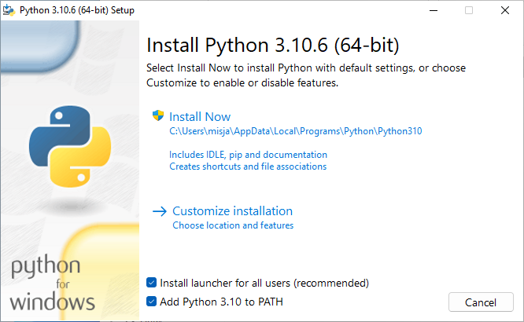
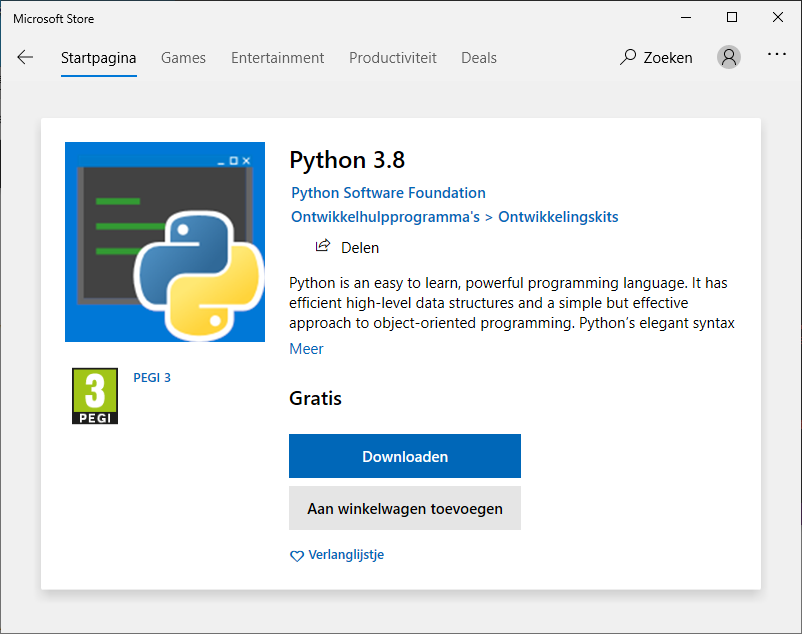

# Software

We gebruiken Python 3. Je kan Python in de [browser](python_browser.md) gebruiken (het is immers de 21e eeuw!) maar we raden je aan het op jouw systeem te installeren.

Om Python bestanden te kunnen bewerken heb je een **teksteditor** nodig (en niet een *tekstverwerker* als bijvoorbeeld Microsoft Word!). Standaard gebruiken we [Visual Studio Code](#editor) (VSCode), een gratis en veelgebruikte editor die beschikbaar is voor alle besturingssystemen (Mac, Windows en Linux). Heb je al een favoriet? Geen probleem, deze kan je blijven gebruiken!

## Python

Als je al Python 3 (minimaal versie 3.8) hebt geïnstalleerd via bijvoorbeeld [https://www.python.org](https://www.python.org/) of [Anaconda Python](https://www.anaconda.com/distribution/) dan kan je deze blijven gebruiken.

### Windows

<!--

Windows store:
pip install etc. installeert in andere scripts dir dan store scripts dir die niet in user path staat

vscode:
installeert met pip in user roaming dir oid, ook niet in user path

Oplossing:
Reguliere python install, aan pad laten toevoegen

pip install ipython

*Voor* vscode wordt opgestart
pip install black pylint

-->

We volgen de aanbevelingen van Microsoft voor [Python op Windows](https://docs.microsoft.com/en-us/windows/python/beginners). Installeer Python via Windows Store, zoek daar naar de Python app (uitgever *Python Software Foundation*) en kies versie 3.8 of hoger.





:::{admonition,info} WSL
Microsoft [adviseert](https://docs.microsoft.com/en-us/windows/python/) voor gevanceerde Python toepassingen Windows Subsystem for Linux (WSL). Ook WSL kan via Windows Store worden geïnstalleerd (kies daar voor Ubuntu als je nog niet goed bekend bent met Linux en WSL wilt proberen).

Voor leren programmeren is WSL **niet** nodig en is de Python app voldoende!
:::

### macOS

Sinds macOS 11.0 ("Big Sur") is Python versie 3 op macOS standaard geïnstalleerd. Controleer dit door in Terminal (deze kan je onder hulpmiddelen vinden) het volgende te typen:

```console
$ python3 --version
```

Als je `command not found: python3` ziet dan is Python 3 niet geïnstalleerd en zal je dit met Homebrew moeten doen (zie [Oudere versies](#oudere-versies)).

#### Oudere versies

Op oudere macOS versies is allees de oude Python versie 2 standaard geïnstalleerd. Een optie is om de laatste versie van de Python [website](https://www.python.org) te downloaden maar dan zal je zelf steeds de website in de gaten moeten houden of nieuwere versies beschikbaar zijn: een betere manier is om [Homebrew](https://brew.sh/) te gebruiken.

Installeer [Homebrew](https://docs.brew.sh/Installation) op jouw Mac als je dit nog niet hebt gedaan. Met Homebrew installeer je dingen die je nodig hebt maar Apple helaaas niet levert, zoals bijvoorbeeld een up-to-date Python versie! Open Terminal en typ het nadat je Homebrew hebt geïnstalleerd het volgende om Python 3 te installeren:

```console
$ brew install python3
```

:::{admonition,tip} Updates
Met Homebrew is het gemakkelijk Python (en andere software die je met Homebrew hebt geïnstalleerd) op nieuwere versies te controleren en te updaten:

```console
$ brew update
$ brew upgrade
```
:::

### Linux

Linux gebruikers zullen Python 3 waarschijnlijk al op hun systeem beschikbaar hebben, controleer dit in een command line (terminal) met:

```console
$ python3 --version
```

Als Python niet aanwezig is dan is aan te raden om de standaard Python 3 versie met een *package manager* te installeren.

:::{admonition,info} Package managers
Linux: zoveel keus uit distributies met gelukkig maar een beperkt aantal package managers! Bijvoorbeeld, gebruik `apt` op distributies als Debian, Ubuntu of Mint:

```console
$ sudo apt-get update
$ sudo apt-get install python3
```

of `dnf` op distributies als Fedora of Red Hat:

```console
$ sudo dnf install python3
```
:::

## IPython

[IPython](https://ipython.readthedocs.io/en/stable/) is een interactieve Python *shell* die heel veel meer kan dan de standaard Python shell. IPython ga je gebruiken bij (bijna) alle opdrachten. IPython installeer je met ... Python!

## Editor

Tot slot heb je een editor nodig, Visual Studio Code (VSCode) is een flexibele texteditor die geschikt is voor het bewerken van Python bestanden. Door middel van uitbreidingen is het ook geschikt voor andere formaten en talen waar je later misschien ook mee gaat werken, bijvoorbeeld HTML, CSS, JavaScript of Java.

> Download en installeer [Visual Studion Code](https://code.visualstudio.com/download) voor Mac, Windows of Linux.

:::{admonition,notice} Andere editors
Wij adviseren Visual Studio Code voor als je nog *geen* editor hebt geïnstalleerd. Het is dus niet verplicht, je kan jouw eigen editor blijven gebruiken als je wilt! Zie verder ook [platte tekst](platte_tekst) voor meer suggesties voor het bewerken van tekstbestanden.
:::

### Configuratie

Configuratie van VSCode zal vanzelf gaan: de eerste keer dat je Python code schrijft en opslaat met een `.py` bestandsextensie (zie ook werken met [platte tekst](platte_tekst)) zal VSCode jou vragen of je de Python uitbreiding voor VSCode wilt installeren. Hier kies je natuurlijk voor :)

:::{admonition,warning} macOS
De VSCode Python uitbreiding ondersteunt macOS met Python versie 2 niet, zorg dat je Python 3 hebt geïnstalleerd.
:::

De Python uitbreiding helpt jou met het schrijven van correcte en goed geformatteerde code door onder andere het aanroepen van een *linter* en een *formatter* die jouw code controleert op fouten.

### Linter

Een *linter* is een apart programma dat jouw code controleert op *syntactische* fouten en zal hints geven hoe je jouw code kan verbeteren.

VSCode zal jou op een gegeven moment vragen welke *linter* je wilt gebruiken (er zijn meerdere Python linters beschikbaar!), kies voor de eerste suggestie (`pylint`) als deze vraag jou wordt gesteld en VSCode zal deze voor je installeren.

### Formatter

Ook een *formatter* is een apart programma. Waar een linter vooral let op hoe jouw code wordt uitgevoerd en eventuele fouten detecteert zal een formatter letten op *stylistische* kenmerken van jouw code en kan indien gewenst ook code *formatteren*. Bijvoorbeeld het volgende Python fragment,

```python
print( 'Hallo!' )
```

zal een formatter als `black` (een populaire Python formatter) omzetten naar:

```python
print("Hallo!")
```

De formatter past hier twee regels toe, ten eerste dat extra spaties binnen haken niet gewenst is en ten tweede en dat het beter is tekst tussen dubbele aanhalingstekens te plaatsen. Merk op dat beide *valide* Python fragmenten zijn, de formatter past alleen maar de *stijl* aan en niet de werking van de code.

<!--
TODO gebruik formatter is optioneel, een aanroep (Ctrl-Shift-i Windows/Linux, Mac ?) zal vragen welke formatter VSCode moet installeren en gebruiken
-->

VSCode zal vragen welke *formatter* je wilt gebruiken. Kies hier voor `black` en deze zal vervolgens voor jou worden geïnstalleerd.

:::{admonition,info} Syntactische- en stylistische fouten?
Code schrijven lijkt soms op het schrijven van gewone tekst, bijvoorbeeld een brief. Naast correcte spelling zal een brief ook elementen moeten bevatten die de lezer verwacht zoals een adressering, aanhef en plaats en datum.

Een *linter* zal in het geval van een brief wijzen op spelfouten maar ook op het ontbreken van verplichte elementen. Een *formatter* zal stijlaanpassingen doen (maar niet de inhoud van de brief wijzigen) door bijvoorbeeld plaats en datum rechts uit te lijnen.

Python gebruikers zoals jij bepalen stijlregels: regels worden door  gebruikers voorgesteld en ter stemming voorgelegd, de meest bekende (en meest toegepaste) set van stijlregels is vastgelegd in de [Style Guide for Python Code](https://www.python.org/dev/peps/pep-0008/) (PEP8). Stijlregels zijn dus *conventies* (afspraken) en niet absolute waarheden!
:::
